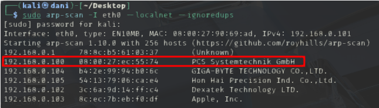
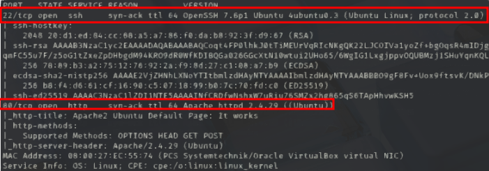
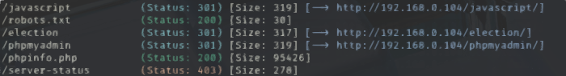
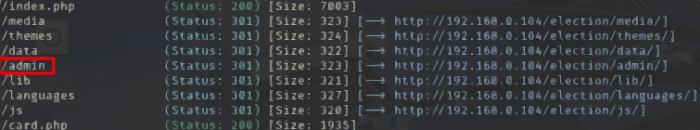
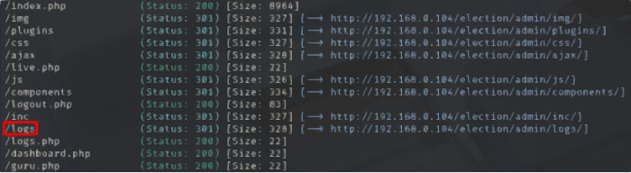
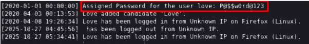
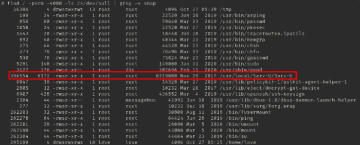
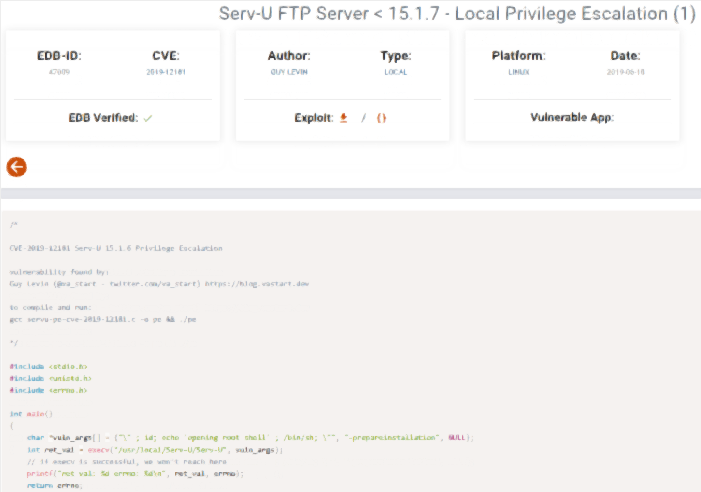
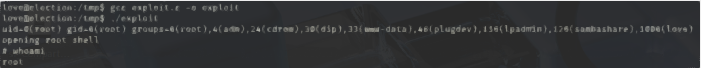
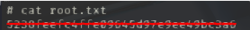

# Election

## General Information

<h3> Difficulty:  </h3>

<h3> Operating sytem: Linux </h3>

<h3> Vulnerability exploited: Local File Inclusion, PATH hijacking</h3>

<h3> Date of resolution: 27/10/2025 </h3>

<h3> Link: <a href="https://www.vulnhub.com/entry/symfonos-1,322">Election</a></h3>

### *Read this document in spanish* <a href="election.md">Election</a>

## Recognition

Vulnhub provides us with the IP of the target machine **192.168.0.100**

I'm going to set the IP of the target mv in the **/etc/hosts** file, I'm going to call it **election**

**ARP-SCAN**

```
sudo arp-scan -I eth0 --localnet --ignoredups
```

<p align="center"> 

</p>

### Ping

Depending on the result we can deduce whether it is a Linux or Windows machine, for example:

```
ping -c 1 192.168.0.100
```

The ttl is 64. So your system is Linux.

### Scanning for open ports

#### TCP port scanning

The command I use with nmap is:

```
sudo nmap -p- --open -sS -sC -sV --min-rate 2000 -n -vvv -Pn 192.168.0.104
```

<p align="center"> 

</p>

<div align="center">

| Open port | Service | Version                                                      |
| --------- | ------- | ------------------------------------------------------------ |
| 22        | ssh     | OpenSSH 7.6p1 Ubuntu 4ubuntu0.3 (Ubuntu Linux; protocol 2.0) |
| 80        | http    | Apache httpd 2.4.29 ((Ubuntu))                               |

</div>

#### UDP port scanning

```
nmap -sU --top-ports 200 --min-rate=5000 -Pn 192.168.0.100
```

All ports are closed

## Exploration

### Fuzzing web

```
gobuster dir -u http://192.168.0.100/ -w /usr/share/wordlists/dirbuster/directory-list-lowercase-2.3-medium.txt -x txt,py,php,sh
```

<p align="center"> 

</p>

Then, we do a gobuster again but this time on the election route

```
gobuster dir -u http://192.168.0.104/election -w /usr/share/wordlists/dirbuster/directory-list-lowercase-2.3-medium.txt -x txt,py,php,sh
```

<p align="center"> 

</p>

Finally, we do it again with admin

```
gobuster dir -u http://192.168.0.104/election/admin/ -w /usr/share/wordlists/dirbuster/directory-list-lowercase-2.3-medium.txt -x txt,py,php,sh
```

<p align="center"> 

</p>

We therefore visualize this content.

<p align="center"> 

</p>

```
User: love
Pass: P@$$w0rd@123
```

We use these credentials by ssh

```
ssh 192.168.0.104@love
```

We got your flag

<p align="center"> 

</p>

## Exploitation

### Privilege Escalation

#### Primer comando:

```
sudo -l
```

User love does not have root permission

#### Segundo comando:

```
find / -perm -4000 -ls 2>/dev/null | grep -v snap
```

<p align="center"> 

</p>

We're looking for information on how to exploit this binary to increase privileges. <a href="https://www.exploit-db.com/exploits/47009">exploit-db</a> explains how to do it with a C script.

<p align="center"> 

</p>

Copy the script to /tmp, then use the following commands:

```
gcc exploit.c -o exploit
./exploit
```

<p align="center"> 

</p>

This is how we became root, we got the flag

<p align="center"> 

</p>

## Conclusion

The **Election** machine on VulnHub is really interesting. A simple enumeration of the IP paths using gobuster yields the credentials needed for SSH access, making it especially useful for practicing reconnaissance and enumeration. The privilege escalation, while sophisticated in its approach, is fairly straightforward if you are familiar with the **Serv-U** binary. Exploit-DB has a C exploit that makes privilege escalation easy; applying it correctly gives you root access. In my opinion, if you know what you're doing from the start, you can complete the machine in a speedrun. The escalation may be a bit off-level **ejptv2**, but I still recommend it.